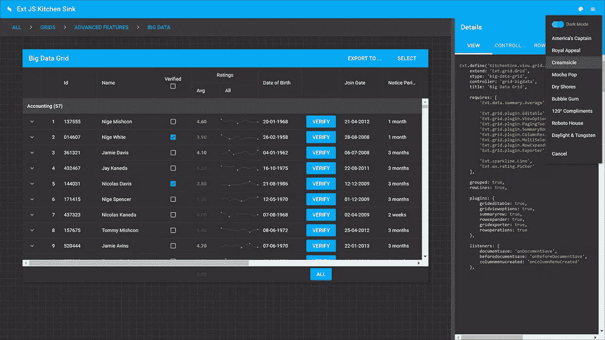
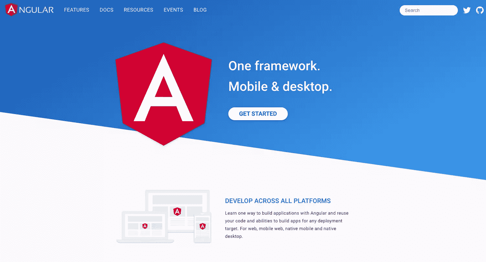
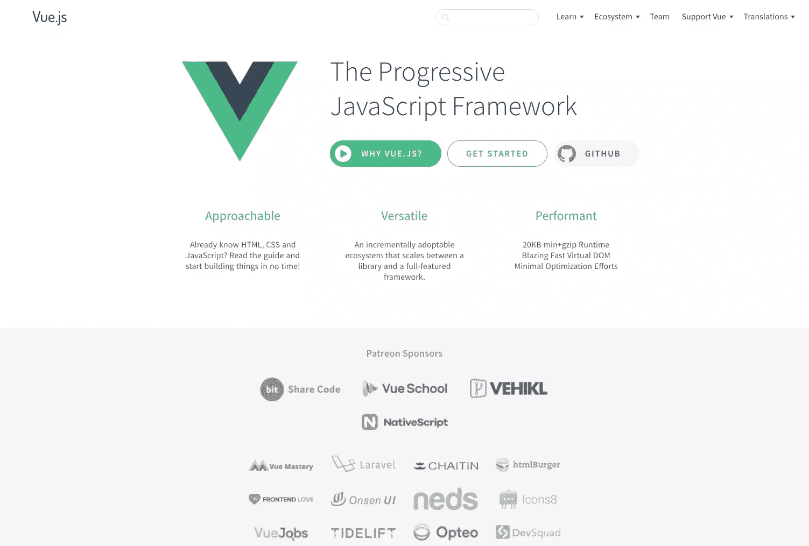
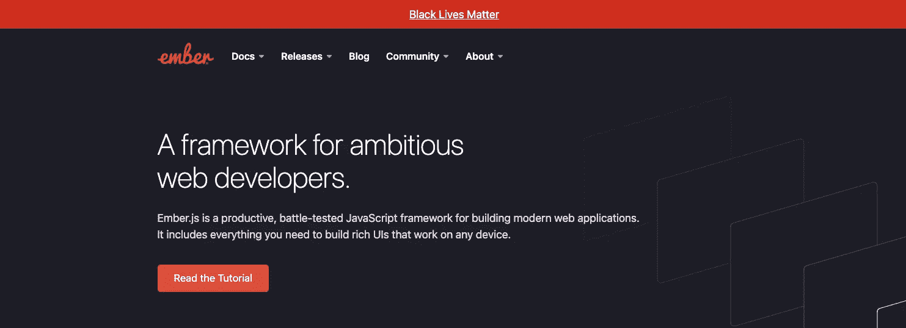
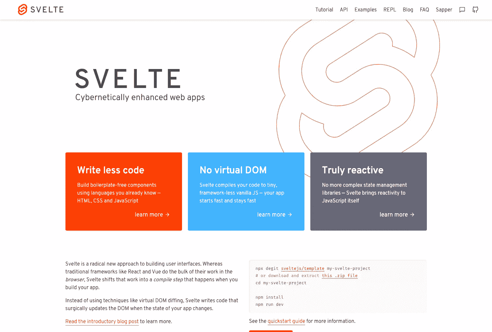

# 2020 年 6 大 JavaScript UI 框架和库

> 原文：<https://www.sitepoint.com/javascript-ui-frameworks/>

*本文是与 [Sencha](https://www.sencha.com/) 合作创作的。感谢您对使 SitePoint 成为可能的合作伙伴的支持。*

JavaScript 是当今快速网络应用的核心技术。有数不清的 UI 框架和库可以用来构建复杂的、反应式的、扩展性好的应用程序。

有些将帮助您编写更高效、更易维护的代码。或者您需要帮助设计一组一致的、可互操作的、快速的 UI 组件。几乎在任何情况下，你都可以找到一个选项来帮你完成大部分繁重的工作。没有必要从头开始，重新发明轮子。

可用的最流行的 JavaScript 框架提供了一些常见的功能。特别是，他们:

*   可以保持状态和视图同步
*   提供路由功能
*   让开发人员构建、重用和维护高效、快速响应用户交互的用户界面组件。

可用的 JS 框架数量很多，而且还在继续增长。看看这些选项。我列出了稳定的、流行的库和供好奇者使用的新选项。

让我们来看看一个时髦的企业级 JavaScript 框架 Sencha 的 Ext JS。

## 1.Sencha 的 Ext JS

需要构建一个处理大量数据的 web 应用程序，并且需要强大、灵活的前端工具来显示和使用它？

[Sencha Ext JS](https://www.sencha.com/products/extjs/) 被描述为…

> 最全面的 JavaScript 框架，用于为任何现代设备构建数据密集型、跨平台的 web 和移动应用程序。Ext JS 包括 140 多个预先集成并经过测试的高性能 UI 组件。

这些组件包括:

*   HTML5 日历
*   网格
*   树
*   列表
*   形式
*   菜单
*   工具栏
*   还有更多

Ext JS 是一个可靠的付费框架，附带优秀的文档、教程和[支持包](https://www.sencha.com/support/)。[最近的测试](https://www.sencha.com/blog/ext-js-performance-benchmarks/)显示 Ext JS 数据网格比领先的竞争对手快 300 倍。事实上，它的虚拟滚动体验可以在不到一秒的时间内检索和显示大量数据。

Ext JS 的优势包括:

*   快速，平稳的发展。享受企业框架与最先进的组件和工具之间的无缝集成。
*   一套全面的安全组件。您永远不必走出框架去寻找任何缺失的小部件或功能。
*   由于包含集成工具，具有强大的设计能力。Sencha Architect 提供拖放功能。Sencha Stencils 允许开发人员模拟、设计、制作原型和测试 UI 概念。
*   牛逼的单元和端到端测试工具配合 [Sencha 测试。](https://www.sencha.com/products/test/)
*   版面设计经理。管理数据和内容在不同浏览器和屏幕上的显示。响应配置系统使界面适应设备方向和浏览器窗口大小。
*   使用 Ext JS ARIA 包轻松实现可访问性合规性
*   一个健壮的数据包，将 UI 组件从数据层中分离出来。

你可以在框架的网站上找到更多关于 Ext JS 的信息。

## 2.反应

React 在前端开发人员中非常受欢迎。这是一个开源的 JavaScript 库，用于构建速度惊人的交互式用户界面。React 最初是由脸书公司的软件工程师乔丹·沃克创建的。它于 2011 年首次出现在脸书的 newsfeed 上，并于 2012 年出现在 Instagram 上。它被网飞、Airbnb、Instagram 和《纽约时报》等网站使用。

选择 React 为您的下一个项目提供动力的原因包括:

*   React 学习和使用起来很快。它是带有小 API 的 JavaScript。
*   代码组件是稳定的和可重用的。使用 API 的声明性语法来创建和维护它们轻而易举。
*   一家大公司和一个强大的社区支持作出反应。
*   该库与堆栈无关，也可以使用 Node.js 在服务器上渲染，以及使用 React Native 在移动应用程序上渲染。

## 3.有角的

[Angular](https://angular.io/) 是谷歌的一个免费开源框架，适用于桌面和移动设备。

有一个学习曲线，包括熟悉 JavaScript 的超集 TypeScript。尽管如此，Angular 仍然是一个很好的工作框架。以下是使用它的一些原因:

*   跨平台–渐进式网络应用、原生移动应用和桌面应用
*   提供速度和性能
*   具有强大的功能，如过滤器、双向数据绑定、指令等
*   为更快的开发提供强大的工具
*   有 Google 的全力支持和强大的开发者社区。

更多详情，不要错过 [*Angular 简介:它是什么，为什么要用它*](https://www.sitepoint.com/angular-introduction/) 作者[伊利亚·博德罗夫-克鲁科夫斯基](https://www.sitepoint.com/author/ibodrov)。

## 4.某视频剪辑软件

[Vue JS](https://vuejs.org/) 是由[尤雨溪](https://github.com/yyx990803/)创建的免费开源渐进式 JavaScript 框架。它使用模板语法(如 Angular)并依赖基于组件的架构(如 React)。

下面是 Vue 在自己的 [GitHub 库页面](https://github.com/vuejs/vue)中对自己的描述:

> Vue(发音为`/vjuː/`，类似 view)是一个用于构建用户界面的**渐进式框架**。它被从头设计为可增量采用，并且可以根据不同的用例在库和框架之间轻松伸缩。它由一个只关注视图层的可接近的核心库和一个支持库的生态系统组成，支持库可以帮助您处理大型单页面应用程序中的复杂性。

以下是 Vue 的一些优点:

*   对开发者友好。如果你知道网络语言(HTML，CSS 和 JavaScript)，Vue 文档就是你需要马上开始构建的所有东西。
*   您可以逐步将它集成到项目中。它很容易从一个库扩展到一个成熟的框架。
*   小巧，配有超快的虚拟 DOM。
*   背后有一个令人惊叹的社区，这使得它成为一个可以采用的稳定框架。
*   提供了很好的文档。

如果你想更深入地研究，请阅读 [*如何判断 Vue.js 是否是你下一个项目*](https://www.sitepoint.com/vue-right-framework/) 的正确框架，作者是[卡罗丽娜·高隆](https://www.sitepoint.com/author/kgawron)。

## 5.余烬

2011 年 12 月由[耶胡达·卡茨](https://yehudakatz.com/)和[汤姆·戴尔](https://tomdale.net/about-me/)，[恩伯](https://emberjs.com/)发布的是:

> 雄心勃勃的 web 开发人员的框架。

Ember.js 是一个高效的、经过实战检验的 JavaScript 框架，用于构建现代 web 应用程序。它包含了构建可以在任何设备上工作的丰富 ui 所需的一切。

这个 JavaScript 框架是免费的、开源的，背后有一个强大的社区。以下是 Ember 在开发者中获得成功的一些原因:

*   利用由[大卫·海涅迈尔·汉森倡导的](https://en.wikipedia.org/wiki/David_Heinemeier_Hansson)[约定胜过配置](https://en.wikipedia.org/wiki/Convention_over_configuration)方法。它旨在减少开发人员必须做出的决策数量(不牺牲灵活性)。
*   几乎所有你需要设置你的应用程序来与 Ember 开箱即用。
*   向后兼容。
*   快速采用最新的 web 标准和 JavaScript 特性。
*   提供优秀的文档和资源。

## 6.苗条 3

[身材苗条的 3](https://svelte.dev/) 虽然长得很快，却是框架积木上的新成员。 [Rich Harris](https://twitter.com/Rich_Harris) 于 2016 年 11 月发布了作为开源项目的 Svelte。 [**版本 3**](https://svelte.dev/blog/svelte-3-rethinking-reactivity)2019 年 4 月问世，是一次彻底的大修。

Svelte 的工作方式不同于目前列出的大多数框架。特别是:

> 尽管 React 和 Vue 等传统框架在*浏览器*中完成大部分工作，但 Svelte 将这些工作转变为*编译步骤*，这发生在你构建应用的时候。

许多框架使用像虚拟 DOM diffing 这样的技术。相反，当应用程序的状态改变时，Svelte 会像外科手术一样更新 DOM。编译代码会带来显著的性能优势。

对于初学者来说，苗条很快上手。您可以构建没有大量样板代码的组件。用 HTML，CSS，JavaScript 就行了。这个苗条的网站以初学者友好的资源为特色。这些包括一个教程，例子，和一个更成熟的苗条开发者的详细 API。为了获得帮助和支持，我们邀请您加入专门的 [Discord 服务器](https://discord.com/invite/yy75DKs)。

## 结论

选择一个框架总是一个视情况而定的决定。它包括关注你的特定项目的挑战是什么。这也意味着要考虑你的团队的经验和偏好。

例如，如果您的团队需要构建数据密集型的企业级项目，这些项目需要一个安全、可靠、全面的框架，该框架包含一大组可以很好地相互协作的组件， [Ext JS by Sencha](https://www.sencha.com/products/extjs/) 是一个很好的选择。您永远不必走出框架去搜索组件。对于开始规模较小但需要灵活性和扩展能力的项目，Vue 可能会很好。如果您的前端团队拥有丰富的 React 专业知识，那么使用 React 可能是您的最佳选择。

你还有其他 JS UI 框架或库可以推荐吗？作为一名开发人员，你发现自己用得最多的是哪些？在推特上告诉我们。

## 分享这篇文章