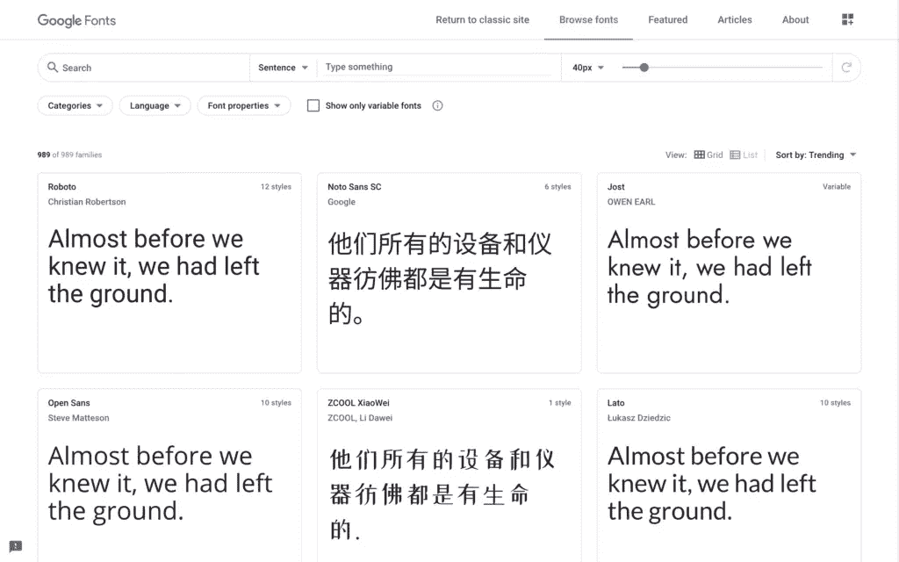
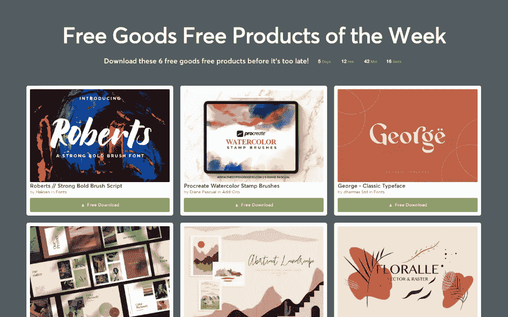
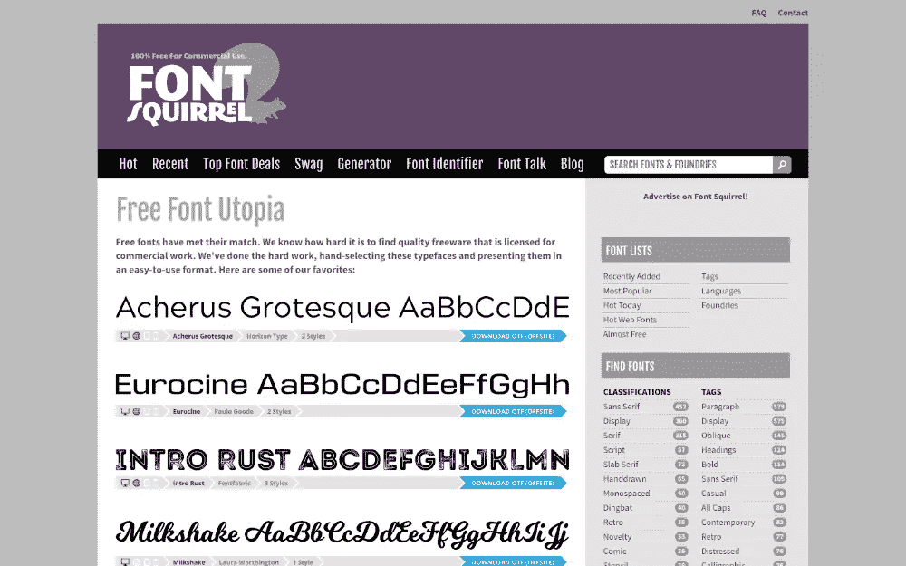
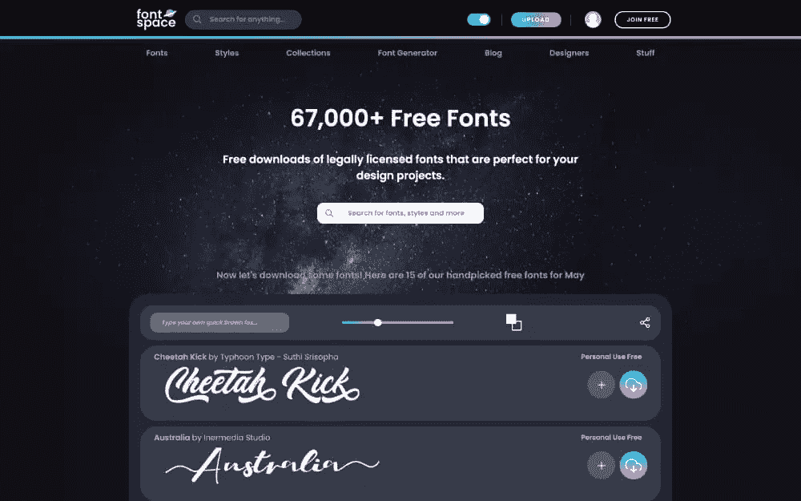
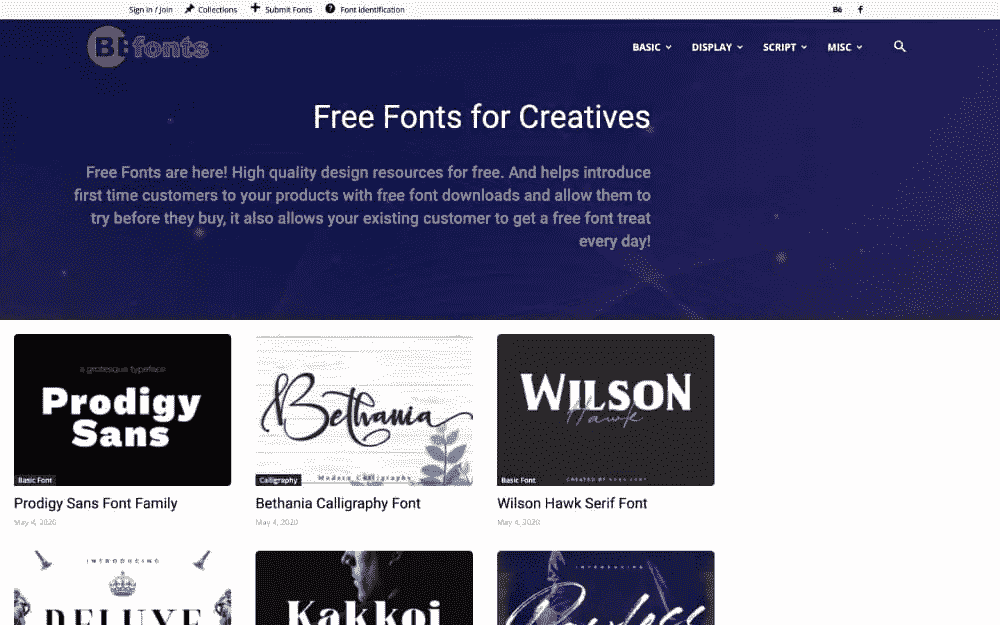
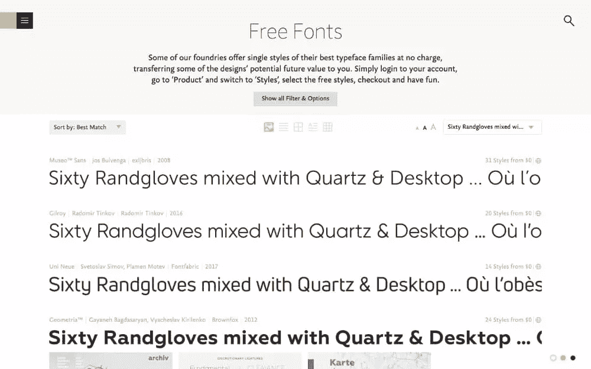

# 免费字体:免费字体下载的最佳来源

> 原文：<https://www.sitepoint.com/free-fonts/>

你需要你的网站看起来很棒，而排版是设计中的一个关键因素。2020 年，你能在网上哪里找到坚持高质量标准的免费字体？

我认为用户界面应该只显示必要的东西，同时让那些必要的元素具有吸引力。我们希望在极简主义和视觉吸引力之间取得最佳平衡。

保持简单，但要让简单看起来很棒。

但是，简单到底是什么样子的呢？

去掉杂乱的内容，剩下的大部分就是 UI 副本和文本内容。这并不令人兴奋，但老实说:这是任何 app 或网站最重要的方面。信息是用户使用我们的应用程序或网站的全部原因。

因此，有了正确的字体加上正确的字体风格(参见[字体与字体:终极指南](https://creativebloq.com/features/font-vs-typeface/))，我们就能创造出既简单又吸引人的设计。这强调了设计的重要方面，使用更少的资源，并导致最少的不必要的认知负荷。

字体设计可能非常强大。

但是最好的免费字体网站有哪些呢？

## Where *not* 寻找免费字体

Dribbble、Behance、Gumroad 等网站拥有大量隐藏的宝石，但这涉及到筛选许多数字资源，其中一些是不完整的风险投资和“精简”版本。也就是说，如果你碰巧遇到了一些很棒的资源，一定要把它们收藏起来。甚至 Instagram 可能会让你感到惊讶，Twitter 也不应该被忽视。

除此之外，让我们看看最好的免费字体网站。

## 1.[谷歌字体](https://fonts.google.com/)

这个列表中的第一名显然是谷歌字体，它超越了大多数替代产品。首先，Google Fonts 提供了快速便捷的 CDN(内容交付网络)，无需实际托管就可以超级轻松地将 web 字体嵌入网站。

Google 字体可以通过脚本和权重进行子集化，我们还可以通过从嵌入代码的查询字符串中设置`font-display` CSS 属性来控制它们在 Web 上的加载方式，从而缩短网站加载时间。(关于“[谷歌字体和字体显示](https://css-tricks.com/google-fonts-and-font-display/)”的 CSS-Tricks 文章解释了如何操作。)

请注意，自托管字体更有利于隐私保护(因为它是无 cookie 的)和速度(因为它为开发者提供了更多的控制)。无论哪种方式，谷歌字体有一个庞大的曲目。

## 2.[创意市场](https://creativemarket.com/free-goods/)

我知道你在想什么:“创意市场不是免费的，丹尼尔！”

啊啊，但是[免费商品](https://creativemarket.com/free-goods/)部分呢？关于免费商品有趣的是，这些实际上是暂时免费的*高级*字体。虽然它不能保证包含字体，但它每周都会更新六种新的设计资产(如果你注册，还会增加三种，如果你在资产上花了 X amount，还会增加三种)。

多年来，我每周都会查看创意市场上的免费商品版块，我已经建立了一个免费的高质量字体的大型资源库。字体捆绑包也有类似的交易。

## 3.[字体松鼠](https://fontsquirrel.com/)

字体松鼠就像 Unsplash，但对于字体来说，虽然考虑到它已经存在了多久(真的很久了！)，也许说 Unsplash 像字体松鼠但对于股票图像更准确！老牌免费字体网站之一，旁边是[达丰](https://dafont.com/)和[城市字体](https://urbanfonts.com/free-fonts.htm)，虽然“松鼠”更好。

尽管许多老牌网站看起来有点过时，但与其他网站相比，Font Squirrel 的网站仍然保持着一定的现代感。它还有几个非常有用的工具:

*   [网页字体生成器](https://fontsquirrel.com/tools/webfont-generator/)(将 TrueType/OpenType 字体转换成网页字体)
*   [字体标识符](https://fontsquirrel.com/matcherator/)(用于从上传的图片/截图中找出名称字体)

## 4.[字体空间](https://fontspace.com/)

FontSpace 是一个更好看的网站，尽管它只提供免费的字体供个人使用，而 Font Squirrel 确认他们所有的字体都免费用于商业用途。字体空间可能并不总是合适的。

## 5.按字体

使 Befonts 与众不同的是它对显示字体的关注。

虽然有些字体只提供精简版/演示版，而且通常只有 TTF/OTF 格式(这意味着它们不太适合网络)，但 Befonts 是为数不多的不采取“我们拥有一切”方法的网站之一(这有时可能会令人不知所措)。除此之外，你还可以随时[将 TTF 和 OTF 字体转换成](https://www.creativefabrica.com/the-ultimate-font-guide/how-to-convert-fonts-into-webfonts/)网页字体。

## 6.字体店

Font Shop 并不完全专注于像 Font Squirrel 和 FontSpace 这样的免费字体，但如果选项 1 到 4 没有你想要的，它仍然是一个相当不错的选择。我发现这是最不方便用户使用的选项，但字体质量相对较高。

## **优秀奖**

以下免费字体网站看起来有点过时，事实上有些字体也是如此，但它们可以说是当今最大的免费字体数据库:

*   [达丰](https://dafont.com/)
*   [城市字体](https://urbanfonts.com/free-fonts.htm)
*   [Fontsly](https://fontsly.com/)

## 我需要哪种字体格式？

OpenType (OTF)和 TrueType (TTF)字体格式在很长一段时间内都是标准格式，今天它们仍然在图形设计中大量使用。但话虽如此，WOFF 格式在网络上有更好的压缩性(尤其是 WOFF2，据 caniuse.com 称，现在 94.49%的网络浏览器都支持 woff 2)。事实上，新的谷歌字体嵌入代码现在只提供 WOFF2 格式。

所以，简而言之:

*   web 嵌入的 WOFF2
*   TTF/OTF 用于其他一切

## 我需要哪种字体？

如今，这已经不重要了，因为规范已经被一点点抛到了窗外。举个例子，[衬线字体](https://fonts.google.com/?category=Serif)现在可以有现代感了(觉得中等)。

相反，我们应该更加关注清晰度:

*   易读性(区分字符的容易程度)
*   可读性(整体阅读句子的难易程度)

其中一些归结于字体本身，所以在决定使用哪种字体时应该仔细观察，但其他时候归结于字体的样式(在大小、粗细等方面)。

当你有疑问的时候， [WCAG 2.0/2.1(网页内容可访问性指南)](https://w3.org/TR/WCAG21/)有你需要知道的关于排版及其许多属性的一切，比如行距、线宽、行高、字体大小等等。

## 结论

字体是非常有用的，它们通常是获得适量的视觉和情感吸引力所需要的，而不会造成越来越多的视觉混乱。无论如何，你的设计需要文本，为什么不把它作为最突出的方面呢？

## 分享这篇文章