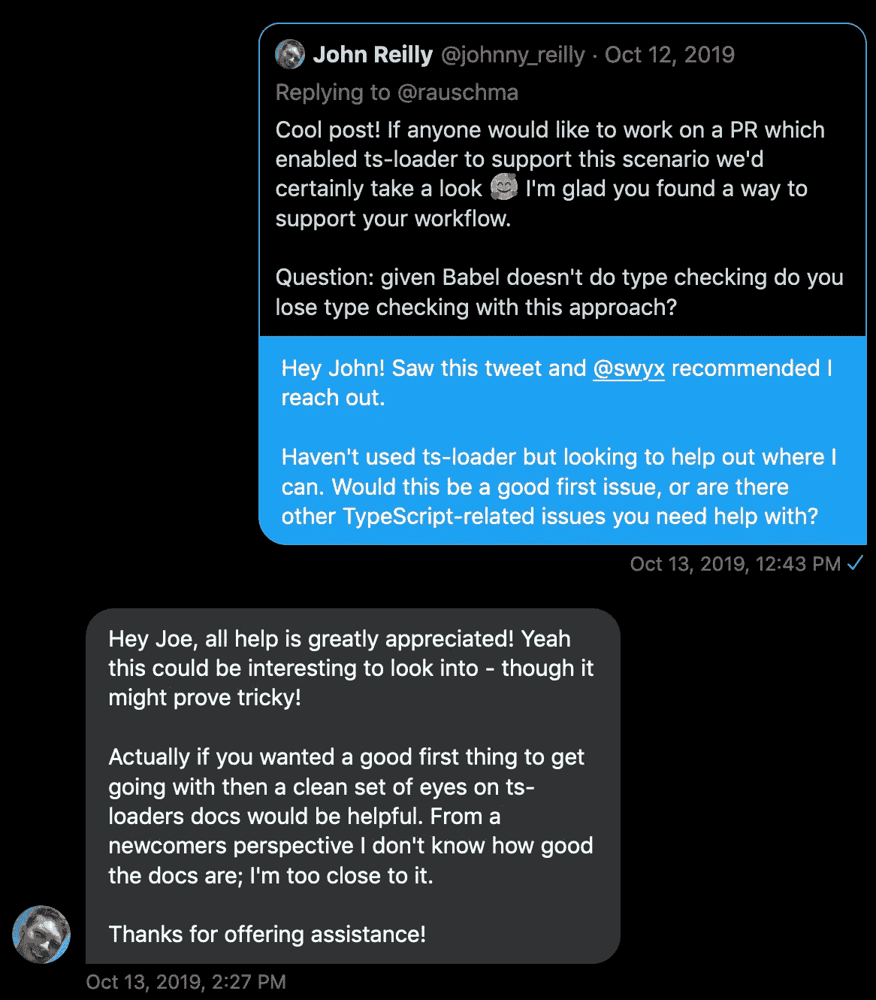

# 如何参与开源 TypeScript 项目

> 原文：<https://www.sitepoint.com/open-source-typescript/>

> 如果你想到开源思想应用于百科全书中的信息，你会想到维基百科——大量的小贡献最终会产生有意义的东西。–*马特·莫楞威格*

我最喜欢开源的一个方面是任何人都可以做出贡献！这就像“富有成效的志愿服务”(如果你愿意迁就我的话)。这是一个很棒的方式来建立比你更大的东西，回馈社区，并提升你的技能。

在这篇文章中，我们将讨论让你参与到开源 [TypeScript](https://www.sitepoint.com/typescript-tutorial-for-beginners/) 项目中的实用方法。我们将首先介绍如何评估你的水平，然后进入如何寻找机会。

## 评估你的水平

在开始为开源做贡献之前，您需要找到自己的舒适程度。你的技能怎么样？你想解决什么程度的复杂性？你想花多少时间？这些都是潜水前要考虑的重要问题。这些信息将在寻找机会的过程中为我们提供指导。

为了简化，我们将创建三个级别:

*   一级
*   第二级
*   第三级

在每个级别，我们将为该级别的人员提供描述和示例贡献。让我们来看看。

### 级别 1:不熟悉 TypeScript

在我们的三级打字技能评估中，第一级是针对那些“打字新手”的如果这些描述能引起你的共鸣，你可能会发现自己在这里:

你是打字新手。您对 JavaScript 已经足够熟悉，因此决定尝试一下 TypeScript。你已经简单地看了一下文件。也许你已经学过一两个教程。也许你在 YouTube 上看过一个关于 TypeScript 的视频。“初学者”在给你的打字稿技能贴标签的时候感觉很准确。

以下是几个你在这个阶段可以做出贡献的例子:

*   文档更新
    *   [开源库](https://github.com/TypeStrong/ts-loader/issues/1024)
    *   [打字手册](https://github.com/microsoft/TypeScript-Handbook/pull/1115)或网站
    *   [为示例创建到 TypeScript playground 的链接](https://github.com/typescript-cheatsheets/react-typescript-cheatsheet/pull/155)

### 第二级:熟悉打字稿

我想我们系统的下一个层次是大多数人自我分类的地方。阅读描述，看看这是否与你目前的感受有关:

你已经在一些项目中使用了 TypeScript。您对 TypeScript 感觉很舒服，并且了解如何修复一般的类型错误。当谈到理解问题时，你不是专家，但你肯定知道如何找到答案。也许你已经写了一些接口或者类型别名。你知道相当多的打字技巧或窍门。编译器不是你最好的朋友，但你认为自己是熟人。

在这个层次上，你可能会乐于以下列方式做出贡献:

*   修复 bug
    *   修复类型错误
    *   使 switch 语句变得详尽
*   添加小功能
    *   将`any`转换为正确的类型
*   用新的例子、模板等更新文档。
    *   撰写[备忘单](https://github.com/typescript-cheatsheets)

### 级别 3:准备好迎接打字稿挑战

我们的最后一个级别是为那些对 TypeScript 非常熟悉并准备好接受挑战的人准备的！看一下下面的描述，看看你是否会这样描述你的水平:

如果有人在记分，它会说，“打字稿 0。你 1”。你觉得打字稿很舒服。也许你已经把一个 JavaScript 代码库转换成了 TypeScript。也许您已经用 TypeScript 从头开始编写了一个大型项目。你已经知道如何破译加密的文字信息。可能别人需要打字稿帮助的时候来找你。也许你教过别人打字，别人称你为“打字”者。

几个例子说明你可以在哪些方面做出贡献:

*   帮助维护[中的类型确定类型](https://github.com/DefinitelyTyped/DefinitelyTyped)
*   为新的 TypeScript 项目编写高级教程或文档
*   对类型脚本、编译器本身有贡献

## 寻找机会

现在你已经知道自己处于什么水平了，是时候考虑应该从哪里开始寻找机会了。我们会覆盖三个你可能有运气的地方。

### 开源代码库

是的，这显然是最明显的。你会在 GitHub 上找到很多开源项目。然而，它经常会让人不知所措。你从哪里开始？

最好的起点是键入具体的组织和回购。这些组织有很多打字稿回购。让我们看一个典型的搜索过程。下面是你使用 [TypeStrong](https://github.com/TypeStrong) 找到一个类型脚本组织或回购后可能要经历的步骤:

1.  从组织打开回购→[fork-ts-checker-web pack-plugin](https://github.com/TypeStrong/fork-ts-checker-webpack-plugin)
2.  导航至问题→[/问题](https://github.com/TypeStrong/fork-ts-checker-webpack-plugin/issues)
3.  寻找“[招聘帮助](https://github.com/TypeStrong/fork-ts-checker-webpack-plugin/issues?q=is%3Aopen+is%3Aissue+label%3A%22help+wanted%22)”或“良好的第一期”类型的标签
4.  现在，转到全球问题页面→[https://github.com/issues](https://github.com/issues)
5.  按组织、发货状态和标签过滤→ [示例](https://github.com/issues?q=is%3Aopen+is%3Aissue+org%3ATypeStrong+archived%3Afalse+label%3A%22help+wanted%22)
6.  按最少评论排序→ [排序:评论-asc](https://github.com/issues?q=is%3Aopen+is%3Aissue+org%3ATypeStrong+archived%3Afalse+label%3A%22help+wanted%22+sort%3Acomments-asc)
7.  找到一个符合你水平的问题

按最少评论进行排序的原因是，这有助于找到尚未声明或处理的问题。我过去曾经使用过类似的策略[来帮助 Rust 开源](https://joeprevite.com/contributing-to-rust-open-source)，效果很好！

### 推特

照看 GitHub 的下一个最好的地方是 Twitter。为什么？嗯，这是一个分享你在做什么的好地方，其他人可能会注意到。如果你提到你正在积极地寻求为 TypeScript 开源项目做贡献，有人可能会给你指出一个方向。

我就是这样找到我参与的一个开源项目的:

同样，一个朋友( [@swyx](https://twitter.com/swyx) )知道我正在寻找开源项目来磨练我的打字技能，并向我指出了这条推文。这导致了一个[问题](https://github.com/TypeStrong/ts-loader/issues/1024)来改善初学者的文档和三个合并的 PRs。

从更实际的角度来看，你可以做些什么来增加在 Twitter 上找到开源 TypeScript 项目的几率:

*   公开学习，即与他人分享你的目标
*   关注知名的 TypeScript 社区成员(从@typescript 关注的列表开始)
*   搜索提及 TypeScript 的推文

Twitter 上的机会可能会少一些，但作为一个额外的途径，它仍然值得努力。

### 不调和

TypeScript 社区有自己的 [Discord 服务器](https://discordapp.com/invite/typescript)。在这里，你可以和其他成员交流，谈论项目，但是你也可以发布关于开源的帖子，分享你正在寻找的东西！我没有亲自尝试过这个，但是如果我在看的话，我会的。

它可能是命中或错过，但我几乎可以肯定有人会知道一个问题，或愿意帮助找到一个适合你的技能水平。

## 摘要

为 TypeScript 开源做贡献让你有机会在社区使用的项目上与其他人合作。它也提供了一种提升你技能的方法。这对双方都是双赢。

在选择要解决的项目时，记得要了解你的技能水平和你想达到的水平。利用 GitHub 的特殊搜索语法，但也不要忽视 Twitter 或 Discord。像一个好木匠一样，知道如何使用你所有的工具。

我希望这篇文章对你有帮助！如果你有，发推特 [@jsjoeio](https://twitter.com/jsjoeio) 告诉我！

如果您使用了这些信息中的任何一条来寻找和贡献 TypeScript 开源，请在下面的评论中告诉我们！

编码快乐！

## 分享这篇文章