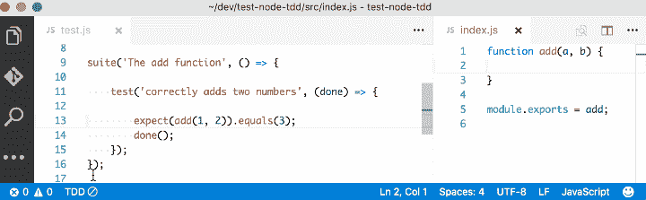
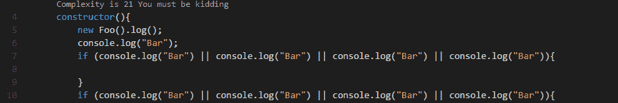
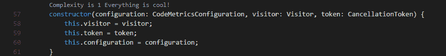
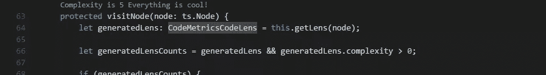

# JavaScript 开发人员必备的 10 个 VS 代码扩展

> 原文：<https://www.sitepoint.com/vs-code-extensions-javascript-developers/>

在本文中，我将关注 JavaScript 开发人员必备的 VS 代码扩展列表。

[Visual Studio 代码](https://code.visualstudio.com/)无疑是当今最受欢迎的轻量级代码编辑器。它确实大量借鉴了其他流行的代码编辑器，主要是 Sublime Text 和 Atom。然而，它的成功主要来自于它能够提供更好的性能和稳定性。此外，它还提供了 IntelliSense 等急需的功能，这些功能只在 Eclipse 或 Visual Studio 2017 等全尺寸 ide 中提供。

毫无疑问，VS 代码的力量来自于市场。多亏了出色的开源社区，编辑器现在能够支持几乎所有的编程语言、框架和开发技术。对库或框架的支持有多种方式，主要包括代码片段、语法高亮、 [Emmet](https://emmet.io/) 和针对特定技术的智能感知特性。

## VS 按类别划分的代码扩展

对于本文，我将重点关注专门针对 JavaScript 开发人员的 VS 代码扩展。目前，有许多 VS 代码扩展符合这个标准，这当然意味着我不能提到所有的扩展。相反，我将重点介绍广受欢迎的 VS 代码扩展以及 JavaScript 开发人员不可或缺的扩展。为了简单起见，我将它们分成十个特定的类别。

## 代码片段扩展

当您第一次安装 VS Code 时，它附带了几个内置的 JavaScript 和 Typescript 代码片段。代码片段帮助您快速编写重复的代码。然而，你可能会发现这些可能还不够。你可以很容易地创建你自己的，或者你可以简单地安装一个扩展，包括一堆新的有用的代码片段。如果您希望片段显示在建议的顶部，一个快速提示是使用以下配置:

```
{
  "editor.snippetSuggestions": "top"
} 
```

以下是 JavaScript 开发人员最常用的代码片段扩展。然而，为了简单起见，我建议您只安装一个。

*   Charalampos Karypidis 的 JavaScript (ES6)代码片段。这是目前最流行的 javaScript 代码片段扩展，至今已有超过 300 万次安装。这个扩展为 JavaScript、TypeScript、HTML、React 和 Vue 提供了 ES6 语法。所有代码片段都包含一个分号。
*   James Vickery 的 StandardJS 风格的 JavaScript (ES6)代码片段。对于那些喜欢 [StandardJS 风格惯例](https://standardjs.com/rules-en.html)的人来说，这基本上是上述扩展的一个分支——也就是说，代码片段没有分号。
*   capaj 的 JavaScript 标准样式片段。另一个标准是 Styled snippets，但是这个标准在超过 72k 的安装中更受欢迎。最初来源于[Atom standards 片段](https://github.com/gaboesquivel/atom-standardjs-snippets)。包含大量方便的代码片段，支持 JavaScript、TypeScript 和 React。
*   内森·查普曼的 JavaScript 片段。到目前为止，已经安装了大约 33k 多的 JavaScript 代码片段。这个 snippet 扩展支持 Node.js，BDD 测试框架，比如 Mocha 和 Jasmine。
*   [Atom JavaScript 片段](https://marketplace.visualstudio.com/items?itemName=gluons.vscode-atom-javascript-snippet)，作者 Saran Tanpituckpong。到目前为止，已经安装了大约 26k+个程序，这个扩展中的代码片段是从`atom/language-javascript`移植过来的。从 atom/language-javascript 扩展移植的 JavaScript 片段。

## 语法突出显示扩展

最新版本的 VS 代码支持更好的语法着色，现在更符合 Atom 语法中设定的标准。因此，不再需要像 [JavaScript Atom Grammar](https://marketplace.visualstudio.com/items?itemName=ms-vscode.js-atom-grammar) 这样的扩展。

然而，我们仍然有一些突出显示扩展名的语法，对于某些类型的项目和文件扩展名非常有用。以下是一些例子:

*   迈克尔·麦克德莫特的巴贝尔 JavaScript 。到目前为止，已有超过 55 万次安装，该扩展为 ES201x JavaScript、React、FlowType 和 GraphQL 代码提供了语法突出显示。
*   [DotENV](https://marketplace.visualstudio.com/items?itemName=mikestead.dotenv) ，由 833737。到目前为止，已经安装了超过 833，000 个，这个扩展支持环境设置的语法高亮显示，也就是说，`.env`文件。
*   [Coen raads 公司的支架对着色机 2](https://marketplace.visualstudio.com/items?itemName=CoenraadS.bracket-pair-colorizer-2) 。对于 730k+安装，此扩展突出显示了不同颜色的匹配支架，帮助您识别哪个支架属于哪个块。

## 棉绒延伸

你曾经和你的队友争论过[制表符对空格](https://www.youtube.com/watch?v=SsoOG6ZeyUI)或者分号对无分号吗？你会意识到人们对使用哪种编码风格有强烈的意见。然而，同一个团队中的每个人都需要使用相同的编码风格，不管他们的观点如何。

然而，程序员经常会忘记他们同意使用哪种编码风格。为了执行规则，我们需要使用 **linters** 来比较你的代码和你建立的规则。你通过选择流行的编码风格来定义你的规则，比如[标准](https://standardjs.com)、[谷歌](https://google.github.io/styleguide/jsguide.html)和 [Airbnb](https://github.com/airbnb/javascript) 。您可以按原样使用它们，也可以使用配置文件来自定义规则。VS 代码没有内置的 JavaScript linter，所以你需要安装一个扩展。

以下是我们提供的扩展:

*   德克·鲍默的《T2》一书。超过 800 万次安装，这是最受欢迎的扩展，为 [ESLint](https://eslint.org/) 图书馆提供支持。为了使扩展能够工作，您的项目需要安装 ESLint 包和插件。您还需要指定一个`.eslintrc`，它将指定扩展用来 lint 您的代码的规则。
*   德克·鲍默的《T2》。有了 120 万以上的安装，这个扩展通过 [JSHint](https://jshint.com/install/) 库支持林挺。扩展需要一个`.jshintrc`配置文件来 lint 您的代码。
*   [Standard js–JavaScript 标准风格](https://marketplace.visualstudio.com/items?itemName=chenxsan.vscode-standardjs)，作者陈山姆。这个扩展(259k+ installs)只是将 [JavaScript 标准风格](https://github.com/standard/standard)集成到 VS 代码中。您需要在项目中安装`standard`或`semiStandard`作为开发依赖项。不需要配置文件。要使这个扩展工作，您需要禁用 VS 代码的内置验证器。
*   《T2》，作者安德鲁·海曼。这个扩展为林挺提供了 JSLint T4 库。你需要在本地或者全局安装`jslint`来让扩展工作。迄今为止，它已经安装了 109，000 多个。

如果你想了解现有的 linters 及其优缺点，请查看我们的 JavaScript 林挺工具对比。

## 节点程序包管理扩展

每个 JavaScript 项目都需要至少一个 npm 包，除非你喜欢用困难的方式做事。这里有几个 VS 代码扩展，可以帮助你更容易地管理和使用 npm 包。

*   [npm](https://marketplace.visualstudio.com/items?itemName=eg2.vscode-npm-script) ，伊加马著。超过 230 万的安装，这个扩展使用`package.json`来验证已安装的软件包。如果缺少任何东西或版本不匹配，扩展将为您提供可点击的选项来修复问题。此外，您还可以在编辑器中运行在`package.json`中定义的 npm 脚本。

–[NPM 智能感知](https://marketplace.visualstudio.com/items?itemName=christian-kohler.npm-intellisense)，作者克里斯蒂安·科勒。对于 1.9M+安装，该扩展在导入语句中提供了自动完成 npm 模块。


*   克里斯蒂安·科勒的《智能感知之路》。在 270 万以上的安装中，这个扩展自动完成文件名。它也适用于 HTML 和 CSS 文件。
*   [Node exec](https://marketplace.visualstudio.com/items?itemName=miramac.vscode-exec-node) ，由米拉麦克。对于 168k+安装，该扩展允许您通过按键盘上的`F8`来执行当前文件或您选择的 Node.js 代码。您也可以按下`F9`取消正在运行的程序。
*   查看张秀坤·昆德尔的节点包。对于 55k 以上的安装，该扩展允许您在处理代码时快速查看节点包源代码和文档。
*   [节点自述](https://marketplace.visualstudio.com/items?itemName=bengreenier.vscode-node-readme)，作者 bengreenier。对于 52k 以上的安装，该扩展允许您在 VS 代码编辑器中作为一个单独的选项卡快速打开 npm 包文档。
*   [搜索节点模块](https://marketplace.visualstudio.com/items?itemName=jasonnutter.search-node-modules)，作者杰森·纳特。默认情况下，`node_modules`文件夹被排除在 VS 代码的内置搜索之外。超过 470，000 次安装，这个扩展允许你通过遍历文件夹树在`node_modules`中快速导航和打开文件。


Source: [vscode-search-node-modules](https://github.com/jasonnutter/vscode-search-node-modules)

*   [Wix 的导入成本](https://marketplace.visualstudio.com/items?itemName=wix.vscode-import-cost)。这会显示在您导入包时它使用了多少磁盘空间。该扩展有 562K 以上的安装。


Source: [import-cost](https://github.com/wix/import-cost)

## 格式扩展

通常情况下，我们有时会编写与其他代码不一致的代码。要解决这个问题，我们需要返回并修复每一行的缩进。此外，我们需要确保大括号和标签以可读的格式正确格式化。这个过程会很快变得乏味。

幸运的是，我们有扩展可以为我们做这些工作。请注意像`Prettier`和`Beautify`这样的扩展不能同时激活。

*   埃斯本·彼得森[漂亮的代码格式器](https://marketplace.visualstudio.com/items?itemName=esbenp.prettier-vscode)。这是最流行的扩展，支持使用[更漂亮的](https://github.com/prettier/prettier)格式化 JavaScript、TypeScript 和 CSS。迄今为止，它已经安装了超过 570 万次。建议您将`prettier`作为开发依赖项安装在本地。
*   [美化](https://marketplace.visualstudio.com/items?itemName=HookyQR.beautify)，by HookyQR。一个支持 JavaScript、JSON、CSS 和 HTML 的[jsbeautiier](http://jsbeautifier.org/)扩展。可以通过`.jsbeautifyrc`文件进行定制。它现在是第二受欢迎的格式器，迄今为止已经安装了 440 万个。
*   [JS Refactor](https://marketplace.visualstudio.com/items?itemName=cmstead.jsrefactor) ，作者 Chris Stead。这为重构 JavaScript 代码提供了许多实用程序和操作，例如提取变量/方法，转换现有代码以使用[箭头函数](https://www.sitepoint.com/javascript-arrow-functions/)或模板文字，以及导出函数。迄今为止，它已经安装了超过 14 万个。
*   [JavaScript Booster](https://marketplace.visualstudio.com/items?itemName=sburg.vscode-javascript-booster) ，作者斯蒂芬·伯格切夫。这是一个了不起的代码重构工具。它有几个编码动作，比如将`var`转换为`const`或`let`，删除多余的`else`语句，合并声明和初始化。很大程度上受 [WebStorm](https://www.jetbrains.com/webstorm/) 的启发，到目前为止已经安装了 74k 多。


Source: [vscode-javascript-booster](https://github.com/xsburg/vscode-javascript-booster)

## 浏览器扩展

除非您用 JavaScript 编写控制台程序，否则您很可能会在浏览器中执行 JavaScript 代码。这意味着您需要经常刷新页面，以查看每次代码更新的效果。这里有几个工具可以显著减少迭代过程的开发时间，而不是一直手动进行:

*   微软的 Chrome 浏览器调试器。超过 520 万次安装，这个扩展允许你在 Chrome 或任何其他支持 Chrome 调试器协议的目标中调试你的 JavaScript 代码。如果你是这个扩展和 VS 代码调试的新手，请查看我们的 [VS 代码和 Chrome 调试教程](https://www.sitepoint.com/debugging-javascript-projects-vs-code-chrome-debugger/)。


Source: [vscode-chrome-debug](https://github.com/Microsoft/vscode-chrome-debug)

*   [直播服务器](https://marketplace.visualstudio.com/items?itemName=ritwickdey.LiveServer)，作者 Ritwick Dey。这个扩展允许您为静态和动态页面启动一个具有实时重新加载特性的本地开发服务器。迄今为止，它已经安装了 460 多万个。


Source: [vscode-chrome-debugvscode-live-server](https://github.com/ritwickdey/vscode-live-server)

*   [在网络服务器上预览](https://marketplace.visualstudio.com/items?itemName=yuichinukiyama.vscode-preview-server)，YuichiNukiyama。这提供了 web 服务器和 HTML 的实时预览。可以从上下文菜单或编辑器菜单中调用这些功能。迄今为止，它已经安装了超过 12 万个。
*   [PHP 服务器](https://marketplace.visualstudio.com/items?itemName=brapifra.phpserver)，由 brapifra。它是为 PHP 项目构建的，对于测试只需要在客户端运行的 JavaScript 代码仍然很有用。迄今为止，它已经安装了超过 234，000 次。
*   [休息客户端](https://marketplace.visualstudio.com/items?itemName=humao.rest-client)，作者华超毛。不用使用浏览器或 CURL 程序来测试 REST API 端点，您可以安装这个工具，在编辑器中交互式地运行 HTTP 请求。迄今为止，它已经安装了 83.4 万次以上。

## 框架扩展

对于大多数项目，你需要一个合适的框架来组织你的代码并减少你的开发时间。VS 代码通过扩展支持大多数主流框架。然而，仍然有许多已建立的框架还没有完全开发的扩展。下面是一些提供重要功能的 VS 代码扩展。

*   约翰·帕帕的《棱角分明的片段》(第九版)。超过 170 万次安装，这是 Angular 开发人员最受欢迎的代码片段扩展。它为 TypeScript、RxJS、HTML 和 Docker 文件提供了角度片段。在撰写本文时，该扩展已经更新为支持 Angular 9。
*   [Angular 8 Snippets–TypeScript、Html、Angular Material、ngRx、RxJS 和 Flex Layout](https://marketplace.visualstudio.com/items?itemName=Mikael.Angular-BeastCode) ，作者 Mikael Morlund。这有角度 2，4，5，6，7 和 8 测试片段。它支持 Typescript、HTML、Angular Material ngRx、RxJS、PWA 和 Flex 布局。迄今为止，它包含了 242 个 Angular snippets，目前已经安装了超过 135 万个。
*   [ES7 React/Redux/graph QL/React-Native snippets](https://marketplace.visualstudio.com/items?itemName=dsznajder.es7-react-js-snippets)，作者 dsznajder。到目前为止，已经安装了超过 120 万个，这个扩展为 React、Redux 和 Graphql 提供了 JavaScript 和 TypeScript 片段，具有 ES7 语法。
*   [React 原生工具](https://marketplace.visualstudio.com/items?itemName=vsmobile.vscode-react-native)，微软出品。这为 React 本机项目提供了智能感知、命令和调试功能。迄今为止，它已经安装了超过 120 万次。
*   [React-EQuimper 为 es6/es7](https://marketplace.visualstudio.com/items?itemName=EQuimper.react-native-react-redux) 提供本地/React/Redux 片段。这为 React、React Native、Redux 和 storybook 提供了 ES6/ES7 语法中的代码片段。迄今为止，它已经安装了 371，000 多个。
*   [Vetur](https://marketplace.visualstudio.com/items?itemName=octref.vetur) ，作者松武。这为 Vue 框架提供了语法高亮、代码片段、Emmet、林挺、格式化、智能感知和调试支持。它附带了发表在 [GitBook](https://vuejs.github.io/vetur/) 上的适当文档。迄今为止，它已经安装了超过 420 万次。
*   费利克斯·里瑟伯格的《烬 T2》。这为 Ember 提供了命令支持和智能感知。安装后，所有的`ember cli`命令都可以通过 VS Code 自己的命令列表获得。迄今为止，它已经安装了超过 18000 个。
*   [科尔多瓦工具](https://marketplace.visualstudio.com/items?itemName=vsmobile.cordova-tools)，由微软。这提供了对 Cordova 插件和 Ionic 框架的支持，还为基于 Cordova 的项目提供了智能感知、调试和其他支持特性。迄今为止，它已经安装了 272，000 多个。
*   唐·贾亚曼的 jQuery 代码片段。这提供了超过 130 个 jQuery 代码片段。它是由前缀`jq`激活的，到目前为止已经安装了 70 万次以上。

## 测试扩展

测试是软件开发的关键部分，尤其是对于处于生产阶段的项目。您可以在我们的指南“ [JavaScript 测试:单元测试与功能测试与集成测试](https://www.sitepoint.com/javascript-testing-unit-functional-integration/)”中获得 JavaScript 测试的概述，并阅读更多关于不同类型测试的内容。下面是一些流行的用于测试的 VS 代码扩展。

*   [摩卡侧边栏](https://marketplace.visualstudio.com/items?itemName=maty.vscode-mocha-sidebar)，作者 maty。这为使用 Mocha 库进行测试提供了支持。这个扩展帮助您直接在代码上运行测试，并将错误显示为装饰器。到目前为止，它已经安装了超过 68k 次。请注意，在撰写本文时，这个扩展还有许多未解决的问题。
*   科里·努南的 ES6 摩卡片段。这提供了 ES6 语法的 Mocha 片段。这个扩展的重点是保持代码干燥，利用箭头函数并尽可能省略曲线。它可以被配置为允许分号，到目前为止已经安装了 36k+个。
*   《茉莉花》代码片段，作者 Charalampos Karypidis。这为 Jasmine 测试框架提供了代码片段。到目前为止，它已经安装了超过 30k 次。不幸的是，在撰写本文时，这个扩展已经有三年没有更新了。
*   Budi Irawan 的量角器片段。这为量角器框架提供了端到端的测试片段。它同时支持 JavaScript 和 Typescript，到目前为止已经安装了 18k 以上。
*   [节点 TDD](https://marketplace.visualstudio.com/items?itemName=prashaantt.node-tdd) ，作者 Prashant Tiwari。这为节点和 JavaScript 项目的测试驱动开发提供了支持。每当源代码更新时，它可以触发自动测试构建。迄今为止，它已经安装了 2.3 万次以上。



Source: [node-tdd](https://github.com/prashaantt/node-tdd)

## 可怕的扩展

我只是把下一批 VS 代码扩展归入“棒极了”一类，因为这是对它们最好的描述！

*   Wallaby.js 开发的一款出色的调试工具，为 JavaScript 代码提供了一个快速原型开发的平台。它带有[优秀的文档](https://quokkajs.com/docs/)，并且有超过 641k 的安装。
*   [通过 quicktype 粘贴为 JSON](https://marketplace.visualstudio.com/items?itemName=quicktype.quicktype) 。这允许您快速地将 JSON 数据转换成 JavaScript 代码，到目前为止已经安装了超过 43 万次。


Source: [quick-type](https://github.com/quicktype/quicktype)

*   Kiss Tamás 的代码度量(Code Metrics)。这是另一个计算 JavaScript 和 TypeScript 代码复杂性的出色扩展。迄今为止，它已经安装了超过 23.3 万次。







Source: [codemetrics](https://github.com/kisstkondoros/codemetrics)

## 扩展包

现在我们来到了最后一个类别，我想让你知道 VS 代码市场有一个扩展包类别。本质上，这些是捆绑在一个包中的相关 VS 代码扩展的集合，以便于安装。以下是一些比较好的例子:

*   韦德·安德森的 Nodejs 扩展包。这个包包含 ESLint、npm、JavaScript (ES6)片段、搜索 node_modules、NPM 智能感知和路径智能感知。它有超过 293，000 个安装。
*   [VS node . js 代码–开发包](https://marketplace.visualstudio.com/items?itemName=nodesource.vscode-for-node-js-development-pack)，由 NodeSource 提供。这个有 NPM 智能感知、ESLint、Chrome 调试器、代码度量、Docker 和导入成本。迄今为止，它已经安装了超过 10.3 万个。
*   [Vue.js 扩展包](https://marketplace.visualstudio.com/items?itemName=mubaidr.vuejs-extension-pack)，作者 Muhammad Ubaid Raza。这是 Vue 和 JavaScript 扩展的集合。它目前包含大约 12 个 VS 代码扩展，其中一些在这里没有提到，比如[自动重命名标签](https://marketplace.visualstudio.com/items?itemName=formulahendry.auto-rename-tag)和[自动关闭标签](https://marketplace.visualstudio.com/items?itemName=formulahendry.auto-close-tag)。迄今为止，它已经安装了超过 15.6 万个。
*   [离子延展包](https://marketplace.visualstudio.com/items?itemName=loiane.ionic-extension-pack)，作者 Loiane Groner。这个包包含了许多用于 Ionic、Angular、RxJS、Cordova 和 HTML 开发的 VS 代码扩展。迄今为止，它已经安装了大约 75，000 个。

## 摘要

VS Code 的大量高质量扩展使其成为 JavaScript 开发人员的热门选择。如此高效地编写 JavaScript 代码从未如此简单。ESLint 之类的扩展可以帮助你避免常见的错误，而其他的如 Debugger for Chrome 可以帮助你更容易地调试你的代码。Node.js 扩展及其 IntelliSense 特性有助于您正确导入模块，Live Server 和 REST client 等工具的可用性减少了您对外部工具的依赖。所有这些工具都使您的迭代过程变得更加容易。

我希望这个列表已经向你介绍了新的 VS 代码扩展，可以在你的工作流程中帮助你。

接下来，通过我们的 [Visual Studio Code power 用户指南](https://www.sitepoint.com/visual-studio-code-power-user-guide/)，了解如何利用 Visual Studio 代码来增强您的开发工作流程。

## 分享这篇文章