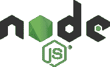
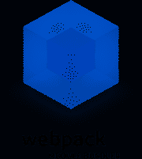

# Web 开发人员工作流工具:初学者指南

> 原文：<https://www.sitepoint.com/web-developer-workflow-tools/>

这里是所有 web 开发人员都应该了解的工具的初级读本，从基本的 Bash 命令到调试 web 应用程序和自动导航测试的 web 浏览器插件，再加上持续集成管道。

请记住，本文旨在涵盖大多数 web 开发人员都需要学习的工具，而不是一个全面的列表。因此，如果您最喜欢的工具不在这里，不要太生气！(比如我故意漏掉了[所见即所得](https://en.wikipedia.org/wiki/WYSIWYG) [网站建设者](https://en.wikipedia.org/wiki/Website_builder)😉。)

## 命令行

[命令行](https://en.wikipedia.org/wiki/Command_language)是一个允许你通过控制台与操作系统进行交互的界面，它可以走*很长的*路，以方便甚至自动化繁琐和例行的任务。

你不应该害怕弄脏你的手。您花在学习一些基本脚本上的时间绝对会有所回报。

### Bash 工具(Linux、macOS)

Bash 是 Linux 和 macOS 等“[类 Unix](https://en.wikipedia.org/wiki/Unix-like)”操作系统最流行的 shell。

您对 Bash shell 的掌握——或者至少是基本知识——可以为您节省*大量*时间。像定位和重命名文件、查找和替换文本字符串这样的事情，分别用`locate`和`grep`和`sed`这样的命令只需要几秒钟。

阅读 [Bash 快速入门指南](https://www.sitepoint.com/premium/books/bash-quick-start-guide/)，精通 Bash。

### PowerShell (Windows)

PowerShell 是微软的“bash 式”任务自动化和配置管理框架。它有一个类似于[命令提示符]的命令行(https://en . Wikipedia . org/wiki/CMD . exe(CMD))，但它也包括了[模块](https://docs.microsoft.com/powershell/module/)和一个适当的[脚本语言](https://docs.microsoft.com/powershell/scripting/samples/sample-scripts-for-administration?view=powershell-7)。但是请记住，*脚本是* *中的 PowerShell，而不是*Bash 中的脚本。除了少数例外，这些命令的名称完全不同，这意味着您需要分别学习这些命令。

PowerShell 7(正在开发中)旨在作为 PowerShell Core[6 的继任者，PowerShell Core](https://github.com/PowerShell/PowerShell) 6 是作为 PowerShell 5 的继任者推出的。谁知道呢，微软的人可能会在第 8 或第 9 版中想出命名的办法。🤷‍♂️

### Cygwin(也是 Windows)

你错过了 Windows 上的狂欢会？不再错过！对于那些习惯了 Bash shell 的强大功能但经常在 Windows 环境下工作的人来说，有一个替代方法。

Cygwin 是一个兼容 POSIX 的环境，它运行在微软的 Windows 上，安装目录的行为类似于根目录，并且遵循类似于 Unix 系统的目录布局。

## 代码编辑器

你几乎肯定知道什么是[源代码编辑器](https://en.wikipedia.org/wiki/Source-code_editor)，但是你可能不知道他们的一些[功能](https://en.wikipedia.org/wiki/Power_user)，比如 git 集成。

有[集成开发环境](https://en.wikipedia.org/wiki/Integrated_development_environment)(ide)，比如 [NetBeans](http://netbeans.apache.org/) 和[Eclipse](https://www.eclipse.org/)——但是它们充斥着我们根本不关心的特性。

作为 web 开发人员，我们更倾向于跨平台工具。让我们来看看其中的几个。

### 原子

毫不奇怪，由于是由 GitHub 开发的， [Atom](https://atom.io/) 拥有所有文本编辑器中最好的嵌入式 Git 控件，专门针对 GitHub 库。

但这还不是全部。“面向 21 世纪的可黑客攻击的文本编辑器”非常容易定制(见[文档](https://atom.io/docs)),一个丰富的[包](https://atom.io/packages)和[主题](https://atom.io/themes)生态系统围绕着它蓬勃发展。一定要看看[博客](https://blog.atom.io/)和[论坛](https://discuss.atom.io/)，看看都在做什么，因为有很多定期更新。

### 崇高的文本

[Sublime Text](https://www.sublimetext.com/) 是这个列表中最老的产品(从 2008 年就有了)，也是唯一一个不免费的产品。它仍然非常受欢迎，并且是第一个在任何像样的代码编辑器中引入我们今天认为是给定的许多特性的编辑器，例如“转到任何东西”、“转到定义”和“多重选择”等等。

它还有一个配套的 Git 客户端，界面非常时尚，2018 年推出的 [Sublime Merge](https://www.sublimemerge.com/) 。

### Visual Studio 代码

[Visual Studio 代码](https://code.visualstudio.com/)(不要与[混淆)Visual Studio](https://visualstudio.microsoft.com/vs/) 是目前另一个非常流行的代码编辑器，它包括如下强大功能:

*   **IntelliSense** ，提供基于变量类型、函数定义和导入模块的智能完成。
*   **内联调试**从编辑器内部分析编码问题。
*   **内置 Git 命令的版本控制**(学习[如何使用版本控制](https://code.visualstudio.com/docs/editor/versioncontrol))。
*   在不同的进程中运行的扩展和定制，确保它们不会降低编辑器的速度(了解[更多关于扩展的信息](https://code.visualstudio.com/docs/editor/extension-gallery))。
*   **云集成**与[微软 Azure](https://azure.microsoft.com) 部署和托管站点，存储和查询基于关系和文档的数据，并通过无服务器计算进行扩展。

阅读我们的 [Visual Studio Code power 用户指南](https://www.sitepoint.com/visual-studio-code-power-user-guide/)成为一名 VS Code pro，并深入阅读《Visual Studio Code:面向 Web 开发人员的端到端编辑和调试工具》一书。

### 亚军

虽然不太受欢迎，但[括号](http://brackets.io/)值得一提，因为它主要专注于 web 开发，具有一个非常有趣的功能，称为实时预览，它可以实时连接到您的浏览器，*可以立即在屏幕上可视化 CSS 和 HTML 的变化*。

[Notepad++](https://notepad-plus-plus.org/) 是 [Windows Notepad](https://www.microsoft.com/p/windows-notepad/9msmlrh6lzf3?activetab=pivot:overviewtab) 的替代产品，非常简约，缺乏我们提到的一些强大功能，如 Git 集成，但它仍然是一个强大的轻量级代码编辑应用程序。

#### 基于命令行

至于基于 commaind 和 line 的编辑器，你有 [Emacs](https://www.gnu.org/software/emacs/) 和 [Vim](https://www.vim.org/) …和[关于哪个更好的无休止的火焰战争](https://en.wikipedia.org/wiki/Editor_war)！

## 浏览器工具—调试、调试、调试

一些浏览器附带的 [web 开发工具](https://en.wikipedia.org/wiki/Web_development_tools)并不是真正的网站构建工具或 ide，因为它们既不能帮助直接创建网页，也不能替代代码编辑器。相反，他们帮助测试你正在工作的项目的[用户界面](https://en.wikipedia.org/wiki/User_interface) (UI)。

过去，你需要大量的扩展来创建一个像样的调试环境，但是现在大多数浏览器都有很好的内置工具来帮助 web 开发人员。

您可能会找到一些工具:

*   一个 **DOM inspector** 直接在[文档对象模型](https://developer.mozilla.org/docs/Web/API/Document_Object_Model) (DOM)上编辑 HTML 和 CSS 代码，查看[事件监听器](https://developer.mozilla.org/docs/Web/API/EventListener)，设置 [DOM 突变断点](https://developer.mozilla.org/docs/Tools/Debugger/Break_on_DOM_mutation)。
*   一个**控制台**，用于查看和过滤日志消息，检查 JavaScript 对象和 [DOM 节点](https://www.w3schools.com/js/js_htmldom_nodes.asp)，并在活动窗口或框架的上下文中运行 JavaScript 代码。
*   一个**调试器**，用于控制代码的执行流程，并设置[监视器](https://developer.mozilla.org/docs/Tools/Debugger/How_to/Examine,_modify,_and_watch_variables)和断点。
*   一个**网络监视器**，用于检查来自网络和浏览器缓存的请求和响应，包括异步[XMLHttpRequest](https://en.wikipedia.org/wiki/XMLHttpRequest)(XHR)——所有这些对于识别瓶颈都非常有用。
*   一个**可访问性检查器**来访问页面的可访问性(a11y)树，允许你检查遗漏了什么或者需要注意什么，以使你的网站对尽可能多的人可用。
*   **性能测量**到 [profile](https://en.wikipedia.org/wiki/Profiling_(computer_programming)) 执行时间和系统资源所需的站点和 walk [JavaScript 调用栈](https://developer.mozilla.org/docs/Glossary/Call_stack)。
*   **内存测量**跟踪内存消耗，并在代码执行的不同阶段比较[堆快照](https://developers.google.com/web/tools/chrome-devtools/memory-problems/heap-snapshots)。
*   一个**存储管理器**来处理缓存数据、cookies、[网络存储](https://developer.mozilla.org/docs/Web/API/Web_Storage_API)，甚至[索引数据库](https://developer.mozilla.org/docs/Web/API/IndexedDB_API)结构化数据。
*   一个**服务工人管理器**处理和调试[服务工人](https://developer.mozilla.org/docs/Web/API/Service_Worker_API/Using_Service_Workers)的更新、注销和单个工人的启动/停止。
*   一个**模拟器**来测试不同的屏幕分辨率，甚至不同的位置坐标。

### Chrome 开发工具

谷歌 Chrome 浏览器配有一套全面的、令人难以置信的完善文档，叫做[开发工具](https://developers.google.com/web/tools/chrome-devtools)。

[https://www.youtube.com/embed/VYyQv0CSZOE](https://www.youtube.com/embed/VYyQv0CSZOE)

事实上，访问谷歌为网络开发者提供的工具是个好主意，因为你会找到大量有用的资源。

### Firefox 开发工具

火狐在版本 3 中首次引入了 [DOM 检查器](https://en.wikipedia.org/wiki/DOM_Inspector)，从那以后**的[开发者工具](https://developer.mozilla.org/docs/Tools)是一套最先进的工具**，附带了额外的好东西，比如[滴管](https://developer.mozilla.org/docs/Tools/Eyedropper)、[截图](https://developer.mozilla.org/docs/Tools/Taking_screenshots)和[标尺](https://developer.mozilla.org/docs/Tools/Rulers)等等。

同样地， [Mozilla 开发者网络](https://developer.mozilla.org/) (MDN)是网络开发者的必备资源。

### Safari 开发者工具

由于缺乏功能和对网络开发人员的支持，苹果 Safari 很难使用，就像当年的 Internet Explorer 一样，不用处理它就好了。但你必须这么做。

它确实搭载了 [Web 开发工具](https://developer.apple.com/safari/tools/),这些工具远没有前面提到的那些工具全面，你将得到的所有文档都是某人在午休时写的。(对，就这些。)

### 其他人

甚至臭名昭著的 ie 浏览器的继任者微软 Edge 也有一套像样的 T2 开发者工具 T3！

如果你喜欢古老的[歌剧](https://www.opera.com/)，查看[这个堆栈交换答案](https://superuser.com/a/1323259)，看看你如何打开它的开发者工具。

用[浏览器开发工具秘笈](https://www.sitepoint.com/premium/books/browser-devtool-secrets/?utm_source=blog&utm_medium=articles)学习 Chrome 和 Firefox 开发工具。

## JavaScript 工具

自从 [Node.js](https://nodejs.org/) (在 web 浏览器之外执行 JavaScript 代码的运行时环境)出现以来，JavaScript 不仅被用来增强用户界面，还被用来编写命令行工具和用于[服务器端脚本](https://en.wikipedia.org/wiki/Server-side_scripting)程序，有效地建立了“JavaScript 无处不在”的范例。

因此，围绕它出现了一个完整的生态系统，这里有一些你需要知道的工具。

### npm

[节点包管理器](https://www.npmjs.com/) (npm)声称是“世界上最大的软件注册中心”，它是一个必不可少的工具，因为它是*现今分发 JavaScript 代码的主要方式*。

如其网站所列，您可以使用 npm 来:

*   为您的应用程序改编代码包，或者按原样合并包。
*   下载可以立即使用的独立工具。
*   使用 [npx](https://www.npmjs.com/package/npx) 运行包而不下载。
*   与任何地方的任何 npm 用户共享代码。
*   将代码限于特定的开发人员。
*   创建 Orgs(组织)来协调包维护、编码和开发人员。
*   利用组织组建虚拟团队。
*   管理多个版本的代码和代码依赖项。
*   当底层代码更新时，轻松更新应用程序。
*   发现解决同一难题的多种方法。
*   找到其他正在处理类似问题和项目的开发人员。

国家预防机制基本上有三个组成部分:

1.  **[网站](https://npmjs.com/)** ，发现套餐，设置档案。
2.  **[CLI](https://docs.npmjs.com/cli/npm)** ，通过一个终端运行。
3.  **[注册表](https://docs.npmjs.com/misc/registry)** ，托管 JavaScript 软件的公共数据库。

更多信息，请阅读[NPM 初学者指南，节点包管理器](https://www.sitepoint.com/beginners-guide-node-package-manager/)。

[https://www.youtube.com/embed/x03fjb2VlGY](https://www.youtube.com/embed/x03fjb2VlGY)

### 网络包

webpack 是另一个级别的打包软件，将应用程序的所有前端资产(如 HTML、CSS 和图像)收集到静态资产中，也称为“捆绑包”。这些包可以用来通过[代码分离](https://webpack.js.org/guides/code-splitting/)按需产生[代码](https://en.wikipedia.org/wiki/Code_on_demand)。(阅读[通过代码分割减少 JavaScript 有效负载](https://developers.google.com/web/fundamentals/performance/optimizing-javascript/code-splitting)来了解这意味着什么。)

您可以使用 webpack 来:

*   捆绑 [ES 模块](https://www.2ality.com/2014/09/es6-modules-final.html)、 [CommonJS](http://wiki.commonjs.org/) 和 [AMD](https://github.com/amdjs/amdjs-api/wiki/AMD) 模块(偶数组合)。
*   创建在运行时异步加载的单个包或多个块(以减少初始加载时间)。
*   在编译期间解决依赖关系，减少运行时大小。
*   编译时使用[加载器](https://webpack.js.org/plugins/)处理文件(例如，将类型脚本转换为 JavaScript，将手柄字符串转换为编译的函数，将图像转换为 Base64 等。).
*   用一个高度模块化的插件系统做你的应用程序需要的任何事情。

查看[web pack 的初学者指南](https://www.sitepoint.com/premium/books/a-beginner-s-guide-to-webpack?utm_source=blog&utm_medium=articles)作为入门指南。

### 聚合物和网络组件

在 2011 年首次推出时， [Web 组件](https://en.wikipedia.org/wiki/Web_Components)被认为是 Web 的下一个大事件。虽然围绕它已经有了一些发展，但它的采用比预期的要慢得多。然而，创建新的 HTML 元素并[封装](https://en.wikipedia.org/wiki/Encapsulation_(object-oriented_programming))它们的可能性仍然是合法的，这样它们可以在以后被使用并分布在不同的站点以防止功能重写。

由 Google 开发的 [Polymer](https://www.polymer-project.org/) 是一个使用 web 组件构建 Web 应用程序的库，它在企业范围内有相当多的追随者，例如 Google 本身、网飞、电子艺界和 IBM。此外，谷歌将其许多[材料设计](https://www.material.io/)原则应用到聚合物中，这使得它成为实现精心制作的网站的一个非常有吸引力的工具。

请访问以下网址，了解有关聚合物和网络组件的更多信息:

*   [聚合物博客](https://www.polymer-project.org/blog/)
*   [WebComponents.org](https://www.webcomponents.org/)
*   [打开 Web 组件](https://open-wc.org/)站点
*   [Slim.js](https://slimjs.com/)
*   [智能 HTML 元素](https://www.htmlelements.com/)

## 代码管理

一个[分布式版本、修订版或源代码控制系统](https://en.wikipedia.org/wiki/Distributed_version_control) (DVCS)是通过[软件提交](https://en.wikipedia.org/wiki/Commit_(version_control))来管理[代码库](https://en.wikipedia.org/wiki/Codebase)的一种方式。换句话说，以整洁、安全和有效的方式跟踪软件开发变更是一个标准。(参见"[以正确的方式提交对代码库的更改](https://www.sitepoint.com/committing-changes-right-way/))。)

有许多版本控制系统，如 [BitKeeper](https://www.bitkeeper.org/) 、 [Subversion](https://subversion.apache.org/) 、 [Mercurial](https://www.mercurial-scm.org/) (我个人最喜欢的)、 [Azure DevOps](https://azure.microsoft.com/services/devops/) (城里的新小子)。但只有一个是国王…

### 饭桶

由 Linus Torvalds(也是 Linux 的创造者)创建的 [Git](https://git-scm.com/) 很快成为 DVCS 事实上的*标准(部分也要感谢 GitHub)。它是真正的*分布式的，因为每台计算机或节点上的每个 Git 目录都是一个成熟的存储库，具有完整的历史和完整的版本跟踪能力，独立于被认为是中央服务器的节点。**

在全面掌握 DVCS 尤其是 Git 之前，你需要熟悉一些概念，比如[分支和合并](https://git-scm.com/about/branching-and-merging)、[分发](https://git-scm.com/about/distributed)、[拉取](https://git-scm.com/docs/git-pull) …但是你会发现基础知识(你大部分时间会用到的)很容易学会。

使用 [Jump Start Git](https://www.sitepoint.com/premium/books/jump-start-git/?utm_source=blog&utm_medium=articles) ，你可以在不到一个周末的时间里对 Git 有一个坚实的理解。

## 其他工具

### 硒

自动化浏览器测试真的很重要，Selenium 不仅掌握了浏览器测试，甚至把它带到了另一个层次。

*   **[Selenium web driver](https://selenium.dev/documentation/en/webdriver/)**本地驱动浏览器，就像真实用户一样，既可以在本地也可以在远程机器上。
*   **[Selenium IDE](https://selenium.dev/selenium-ide/)** 是 Chrome 和 Firefox 的扩展，可以在浏览器中轻松记录和回放测试。
*   **[Selenium Grid](https://selenium.dev/documentation/en/grid/)** 通过同时在许多机器上运行测试，将 WebDriver 带到了另一个层次，减少了在多个浏览器和操作系统上测试所需的时间。

了解如何[在 Python 应用程序上使用 Selenium](https://www.sitepoint.com/premium/books/front-end-testing-in-python-a-detailed-guide/read/1?utm_source=blog&utm_medium=articles) 执行端到端测试。

还有 **[木偶师](https://www.sitepoint.com/puppeteer-end-to-end-testing/)** ，谷歌的 Node.js 库提供了一个 API 来控制[无头](https://developers.google.com/web/updates/2017/04/headless-chrome) Chrome 或通过 [DevTools 协议](https://chromedevtools.github.io/devtools-protocol/)的 Chrome。不过非常坦率地说，Selenium 比 Puppeteer 更像是一个高级工具，或者说是一个生态系统，你也可以用它来与 Chrome DevTools 协议对话(参见 Chrome DevTools 和 Selenium 4)。

### Docker 和软件容器

我们不能在这里解释太多，也不能公正地对待它，但是有一点是肯定的:软件容器可以显著地改善你的交付和部署工作流程。

要深入了解它，请阅读[Learning Docker–第二版](https://www.sitepoint.com/premium/books/learning-docker-second-edition/)。

## CI/CD 管道

[持续集成](https://en.wikipedia.org/wiki/Continuous_integration) (CI)与[持续交付](https://en.wikipedia.org/wiki/Continuous_delivery) (CD)交织在一个所谓的 CI/CD 管道中，用于[持续部署](https://en.wikipedia.org/wiki/Continuous_deployment)。但是这一切意味着什么呢？

来自维基百科，简而言之:

*   CI 确保在主线上签入的软件总是处于可以部署给用户的状态。
*   **CD** 使部署过程完全自动化。

换句话说，连续交付是一种实践(而不是技术),它通过自动化测试和部署到云上来平滑地简化软件开发，非常符合 DevOps 文化。

所有的部署过程都可以完全自动化，从使用 Selenium 检查工作流错误，到编译和构建软件，从 GitHub 获取最新的检查版本，或者修补数据库，甚至重新启动缓存。无论需要做什么，你只要把它放到管道里。

有关 DevOps 的更多信息，请查看 SitePoint 的“ [DevOps by Example](https://www.sitepoint.com/devops-by-example-tools-pros-and-cons-of-a-devops-culture/) ”文章。

### GitLab CI/CD

[GitLab](https://about.gitlab.com/) 是一个类似于 GitHub 的服务。但是与 GitHub 不同，GitHub 托管 Git 库并提供一些 DevOps 工具，GitLab *本质上是一个 DevOps 生命周期工具*(而且是市场上最好的一个，根据[一份 Forrester 报告](https://about.gitlab.com/analysts/forrester-cloudci19/))*也托管 Git 库*。也就是说，GitHub 几乎没有任何特性是 GitLab 所不具备的(事实恰恰相反)。

该服务基于基于消耗的构建分钟模型:

| 计划 | 构建分钟 | 用户/月 |
| --- | --- | --- |
| 自由的 | Two thousand | $0 |
| 青铜 | Two thousand | $9 |
| 银 | Ten thousand | $19 |
| 金色的 | Fifty thousand | $99 |

由于关注于[复杂的工具链](https://about.gitlab.com/just-commit/lower-tco/)、[速度](https://about.gitlab.com/just-commit/reduce-cycle-time/)和[安全性](https://about.gitlab.com/just-commit/secure-apps/)，我们无法在此真正涵盖 GitLab CI/CD 的所有特性，但请查看以下资源:

*   [GitLab 持续集成(CI) &持续交付(CD)](https://about.gitlab.com/stages-devops-lifecycle/continuous-integration/)
*   [GitLab CI/CD](https://docs.gitlab.com/ee/ci/README.html)
*   [创建和使用 CI/CD 管道](https://docs.gitlab.com/ee/ci/pipelines.html)

### GitHub 操作

GitHub 是使用 Git 的软件项目的领先托管提供商，它的 CI/CD 解决方案 [GitHub Actions](https://github.com/features/actions) 似乎来得有点晚，去年 8 月[推出了对公共存储库的 CI/CD 支持(竞争对手已经做了很多年)。](https://github.blog/2019-08-08-github-actions-now-supports-ci-cd/)

在任何情况下，该服务都是生产就绪的，具有相当大的[动作列表](https://github.com/marketplace?type=actions)，您可以开始将其集成到您的管道中。

| 计划 | 构建分钟 | 月 |
| --- | --- | --- |
| 自由的 | Two thousand | $0 |
| 赞成 | Three thousand | $7 |
| 组 | Ten thousand | 每位用户 9 美元 |
| 企业 | Fifty thousand | 联系销售 |

构建时间似乎很长，但是对并发性有一些限制，这可能会对总运行时间产生负面影响，所以一定要检查[使用限制](https://help.github.com/en/actions/getting-started-with-github-actions/about-github-actions#usage-limits)。

更多信息:

*   [GitHub 动作文档](https://help.github.com/en/actions)
*   [启动工作流程](https://github.com/actions/starter-workflows)
*   [GitHub 市场:行动](https://github.com/marketplace?type=actions)

### 比特桶管道

[Bitbucket 管道&部署](https://bitbucket.org/product/features/pipelines)与[吉拉](https://www.atlassian.com/software/jira)(在[敏捷开发](https://en.wikipedia.org/wiki/Agile_software_development)团队中非常流行的工具)和 [Bitbucket](https://bitbucket.org/) 一起轻松工作。毫不奇怪，因为它们都是[亚特兰蒂斯](https://www.atlassian.com/)的创造，就像[特雷罗](https://www.atlassian.com/software/trello)一样。

虽然位桶管道提供的时间似乎少得多，但请记住，并发不会产生额外费用:

| 计划 | 构建分钟 | 用户/月 |
| --- | --- | --- |
| 自由的 | Fifty | $0 |
| 标准 | Two thousand five hundred | $3 |
| 溢价 | Three thousand five hundred | $6 |

更多信息:

*   [比特桶流水线简介](https://bitbucket.org/blog/an-introduction-to-bitbucket-pipelines)
*   [你需要知道的关于位桶管道构建时间的一切](https://bitbucket.org/blog/everything-you-need-to-know-about-build-minutes-in-bitbucket-pipelines)

使用本指南，您可以了解如何为示例 Python web 应用[设置这些 CI 系统。](https://www.sitepoint.com/premium/books/python-web-development-tools/)

## 包裹

在这篇文章中，许多工具都被忽略了——有些是有意的，有些是因为我承认我甚至不知道它们！

随着新的工具、方法和开发实践不断出现，Web 开发与其他学科(如移动和桌面软件开发)的结合越来越紧密。别误会，我不是在抱怨这个。我庆祝它，因为这一切都是为了更好。但它确实以疯狂的方式扩展了可能的途径，你只能期待它在未来会变得更有竞争力。

正如我常说的:如果你想保持价值，*保持好奇*！

## 分享这篇文章