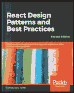
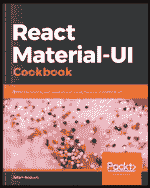
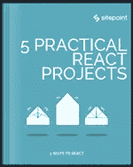
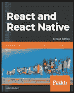
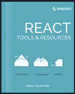
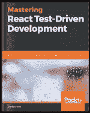
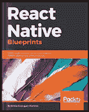
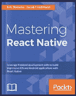
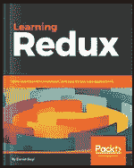

# 有兴趣学习 React 吗？这些会有帮助

> 原文：<https://www.sitepoint.com/interested-in-learning-react-these-will-help/>

React 是一个非常流行的 JavaScript 框架。喜欢，*真的*流行。

那又怎样？

好吧，如果你是前端开发人员(或者即将成为)😉)，React 是一种节省编写代码时间的好方法，可以制作出令人惊叹的、响应迅速的用户界面。

想想单页应用程序(SPAs ),它具有不断变化的状态、可重用的组件和移动应用程序——甚至跨 iOS 和 Android！

见鬼，我们甚至用它！

因此，如果您还没有涉足 React 的世界，我们认为是时候看一看了。以下是我们一些受欢迎的内容:

## [反应设计模式和最佳实践——第二版](https://www.sitepoint.com/premium/books/react-design-patterns-and-best-practices-second-edition/?utm_source=blog&utm_medium=article&utm_campaign=react-books)

我们将通过 React 中最有价值的设计模式进行一次完整的旅程，这本书演示了如何在现实生活中应用设计模式和最佳实践，无论是对于新的还是已经存在的项目。它将帮助您使您的应用程序更灵活、性能更好、更易于维护。

## [React Material-UI 食谱](https://www.sitepoint.com/premium/books/react-material-ui-cookbook/?utm_source=blog&utm_medium=article&utm_campaign=react-books)

React Material-UI Cookbook 是你用 React 和 Material 设计构建引人注目的用户界面的终极指南。充满了实用和中肯的食谱，你将学习如何实现复杂的用户界面组件。您还将学习如何使用现代的 React 工具和技术来应用大量的材质 UI 组件。

## [5 个实际反应项目](https://www.sitepoint.com/premium/books/5-practical-react-projects?utm_source=blog&utm_medium=article&utm_campaign=react-books)

通过使用 React 和 Firebase 构建 Reddit 克隆，使用 React、Redux 和 FeatherJS 构建 CRUD 应用程序，使用 React、Redux 和 Immutable.js 构建 ToDo 应用程序，使用 Three.js、React 和 WebGL 构建游戏，以及使用 React、PHP 和 WebSockets 构建程序生成的游戏地形，来提高 React 技能。

## [React 和 React Native 第二版](https://www.sitepoint.com/premium/books/react-and-react-native-second-edition/?utm_source=blog&utm_medium=article&utm_campaign=react-books)

了解如何使用 React 和 React Native 通过 React 和 React Native 构建移动、桌面和本机应用程序。从可组合的和本地的 ui 到特定于设备的 API 和离线开发，这本书有你需要的一切来创建迷人的和用户友好的 React 应用程序，这些应用程序可以在所有主要平台上运行。

## [反应:工具&资源](https://www.sitepoint.com/premium/books/react-tools-resources?utm_source=blog&utm_medium=article&utm_campaign=react-books)

这本书收集了 React 最常用的一些工具和资源的深入指南，如 Jest 和 React Router，以及 React 如何与 D3 协同工作的讨论，并介绍了 Preact，一种轻量级 React 替代产品。

## [掌握 React 测试驱动开发](https://www.sitepoint.com/premium/books/mastering-react-test-driven-development/?utm_source=blog&utm_medium=article&utm_campaign=react-books)

这本书是 React 的测试驱动开发(TDD)的全面演练。使用 vanilla Jest 教授 TDD 过程需要一种基本的方法。读者在构建现实世界的应用程序的同时，重构重复的代码，构建自己的测试库。它还包括使用 Cucumber 和 Puppeteer 的验收测试。

## [打造自己的 React 通用博客应用](https://www.sitepoint.com/premium/books/build-your-own-react-universal-blog-app/?utm_source=blog&utm_medium=article&utm_campaign=react-books)

构建第一个通用 React 应用程序的入门课程。从介绍 React 开始，然后熟悉无价的 React 工具包——Create React App，我们将带您从头开始创建通用 React 博客应用程序的步骤。

想在移动开发中使用 React？看看 React Native！

## [反应原生蓝图](https://www.sitepoint.com/premium/books/react-native-blueprints/?utm_source=blog&utm_medium=article&utm_campaign=react-books)

使用 React Native 开发真实世界的 Android 和 iOS 应用程序，从头开始构建有趣的项目，同时发现更高效的技术。学会用你的 JS 技能构建专业的 Android 和 iOS 应用。使用同构原则构建提供本地用户体验的移动应用。

## [掌握 React Native](https://www.sitepoint.com/premium/books/mastering-react-native/?utm_source=blog&utm_medium=article&utm_campaign=react-books)

借助 React 的所有本机构建模块，快速创建专业、前沿的应用程序。了解如何应用 Flexbox、构建丰富的动画、集成第三方库、开发定制组件、将 React Native 与 Redux、Redux 中间件、远程 API 等结合起来。

没有太大的反应，但一些很好的赞美内容:

## [学习冗余](https://www.sitepoint.com/premium/books/learning-redux/?utm_source=blog&utm_medium=article&utm_campaign=react-books)

使用 Redux，通过集中应用程序的状态，构建在不同环境(客户端、服务器和本机)中运行的一致的 web 应用程序，并且易于测试。通过将 Redux 的强大功能与 React 和 Angular 等其他框架相结合，将您的 web 应用提升到一个新的水平。

想看更多 React 内容？[参观我们图书馆](https://www.sitepoint.com/premium/search?q=react&firstSearch=true)！

### 想要以每月 3 美元的价格使用我们拥有 400 多本书籍和课程的整个图书馆吗？

[今天就加入 SitePoint Premium](https://www.sitepoint.com/premium/products/Z2lkOi8vbGVhcm5hYmxlL1Byb2R1Y3QvMzcz?utm_source=blog&utm_medium=article&utm_campaign=react-books) ,前三个月每月只需 3 美元，就可以获得所有这些书籍以及 400 多种其他书籍和课程！(此后每月 9 美元，随时取消)。

### 想找一份远程工作？

在 [SitePoint Remote](https://www.sitepoint.com/jobs/?utm_source=blog&utm_medium=article&utm_campaign=react-books) 上搜索数百个远程职位，每天发布 20 多个新职位！

## 分享这篇文章