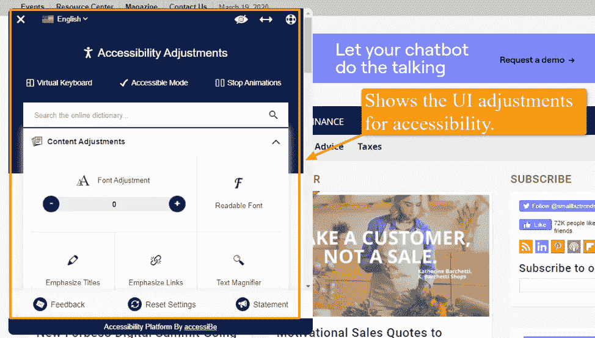
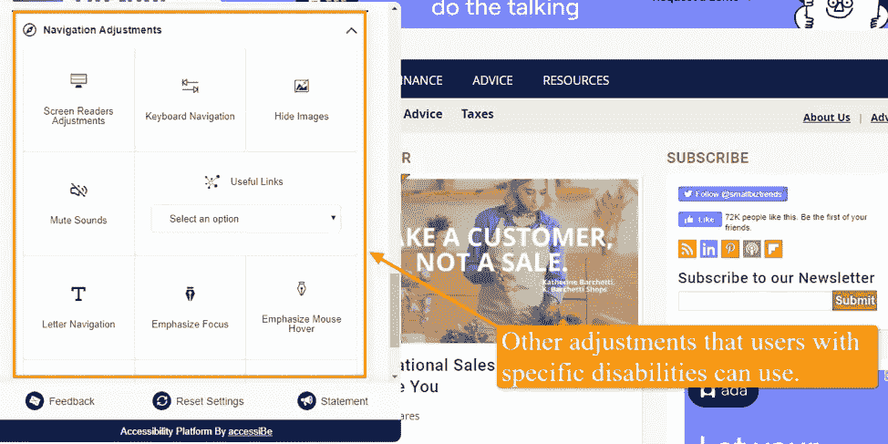
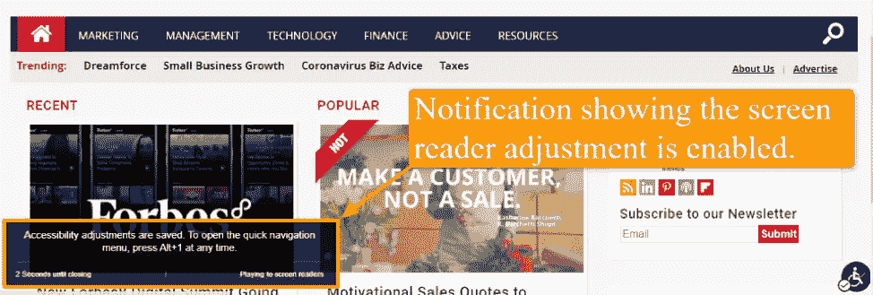
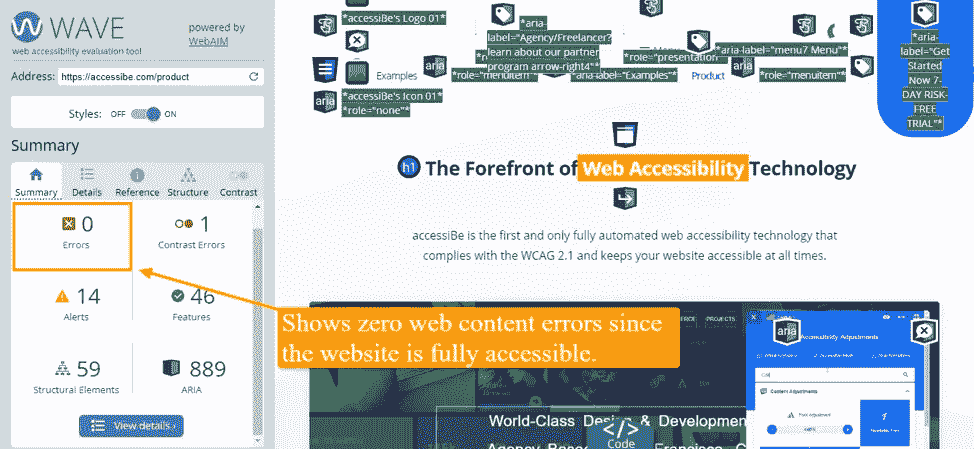
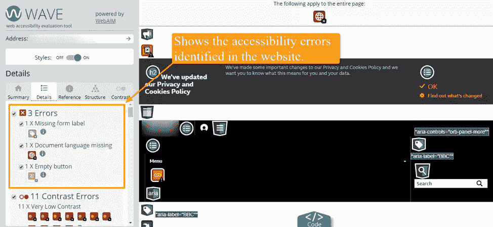
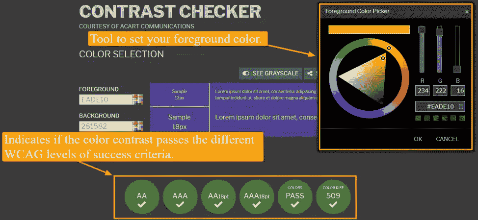
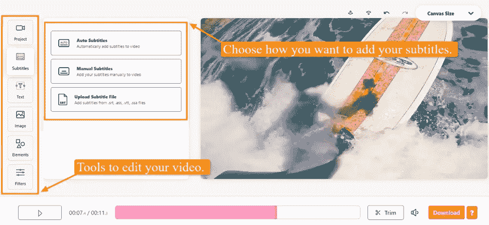

# 数字机构必须遵守 ADA。这是怎么做的

> 原文：<https://www.sitepoint.com/the-ultimate-ada-compliance-guide/>

*本文是与 [StudioWorks](http://studioworks.me/) 合作创作的。感谢您对使 SitePoint 成为可能的合作伙伴的支持。*

**根据网页可访问性数据，2019 年与 ADA 合规性相关的诉讼达到 2000 多起。数字机构必须遵守 ADA。然而，挑战在于知道*如何*建立和设计符合 ADA 的网站。这就是我们将在这篇文章中帮助你解决的问题。**

在这本终极 ADA 合规指南中，我们列出了你的网站设计机构制作无障碍网站需要知道的事情。

如果网站所有者、开发者和代理机构继续不遵守 ADA，诉讼的数量只会继续增长。

如果您不想成为该统计的一部分，您需要确保您的机构和客户网站为残疾人提供可访问性，并遵守 ADA 标准。

## ADA 到底是什么？

*[《美国残疾人法案](https://adata.org/learn-about-ada)* 是一部民权法，于 1990 年颁布，旨在禁止公共生活各个领域对残疾人的歧视。

这包括在学校、工作、交通以及所有私人和公共场所的非歧视，以及那些被视为“公共场所”的场所

对于企业而言,《美国残疾人法案》规定的便利设施包括为视力障碍者提供的接口设备、为听力障碍者提供的合格口译员或口译工具、为轮椅等移动设备提供的坡道通道等。

在数字空间，特别是网站，符合《美国残疾人法》意味着提供网页无障碍特征和功能，使残疾人能够有效地使用网站。

最初，美国残疾人协会将残疾人定义为患有严重限制主要生活活动的疾病的人——这在某种程度上限制了残疾的定义。

然而，在 2018 年的修正案中，ADA 的范围变得更广，改变了“主要生活活动”的含义，包括日常生活功能，如进行手工操作。

有了这个新的定义，企业将需要为各种各样的残疾人提供可访问性，以遵守 ADA 标准。

## 为什么网页设计机构应该知道它？

如果你的网站设计公司创建了不符合 ADA 标准的网站，你就把你的客户置于被 ADA 相关的法律诉讼的风险之中——这可不是你想要的。

通过向你的客户提供不合规的网站，你不仅会因为他们必然会遇到的法律问题而受到他们的指责，而且你还会破坏你的代理机构的信誉。

还值得指出的是，ADA 没有规定实现合规性的技术要求。相反，它给了你如何使你的网站具有可访问性的灵活性。

不幸的是，这并没有给你足够的时间来完全遵守法律。

司法部(DOJ)和美国法院之前使用[网页内容无障碍指南(WCAG)2.1](https://www.w3.org/TR/WCAG21/)a a 级成功标准作为评估网站无障碍性的标准。

WCAG 2.1 提供了多层标准来帮助您实现网页可访问性，包括原则、基本指南、成功标准以及充分的建议性技术。

尽管 WCAG 2.1 没有正式编入美国法律，但它是目前你能遵循的最好和最安全的标准，以符合网页可访问性要求和 ADA。

## 网页设计机构如何为客户制作符合 ADA 的网站？

有多种方法可以为您的客户制作符合 ADA 的网站，但最可靠、最经济、最容易实现的方法是让代理机构使用像 [accessiBe](https://accessibe.com/) 这样的网络无障碍平台。

该平台利用人工智能并完全自动化:它扫描网站并使其所有元素符合标准，因此最终结果是完全可访问且符合 WCAG 2.1 AA 级和 ADA 标准的网站。

该平台的界面允许残疾用户根据他们的残疾和需求对您的客户端网站的用户界面进行调整。



用户可以调整字体、颜色、暂停动画、突出显示内容、静音以及其他功能，如启用虚拟键盘、更改光标大小和颜色等。



这些界面调整为不同的残疾(如视觉障碍、癫痫等)提供了可访问性，从而允许有效地使用您的网站。

你甚至不需要对你的客户端网站进行重大修改，因为 accessiBe 的界面允许用户相应地调整网站的设计。

accessiBe 还使用 AI 技术进行屏幕阅读器优化和键盘导航。

人工智能通过可访问的富互联网应用程序(ARIA)属性集来学习您的客户端网站的所有组件，以提供屏幕阅读器软件的完整上下文。

例如，人工智能给出准确的表单标签，像按钮和菜单这样的元素角色，像社交媒体和搜索图标这样的可操作图标描述，等等。

accessiBe 的人工智能将自动修改网站上的链接标签——例如，你的 Twitter 图标上的链接标签——并添加一个如下所示的 ARIA 标签:

```
aria-label="Twitter" 
```

这允许屏幕阅读器阅读“链接 Twitter”，而不仅仅是“链接”，为您的客户端网站上的盲人用户提供更准确的描述。



为了优化键盘导航功能，AI 将调整您的客户端网站的 HTML，并添加不同的 JavaScript 代码行为，以允许完整的键盘操作。

accessiBe 大大减轻了您的工作量，因为您的机构不需要手动编写所有代码来使您的客户网站符合 ADA 并完全可访问。

此外，accessiBe 使用机器学习技术每 24 小时优化您网站的可访问性级别，并自动进行必要的调整，以实现 100%的合规性。

这意味着你不需要每次更新或添加新的内容到网站时，都要进行代码可访问性调整或修改网站的设计。

最棒的是，如果你推荐你的客户使用 accessiBe，让他们遵守 ADA，你可以通过他们的[合作项目](https://accessibe.com/partners)从你客户的购买价值中获得 20%的佣金。

您也可以选择为您的客户购买 accessiBe，这样您就可以在事后向他们收费。accessiBe 将为您的购买提供 20%的内置折扣。)

还有其他符合 WCAG 2.1 和 ADA 的方法，比如可访问性插件。

然而，大多数可访问性插件只能帮助你满足大约 5%—20%的需求——导致成功率很低。

此外，大多数插件只提供了构建完全可访问的网站所需的一小部分功能，你需要将每一个都集成到网站中——这可能需要大量的工作。

手动可访问性解决方案也是帮助您实现法规遵从性的一种选择，但是大多数解决方案可能成本高昂，不可持续，并且实施时间太长。

此外，你需要经常检查和修改网站——因为添加新内容和每日更新会导致网站的可访问性出现差距。

## 如何检查一个网站的可访问性水平？

创建符合 ADA 的网站是一回事，但保持网页内容在所有时间都可以访问也很重要。

为此，您需要检查是否有任何问题会影响内容对 WCAG 的合规性级别和可访问性。

有了像 [WAVE](https://wave.webaim.org/) 这样的网页可访问性评估工具，你可以评估客户网站上潜在的 WCAG 错误。

一旦您将网页地址或 URL 复制并粘贴到提供的字段中，该工具将识别可访问性问题，如对比度错误、结构元素等。

这是一个完全可访问且符合 ADA 的网站的样子。



相比之下，如果你通过 WAVE 运行一个不完全可访问和兼容的网站，它会是什么样子。



该工具还提供了对发现的错误的见解，以及修复您的客户端网站的可访问性问题的具体建议。

例如，如果可见的表单控件文本标签缺少相应的标签，该工具建议使用`<label>`元素将其与表单控件相关联。

对于那些没有可见标签的，您可以添加一个描述性的标题属性，为表单控件提供一个相关联的标签，或者使用`aria-labelledby`引用标签。

你也可以通过像[对比度检查器](https://contrastchecker.com/)这样的工具来检查你的站点元素的对比度是否在 WCAG 无障碍标准之内。



您可以选择前景色和背景色，该工具将根据色盲的色差、亮度和可读性来检查对比度。

该工具还将指示对比色是否通过 AAA 和 AAA 级成功标准，以满足 18 点以下字体的最低和增强标准。

您的客户网站也需要提供标题和字幕，以满足 WCAG 和美国残疾人协会的要求。

像 [Veed](https://www.veed.io/) 这样的在线视频编辑工具可以通过其简单易用的工具帮助你做到这一点。

该工具允许您手动或自动添加字幕，并将字幕文件如`.srt`、`.vtt`和其他格式上传到您的视频。



有了它，您的客户网站为聋人或有听力障碍的人提供了可访问性，并符合 WCAG 要求，在网站上为所有视频添加字幕。

此外，为了使您的客户端网站符合 ADA，它们需要为运动障碍者和盲人提供方便的导航。

确保您的客户网站可访问的一个好方法是了解盲人和视力受损者如何浏览网站。

例如，盲人用户使用屏幕阅读器软件浏览互联网。你可以效仿他们的经验，使用免费的屏幕阅读器，如 [NVDA(非可视桌面访问)](https://www.nvaccess.org/)来帮助识别你的客户网站上潜在的可访问性问题。

该工具可在 Windows 操作系统上工作，并提供一系列功能，包括易于使用的语音安装程序，支持谷歌 Chrome 等流行应用程序上的盲文显示，等等。

它还提供文本格式报告(如果可用)，如拼写错误、字体大小、样式和名称。

使用此工具，您可以从使用屏幕阅读器的盲人用户的角度查看您的客户端网站的可访问性。

## 遵从网页可及性的意想不到的好处

在很大程度上，许多网站所有者和网络机构都担心 ADA，因为不遵守 ADA 会带来法律后果。

然而，那些花时间投资于遵从的人已经遇到了他们没有想到会从坚持 ADA 标准中得到的好处。

例如，ADA 合规性可以带来更多的销售，因为它允许网站所有者迎合更广泛的受众，这有助于扩大您的代理和客户的市场。

合规性也有助于建立更好的品牌声誉，因为提供网页可访问性将显示出你的客户对其用户福利的关注。

最后，遵守 ADA 可以降低跳出率，因为残疾用户不会点击离开，而是持续浏览网站——这增加了他们转化为客户的机会。

## 立即制作符合 ADA 标准的网站

如果你想让你的网页设计公司兴旺发达，你需要对你的客户表现出真诚的关心。

你需要确保他们从你创建的网站中获得大量价值，同时保护他们免受可能损害他们业务的威胁。

这就是为什么你需要确保你为客户创建的每一个网站都符合 ADA。

考虑到在 accessiBe 的帮助下创建符合 ADA 的网站是多么容易(而且负担得起)，并且通过 WAVE 进行测试，你真的没有理由让你的客户面临法律风险。

## 分享这篇文章