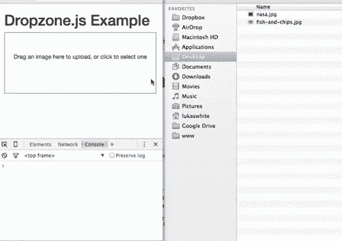
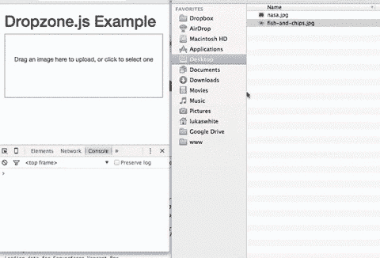

# 如何用 Express 和 DropzoneJS 构建文件上传表单

> 原文：<https://www.sitepoint.com/file-upload-form-express-dropzone-js/>

面对现实吧，没有人喜欢形式。开发人员不喜欢构建它们，设计人员不特别喜欢设计它们的样式，用户当然也不喜欢填充它们。

在构成表单的所有组件中，文件控件可能是最令人沮丧的。这是一个真正的痛苦，它使用起来又笨重又笨拙，上传一个文件会减慢任何形式的提交过程。

这就是为什么增强它们的插件总是值得一看，而 [DropzoneJS](http://www.dropzonejs.com) 就是这样一个选项。它会让你的文件上传控件看起来更好，更人性化，而且通过使用 AJAX 在后台上传文件，它至少会让*看起来*更快。它还使得在文件到达您的服务器之前验证文件变得更加容易，为用户提供了近乎即时的反馈。

我们将详细了解一下 DropzoneJS。我们将展示如何实现它。看看可以对它进行调整和定制的一些方法。我们还将使用 Node.js 实现一个简单的服务器端上传机制。

和以往一样，你可以在我们的 [GitHub 库](https://github.com/sitepoint-editors/image-uploads-dropzonejs-node-express)上找到本教程的代码。

*本文更新于 2020 年。关于 Node.js 的更多信息，请阅读 [Node.js Web 开发-第四版](https://www.sitepoint.com/premium/books/node-js-web-development-fourth-edition/)。*

## DropzoneJS 简介

DropzoneJS 允许用户使用拖放来上传文件。虽然可用性的好处[可以被合理地争论](http://ux.stackexchange.com/questions/56829/what-is-the-usability-benefit-of-drag-files-images-here)，但这是一种越来越普遍的方法，也是一种与许多人在桌面上处理文件的方式合拍的方法。它在主流浏览器中也得到很好的支持。

然而，DropzoneJS 不仅仅是一个基于拖放的小部件。单击小部件启动更传统的文件选择器对话框方法。

下面是小部件运行的动画:



或者，看一看[这个最简单的例子](http://www.dropzonejs.com/examples/simple.html)。

您可以将 DropzoneJS 用于任何类型的文件，尽管漂亮的小缩略图效果使它特别适合上传图像。

### 特征

为了总结该插件的一些特性和特征，DropzoneJS:

*   可以与 jQuery 一起使用
**   具有拖放支持*   生成缩略图*   支持多次上传，可以选择并行上传*   包括一个进度条*   是完全主题化的*   包括可扩展的文件验证支持*   作为 AMD 模块或 RequireJS 模块提供*   缩小后约为 43KB，压缩后约为 13KB*

 *### 浏览器支持

来自官方文档的浏览器支持如下:

*   铬 7+
*   火狐 4+
*   IE 10+的
*   opera 12+(MAC OS 的版本 12 被禁用，因为他们的 API 有问题)
*   Safari 6+版本

当插件不被完全支持时，有几种方法可以处理回退，我们将在后面讨论。

## 正在设置

开始使用 DropzoneJS 最简单的方法是[包含来自 CDN](https://cdnjs.com/libraries/dropzone) 的最新版本。在撰写本文时，这是版本`5.5.1`。

或者，您可以从该项目的 GitLab 页面下载最新版本。还有一个第三方包为[反应](https://github.com/paramaggarwal/react-dropzone)提供支持。

然后，确保在页面中包含主 JavaScript 文件和 CSS 样式。例如:

```
<!DOCTYPE html>
<html lang="en">
<head>
  <meta charset="UTF-8">
  <title>File Upload Example</title>
  <link
    rel="stylesheet"
    href="https://cdnjs.cloudflare.com/ajax/libs/dropzone/5.5.1/min/dropzone.min.css">
</head>
<body>

  <script src="https://cdnjs.cloudflare.com/ajax/libs/dropzone/5.5.1/min/dropzone.min.js"></script>
</body>
</html> 
```

注意，该项目提供了两个 CSS 文件——一个样式简单的`basic.css`文件和一个更大的`dropzone.css`文件。也有缩小版的`dropzone.css`和`dropzone.js`。

## 基本用法

实现该插件最简单的方法是将其附加到一个表单上，尽管您可以使用任何 HTML，比如`<div>`。然而，使用表单意味着需要设置的选项更少——最明显的是 URL，它是最重要的配置属性。

您可以简单地通过添加`dropzone`类来初始化它。例如:

```
<form id="upload-widget" method="post" action="/upload" class="dropzone"></form> 
```

从技术上来说，这就是你所需要做的，尽管在大多数情况下你会想要设置一些额外的选项。其格式如下:

```
Dropzone.options.WIDGET_ID = {
  //
}; 
```

要获得用于设置选项的小部件 ID，请使用您在 HTML 中定义的 ID，并将其转换为骆驼格式。例如，`upload-widget`变成了`uploadWidget`:

```
Dropzone.options.uploadWidget = {
  //
}; 
```

您也可以通过编程方式创建实例:

```
const uploader = new Dropzone('#upload-widget', options); 
```

接下来，我们将看看一些可用的配置选项。

## 基本配置选项

`url`选项定义了上传表单的目标，并且是唯一必需的参数。也就是说，如果你将它附加到一个表单元素，那么它将简单地使用表单的`action`属性，在这种情况下你甚至不需要指定它。

`method`选项设置 HTTP 方法，同样，如果您使用该方法，它将从表单元素中获取该方法，否则它将简单地默认为`POST`，这应该适合大多数场景。

`paramName`选项用于设置上传文件的参数名称。如果您使用文件上传表单元素，它将匹配`name`属性。如果你不包括它，它默认为`file`。

`maxFiles`设置用户可以上传的最大文件数，如果没有设置为空。

默认情况下，小部件在被点击时会显示一个文件对话框，不过您可以使用`clickable`参数将其设置为`false`来禁用它，或者您可以提供一个 HTML 元素或 CSS 选择器来定制可点击的元素。

这些是基本选项，但现在让我们看看一些更高级的选项。

### 强制最大文件大小

`maxFilesize`属性决定了以兆字节为单位的最大文件大小。默认大小为 1000 字节，但是使用`filesizeBase`属性，您可以将其设置为另一个值，例如 1024 字节。您可能需要对此进行调整，以确保您的客户端和服务器代码以完全相同的方式计算任何限制。

### 限制到某些文件类型

`acceptedFiles`参数可用于限制您想要接受的文件类型。这应该是以逗号分隔的 MIME 类型列表的形式，尽管您也可以使用通配符。

例如，要仅接受图像:

```
acceptedFiles: 'image/*', 
```

### 修改缩略图的大小

默认情况下，缩略图以 120x120px 的分辨率生成。也就是说，它是方形的。有几种方法可以改变这种行为。

第一种是使用`thumbnailWidth`和/或`thumbnailHeight`配置选项。

如果您将`thumbnailWidth`和`thumbnailHeight`都设置为`null`，缩略图根本不会调整大小。

如果你想完全自定义缩略图生成行为，你甚至可以覆盖`resize`函数。

关于修改缩略图大小的一个要点是，软件包提供的`dz-image`类设置 CSS 中的缩略图大小，因此您也需要相应地修改它。

### 附加文件检查

`accept`选项允许您提供额外的检查，以确定文件在上传前是否有效。您不应该使用它来检查文件数量(`maxFiles`)、文件类型(`acceptedFiles`)或文件大小(`maxFilesize`)，但是您可以编写定制代码来执行其他类型的验证。

您可以像这样使用`accept`选项:

```
accept: function(file, done) {
  if (!someCheck()) {
    return done('This is invalid!');
  }
  return done();
} 
```

如您所见，这是异步的。您可以不带参数调用`done()`并通过验证，或者提供一条错误消息，文件将被拒绝，在文件旁边显示一条弹出消息。

稍后，当我们看到如何强制最小或最大图像尺寸时，我们将看到一个更复杂的真实世界的例子。

## 发送附加邮件头

通常，您需要在上传者的 HTTP 请求中附加额外的头。

例如，CSRF(跨站点请求伪造)保护的一种方法是在视图中输出一个令牌，然后让您的`POST/PUT/DELETE`端点检查有效令牌的请求头。假设您像这样输出令牌:

```
<meta name="csrf-token" content="CL2tR2J4UHZXcR9BjRtSYOKzSmL8U1zTc7T8d6Jz"> 
```

然后，您可以将它添加到配置中:

```
headers: {
  'x-csrf-token': document.querySelector('meta[name=csrf-token]').getAttributeNode('content').value,
}, 
```

或者，下面是使用 jQuery 的相同示例:

```
headers: {
  'x-csrf-token': $('meta[name="csrf-token"]').attr('content')
}, 
```

然后，您的服务器应该验证`x-csrf-token`报头，可能使用一些[中间件](https://www.npmjs.com/package/csrf)。

## 处理回退

实现回退最简单的方法是在包含输入控件的表单中插入一个`<div>`，将元素的类名设置为`fallback`。例如:

```
<form id="upload-widget" method="post" action="/upload" class="dropzone">
  <div class="fallback">
    <input name="file" type="file" />
  </div>
</form> 
```

或者，您可以使用`fallback`配置参数提供一个在浏览器不支持插件时执行的功能。

您可以通过将`forceFallback`设置为`true`来强制小部件使用回退行为，这在开发期间可能会有所帮助。

## 处理错误

通过使用`error`配置参数提供一个定制函数，您可以定制小部件处理错误的方式。第一个参数是文件，第二个是错误消息，如果错误发生在服务器端，第三个参数将是一个`XMLHttpRequest`的实例。

和往常一样，客户端验证只是成功的一半。您还必须在服务器上执行验证。当我们稍后实现一个简单的服务器端组件时，我们将查看错误响应的预期格式，如果正确配置，它将以与客户端错误相同的方式显示(如下所示)。



## 覆盖消息和翻译

还有许多附加的配置属性，用于设置小部件显示的各种消息。您可以使用它们来自定义显示的文本，或者将它们翻译成另一种语言。

最值得注意的是，`dictDefaultMessage`用于在用户选择要上传的文件之前，设置显示在 dropzone 中间的文本。

您将在文档中找到可配置字符串值的完整列表，所有这些值都以`dict` — [开头。](http://www.dropzonejs.com/#configuration-options)

## 事件

为了定制或增强插件，您可以收听许多事件。

收听事件有两种方式。第一种方法是在初始化函数中创建一个监听器:

```
Dropzone.options.uploadWidget = {
  init: function() {
    this.on('success', function(file, resp){
      ...
    });
  },
  ...
}; 
```

这是另一种方法，如果您决定以编程方式创建 Dropzone 实例，这种方法很有用:

```
const uploader = new Dropzone('#upload-widget');
uploader.on('success', function(file, resp){
  ...
}); 
```

也许最值得注意的方面是`success`事件，当一个文件被成功上传时该事件被触发。`success`回调有两个参数:第一个是文件对象，第二个是`XMLHttpRequest`的实例。

其他有用的事件包括`addedfile`和`removedfile`，用于在上传列表中添加或删除文件；`thumbnail`，缩略图生成后触发；和`uploadprogress`，您可以用它来实现自己的进度表。

还有一些事件将事件对象作为参数，您可以使用它们来定制小部件本身的行为— `drop`、`dragstart`、`dragend`、`dragenter`、`dragover`和`dragleave`。

您将在文档的相关章节[中找到完整的事件列表。](http://www.dropzonejs.com/#event-list)

## 一个更复杂的验证示例:图像尺寸

前面我们看到了异步`accept()`选项，您可以使用它在文件上传之前对文件进行检查(验证)。

上传图像时的一个常见要求是强制最小或最大图像尺寸。我们可以用 DropzoneJS 做到这一点，尽管它稍微复杂一些。

虽然 accept 回调函数接收一个 file 对象，但是为了检查图像的尺寸，我们需要等到缩略图生成之后，此时尺寸已经在 file 对象上设置好了。为此，我们需要监听缩略图事件。

这是代码。在本例中，我们在上传之前检查图像是否至少为 640x480px:

```
init: function() {
  this.on('thumbnail', function(file) {
    if (file.accepted !== false) {
      if (file.width < 1024 || file.height < 768) {
        file.rejectDimensions();
      }
      else {
        file.acceptDimensions();
      }
    }
  });
},
accept: function(file, done) {
  file.acceptDimensions = done;
  file.rejectDimensions = function() {
    done('The image must be at least 1024 by 768 pixels in size');
  };
}, 
```

## 一个完整的例子

在经历了选项、事件和一些稍微高级的验证之后，让我们来看一个完整且相对全面的例子。显然，我们没有利用每一个可用的配置选项，因为有太多的配置选项，这使得它非常灵活。

下面是表单的 HTML:

```
<form id="upload-widget" method="post" action="/upload" class="dropzone">
  <div class="fallback">
    <input name="file" type="file" />
  </div>
</form> 
```

如果您正在实施 CSRF 保护，您可能需要在布局中添加如下内容:

```
<head>
  <!-- -->
  <meta name="csrf-token" content="XYZ123">
</head> 
```

现在是 JavaScript。注意我们没有使用 jQuery！

```
Dropzone.options.uploadWidget = {
  paramName: 'file',
  maxFilesize: 2, // MB
  maxFiles: 1,
  dictDefaultMessage: 'Drag an image here to upload, or click to select one',
  headers: {
    'x-csrf-token': document.querySelectorAll('meta[name=csrf-token]')[0].getAttributeNode('content').value,
  },
  acceptedFiles: 'image/*',
  init: function() {
    this.on('success', function(file, resp){
      console.log(file);
      console.log(resp);
    });
    this.on('thumbnail', function(file) {
      if (file.accepted !== false) {
        if (file.width < 640 || file.height < 480) {
          file.rejectDimensions();
        }
        else {
          file.acceptDimensions();
        }
      }
    });
  },
  accept: function(file, done) {
    file.acceptDimensions = done;
    file.rejectDimensions = function() {
      done('The image must be at least 640 x 480px')
    };
  }
}; 
```

提醒一下，你可以在我们的 [GitHub 库](https://github.com/sitepoint-editors/image-uploads-dropzonejs-node-express/blob/master/views/index.hbs)上找到这个例子的代码。

希望这足以让您开始处理大多数场景。如果你需要更复杂的东西，请查看完整的文档。

## 主题

有许多方法可以定制小部件的外观和感觉，事实上完全改变它的外观是可能的。

作为外观可定制性的一个例子，这里有一个使用 Bootstrap 的小部件的演示,看起来和感觉完全像 [jQuery 文件上传](https://blueimp.github.io/jQuery-File-Upload/index.html)小部件。

显然，改变小部件外观的最简单方法是使用 CSS。小部件有一个类`dropzone`，它的组件元素有以`dz-`为前缀的类——例如，`dz-clickable`用于 dropzone 内的可点击区域，`dz-message`用于标题，`dz-preview` / `dz-image-preview`用于包装每个上传文件的预览，等等。看一下`dropzone.css`文件做参考。

您可能还希望对悬停状态应用样式，也就是说，当用户在释放鼠标按钮开始上传之前将文件悬停在 dropzone 上时。你可以通过设计由插件自动添加的`dz-drag-hover`类的样式来做到这一点。

除了 CSS 调整之外，您还可以通过设置`previewTemplate`配置属性来自定义组成预览的 HTML。下面是默认预览模板的样子:

```
<div class="dz-preview dz-file-preview">
  <div class="dz-image">
    
  </div>
  <div class="dz-details">
    <div class="dz-size">
      <span data-dz-size></span>
    </div>
    <div class="dz-filename">
      <span data-dz-name></span>
    </div>
  </div>
  <div class="dz-progress">
    <span class="dz-upload" data-dz-uploadprogress></span>
  </div>
  <div class="dz-error-message">
    <span data-dz-errormessage></span>
  </div>
  <div class="dz-success-mark">
    <svg>REMOVED FOR BREVITY</svg>
  </div>
  <div class="dz-error-mark">
    <svg>REMOVED FOR BREVITY</svg>
  </div>
</div> 
```

如您所见，一旦文件进入上传队列，您就可以完全控制文件的呈现方式，以及成功和失败状态。

关于使用 DropzoneJS 插件的部分到此结束。最后，让我们看看如何让它与服务器端代码一起工作。

## 一个简单的带有 Node.js 和 Express 的服务器端上传处理程序

当然，您可以使用任何服务器端技术来处理上传的文件。为了演示如何将您的服务器与插件集成，我们将使用 Node.js 和 [Express](https://expressjs.com/) 构建一个非常简单的示例。

为了处理上传的文件本身，我们将使用 [Multer](https://www.npmjs.com/package/multer) ，这是一个提供一些快速中间件的包，使它变得非常容易。事实上，这很容易:

```
const upload = multer({ dest: 'uploads/' });

app.post('/upload', upload.single('file'), (req, res, next) => {
  // Metadata about the uploaded file can now be found in req.file
}); 
```

在我们继续实现之前，当处理像 DropzoneJS 这样在幕后为您发出请求的插件时，最明显的问题是:“它期望什么样的响应？”

## 处理上传成功

如果上传过程成功，就您的服务器端代码而言，唯一的要求就是返回一个`2xx`响应代码。你的回答的内容和格式完全取决于你，并且可能取决于你如何使用它。例如，您可能会返回一个 JSON 对象，其中包含上传文件的路径，或者自动生成的缩略图的路径。出于本例的目的，我们将简单地返回 file 对象的内容——即 Multer 提供的一组元数据:

```
return res.status(200).send(req.file); 
```

响应看起来会像这样:

```
{ fieldname: 'file',
  originalname: 'myfile.jpg',
  encoding: '7bit',
  mimetype: 'image/jpeg',
  destination: 'uploads/',
  filename: 'fbcc2ddbb0dd11858427d7f0bb2273f5',
  path: 'uploads/fbcc2ddbb0dd11858427d7f0bb2273f5',
  size: 15458 } 
```

## 处理上传错误

如果您的响应是 JSON 格式的——也就是说，您的响应类型被设置为`application/json`——那么 DropzoneJS 默认错误插件期望响应看起来像这样:

```
{
  error: 'The error message'
} 
```

如果您没有使用 JSON，它将简单地使用响应体。例如:

```
return res.status(422).send('The error message'); 
```

让我们通过对上传的文件执行一些验证检查来演示这一点。我们将简单地重复我们在客户机上执行的检查。请记住，客户端验证本身是不够的。

为了验证该文件是一个图像，我们将简单地检查 MIME 类型是否以`image/`开头。ES6 的 [`String.prototype.startsWith()`](https://developer.mozilla.org/en-US/docs/Web/JavaScript/Reference/Global_Objects/String/startsWith) 很适合这个。

下面是我们如何运行该检查，如果失败，则以 Dropzone 的默认错误处理程序期望的格式返回错误:

```
if (!req.file.mimetype.startsWith('image/')) {
  return res.status(422).json({
    error: 'The uploaded file must be an image'
  });
} 
```

*注意:我使用 HTTP 状态代码 422，不可处理的实体，用于验证失败，但是 400 错误请求同样有效。事实上，任何超出 2xx 范围的东西都会导致插件报告错误。*

我们还要检查图像是否有一定的大小。 [image-size](https://github.com/netroy/image-size) 包使得获取图像的尺寸变得非常简单。您可以异步或同步使用它。为了简单起见，我们将使用后者:

```
const dimensions = sizeOf(req.file.path);

if ((dimensions.width < 640) || (dimensions.height < 480)) {
  return res.status(422).json({
    error: 'The image must be at least 640 x 480px'
  });
} 
```

让我们将所有这些放在一个完整的(迷你)应用程序中:

```
const express = require('express');
const multer = require('multer');
const upload = multer({ dest:'uploads/'});
const sizeOf = require('image-size');
const exphbs = require('express-handlebars');

const app = express();

app.use(express.static(__dirname +'/public'));

app.engine('.hbs', exphbs({ extname:'.hbs'}));
app.set('view engine','.hbs');

app.get('/', (req, res) => {
  return res.render('index', {layout: false});
});

app.post('/upload', upload.single('file'), (req, res) => {
  if (!req.file.mimetype.startsWith('image/')) {
    return res.status(422).json({
      error :'The uploaded file must be an image'
    });
  }

  const dimensions = sizeOf(req.file.path);

  if ((dimensions.width < 640) || (dimensions.height < 480)) {
    return res.status(422).json({
      error :'The image must be at least 640 x 480px'
    });
  }

  return res.status(200).send(req.file);
});

app.listen(8080, () => {
  console.log('Express server listening on port 8080');
}); 
```

*注意:为了简洁起见，这段服务器端代码没有实现 CSRF 保护。你可能想看看像 CSURF 这样的[包。](https://www.npmjs.com/package/csurf)*

您将在伴随库的[中找到这些代码，以及支持资产，比如视图。](https://github.com/lukaswhite/image-uploads-dropzonejs-node-express)

如果您想了解更多关于在 Node.js 中使用表单的信息，请阅读 [Forms，File Uploads and Security with node . js and Express](https://www.sitepoint.com/forms-file-uploads-security-node-express/)。

## 摘要

DropzoneJS 是一个精巧、强大和高度可定制的 JavaScript 插件，用于增强文件上传控制和执行 AJAX 上传。在本教程中，我们已经看了一些可用的选项，在事件，以及如何去定制插件。这里面有很多东西是一个教程无法涵盖的，所以如果你想了解更多，可以查看一下[官方网站](http://www.dropzonejs.com)。但希望这足以让你开始。

我们还构建了一个非常简单的服务器端组件来处理文件上传，演示了如何让两者协同工作。

## 分享这篇文章*