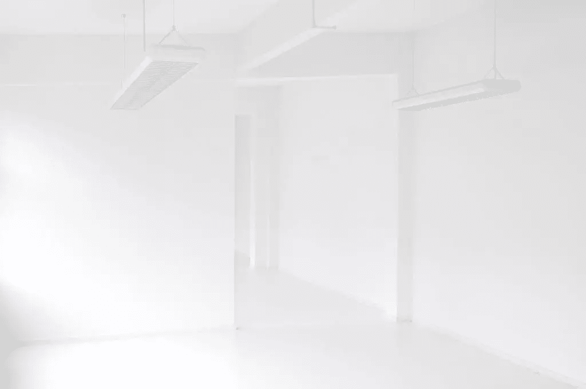

# 高效的远程工作(当你的精神健康状况说“不”时)

> 原文：<https://www.sitepoint.com/productive-remote-work-when-your-mental-health-says-no/>

**远程工作是*而不是*容易。这听起来像一个梦(老实说，在很多方面都是如此)，但远程工作还有更黑暗的一面，只有在完成之后才能理解。**

是这样的。远程工作的人经常精神不佳，所以你可能会想，他们到底为什么要这样做？事实是，虽然远程工作带来了一些非常独特的挑战，但*不*远程工作也是如此。不同之处在于*远程*工作可以为你提供建立适合你的生活方式所需的灵活性。

* * *

**使用 [SitePoint Remote](https://www.sitepoint.com/jobs/) 找到您的下一份远程工作，我们在这里为开发人员、设计师和数字专业人士精心挑选最佳远程工作。**

事实上，远程工作并不是解决倦怠或旅游癖的灵丹妙药，但如果你碰巧尝试了它，并最终屈服于孤独，或缺乏动力或生产力(正如许多远程工作者所做的那样)，至少你将有机会改变事情，让事情变得更好。

在许多人看来，这是两害相权取其轻。

也就是说，试图诊断你的精神和身体需要什么并不容易。某一天可能有效的东西在另一天可能无效，对一个人有效的东西可能对另一个人无效。人类是复杂的，在远程工作的情况下，日常的生产力技巧往往不能满足它。

让我们来看看。

## “我感到孤独”

孤独是一个大问题(也许是最大的问题？)对于在国外的自由远程工作者和数字游牧者来说，但它也会影响那些在分布式团队中工作的人(特别是当一些团队成员*不在*远程时，因为使用这种设置工作时会感觉像一个局外人)。我们来看看解决方案。

### 利用合作空间

合作空间并不适合所有人。如果你教英语，这显然是一个禁忌(不是因为噪音，而是因为噪音会分散其他远程工作者的注意力)。不过，如果你只需要偶尔打打视频电话，许多合作空间会有几个小时的“展位时间”。

加入超高速 Wi-Fi、免费咖啡、每日活动和志同道合的人群，加入联合工作空间就像加入一个社区，一些联合工作空间(如 [Hubud](https://hubud.org/) 和 [Dojo Bali](https://www.dojobali.org/) )真的很有名！**心情愉快=巨大的动力提升**。

### 在酒吧和咖啡馆工作

咖啡馆和酒吧也不错。噪音和座位选择可能有点不可预测，当去一个新的地方时，人们必须找到 Wi-Fi 密码，但总而言之，体验是非常相同的。认识其他人仍然相当容易，因为你很可能不是唯一的常客。

*亲提示:下载 [Wi-Fi 地图 app](https://www.wifimap.io/) 获取你附近网络的 Wi-Fi 密码！*

My favourite café — October Coffee Gaya, Kota Kinabalu, Malaysia)

### 有时会和你的团队碰面

2019 年出现了远程工作的趋势，分散的团队不时会聚在一起，有时甚至会在异国他乡进行年度休假。比如…为什么不呢？马上把想法提出来！

### 工作时大声说出来；没人告诉你你不能

在半分布式团队中，人们会觉得那些远程工作的人被排除在外，大部分行动发生在办公室，“远程”人员不得不用电子邮件备忘录来应对。这是常有的事。很少是故意的，所以如果你想成为团队的一员，那就成为团队的一员！

## “我感到焦虑”

焦虑是一件很难解释的事情，尤其是当我们认为它是我们产生某种感觉的根本原因时。当然，问题会导致焦虑，但是，突如其来的焦虑也会导致*问题*，这让我们有点难以发现我们与焦虑的互动实际上发生在什么地方，我喜欢称之为“心理健康客户之旅”。

我们的焦虑到底是从哪里开始的？🤔

以我的经验来看，克服焦虑的最好方法是留心它。也就是说，当你感到焦虑时，找一个安静的地方思考，并试图找出原因——而不是“全力以赴”,有意或无意地试图用低效的习惯来分散自己的注意力，如查看电子邮件和社交媒体，或在网上搜索通用的生产力建议，这些建议可能只能作为临时的解决方案。

仅供参考:同时有多种焦虑是可能的！

### 工作太多

令人恼火的是，我们从远程工作生活方式中获得的自由可能是一种诅咒，也可能是一种祝福——例如，当“我想什么时候工作就什么时候工作”变成了“该死的一直工作”。

应对超负荷的工作(尤其是应对精疲力竭时)是最糟糕的。解决办法显然是休息一段时间(我想你已经知道了！)，但通常这是不可能的。这是一个进退两难的局面。

诀窍是给自己 30 分钟的休息时间。事先做好计划，让每一秒都有价值，然后你会惊讶地发现自己有多棒，不管你是去散步还是坐在咖啡店里(*而不是*工作！).

随着你的工作效率变得更高，每天把这个 30 分钟的休息时间增加 5 到 10 分钟，最终你会意识到你实际上是在用更少的时间做更多的工作。

不幸的是，生产力“黑客”很少长期有效。相反，一个人必须有规律地选择健康的生活方式。

### 太多的干扰

有太多的工作要做，然后有正常量的工作，但有太多的干扰(可能比你在办公室时更多的干扰)😅).呀！

我相信你以前听说过这些提高效率的建议:

*   删除社交媒体
*   关闭通知
*   关闭 Wi-Fi(如果可以的话)
*   停止检查你的电子邮件和设备
*   使用噪音应用程序(如 [Noizio](https://noiz.io/)
*   试试[番茄工作法](https://www.sitepoint.com/the-pomodoro-technique-time-management/)

虽然这些提高效率的建议完全有效，但是分心和拖延的问题是我们经常会发现新的事情来分散我们的注意力。只是习惯性的。

你试过这些东西吗？

*   关闭打开的标签页
*   删除您的书签
*   取消订阅电子邮件
*   从 dock 中移除应用程序
*   重新定位桌面文件和文件夹
*   完全删除或整合您的应用程序

考虑删除一些应用和订阅，或者将所有待办事项和备忘录转移到一个应用中(甚至是一个简单的降价文件)。你会发现这样你会花更多的时间工作，花更少的时间重组(和担心)你的待办事项。我个人把所有文件都放在云端，dock 里只有 Dropbox + email +我的 todo 文件。眼不见，心不烦！

### 你的工作比你想象的多

你或许可以把你的待办事项清单减半。就像现在。

自由的问题在于，我们认为我们比实际上拥有更多的时间，并且经常(过于兴奋地)在我们的待办事项清单上添加一些事情，当我们不再对做这些事情感到兴奋时，这些事情就变成了负担。做一点春季大扫除…

*   哪些 todos 很好玩却没有真正的结果？
*   哪个 todos *有*的目的，但是现在没有了？
*   哪些待办事项很小，可以马上完成？
*   哪些待办事项可以与其他待办事项合并？

扔掉它们(或者今天完成它们)，不要回头。

再一次，考虑把所有的东西都整合到一个列表中，扔掉 Wunderlist，Trello，以及其他你用来管理太多不同应用程序的各种任务的东西。

## 结论

远程工作很有趣，但也可能非常… *不*有趣。我们倾向于认为自由是一件*好*的事情，但不幸的是，我们生来就会做出糟糕的生活选择，并经常利用这种自由来轰炸我们自己的认知负荷，这对我们没有任何好处。当然是出于好意，但还是。

过了一段时间，这看起来像是“自由/莫”的问题，但实际上这些问题通常是自己造成的。当然，作为一名远程工作者可以获得自由，但也需要很多自律。否则，我们只是在浪费我们的自由，不明智地利用我们的时间，不去关心我们的身心需要什么。老实说，这也适用于非遥控器。

无论如何，诀窍是保持控制。

* * *

对于许多人来说，远程工作是他们的梦想。这也很有挑战性——它需要测试假设和学习一系列全新的技能。我们推荐[远程工作的艺术](https://www.sitepoint.com/premium/books/the-art-of-working-remotely/?utm_source=blog&utm_medium=articles)，这份指南将向你展示如何建立最佳的工作空间，并采取措施在远程工作场所取得成功。

## 分享这篇文章