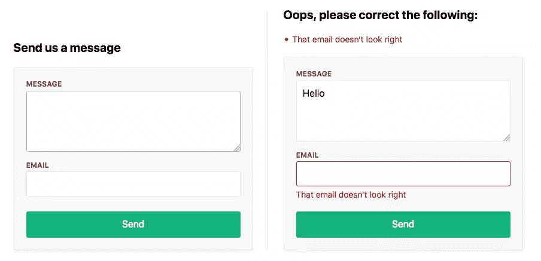

# Node.js 和 Express 的表单、文件上传和安全性

> 原文：<https://www.sitepoint.com/forms-file-uploads-security-node-express/>

如果你正在构建一个 web 应用程序，你可能会在第一天就遇到构建 HTML 表单的需求。它们是网络体验的重要组成部分，而且可能很复杂。

通常，表单处理流程包括:

*   显示一个空的 HTML 表单来响应初始的`GET`请求
*   用户在`POST`请求中提交包含数据的表单
*   在客户端和服务器上都进行验证
*   如果无效，重新显示填充了转义数据和错误消息的表单
*   在服务器上对清理过的数据做一些事情，如果这些数据都有效的话
*   处理数据后重定向用户或显示成功消息。

处理表单数据还需要额外的安全考虑。

我们将浏览所有这些内容，并解释如何使用 Node.js 和[Express](https://expressjs.com/)——最流行的 Node web 框架来构建它们。首先，我们将构建一个简单的联系表单，人们可以在其中安全地发送消息和电子邮件地址，然后看看在处理文件上传时涉及到什么。



与以往一样，完整的代码可以在我们的 [GitHub repo](https://github.com/sitepoint-editors/node-forms) 中找到。

## 设置

确保您已经安装了 Node.js 的最新版本。`node -v`应返回`8.9.0`或更高。

使用 Git 从这里下载启动代码:

```
git clone -b starter https://github.com/sitepoint-editors/node-forms.git node-forms-starter
cd node-forms-starter
npm install
npm start 
```

*注:回购有两个分支，`starter`和`master`。`starter`分支包含了遵循本文所需的最基本的设置。`master`分支包含一个完整的工作演示(上面的链接)。*

这里没有太多的代码。这只是一个带有 [EJS 模板](https://www.npmjs.com/package/ejs)和错误处理程序的基本快速设置:

```
// server.js
const path = require('path');
const express = require('express');
const layout = require('express-layout');

const routes = require('./routes');
const app = express();

app.set('views', path.join(__dirname, 'views'));
app.set('view engine', 'ejs');

const middlewares = [
  layout(),
  express.static(path.join(__dirname, 'public')),
];
app.use(middlewares);

app.use('/', routes);

app.use((req, res, next) => {
  res.status(404).send("Sorry can't find that!");
});

app.use((err, req, res, next) => {
  console.error(err.stack);
  res.status(500).send('Something broke!');
});

app.listen(3000, () => {
  console.log('App running at http://localhost:3000');
}); 
```

根 url `/`简单地呈现了`index.ejs`视图:

```
// routes.js
const express = require('express');
const router = express.Router();

router.get('/', (req, res) => {
  res.render('index');
});

module.exports = router; 
```

## 显示表单

当人们向`/contact`发出 GET 请求时，我们希望呈现一个新的视图`contact.ejs`:

```
// routes.js
router.get('/contact', (req, res) => {
  res.render('contact');
}); 
```

联系方式会让他们给我们发送信息和电子邮件地址:

```
<!-- views/contact.ejs -->
<div class="form-header">
  <h2>Send us a message</h2>
</div>
<form method="post" action="/contact" novalidate>
  <div class="form-field">
    <label for="message">Message</label>
    <textarea class="input" id="message" name="message" rows="4" autofocus></textarea>
  </div>
  <div class="form-field">
    <label for="email">Email</label>
    <input class="input" id="email" name="email" type="email" value="" />
  </div>
  <div class="form-actions">
    <button class="btn" type="submit">Send</button>
  </div>
</form> 
```

看看`http://localhost:3000/contact`的样子。

## 表单提交

要在 Express 中接收 POST 值，您首先需要包含`body-parser`中间件，该中间件在路由处理程序中的`req.body`上公开提交的表单值。将其添加到`middlewares`数组的末尾:

```
// server.js
const bodyParser = require('body-parser');

const middlewares = [
  // ...
  bodyParser.urlencoded({ extended: true }),
]; 
```

表单将数据发送回初始 GET 请求中使用的相同 URL 是一个常见的约定。让我们在这里这样做，并处理 POST `/contact`来处理用户输入。

我们先来看无效提交。如果无效，我们需要将提交的值传递回视图(这样用户就不需要重新输入它们)以及我们想要显示的任何错误消息:

```
router.get('/contact', (req, res) => {
  res.render('contact', {
    data: {},
    errors: {}
  });
});

router.post('/contact', (req, res) => {
  res.render('contact', {
    data: req.body, // { message, email }
    errors: {
      message: {
        msg: 'A message is required'
      },
      email: {
        msg: 'That email doesn‘t look right'
      }
    }
  });
}); 
```

如果有任何验证错误，我们将执行以下操作:

*   在表单顶部显示错误
*   将输入值设置为提交给服务器的值
*   在输入下方显示行内错误
*   向有错误的字段添加一个`form-field-invalid`类。

```
<!-- views/contact.ejs -->
<div class="form-header">
  <% if (Object.keys(errors).length === 0) { %>
    <h2>Send us a message</h2>
  <% } else { %>
    <h2 class="errors-heading">Oops, please correct the following:</h2>
    <ul class="errors-list">
      <% Object.values(errors).forEach(error => { %>
        <li><%= error.msg %></li>
      <% }) %>
    </ul>
  <% } %>
</div>

<form method="post" action="/contact" novalidate>
  <div class="form-field <%= errors.message ? 'form-field-invalid' : '' %>">
    <label for="message">Message</label>
    <textarea class="input" id="message" name="message" rows="4" autofocus><%= data.message %></textarea>
    <% if (errors.message) { %>
      <div class="error"><%= errors.message.msg %></div>
    <% } %>
  </div>
  <div class="form-field <%= errors.email ? 'form-field-invalid' : '' %>">
    <label for="email">Email</label>
    <input class="input" id="email" name="email" type="email" value="<%= data.email %>" />
    <% if (errors.email) { %>
      <div class="error"><%= errors.email.msg %></div>
    <% } %>
  </div>
  <div class="form-actions">
    <button class="btn" type="submit">Send</button>
  </div>
</form> 
```

在`http://localhost:3000/contact`提交表格，查看实际操作。这就是我们在视图端需要的一切。

## 验证和消毒

有一个方便的中间件叫做 [express-validator](https://www.npmjs.com/package/express-validator) ，用于使用 [validator.js](https://github.com/chriso/validator.js) 库来验证和净化数据。让我们将它添加到我们的应用程序中。

### 确认

有了提供的[验证器](https://github.com/chriso/validator.js#validators)，我们可以很容易地检查是否提供了消息和有效的电子邮件地址:

```
// routes.js
const { check, validationResult, matchedData } = require('express-validator');

router.post('/contact', [
  check('message')
    .isLength({ min: 1 })
    .withMessage('Message is required'),
  check('email')
    .isEmail()
    .withMessage('That email doesn‘t look right')
], (req, res) => {
  const errors = validationResult(req);
  res.render('contact', {
    data: req.body,
    errors: errors.mapped()
  });
}); 
```

### 卫生处理

有了提供的[清理器](https://github.com/chriso/validator.js#sanitizers)，我们可以从值的开头和结尾修剪空白，并将电子邮件地址规范化为一致的模式。这有助于删除由稍微不同的输入创建的重复联系人。例如，`' Mark@gmail.com'`和`'mark@gmail.com '`都将被清理到`'mark@gmail.com'`中。

杀毒程序可以简单地链接到验证程序的末尾:

```
// routes.js
router.post('/contact', [
  check('message')
    .isLength({ min: 1 })
    .withMessage('Message is required')
    .trim(),
  check('email')
    .isEmail()
    .withMessage('That email doesn‘t look right')
    .bail()
    .trim()
    .normalizeEmail()
], (req, res) => {
  const errors = validationResult(req);
  res.render('contact', {
    data: req.body,
    errors: errors.mapped()
  });

  const data = matchedData(req);
  console.log('Sanitized:', data);
}); 
```

`matchedData`函数在我们的输入上返回杀毒程序的输出。

另外，注意我们使用的[保释](https://express-validator.github.io/docs/validation-chain-api.html#bail)方法，如果前面的任何一个验证失败，它将停止运行验证。我们需要这样做，因为如果用户提交表单时没有在 email 字段中输入值，`normalizeEmail`将试图规范化一个空字符串，并将其转换为`@`。当我们重新呈现表单时，这将被插入到我们的电子邮件字段中。

## 有效形式

如果有错误，我们需要重新渲染视图。如果没有，我们需要对数据做一些有用的事情，然后显示提交是成功的。通常，此人会被重定向到成功页面并显示一条消息。

HTTP 是无状态的，所以如果没有一个[会话 cookie](https://developer.mozilla.org/en-US/docs/Web/HTTP/Cookies) 的帮助，你就不能重定向到另一个页面*和*传递消息，从而在 HTTP 请求之间保存消息。“快速消息”是对这种一次性消息的命名，我们希望这种消息在重定向时保持不变，然后消失。

要实现这一点，我们需要包括三个中间件:

```
// server.js
const cookieParser = require('cookie-parser');
const session = require('express-session');
const flash = require('express-flash');

const middlewares = [
  // ...
  cookieParser(),
  session({
    secret: 'super-secret-key',
    key: 'super-secret-cookie',
    resave: false,
    saveUninitialized: false,
    cookie: { maxAge: 60000 }
  }),
  flash(),
]; 
```

`express-flash`中间件增加了`req.flash(type, message)`，我们可以在路由处理器中使用它:

```
// routes
router.post('/contact', [
  // validation ...
], (req, res) => {
  const errors = validationResult(req);
  if (!errors.isEmpty()) {
    return res.render('contact', {
      data: req.body,
      errors: errors.mapped()
    });
  }

  const data = matchedData(req);
  console.log('Sanitized: ', data);
  // Homework: send sanitized data in an email or persist to a db

  req.flash('success', 'Thanks for the message! I‘ll be in touch :)');
  res.redirect('/');
}); 
```

`express-flash`中间件将`messages`添加到所有视图都可以访问的`req.locals`中:

```
<!-- views/index.ejs -->
<% if (messages.success) { %>
  <div class="flash flash-success"><%= messages.success %></div>
<% } %>

<h1>Working With Forms in Node.js</h1> 
```

现在，您应该被重定向到`index`视图，并在提交包含有效数据的表单时看到一条成功消息。万岁。我们现在可以将它部署到生产中，并由尼日利亚王子向我们发送消息。

[https://codesandbox.io/embed/priceless-butterfly-u3557?codemirror=1&fontsize=14&initialpath=%2Fcontact&theme=dark](https://codesandbox.io/embed/priceless-butterfly-u3557?codemirror=1&fontsize=14&initialpath=%2Fcontact&theme=dark)

### 使用节点发送电子邮件

你可能已经注意到，邮件的实际发送是留给读者的作业。这并不像听起来那么困难，可以使用 [Nodemailer 包](https://www.npmjs.com/package/nodemailer)来完成。你可以在这里找到[关于如何设置的基本说明，或者在这里](https://www.w3schools.com/nodejs/nodejs_email.asp)找到[更深入的教程。](https://stackabuse.com/how-to-send-emails-with-node-js/)

## 安全考虑

如果您正在使用 Internet 上的表单和会话，您需要了解 web 应用程序中常见的安全漏洞。我得到的最好的安全建议是“永远不要相信客户！”

### HTTPS 上空的 TLS

*在处理表单时，总是使用 TLS 加密*而不是`https://`，这样提交的数据在通过互联网发送时就会被加密。如果您通过`http://`发送表单数据，它是以纯文本的形式发送的，当这些数据包在网络上传输时，任何窃听它们的人都可以看到。

如果您想了解更多关于在 Node.js 中使用 SSL/TLS 的信息，请参考本文。

### 戴上你的头盔

有一个叫做[头盔](https://helmetjs.github.io/docs/)的小巧的中间件，它增加了 HTTP 头的安全性。最好包含在您的中间件的顶部，并且非常容易包含:

```
// server.js
const helmet = require('helmet');

middlewares = [
  helmet(),
  // ...
]; 
```

### 跨站点请求伪造(CSRF)

您可以保护自己免受[跨站点请求伪造](https://en.wikipedia.org/wiki/Cross-site_request_forgery)的影响，方法是在向用户呈现表单时生成一个惟一的令牌，然后在处理 POST 数据之前验证该令牌。这里还有一个[中间件](https://expressjs.com/en/resources/middleware/csurf.html)来帮助你:

```
// routes.js
const csrf = require('csurf');
const csrfProtection = csrf({ cookie: true }); 
```

在 GET 请求中，我们生成一个令牌:

```
// routes.js
router.get('/contact', csrfProtection, (req, res) => {
  res.render('contact', {
    data: {},
    errors: {},
    csrfToken: req.csrfToken()
  });
}); 
```

并且在验证错误响应中:

```
router.post('/contact', csrfProtection, [
  // validations ...
], (req, res) => {
  const errors = validationResult(req);
  if (!errors.isEmpty()) {
    return res.render('contact', {
      data: req.body,
      errors: errors.mapped(),
      csrfToken: req.csrfToken()
    });
  }

  // ...
}); 
```

然后我们只需要在隐藏输入中包含令牌:

```
<!-- view/contact.ejs -->
<form method="post" action="/contact" novalidate>
  <input type="hidden" name="_csrf" value="<%= csrfToken %>">
  <!-- ... -->
</form> 
```

这就是全部要求。

我们不需要修改 POST 请求处理程序，因为所有 POST 请求现在都需要一个由`csurf`中间件提供的有效令牌。如果没有提供有效的 CSRF 令牌，就会抛出一个`ForbiddenError`错误，这个错误可以由在`server.js`末尾定义的错误处理程序来处理。

您可以通过使用浏览器的开发工具编辑或删除表单中的令牌并提交来测试这一点。

### 跨站点脚本(XSS)

当在 HTML 视图中显示用户提交的数据时，你需要小心，因为它会让你进入[跨站脚本(XSS)](https://developer.mozilla.org/en-US/docs/Glossary/Cross-site_scripting) 。所有的模板语言都提供了不同的输出值的方法。EJS `<%= value %>`输出 *HTML 转义*值来保护你免受 XSS 的攻击，而`<%- value %>`输出一个原始字符串。

在处理用户提交的值时，总是使用转义输出`<%= value %>`。只有在确定安全的情况下，才使用原始输出。

## 文件上传

在 HTML 表单中上传文件是一种特殊情况，需要编码类型`"multipart/form-data"`。参见 [MDN 的发送表单数据指南](https://developer.mozilla.org/en-US/docs/Learn/HTML/Forms/Sending_and_retrieving_form_data#A_special_case_sending_files)，了解更多关于多部分表单提交的细节。

您将需要额外的中间件来处理多部分上传。我们将在这里使用一个名为 [multer](https://www.npmjs.com/package/multer) 的快速包:

```
// routes.js
const multer = require('multer');
const upload = multer({ storage: multer.memoryStorage() });

router.post('/contact', upload.single('photo'), csrfProtection, [
  // validation ...
], (req, res) => {
  // error handling ...

  if (req.file) {
    console.log('Uploaded: ', req.file);
    // Homework: Upload file to S3
  }

  req.flash('success', 'Thanks for the message! I’ll be in touch :)');
  res.redirect('/');
}); 
```

这段代码指示`multer`将“照片”字段中的文件上传到内存中，并在`req.file`中公开`File`对象，我们可以对其进行进一步检查或处理。

我们需要的最后一件事是添加`enctype`属性和我们的文件输入:

```
<form method="post" action="/contact?_csrf=<%= csrfToken %>" novalidate enctype="multipart/form-data">
  <input type="hidden" name="_csrf" value="<%= csrfToken %>">
  <div class="form-field <%= errors.message ? 'form-field-invalid' : '' %>">
    <label for="message">Message</label>
    <textarea class="input" id="message" name="message" rows="4" autofocus><%= data.message %></textarea>
    <% if (errors.message) { %>
      <div class="error"><%= errors.message.msg %></div>
    <% } %>
  </div>
  <div class="form-field <%= errors.email ? 'form-field-invalid' : '' %>">
    <label for="email">Email</label>
    <input class="input" id="email" name="email" type="email" value="<%= data.email %>" />
    <% if (errors.email) { %>
      <div class="error"><%= errors.email.msg %></div>
    <% } %>
  </div>
  <div class="form-field">
    <label for="photo">Photo</label>
    <input class="input" id="photo" name="photo" type="file" />
  </div>
  <div class="form-actions">
    <button class="btn" type="submit">Send</button>
  </div>
</form> 
```

尝试上传文件。您应该会看到控制台中记录的`File`对象。

### 填充文件输入

在验证错误的情况下，我们不能像对文本输入那样重新填充文件输入([这是一个安全风险](https://stackoverflow.com/questions/1696877/how-to-set-a-value-to-a-file-input-in-html))。解决此问题的一种常见方法包括以下步骤:

*   将文件上传到服务器上的临时位置
*   显示附件的缩略图和文件名
*   将 JavaScript 添加到表单中，以允许人们删除选定的文件或上传新文件
*   当一切都有效时，将文件移动到一个永久的位置。

由于处理多部分和文件上传的额外复杂性，它们通常以单独的形式保存。

### 使用节点上传文件

最后，您会注意到，实际的上传功能是由阅读器来实现的。这并不像听起来那么困难，可以使用各种软件包来完成，比如[强大的](https://www.npmjs.com/package/formidable)，或者[快速文件上传](https://www.npmjs.com/package/express-fileupload)。你可以在这里找到[关于如何设置的基本说明，或者在这里](https://flaviocopes.com/how-to-handle-file-uploads-node/)找到[更深入的教程。](https://stackabuse.com/handling-file-uploads-in-node-js-with-expres-and-multer/)

## 感谢阅读

我希望您喜欢学习 HTML 表单以及如何在 Express 和 Node.js 中使用它们。下面是我们所学内容的快速回顾:

*   显示空表单以响应 GET 请求
*   处理提交的帖子数据
*   显示错误、内联错误和提交数据的列表
*   用验证器检查提交的数据
*   用杀毒软件清理提交的数据
*   使用 flash 消息跨重定向传递消息
*   保护自己免受 CSRF 和 XSS 之类的袭击
*   在多部分表单提交中处理文件上传。

让我知道你是如何通过 Twitter 上[的！](https://twitter.com/markbrown4)

## 分享这篇文章