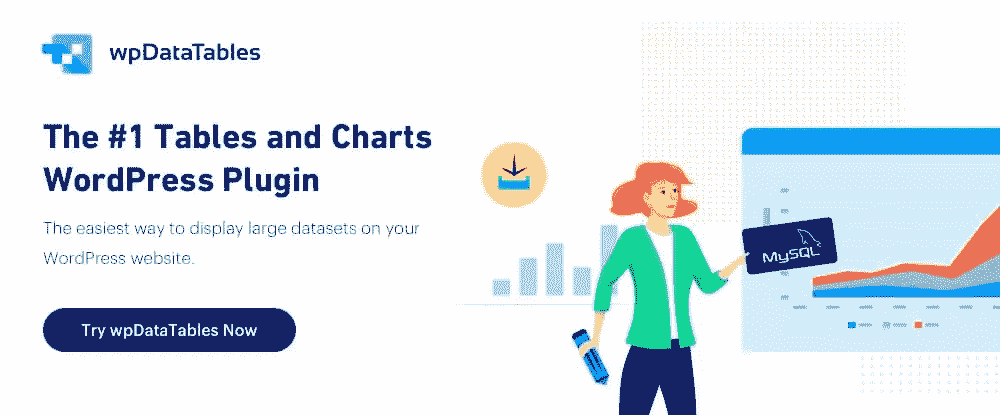
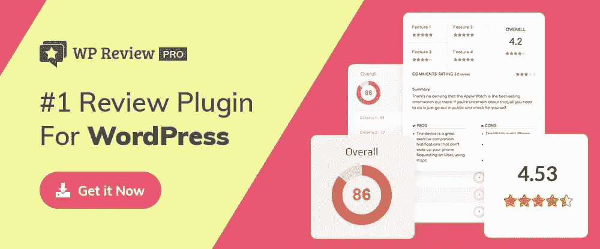

# 为你的网站增压的 2020 个 WordPress 插件

> 原文：<https://www.sitepoint.com/wordpress-plugins-website-supercharge/>

*这篇赞助文章由我们的内容合作伙伴 [BAW 媒体](https://bawmedia.com)创作。感谢您对使 SitePoint 成为可能的合作伙伴的支持。*

WordPress 已经成为最受欢迎的网站建设平台。它有丰富的工具来帮助你设计和建立一个专业的投资组合，博客，电子商务网站，或几乎任何其他类型的网站。

没有什么是完美的。即使这个卓越的网络建设平台接近成功，它也缺少某些工具或功能——例如，可以给你的网站增加一个重要的额外功能的工具或功能，或者简单地给它注入类固醇。

正如他们所说，帮助就在眼前——以 WordPress 插件的形式。

然而，他们有超过 55，000 人。

希望本文中描述的八个高级插件中的一个或多个能够解决您一直在寻找的功能。在任何情况下，我们都愿意打赌你会喜欢使用这些流行的插件。

听起来像个赢家。

## 1.WordPress 的 Brizy 网站生成器

将 Brizy WordPress 插件添加到你的网页设计工具包中并不缺乏好的理由，但是在进入更多细节之前，让我们从几个真正好的开始。

*   Brizy 易于设置，使用直观，可以轻松开始网站设计。
*   您可以在几分钟内构建一个页面，并且不需要任何编码。
*   布里兹不会花你一分钱。可以免费下载使用。

如果这还不足以让你尝试这个优质的网站建设插件，那么还有更多。你可以得到 500 多个预制块、40 个弹出窗口和 150 个布局——如果你不想从头开始，这是很好的选择。

此外，该软件包包含 4，000 个图标，您可能需要的所有全局颜色和字体，一个弹出窗口生成器，应用程序集成和线索生成选项，以及大量有用的文档，包括视频教程。

无论你是 WordPress 的长期用户还是刚刚入门，Brizy 提供了你希望早点知道的额外内容。

## 2.[WP 数据表](https://wpdatatables.com/pricing/?utm_source=sitepoint.com&utm_medium=content&utm_campaign=plugins20)

wpDataTables 的学习曲线可能并不陡峭，但是您为熟悉这个插件所投入的每一分钟都是值得的。那是因为这个高级插件可以为你做很多事情。如果您曾经不得不组织和管理各种格式、来自多个来源的大量数据，您会发现这也是一种巨大的时间节省。

别担心。用户文档非常详细，易于理解。

wpDataTables 插件使您能够构建一个网站，可以轻松地管理基于 Excel 和 CSV 文件、Google 电子表格、MySQL 查询、JSON 和 XML feed 的数据，以及其他更多内容。

您将能够构建可编辑的表格和图表，其中包括财务或运营统计数据、复杂的分析和比较数据以及大量的产品目录。

这些表格和图表将易于理解和响应，它们也可以是丰富多彩的。

## 3.[逻辑跳转 WordPress 的内容个性化](https://logichop.com/?utm_source=sitepoint.com&utm_medium=content&utm_campaign=plugins20)

一段时间以来，Logic Hop 一直是我们的最爱之一，原因很简单:毫无疑问，Logic Hop 是 WordPress 最好的个性化插件。

真相是什么？Logic Hop 完全符合 GDPR 标准，无论有无缓存都可以工作，它的支持团队确实是最好的之一，它会让你赚更多的钱。有什么不喜欢的？

2020 年将成为内容个性化的一年。为什么？精明的营销人员和开发商开始意识到它的真正潜力。通过个性化简单的行动号召，您可以将转化率和销售额提高 200%以上。这不是废话，这是有据可查的！Logic Hop 使您可以轻松集成您最喜欢的页面生成器，如 Divi、Elementor 和 Beaver Builder。

不要袖手旁观。今天就开始个性化。

## 4. [StarCat 评论](https://starcatwp.com/?utm_source=sitepoint.com&utm_medium=content&utm_campaign=plugins20)

StarCat Reviews 是一个一体化的 WordPress 评论插件，可以满足你所有的评论需求。轻松创建任何类型的评论网站，包括用户生成的评论网站。在你的网站上评论产品和服务可以赚很多钱。

它包括一个先进的审查系统，具有多种评级标准，利弊，并审查答复，可用于任何职位，页面，WooCommerce 页面或 CPT。它还拥有功能更强大的高级附加组件。

## 5. [Amelia WordPress 预订插件](https://wpamelia.com/pricing/?utm_source=sitepoint.com&utm_medium=content&utm_campaign=plugins20)

Amelia 是一个企业级的约会和活动预订插件，可以从一个平台自动管理您企业的约会和活动操作。

客户喜欢 Amelia，因为它使他们能够随时进行、访问、重新安排或取消约会。员工喜欢 Amelia，因为它可以让他们的工作时间表与客户需求相匹配，而无需来回奔波。

你会喜欢阿米莉亚，因为它会节省你大量的时间和金钱，同时让你的客户高兴。

## 6. [WordPress 评论](https://mythemeshop.com/plugins/wordpress-review/)

WordPress Review 非常适合建立一个网站来评论产品、书籍、游戏或其他任何东西。不同的产品通常需要不同类型的评论——比如圈、星、百分比、竖起大拇指等等。WP Review 还可以创建比较表来处理多种产品。功能包括支持 19 个省时的丰富片段和 16 个预定义的网站设计。WordPress Review 兼容任何 WordPress 主题，并与 WooCommerce 完全集成。

## 7.[英雄知识库——知识库插件](https://herothemes.com/plugins/heroic-wordpress-knowledge-base/?utm_source=sitepoint.com&utm_medium=content&utm_campaign=plugins20)

对顾客的询问做出快速反应是优质顾客服务的标志。客户也喜欢能够快速获得问题的信息性答案——这是 FAQ 页面不擅长提供的。

您的客户将会感谢您在 heritary KB 知识库插件的帮助下提供的 24/7 知识渊博的答案和信息。它的功能包括实时搜索、文章反馈，以及基于访问者在访问您的网站时所采取的行动的分析的答案。

## 8.[排名数学 SEO](https://rankmath.com/wordpress/plugin/seo-suite/)

让一个网站尽可能的搜索引擎友好是一件非常麻烦的事情。Rank Math 插件有着简洁明了的界面和各种 SEO 增强特性，可以完成这项工作。

其中包括 WooCommerce SEO、自动图像 SEO 和各种本地 SEO 选项。排名数学还将评估您的网站的 40 个不同的搜索引擎优化因素，以帮助确保它将是一个电子商务发电站。

## 包扎

你刚刚发现了 2020 年的八个顶级插件——其中一个或多个可以用来给一个新的或现有的网站增加活力。它们提供了许多特性和功能。他们缺少很多(如果不是大多数的话)WordPress 主题，包括很多专业主题。

不要犹豫尝试这八个顶级 WordPress 插件中的一个或多个。如果你觉得你可以很好地利用它们，你可能可以。

## 分享这篇文章