# 用 Print Peppermint 的新鲜设计和优质纸张留下印象

> 原文：<https://www.sitepoint.com/leave-an-impression-with-print-peppermints-fresh-designs-premium-paper/>

*本文是与 [Print Peppermint](https://synd.co/2twsklY) 合作创作的。感谢您对使 SitePoint 成为可能的合作伙伴的支持。*

[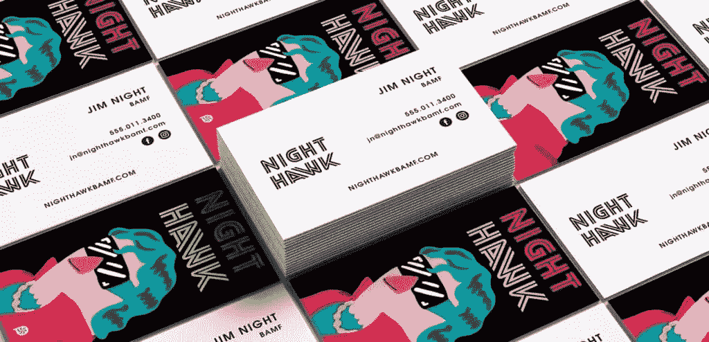](https://synd.co/2twsklY)

每个人都有一张名片，你的有什么不同吗？为你的生意设计理想的卡片是一个值得花时间和思考的项目。对于一个新鲜的方法，考虑[打印薄荷](https://synd.co/2twsklY)。他们的内部设计服务确保您的名片绝对是定制和独特的，他们的高端特殊处理增加了一点档次。

他们不是街区里新来的孩子。在过去的七年里，他们制作了数以千计的创新印刷项目，并吸引了行业领先的创意公司的业务，如 **Vice、Google、Geico、Wendy's** 。他们甚至为 Grammarly 打印了**圆形模切名片，这是我们办公室最喜欢的网络应用之一！他们也可以为你手工制作一些独特的东西。**

[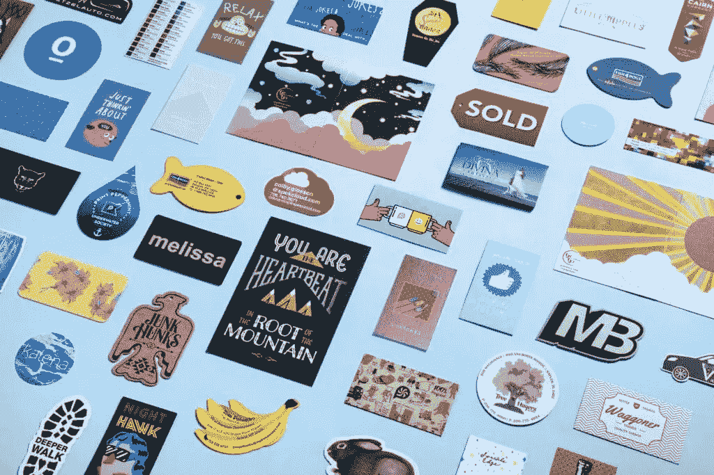](https://synd.co/2twsklY)

你可以从他们的免费在线设计工具开始。这是一个易于使用的在线应用程序，它将帮助您从空白画布上设计自己的名片、海报、传单、邀请函和贺卡。

[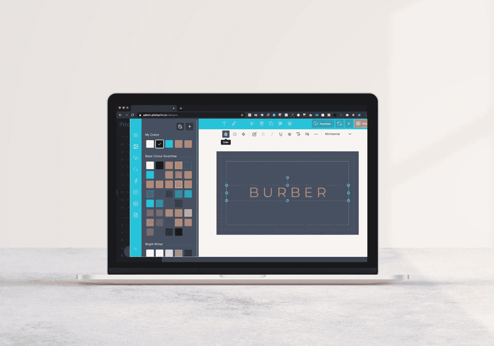](https://synd.co/2twsklY)

但是如果你把设计工作交给专家，并雇佣他们内部的一名平面设计师，你会得到最好的结果。给他们尽可能多的输入——草图、想法、任何能激发你灵感的东西的链接——他们会以一种新鲜、独特的方式把它带进生活。他们甚至可以为你的企业设计一个标志。每一份订单都经过手工检验，无论大小。

但是你写在名片上的只是一个开始。认真思考一下卡片本身。

首先，您打印的纸张可以产生非常有触感的印象。从精心策划的厚纸和优质纸系列中选择，包括 100%纯棉、触感柔软、三层、透明磨砂塑料、缟玛瑙黑麂皮、再生牛皮纸等等。

第二，从多种特殊饰面中选择。他们脱颖而出，对你的业务做出强有力的声明。这些包括铝箔冲压，模切，压花，凸版印刷，边缘绘画，等等。

设计、纸张和表面处理的完美结合给人留下了深刻的印象。这里有几个你可以实现的例子。

一个“凸版印刷完成”可以是引人入胜的，而凹陷可以给人留下深刻的印象。这是在厚棉纸上的盲凹陷。

[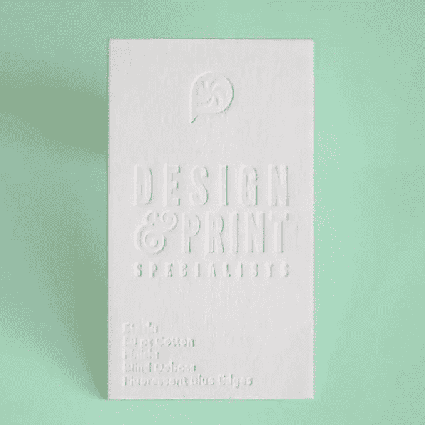](https://synd.co/2twsklY)

通过使用透明塑料，你的名片将像信用卡一样耐用。磨砂 PVC 向您的客户表达了您的高标准和对质量的关注。

[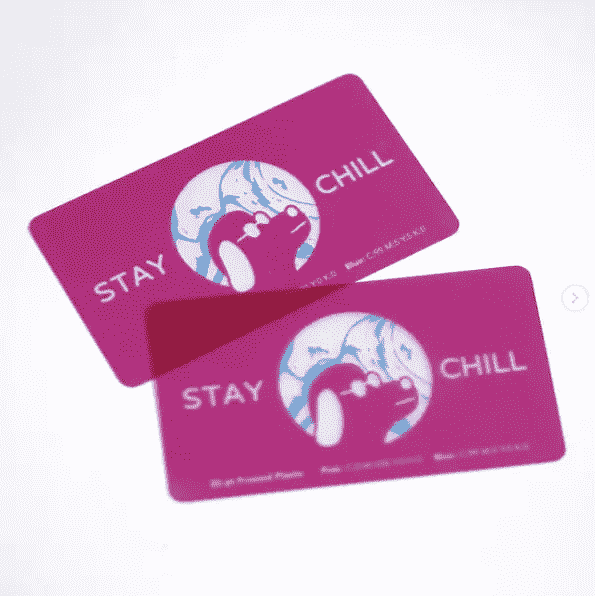](https://synd.co/2twsklY)

金属箔邮票名片有一个溢价的外观。有 15 种颜色可供选择，这里有一种是铜色的。你甚至可以让照片具有金属质感。

[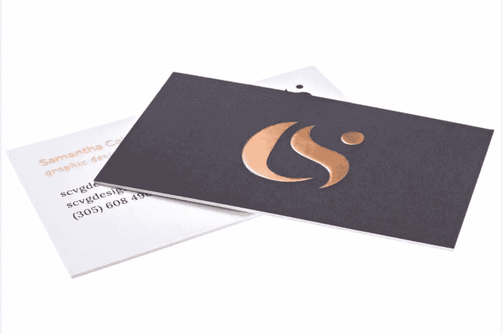](https://synd.co/2twsklY)

凸起的箔片感觉更富有戏剧性，类似于压花。这是它在优质麂皮、触感柔软的纸上的金色效果。

[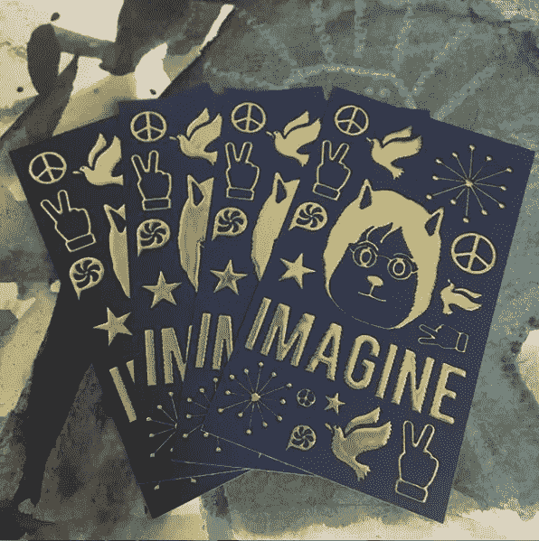](https://synd.co/2twsklY)

如果你觉得矩形很无聊，你可以把你的名片剪成任何定制的形状。想象一下可能性！

[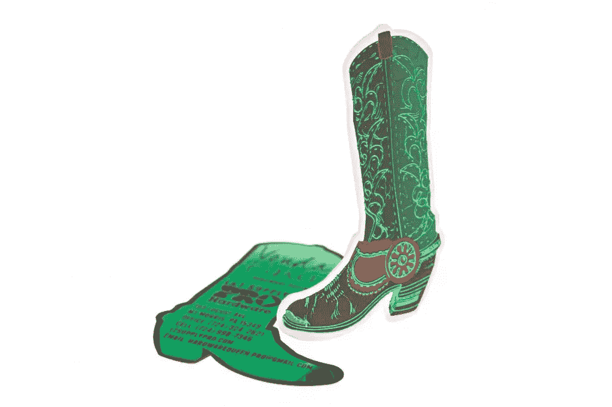](https://synd.co/2twsklY)

甚至你的卡片边缘也可以定制油漆。

[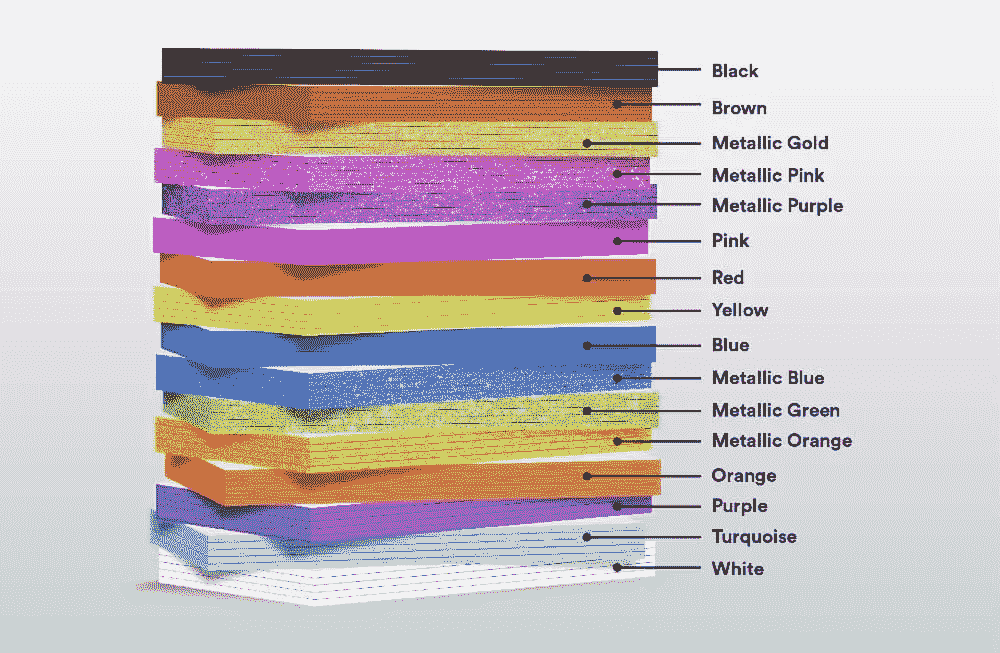](https://synd.co/2twsklY)

合适的名片可以确保完美地介绍你的业务，所以要花时间决定设计。获得灵感的最佳方式可能是订购他们价值 10 美元的样品包。您将能够触摸、嗅闻和探索 20 多种优质产品和纸张，作为奖励，您的订单将减少 25 美元。对我来说那听起来像一笔好交易。

[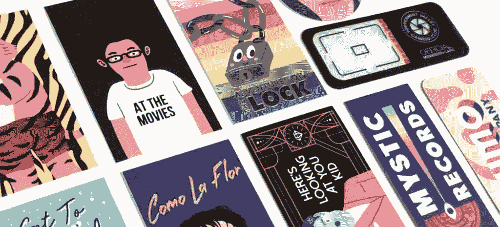](https://synd.co/2twsklY)

另一个极好的灵感来源是该公司的[设计博客](https://synd.co/36zNDC2)。它充斥着诸如[平面设计](https://synd.co/2ty5af7)和[摄影](https://www.printpeppermint.com/tag/graphic-design/)等主题的文章，但你会想从[名片灵感](https://www.printpeppermint.com/tag/business-card-inspiration/)部分开始。如果你在设计自己的卡片时遇到困难，看看别人的设计会很有帮助。该博客包含 200 多篇文章，探索最近完成的名片项目。

你现在对你现在的名片有什么感觉？如果你准备好了新的东西，所有印刷薄荷产品都支持 100%退款质量保证。他们为拥有多名员工的企业和组织提供惊人的团体订单折扣。

有了合适的名片，你现在所需要的就是完善如何[以一种风格](https://www.printpeppermint.com/the-archetype-of-business-card-handling-how-to-hand-out-yours/)送出你的名片！

[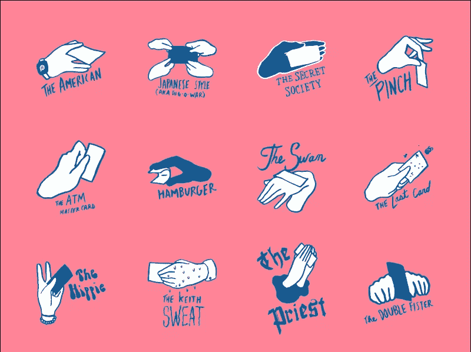](https://synd.co/2twsklY)

## 分享这篇文章