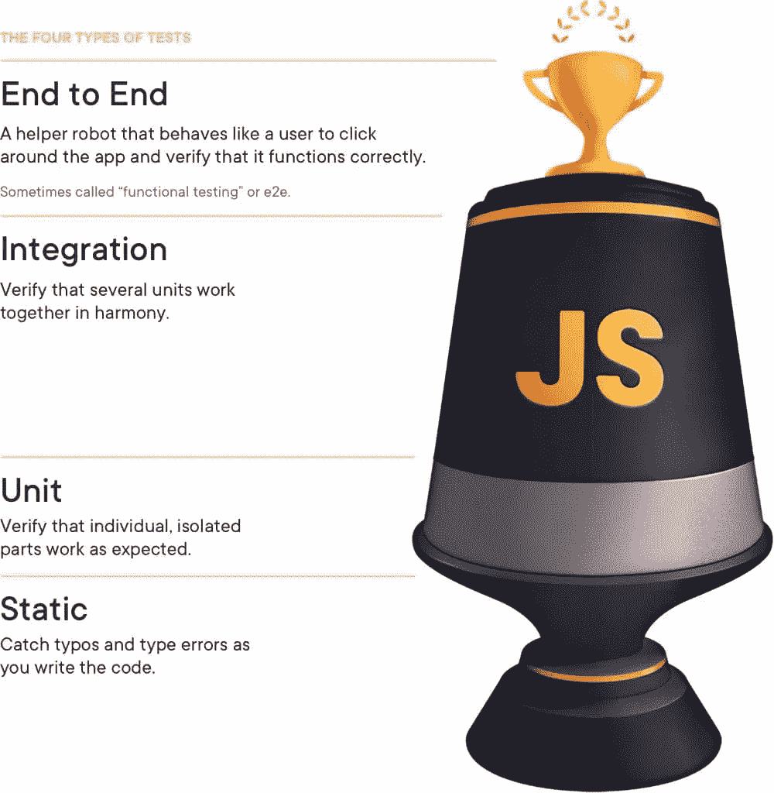
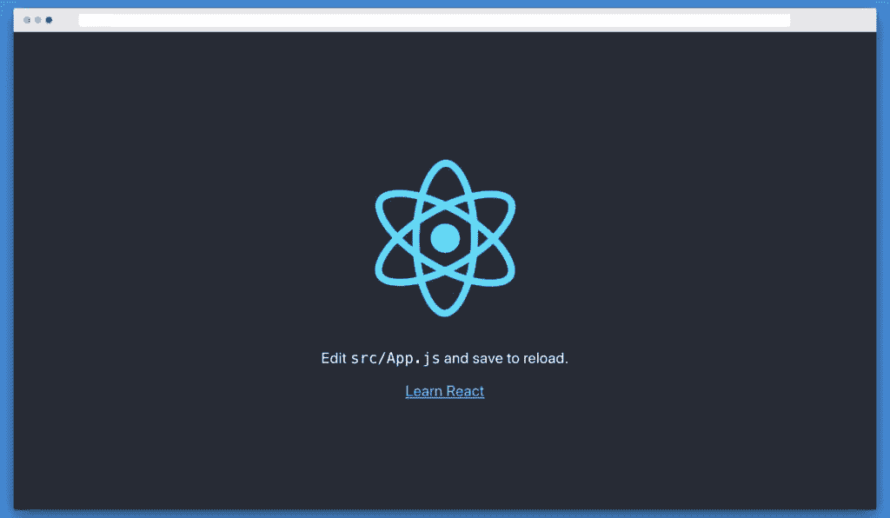
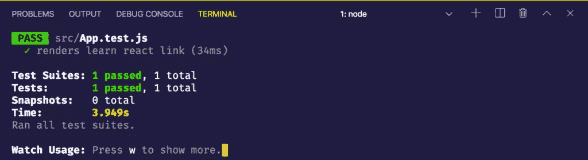
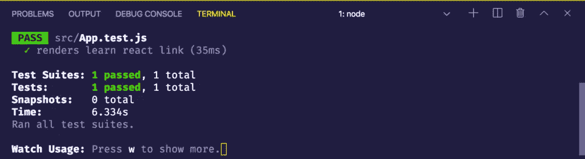
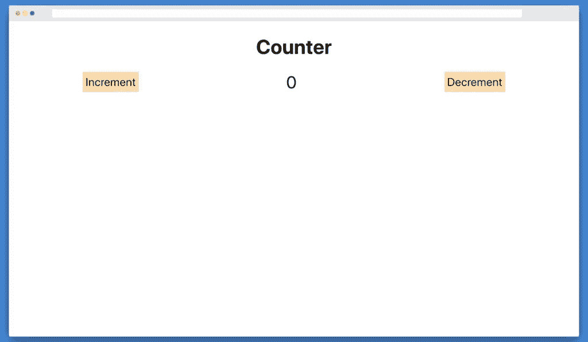
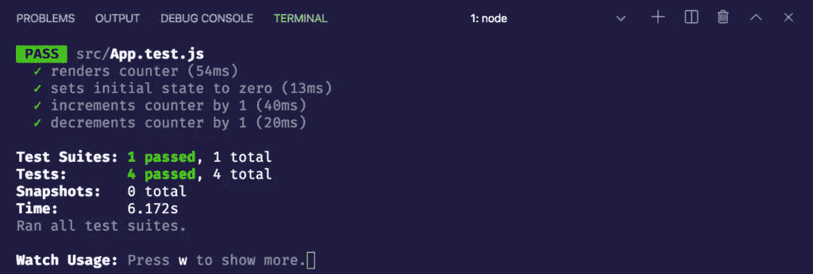

# 使用木偶师学习端到端测试

> 原文：<https://www.sitepoint.com/puppeteer-end-to-end-testing/>

在本教程中，我们将学习什么是测试，不同类型的测试，然后我们将使用 Puppeteer 对我们的应用程序执行端到端测试。本教程结束时，您应该能够使用 Puppeteer 轻松地对您的应用程序进行端到端测试。

## 什么是木偶师？

是一个节点库，它提供了一个高级 API 来控制 DevTools 协议上的 Chrome 或 Chromium。默认情况下，Puppeteer 是无头运行的，但是可以配置为运行完整的(非无头)Chrome 或 Chrome。

## 先决条件

对于本教程，您需要 JavaScript、ES6+和 Node.js 的基础知识。

您还必须安装了最新版本的 [Node.js](https://nodejs.org/) 。

我们将在整个教程中使用[纱线](https://yarnpkg.com/)。如果你还没有安装`yarn`，从[这里](https://yarnpkg.com/en/docs/install)安装。

你也应该知道木偶师的基本知识。要了解木偶师的基础知识，请查看这个简单的教程。

为了确保我们在同一页上，这些是本教程中使用的版本:

*   节点 13.3.0
*   国家预防机制 6.13.2
*   纱线 1.21.1
*   木偶师 2.0.0
*   创建-反应-应用 3.3.0

## 测试简介

简单来说，**测试**是评估应用程序是否按预期工作的过程。它有助于在部署应用程序之前捕获 bug。

有四种不同类型的测试:

1.  **静态测试**:使用静态类型系统如 [TypeScript](https://www.typescriptlang.org/) 、 [ReasonML](https://reasonml.github.io/) 、 [Flow](https://flow.org/) 或 linter 如 [ESLint](https://eslint.org/) 。这有助于捕捉基本错误，如错别字和语法。
2.  **单元测试**:测试应用程序的最小部分，也称为单元。
3.  **集成测试**:将多个相关的单元放在一起测试，看看应用程序在组合中是否能完美工作。
4.  **端到端测试**:整个应用程序从头到尾都要进行测试，就像普通用户一样，看看它的行为是否符合预期。

肯特·C·多兹的测试奖杯是对不同类型测试的一个很好的形象化展示:



测试奖杯应该自下而上阅读。如果您执行了这四个级别的测试，您就可以对您发布的代码有足够的信心。

现在让我们用 Puppeteer 执行端到端测试。

## 使用木偶师进行端到端测试

让我们用 [create-react-app](https://create-react-app.dev) 引导一个新的 React 项目，也称为 CRA。继续在终端中键入以下内容:

```
$ npx create-react-app e2e-puppeteer 
```

这将在`e2e-puppeteer`文件夹中引导一个新的 React 项目。多亏了最新的`create-react-app`版本，它还会默认安装[测试库](https://testing-library.com/)，这样我们就可以轻松测试我们的应用了。

进入`e2e-puppeteer`目录，通过在终端中键入以下命令来启动服务器:

```
$ cd e2e-puppeteer
$ yarn start 
```

它应该是这样的:



我们的`App.js`长这样:

```
import React from 'react';
import logo from './logo.svg';
import './App.css';

function App() {
  return (
    <div className="App">
      <header className="App-header">
        
        <p>
          Edit <code>src/App.js</code> and save to reload.
        </p>
        <a
          className="App-link"
          href="https://reactjs.org"
          target="_blank"
          rel="noopener noreferrer"
        >
          Learn React
        </a>
      </header>
    </div>
  );
}

export default App; 
```

我们将测试`App.js`函数，代码将用`App.test.js`编写。所以请继续打开`App.test.js`。它应该有以下内容:

```
import React from 'react';
import { render } from '@testing-library/react'; // 1
import App from './App';

test('renders learn react link', () => { // 2
  const { getByText } = render(<App />); // 3
  const linkElement = getByText(/learn react/i); // 4
  expect(linkElement).toBeInTheDocument(); // 5
}); 
```

下面是上面代码中发生的情况:

1.  我们从`@testing-library/react`包中`import`出`render`函数。
2.  然后我们使用来自 [Jest](https://jestjs.io/) 的全局`test`函数，这是我们通过 CRA 默认安装的测试运行程序。第一个参数是一个描述我们测试的字符串，第二个参数是一个函数，我们在其中编写想要测试的代码。
3.  接下来，我们呈现`App`组件并析构一个名为`getByText`的方法，该方法搜索所有包含带有`textContent`的文本节点的元素。
4.  然后，我们用想要检查的文本调用`getByText`函数。在这种情况下，我们用不区分大小写标志检查`learn react`。
5.  最后，我们用`expect`函数进行断言，检查文本是否存在于 DOM 中。

当我们使用 CRA 引导时，这是默认的。继续打开另一个终端，键入以下内容:

```
$ yarn test 
```

当它显示一个提示时，输入`a`来运行所有的测试。您现在应该会看到:



现在让我们用端到端测试来测试这个应用程序。

### 用木偶师测试样板文件

通过在终端中键入以下命令，继续安装`puppeteer`作为开发依赖项:

```
$ yarn add -D puppeteer 
```

现在打开`App.test.js`并粘贴以下内容:

```
import puppeteer from "puppeteer"; // 1

let browser;
let page;

// 2
beforeAll(async () => {
  browser = await puppeteer.launch({
    headless: false
  });
  page = await browser.newPage();
  await page.goto("http://localhost:3000/");
});

// 3
test("renders learn react link", async () => {
  await page.waitForSelector(".App");

  const header = await page.$eval(".App-header>p", e => e.innerHTML);
  expect(header).toBe(`Edit <code>src/App.js</code> and save to reload.`);

  const link = await page.$eval(".App-header>a", e => {
    return {
      innerHTML: e.innerHTML,
      href: e.href
    };
  });
  expect(link.innerHTML).toBe(`Learn React`);
  expect(link.href).toBe("https://reactjs.org/");
});

// 4
afterAll(() => {
  browser.close();
}); 
```

这就是我们在上面的代码中所做的:

1.  首先，我们导入`puppeteer`包并声明一些全局变量，`browser`和`page`。
2.  然后我们就有了 Jest 提供的`beforeAll`函数。这在所有测试运行之前运行。这里，我们通过调用`puppeteer.launch()`来启动一个新的 Chromium 浏览器，同时将`headless`模式设置为`false`，这样我们就可以看到发生了什么。然后，我们通过调用`browser.newPage()`创建一个新页面，然后通过调用`page.goto()`函数转到 React 应用程序的 URL `http://localhost:3000/`。
3.  接下来，我们等待`.App`选择器加载。当它加载时，我们用`page.$eval()`方法得到`.App-header>p`选择器的`innerHTML`，并与`Edit` T5 进行比较，保存后重新加载..我们用`.App-header>a`选择器做同样的事情。我们取回`innerHTML`和`href`，然后分别与`Learn React`和`https://reactjs.org/`进行比较，用 Jest 的`expect()`函数测试我们的断言。
4.  最后我们调用 Jest 提供的`afterAll`函数。这将在所有测试运行后运行。在这里，我们关闭浏览器。

该测试应该会自动运行，并给出以下结果:



让我们继续做一个计数器应用程序。

### 将样板文件转换为计数器应用程序

首先，编辑一些 CSS，将`App.css`改为如下:

```
.header {
  font-size: 56px;
  text-align: center;
}

.counter-app {
  display: flex;
  justify-content: space-around;
}

button {
  background-color: navajowhite;
  font-size: 32px;
}

.count {
  font-size: 48px;
} 
```

现在将`App.js`改为如下:

```
import React, { useState } from "react";
import "./App.css";

function App() {
  const [count, setCount] = useState(0);
  return (
    <>
      <h1 className="header">Counter</h1>
      <div className="counter-app">
        <button className="increment" onClick={() => setCount(count + 1)}>
          Increment
        </button>
        <div className="count">{count}</div>
        <button className="decrement" onClick={() => setCount(count - 1)}>
          Decrement
        </button>
      </div>
    </>
  );
}

export default App; 
```

这里，我们制作了一个简单的计数器应用程序，有两个按钮，`Increment`和`Decrement`。按下`Increment`按钮，计数器加 1，按下`Decrement`按钮，计数器减 1。看起来是这样的:



### 使用木偶师测试计数器应用程序

现在将`App.test.js`改为如下:

```
import puppeteer from "puppeteer";

let browser;
let page;

beforeAll(async () => {
  browser = await puppeteer.launch({
    headless: false
  });
  page = await browser.newPage();
  await page.goto("http://localhost:3000/");
});

// 1
test("renders counter", async () => {
  await page.waitForSelector(".header");

  const header = await page.$eval(".header", e => e.innerHTML);
  expect(header).toBe("Counter");
});

// 2
test("sets initial state to zero", async () => {
  await page.waitForSelector(".counter-app");

  const count = await page.$eval(".count", e => e.innerHTML);
  expect(count).toBe("0");
});

// 3
test("increments counter by 1", async () => {
  await page.waitForSelector(".counter-app");

  await page.click(".increment");
  const count = await page.$eval(".count", e => e.innerHTML);
  expect(count).toBe("1");
});

// 4
test("decrements counter by 1", async () => {
  await page.waitForSelector(".counter-app");

  await page.click(".decrement");
  const count = await page.$eval(".count", e => e.innerHTML);
  expect(count).toBe("0");
});

afterAll(() => {
  browser.close();
}); 
```

这里，我们保持`beforeAll`和`afterAll`的功能不变，像以前一样，我们初始化一个浏览器，在`beforeAll`中进入`http://localhost:3000/`，在`afterAll`中关闭浏览器。然后，我们执行以下操作:

1.  我们检查文本`Counter`是否被渲染。为此，我们等待`.header`选择器加载。然后我们用`page.$eval()`得到`.header`选择器的`innerHTML`。然后我们最后做断言来检查`Counter`是否被渲染。
2.  接下来，我们检查初始状态是否为零。我们等待`.counter-app`选择器加载。然后我们从`.count`选择器中得到`innerHTML`。我们最后比较一下`count`是不是`0`。注意，我们使用的是一个`string`，而我们的状态是一个`number`。这是因为`innerHTML`总是返回一个`string`。
3.  这里，我们检查单击按钮是否会使状态增加 1。首先，我们等待`.counter-app`选择器加载。然后我们点击`.increment`按钮。这应该会将状态从`0`增加到`1`。然后我们从`.count`选择器中得到`innerHTML`。然后我们将其与`1`进行比较，因为我们的`increment`函数应该总是将状态增加`1`。
4.  减量按钮应该将状态减少 1。它的工作方式与增量按钮相同。首先，我们等待`.counter-app`选择器加载。然后我们点击`.decrement`按钮。这将把状态从`1`降低到`0`。注意，在我们点击`increment`按钮后，状态是`1`。然后我们从`.count`选择器中得到`innerHTML`。然后我们将其与`0`进行比较，因为我们的`decrement`函数应该总是将状态减少`1`。

结果应该是这样的:



## 结论

在本教程中，我们学习了不同类型的测试——静态测试、单元测试、集成测试和端到端测试。然后，我们在样板文件上执行端到端测试，在`create-react-app`的帮助下进行引导。

后来，我们将该应用程序转换为柜台应用程序。最后，我们对计数器应用程序执行了端到端测试。

Puppeteer 库不仅对于执行端到端测试非常有用，对于实现不同种类的浏览器自动化也非常有用。木偶师由谷歌支持，并得到积极维护，所以一定要检查它的[文档](https://pptr.dev)以了解它提供的广泛用例。

你可以在 [GitHub](https://github.com/deadcoder0904/e2e-puppeteer) 上找到这个教程的代码。

**关于测试的更多信息，SitePoint Premium 提供了一系列资源，包括:**

*   [Python 中的前端测试:详细指南](https://www.sitepoint.com/premium/books/front-end-testing-in-python-a-detailed-guide?utm_source=blog&utm_medium=articles)
*   [介绍 Detox，一个 React 本地端到端测试和自动化框架](https://www.sitepoint.com/premium/books/introducing-detox-a-react-native-end-to-end-testing-and-automation-framework/)
*   [Python 测试指南——第二版](https://www.sitepoint.com/premium/books/python-testing-cookbook-second-edition/)

**如果你喜欢这篇文章，你可能也会发现下面的文章很有用:**

*   Cypress 测试:运行 Web 应用程序测试的指南
*   [使用 unittest 和 pytest 进行 Python 单元测试的介绍](https://www.sitepoint.com/python-unit-testing-unittest-pytest/)
*   [如何使用 Jest 测试 React 组件](https://www.sitepoint.com/test-react-components-jest/)
*   [3 种免提连续测试方法](https://www.sitepoint.com/3-methods-for-hands-free-continuous-testing/)
*   [重新介绍 Jenkins:流水线自动化测试](https://www.sitepoint.com/re-introducing-jenkins-automated-testing-with-pipelines/)

## 分享这篇文章