# 2020 年使用的 15 大 WordPress 主题

> 原文：<https://www.sitepoint.com/top-wordpress-themes/>

*这篇赞助文章由我们的内容合作伙伴 [BAW 媒体](https://bawmedia.com)创作。感谢您对使 SitePoint 成为可能的合作伙伴的支持。*

过度劳累，压力过大，厌倦了从零开始设计网站？这里有一些你会喜欢的 WordPress 主题解决方案。

也许你需要切换到一个易于使用的主题——一个 WordPress 主题，它非常快，给你可靠的性能，可能是你喜欢的。

厌倦了从零开始建立自己的网站？这是完全没有必要的，除非出于某种原因你绝对想。

在你为自己所处的处境责备自己之前，考虑一下:也许是你正在使用的工具。你可能试图在不使用电动工具、脚手架或辅助工具的情况下建造一所房子。

以下 15 个 WordPress 主题中的一个应该可以解决你的问题。事实上，不止一个可能会很好地服务。

喝杯咖啡，我们开始吧。

## 1.响应迅速、多功能的 WordPress 主题

这个最大的多用途 WordPress 主题在大量的“强大”工具和设计元素方面无与伦比。贝瑟姆又快又灵活。初学者很容易上手。如果试图满足多个客户变得比回报更有压力，BeTheme 也有一个解决方案。

Be 精选的 500 多个可定制、响应迅速的预建网站是其亮点，也是一种行之有效的减压方式。这些专业制作、预先构建的网站涵盖了 30 个行业领域、所有常见网站以及令人印象深刻的一系列商业领域。

它们还内置了 UX 特性和功能，有可能为您节省大量设计时间。

*   BeTheme 使用流行的 Muffin Builder 3 页面生成器，WPBakery 是一个选项。
*   如果你真的想或者绝对必须从头开始创建一个页面，有一个布局配置器。
*   它有一个短代码生成器和大量的短代码选择，加上 Be 的拖放功能，消除了编码的需要。
*   Be 强大的管理面板提供了无与伦比的灵活性。

> 我已经购买了 4 个这样的主题。喜欢他们的速度和体型。唯一的愿望清单项目将是一种分类和标记网页的方式，就像你可以用帖子一样。—鲨鱼水

点击[此处](https://themes.muffingroup.com/be/splash/?utm_source=sitepoint.com&utm_medium=content&utm_campaign=bestwpthemes2020)浏览 Be 令人印象深刻的预建网站集合。

## 2.[总主题](https://total.wpexplorer.com/?utm_source=baw&utm_medium=post&utm_campaign=best-themes-2020)

Total 是另一个减压主题。这个灵活易用的 WordPress 主题已经存在了一段时间，并且已经积累了 41，000 名满意的用户。

*   Total 是拖放式的，它不需要编码就可以建立你想要的网站类型。
*   Total 也是开发者友好的，这要感谢它的钩子、过滤器和代码片段系统。
*   有 500 多个高级定制选项可用，加上 100 多个页面生成器元素和设计模块，以及 40 多个预建演示，让任何项目有一个坚实的开端。
*   你也不会被第三方插件拖累，因为这个 WooCommerce-ready 主题兼容所有 WordPress 插件。

> *   非常友好
> *   非常简单
> *   干净的代码
> *   良好的灵活性
> *   酷元素
> *   出色的定制面板
> *   与 WooCommerce 的良好集成
> 
> 爱这个主题，它可以做我需要的一切，包括商店，在一个非常好和容易的方式。— soswebdesign

点击[此处](https://total.wpexplorer.com/?utm_source=baw&utm_medium=post&utm_campaign=best-themes-2020)了解 Total 是否是您一直在寻找的解决方案。

## 3\. [Avada](ttps://avada-theme.com/?utm_source=sitepoint.com&utm_medium=content&utm_campaign=wpthemes2020)

[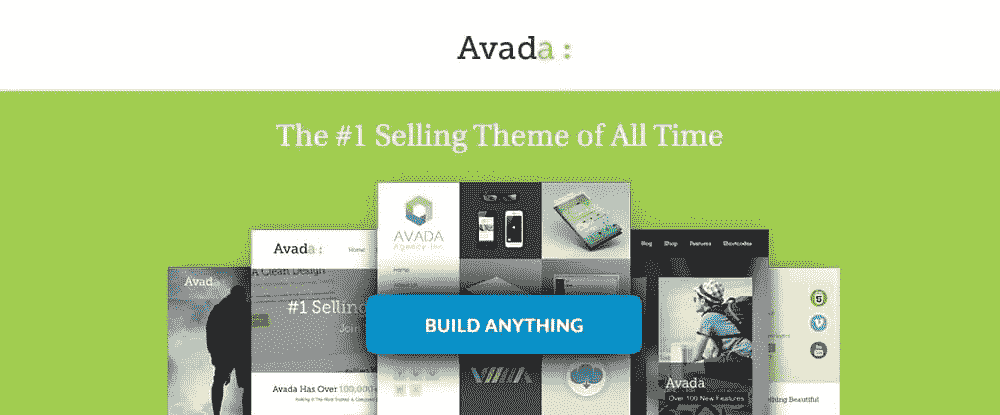](ttps://avada-theme.com/?utm_source=sitepoint.com&utm_medium=content&utm_campaign=wpthemes2020)

如果你选择了一个最畅销的主题，它很可能会减轻而不是增加你可能遇到的任何压力。阿瓦达就是这样一个题材。

*   其动态内容系统提供了无与伦比的灵活性。
*   Avada 与 WooCommerce 完全集成，包括产品设计拖放功能。
*   包含 55 个以上的预建网站，让您快速起步。

> 很棒的主题！作为我的第一个 WordPress 主题，它提供了许多选项，并且还在继续改进！— nwilger

点击[此处](ttps://avada-theme.com/?utm_source=sitepoint.com&utm_medium=content&utm_campaign=wpthemes2020)了解更多关于这本畅销书的信息。

## 4.主题:创造性的、多功能的、高性能的 WordPress 主题

[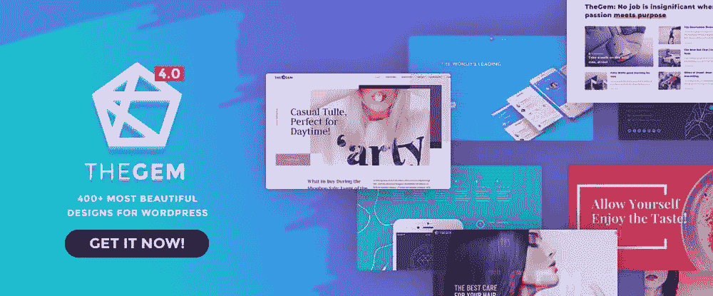](https://codex-themes.com/thegem/meta-splash/?utm_source=baw&utm_medium=post&utm_campaign=best-themes)

许多网页设计师会告诉你，WordPress 拥有最漂亮的设计。然而，真正让他们兴奋的是该软件包附带的工具。

这些设计师会告诉你，TheGem 是 WordPress 的终极工具箱。仅举几个例子，你会发现:

*   大量预建的一键安装网站
*   超过 400 种现代时尚的设计模板
*   现成的时装商店

> 伟大的主题和伟大的服务。— bepreoo

只需点击[或两次](https://codex-themes.com/thegem/meta-splash/?utm_source=baw&utm_medium=post&utm_campaign=best-themes)就能拥有自己的终极工具箱。

## 5.创造性的，多用途的主题

[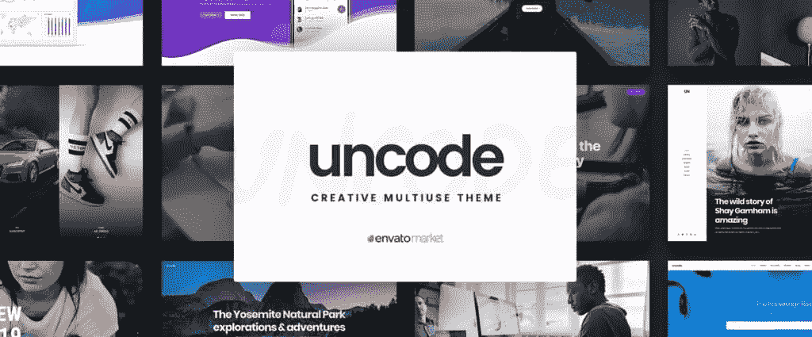](https://undsgn.com/uncode/?utm_source=sitepoint.com&utm_medium=content&utm_campaign=bestwpthemes2020)

博客作者、自由职业者和各种类型的创意者，加上小企业和机构，将受益于这一主题森林畅销书及其 60K+的销售额。如果你需要创建一个作品集或杂志风格的网站或任何类型或风格的页面，这一点更是如此。

功能包括:

*   强大的前端编辑器
*   自适应图像和高级网格系统
*   WooCommerce 兼容性和单一产品设计和展示功能。

这场展览的明星是 Uncode 的用户创建网站展示。它们讲述了一个 Uncode 能为你做什么的故事，而且它们是灵感的来源。

> 漂亮的代码，良好的支持，设计的可能性是无穷无尽的。— zoutmedia

访问 [Uncode](https://undsgn.com/uncode/?utm_source=sitepoint.com&utm_medium=content&utm_campaign=bestwpthemes2020) 并浏览其用户自建网站展示。

## 6. [Houzez:高度可定制的房地产主题](https://houzez.co/?utm_source=sitepoint.com&utm_medium=content&utm_campaign=bestwpthemes2020)

[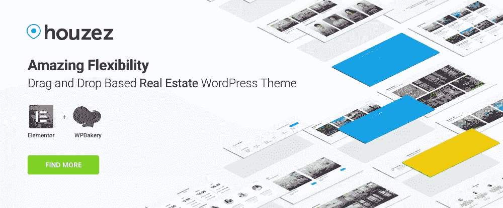](https://houzez.co/?utm_source=sitepoint.com&utm_medium=content&utm_campaign=bestwpthemes2020)

有一些网站类型是多用途主题不能帮到你的——通常是因为需要独特和特殊的功能。例如，对于房地产行业，使用像 Houzez 这样的主题是必须的。Houzez 的独特功能包括:

*   高级属性搜索
*   灵活的属性列表格式
*   物业管理系统

此外，这个拖放主题可以很容易地定制，以匹配房地产经纪人的业务模型。

> 我真的很喜欢这个主题的功能和外观。— stuffmartusa2

如果你碰巧有一个客户的房地产经纪人，那么[不用再找了](https://houzez.co/?utm_source=sitepoint.com&utm_medium=content&utm_campaign=bestwpthemes2020)。

## 7. [XStore:响应式多功能 WooCommerce WordPress 主题](https://xstore.8theme.com/preview-new/?utm_source=baw&utm_medium=paidsocial&utm_campaign=bestwordpressthemes2020)

[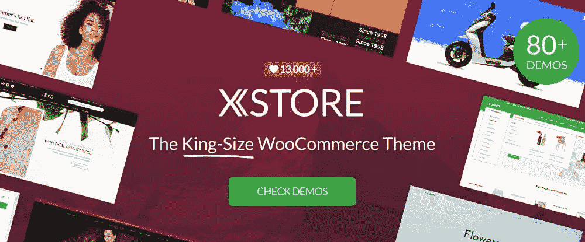](https://xstore.8theme.com/preview-new/?utm_source=baw&utm_medium=paidsocial&utm_campaign=bestwordpressthemes2020)

如果你有一个现成的商店，你可以调整一下来得到你想要的东西，那么真的没有必要从头开始设计一个网上商店。如果你有 80 家现成的商店呢？这就是 XStore 给你的，还有各种产品的大量演示，价值 300 美元的高级插件，以及一个强大的单一产品页面生成器。

这对简化你的工作流程有什么好处？

> 一如既往的 5 星！到目前为止，我已经第三次或第四次买这个主题了…真的很喜欢它。6.0 的新更新太棒了。— edvin33

点击[这里](https://xstore.8theme.com/preview-new/?utm_source=baw&utm_medium=paidsocial&utm_campaign=bestwordpressthemes2020)浏览 80 家整装待发的店铺。

## 8. [Typer:具有多作者出版功能的惊人主题](https://1.envato.market/bzJvP)

[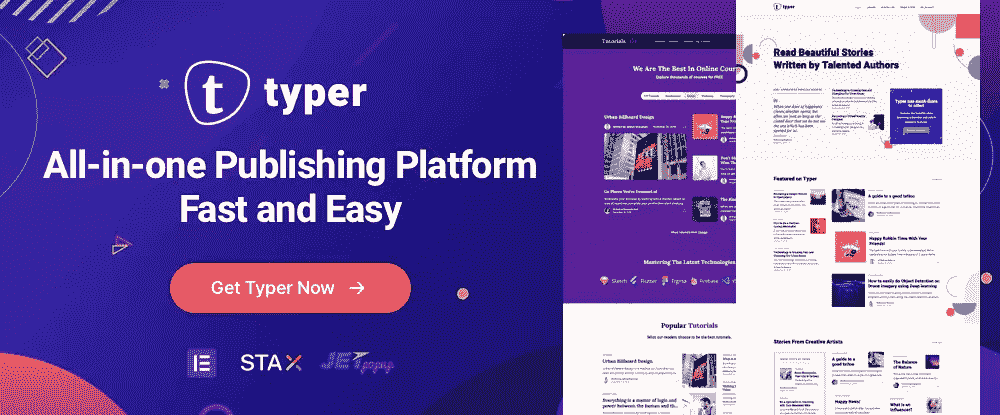](https://1.envato.market/bzJvP)

寻找符合出版商或博主特殊需求的主题？有了 Typer，你可以创建一个容纳多个作者的发布 WordPress 站点。

Typer 的 100% Gutenberg 优化为您发布博客文章提供了支持，而 Elementor 页面生成器可以轻松创建有吸引力的专业外观的登录页面。

*   不需要任何编码知识
*   Typer 针对速度进行了优化
*   Typer 给你无限的标题样式和独特的页面和文章选项

如果需要，您还可以依靠高级支持。

> 令人惊叹的设计——我最近发现的最好看的简约主题之一。而且，支持是难以置信的。—博客向导

如果您的目标是建立一个发布网站，请点击[此处](https://1.envato.market/bzJvP)。

## 9.[桥](https://qodeinteractive.com/wordpress-theme/bridge-creative-multi-purpose-wordpress-theme/?utm_source=baw&utm_medium=multi&utm_campaign=best2020)

[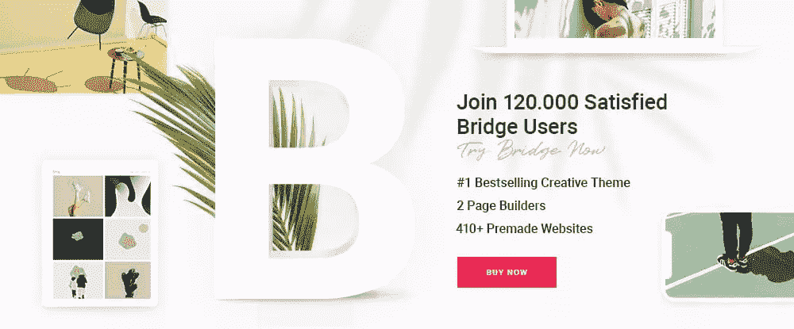](https://qodeinteractive.com/wordpress-theme/bridge-creative-multi-purpose-wordpress-theme/?utm_source=baw&utm_medium=multi&utm_campaign=best2020)

如果你选择一个完全符合你需求的主题的方法是戴上眼罩，而你恰好选择了桥牌，你就有赢家了！对于任何人来说，桥牌都是一个完美的主题，无论是初学者还是经验丰富的专业人士。
这个服务于 120，000 名快乐用户的畅销创意主题提供:

*   开放式灵活性和可定制性
*   大量的设计元素和设计辅助工具
*   420 多个预制网站
*   滑块和插件，包括 WooCommerce 和两个强大的页面生成器之间的选择——WP bakery 和 Elementor。

> 我在 ThemeForest 上买了一些主题，但这是我更喜欢的一个。太不可思议了。—乔伊博贝

点击[此处](https://qodeinteractive.com/wordpress-theme/bridge-creative-multi-purpose-wordpress-theme/?utm_source=baw&utm_medium=multi&utm_campaign=best2020)了解更多。

## 10.[布鲁克:多功能创意主题](http://brook.thememove.com/?utm_source=sitepoint.com&utm_medium=content&utm_campaign=bestwpthemes2020)

[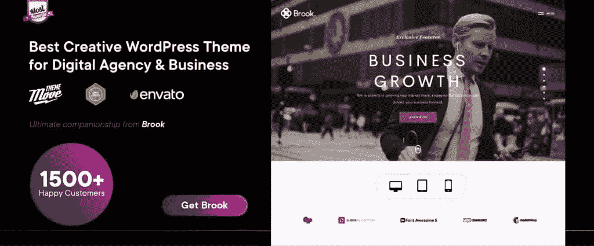](http://brook.thememove.com/?utm_source=sitepoint.com&utm_medium=content&utm_campaign=bestwpthemes2020)

证词说明了一切。Brook 凭借其令人印象深刻的设计工具和功能，是网页设计师梦寐以求的主题。该软件包带有大量预制模板、精选的优质网站建设插件、设计元素和短代码。

你也会很快发现布鲁克是:

*   搜索引擎友好
*   装载速度超快
*   易于使用且易于定制

还有一个支持教程库可以帮助您。

> 这个模板有很多优点，从代码质量到定制方便性，再到客户支持！强烈推荐！！！——罗德斯波特

[访问网站](http://brook.thememove.com/?utm_source=sitepoint.com&utm_medium=content&utm_campaign=bestwpthemes2020)并查看视频教程，了解更多信息。

## 11. [TheFox:响应式多功能 WordPress 主题](https://thefoxwp.wpengine.com/?utm_source=sitepoint.com&utm_medium=content&utm_campaign=bestwpthemes2020)

[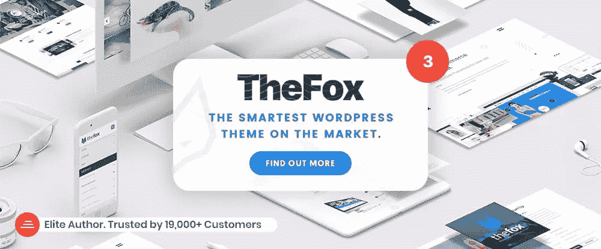](https://thefoxwp.wpengine.com/?utm_source=sitepoint.com&utm_medium=content&utm_campaign=bestwpthemes2020)

是什么让 WordPress 主题变得聪明，像狐狸一样聪明？有才华的作者或者设计团队显然是有关系的，但最主要的原因还是对细节的关注。TheFox 是聪明的，因为它的设计者注意到了最微小的细节，以实现他们所追求的——一个多用途的主题，有着可靠的跟踪记录和一大群满意的用户。

> 一个非常强大的主题，具有难以置信的灵活性。当我在主题上需要帮助时，他们的支持总是很有帮助。—徽标 24

点击[这里](https://thefoxwp.wpengine.com/?utm_source=sitepoint.com&utm_medium=content&utm_campaign=bestwpthemes2020)了解更多关于最聪明的 WordPress 主题。

## 12.[本乡:现代&多功能 WooCommerce WordPress 主题](http://hongo.themezaa.com/landing/?utm_source=sitepoint.com&utm_medium=content&utm_campaign=bestwpthemes2020)

[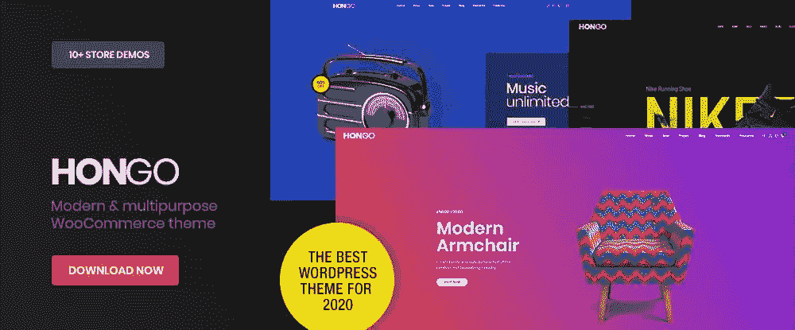](http://hongo.themezaa.com/landing/?utm_source=sitepoint.com&utm_medium=content&utm_campaign=bestwpthemes2020)

如果你计划建立一个 WooCommerce 商店，一个公司网站，甚至一个博客网站，Hongo 可以提供你所需要的。这个相对较新的 WordPress 主题展示了一个现代的、令人耳目一新的外观。在包装中，您可以找到:

*   一整套演示、设计元素和模板
*   流行的 WPBakery 页面生成器
*   自定义短代码
*   一键演示导入。

> 最好的主题之一，定制简单，功能强大。干得好。—克里奥尔语

[仔细看看 Hongo](http://hongo.themezaa.com/landing/?utm_source=sitepoint.com&utm_medium=content&utm_campaign=bestwpthemes2020) 看看它能给你带来什么帮助。

## 13.Pofo:创意组合、博客和电子商务主题

[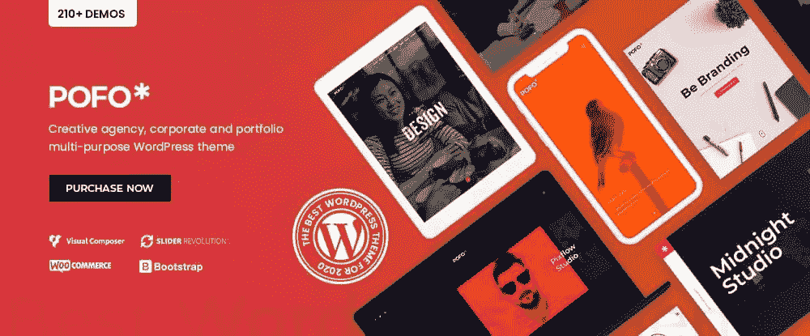](http://wpdemos.themezaa.com/pofo/?utm_source=sitepoint.com&utm_medium=content&utm_campaign=bestwpthemes2020)

Pofo 是任何需要建立和发布一个吸引人的、获奖的在线投资组合的人的绝佳选择。众所周知，好的投资组合设计是企业成功的关键因素。

*   Pofo 速度极快，反应灵敏
*   Pofo 是 100%古腾堡兼容
*   你会发现一系列令人印象深刻的主页和演示页面、设计元素和高级插件
*   该软件包还具有 WPBakery 页面生成器、Revolution 滑块和大量在线文档。

> 我购买了这个模板来创建我的在线投资组合。到目前为止，都很神奇！该设计非常现代，在所有平台上看起来都很棒。但最重要的是，我不是网页设计方面的专家，他们的客户支持非常出色。梅甘亚姆

点击[此处](http://wpdemos.themezaa.com/pofo/?utm_source=sitepoint.com&utm_medium=content&utm_campaign=bestwpthemes2020)了解更多关于这个优质组合网站建设者的信息。

## 14.[模式](https://mythemeshop.com/themes/schema/)

[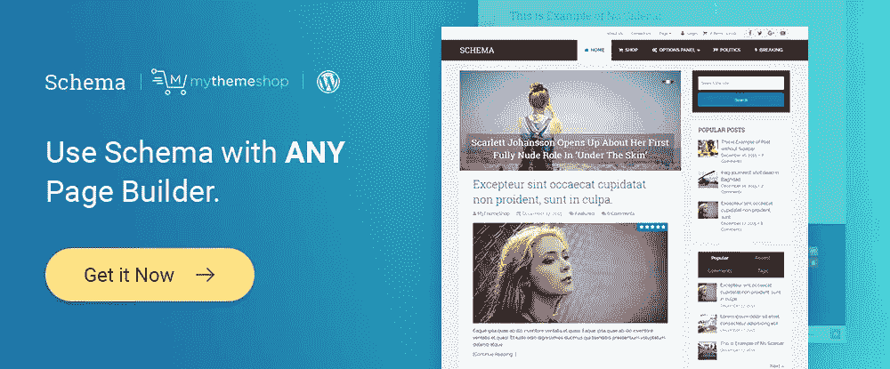](https://mythemeshop.com/themes/schema/)

模式不是普通的多用途主题。虽然它的许多特性与这种类型的大多数高级主题相似，但有一个显著的区别可以使投资 Schema 成为明智的决定。这是 Schema 独有的 SEO 功能，它:

*   知道搜索引擎在找什么
*   引导搜索引擎通过你的网站
*   检查干净代码并检查页面加载时间。

所有这些都是为了提高你网站的排名。

> 易于定制和支持是伟大的。— fmueller01

SEO 设计问题？[检出模式](https://mythemeshop.com/themes/schema/)。

## 15. [Leadinjection: WordPress 登陆页面主题](https://leadinjection.io/?utm_source=sitepoint.com&utm_medium=content&utm_campaign=bestwpthemes2020)

虽然任何网页设计者或开发者都可以很好地利用这个主题，但如果你负责维护几个网站，Leadinjection 是一个特别有价值的工具。

这是因为 Leadinjection 使得向可操作站点添加新页面这个典型的棘手问题变得简单了。Leadinjection 也是 WordPress multisite 兼容的，WPML 和翻译就绪，并侧重于转换。

> 快速支持。…我甚至喝不完我的啤酒。…喜欢后端，我期待着与这家公司有更多的业务。—布里安斯科尼克

将这个有用的工具添加到设计师的工具箱中。

## 包裹

虽然这篇文章的重点似乎是多用途主题，但列出的大多数主题都有一个或多个独特的功能。这些特点可能会证明对你特别有价值。如果你是一名初级设计师，多用途主题通常是最好的选择。

如果你比较高级或者有很多客户要满足，你可能想更仔细地看看每个主题有哪些是其他主题没有的。无论如何，我们希望你已经找到了减轻工作负担和消除压力的方法。

请与设计师同事或在社交媒体上分享这篇文章。我们希望了解您的购物体验。

## 分享这篇文章