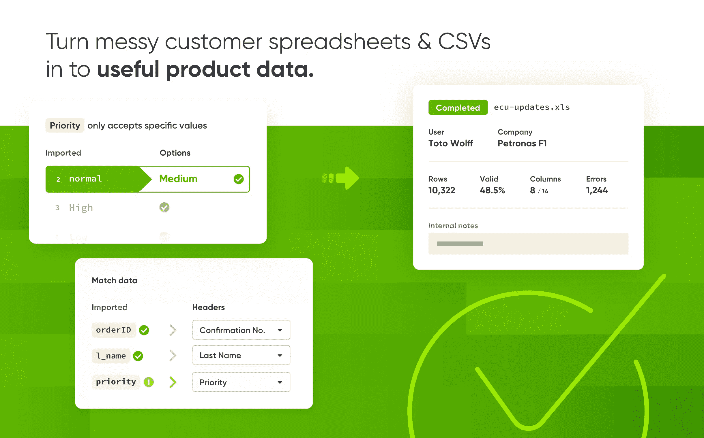
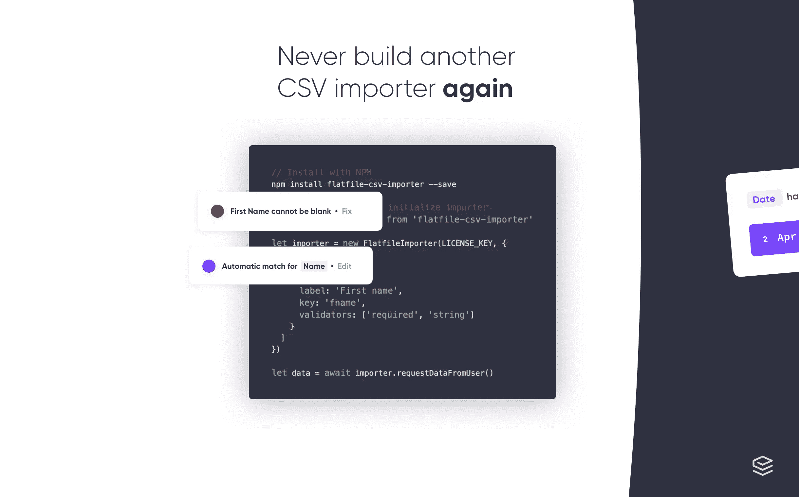
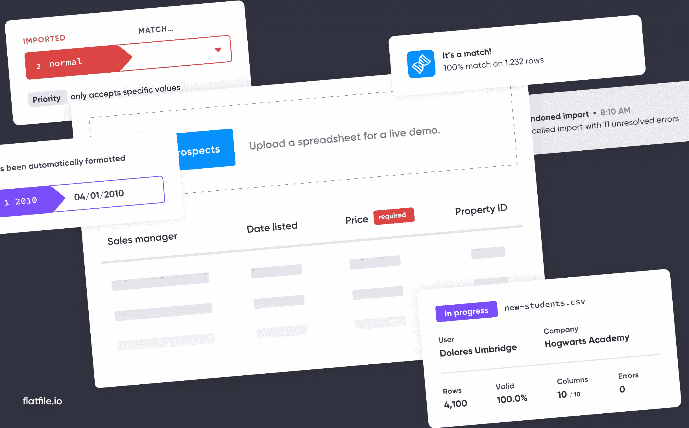

# 使用 Flatfile 的数据导入器改善客户体验

> 原文：<https://www.sitepoint.com/customer-journey-flatfile-data-importer/>

*本文是与 [Flatfile.io](https://flatfile.io/?utm_source=SitePoint&utm_medium=Article&utm_campaign=SitePoint-Article-Text-Link-10172019-PR-awareness&utm_term=SitePoint-Article-Text-Link&utm_content=In-Content) 合作创作的。感谢您对使 SitePoint 成为可能的合作伙伴的支持。希望与 SitePoint 合作？在这里获得[更多信息。](https://www.sitepoint.com/advertise/)*

闭上眼睛，想象一下将数据导入应用程序是什么样子。现在睁开眼睛。

它看起来像这样吗？

将 CSV 数据导入应用程序时的典型用户体验。

当创造一个新的或改进一个现有的产品时，构建有用的特性当然是第一位的。然而，许多人忘记的是，当产品体验不直观时，创新就被浪费了。在规划客户之旅时，产品经理必须特别关注客户的第一步。

在许多产品中，数据导入过程是早期步骤之一。不幸的是，这通常是客户的一个主要痛点。这不全是首相的错；我们认为数据导入是一种糟糕的软件体验。因此，我们不断地向客户发送复杂的模板、冗长的支持文章和神秘的错误屏幕，通常是在他们旅程的最初几分钟内。

不过，现在不是了。Flatfile 提供了一个简单的解决方案:一个直观的、即插即用的数据导入器。

Flatfile 支持使用 Angular、React、Vue、Ruby、PHP 等将面向用户的 CSV 导入应用程序。

## 什么是平面文件？

为您的用户提供世界一流的 CSV 导入体验，无需预先构建的 CSV 模板或令人生畏的文档。

Flatfile 为软件公司提供了构建自己的数据导入器的另一种选择。

对于用户来说，这意味着他们不必再为上传数据而费尽周折。现在，他们可以使用 Flatfile 的平台来获得无缝、流畅和支持性的数据导入体验。Flatfile 旨在支持任何技术水平的用户:消防员、房地产经纪人和数据分析师都使用 Flatfile 导入器。

对于 PMs 来说，这意味着不再担心处理数据导入的 UX 和工程复杂性。项目经理可以交给他们的工程团队 Flatfile 文档，并在一天内获得优雅、精致的体验，而不是计划整个 sprint(如果不是几个的话)来构建定制解决方案。简而言之，Flatlife 消除了构建和维护数据导入器的痛苦，让产品团队专注于创新的、与众不同的特性。

## 平面文件是如何工作的？

Flatfile 允许将导入的 CSV 文件无缝映射到特定的数据模型，并提供直观的数据验证。

Flatlife 让用户只需点击几下就能上传电子表格。他们也可以手动输入数据。

数据上传后，Flatfile 会问用户几个简单的问题，询问他们的电子表格如何与您的产品相匹配，确保数据与正确的字段(如名字、姓氏、电子邮件地址等)保持一致。).

最后一步是数据修复，用户可以检查和更新他们的导入，以纠正任何数据错误。这些错误基于您可以预定义的验证出现，确保数据在到达您的产品数据库之前保持整洁。

一旦这些步骤完成，用户就回到了您的应用程序中，您就有了一个干净的、结构化的 JSON 数据集，可以很容易地将它放入任何数据库。

Digsy.ai 的产品负责人 Meghann 说:“当我们在寻找解决方案时，我们知道我们要么自己开发，要么尝试寻找解决方案。我们的产品负责人当时听说过 Flatfile。他向团队展示了它，最终我们决定实现 Flatfile。我们没有在市场上看到其他任何东西。”

您的世界级产品值得拥有世界级的数据导入体验。

## 为什么应该选择平面文件？

当用户向您的产品导入数据时，他们希望使用这些数据，并且希望看到它的价值。不要让他们被电子表格模板和吓人的文档所困扰。大多数组织用不到一周的时间就实现了 Flatfile，它为用户提供了简单、流畅和愉快的数据导入体验。从 30 天免费试用开始，[了解 Flatfile.io 如何改善您的客户之旅](https://www.flatfile.io/?utm_source=SitePoint&utm_medium=Article&utm_campaign=SitePoint-Article-Text-Link-10172019-PR-awareness&utm_term=SitePoint-Article-Text-Link&utm_content=In-Content)。

**访问 [Flatfile.io](https://www.flatfile.io/?utm_source=SitePoint&utm_medium=Article&utm_campaign=SitePoint-Article-Text-Link-10172019-PR-awareness&utm_term=SitePoint-Article-Text-Link&utm_content=In-Content) 。**

## 分享这篇文章