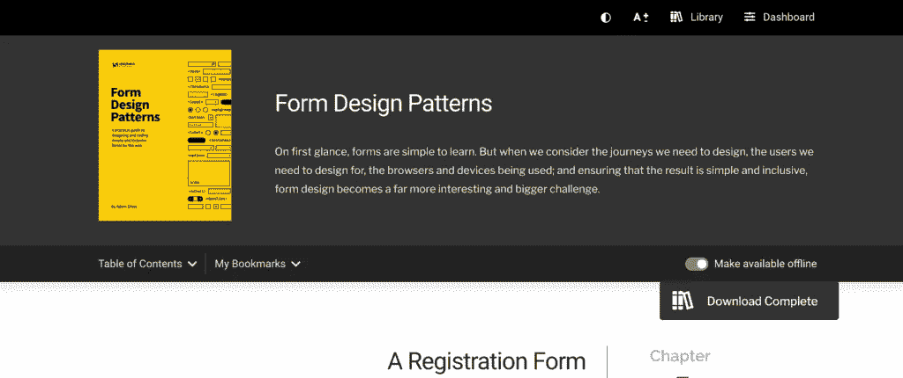

# 脱离网格:SitePoint Premium 离线阅读器现处于测试阶段

> 原文：<https://www.sitepoint.com/go-off-grid-offline-reader-for-sitepoint-premium-now-in-beta/>

今年我们已经做了大量的工作来改善 SitePoint Premium 体验，我们终于准备好发布我们的用户最想要的东西了。

我们在 SitePoint Premium 中请求最多的功能是对图书的离线访问，今天，它出现了。

我们已经为此工作了很长时间，我们非常兴奋地发布我们认为是离线阅读这些书籍的好方法。在你急着离线阅读之前，我们希望你记住这是第一个测试版，我们预计会有一些问题。

我们把它作为 MVP 发布给我们的高级用户，这样我们就可以根据你的反馈对它进行迭代。该解决方案将允许您在任何设备上离线阅读我们的内容，而无需下载专门的应用程序。

作为会员，你已经能够在 SitePoint Premium 的阅读器中访问该功能，但有一个警告:你需要使用一个现代化的浏览器，因为我们正在运行 service workers 和 indexedDB 来启用该功能。

目前，下载一本书需要两个阶段:

1.  如下面的截图所示，点击下载开关，这将保存图书以便脱机访问。
2.  然后，您需要通过书签保存页面，以便能够在脱机状态下访问图书。

请试用并给我们您的反馈。在 SitePoint 社区上有一个专门的反馈线程，您可以使用现有的 SitePoint Premium 帐户访问它。

最后，继续关注这个特性。我们正在努力尽快发布一个新版本，这将使您更容易看到您下载的离线访问的标题。

*   [前往图书馆，测试离线阅读器](https://www.sitepoint.com/premium/library/)
*   [前往我们的反馈主题](https://www.sitepoint.com/community/t/offline-mode-for-sitepoint-premium-beta/342119)

## 分享这篇文章