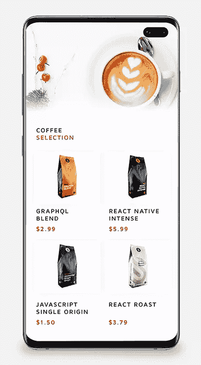
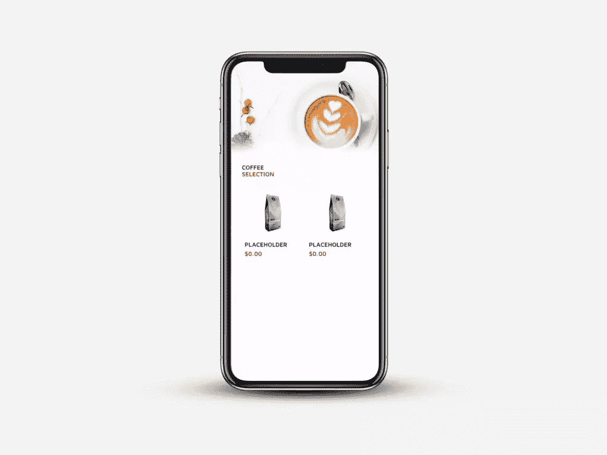
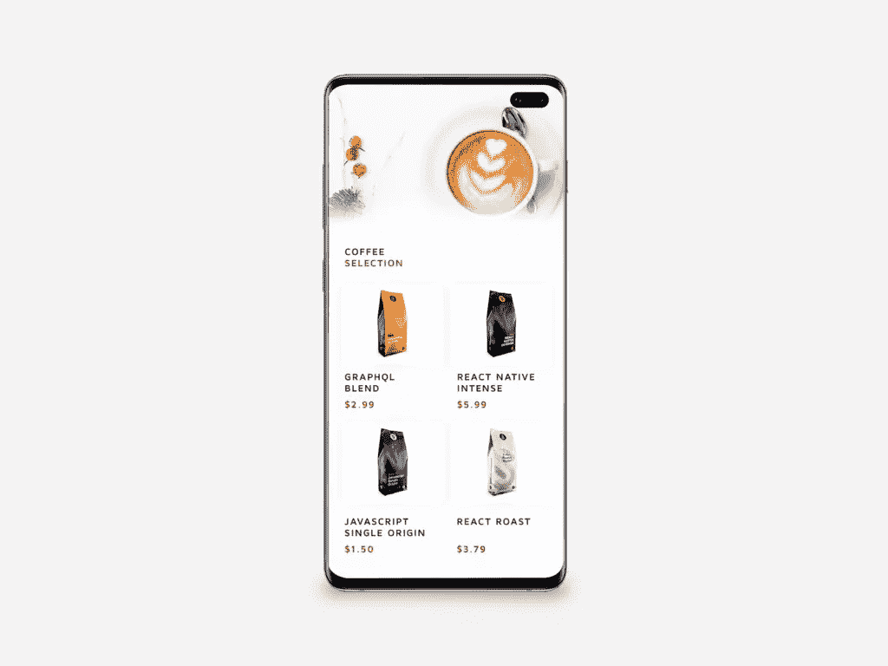
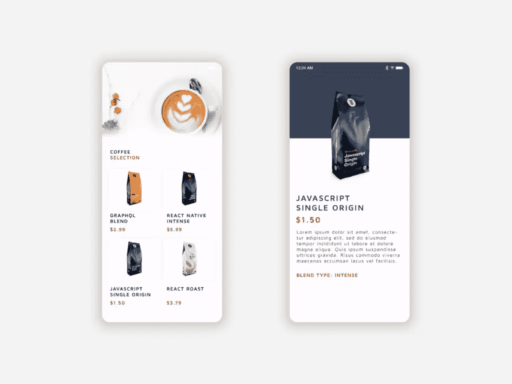

# GraphQL 和 React Native 入门

> 原文：<https://www.sitepoint.com/graphql-react-native-getting-started/>

**2012 年，脸书工程师尼克·施勒克开始开发一个小型原型，以帮助摆脱旧的、不受支持的合作伙伴 API，该 API 支持当前的脸书新闻订阅。在当时，这被称为“超级图表”。快进到今天，SuperGraph 已经帮助形成了开源查询语言 GraphQL，这是最近的流行语。**

脸书将 GraphQL 描述为一种“API 的查询语言和一个用现有数据完成这些查询的运行时”。简而言之，GraphQL 是 REST 的替代品，自发布以来一直在稳步普及。使用 REST，开发人员通常会整理来自一系列端点请求的数据，而 GraphQL 允许开发人员向服务器发送一个查询，描述确切的数据需求。

*想从头开始学习 React Native？这篇文章是从我们的优质图书馆摘录的。使用 SitePoint Premium 获得 React 本地书籍的完整收藏，涵盖基础知识、项目、技巧和工具&。[现在就加入，每月仅需 9 美元](https://www.sitepoint.com/premium/products/Z2lkOi8vbGVhcm5hYmxlL1Byb2R1Y3QvMzA3?utm_source=blog&utm_medium=articles)。*

## 先决条件

对于本教程来说，你需要对当地的反应有一个基本的了解，并对 T2 世博会的环境有所了解。您还需要在移动设备上安装 Expo 客户端，或者在计算机上安装兼容的模拟器。如何做到这一点的说明可以在[这里](https://docs.expo.io/versions/latest/introduction/installation/)找到。

## 项目概述

在本教程中，我们将通过创建一个简单的咖啡豆比较应用程序，在 React 本地设置中演示 GraphQL 的强大功能。为了让您能够专注于 GraphQL 提供的所有优秀的东西，我已经使用 Expo 为应用程序整合了基础模板。



首先，您可以克隆[这个 repo](https://github.com/jamiemaison/graphql-coffee-comparison) 并导航到“[入门](https://github.com/jamiemaison/graphql-coffee-comparison/tree/getting-started)”分支，其中包括我们开始添加 GraphQL 数据的所有基本视图，以及我们所有的初始依赖项，在此阶段包括:

```
{
    "expo": "^32.0.0",
    "react": "16.5.0",
    "react-native": "https://github.com/expo/react-native/archive/sdk-32.0.0.tar.gz",
    "react-navigation": "^3.6.1"
} 
```

要克隆这个分支，您需要打开终端并运行以下命令:

```
git clone https://github.com/jamiemaison/graphql-coffee-comparison.git 
```

为了导航到`getting-started`分支，您移动到新克隆的带有`cd graphql-coffee-comparison`的 repo 并运行`git checkout getting-started`。

下一步是安装我们的依赖项。为此，确保您在节点`v11.10.1`上，并在项目的根目录下运行`npm install`。这将把上面列出的所有依赖项添加到您的`node_modules`文件夹中。

要开始将 GraphQL 添加到我们的 React 本机应用程序中，我们需要安装更多的依赖项，以帮助我们执行一些简单的 GraphQL 功能。正如现代 JavaScript 开发中常见的那样，您不需要所有这些依赖项来完成数据请求，但它们肯定有助于给开发人员一个更好的机会来构建一些干净、易读的代码。您需要的依赖项可以通过运行`npm install --save apollo-boost react-apollo graphql-tag graphql`来安装。

以下是这些依赖关系的概述:

*   `apollo-boost`:React/React Native 中 GraphQL 的零配置入门方式
*   这提供了 GraphQL 和 Apollo 客户端之间的集成
*   `graphql-tag`:解析 GraphQL 查询的模板文字标签
*   `graphql`:graph QL 的 JavaScript 参考实现

一旦所有必需的依赖项安装完毕，运行`npm start`。您现在应该会看到您熟悉的 Expo 窗口，如果您启动该应用程序(通过模拟器或在设备上)，您应该会看到类似如下的屏幕:



基本上，这个应用程序有两个屏幕，分别由`react-navigation`、`Home.js`和`CoffeePage.js`管理。`Home`屏幕包含一个简单的`FlatList`,呈现提供给其`data`字段的所有咖啡豆。点击后，用户会被导航到该项目的`CoffeePage`,它会显示关于该产品的更多信息。现在我们的工作是用 GraphQL 中有趣的数据填充这些视图。



### 阿波罗服务器游乐场

任何成功的 GraphQL 事务都有两个主要元素:保存数据的服务器和发出请求的前端查询。出于本教程的目的，我们不打算开始钻研服务器端代码的奇妙世界，所以我已经为我们创建了服务器。你所需要做的就是在你最喜欢的浏览器中导航到[yq 42 LJ 36m 9 . SSE . code sandbox . io](https://yq42lj36m9.sse.codesandbox.io/)，并让它在整个开发过程中运行。对于那些感兴趣的人来说，服务器本身正在使用`apollo-server`运行，并包含足够的代码来保存我们需要的数据，并在接收到适当的查询时为其提供服务。如需进一步阅读，你可以前往 apollographql.com 的阅读更多关于`apollo-server`的内容。

## GraphQL Query Basics(图形 SQL 查询基础)

在我们开始编写请求咖啡豆比较应用程序所需数据的实际代码之前，我们应该了解 GraphQL 查询是如何工作的。如果您已经知道查询是如何工作的，或者只是想开始编写代码，您可以跳到下一节。

*注意:这些查询无法在我们的 [codesandbox](https://yq42lj36m9.sse.codesandbox.io/) 服务器上运行，但是如果你想测试这些查询，可以在 [codesandbox.io](https://codesandbox.io) 创建你自己的查询。*

在最简单的层面上，当我们知道我们所请求的数据的形状时，我们可以为我们的查询使用平面结构:

```
QUERY:                                RESPONSE:
{                                     {
  coffee {                              "coffee": {
    blend                                 "blend": "rich"
  }                                     }
}                                     } 
```

在左边，我们看到 GraphQL 查询从`coffee`请求`blend`字段。当我们确切地知道我们的数据结构是什么时，这很好地工作，但是当事情不那么透明时呢？在这个例子中，`blend`返回一个字符串，但是查询也可以用来请求对象:

```
QUERY:                                RESPONSE:
{                                     {
  coffee {                              "coffee": {
    beans {                               "beans": [
        blend                               {
    }                                         blend: "rich"
  }                                         },
}                                           {
                                              blend: "smooth"
                                            }
                                          ]
                                        }
                                      } 
```

这里你可以看到我们只是请求了`beans`对象，只有字段`blend`从该对象返回。`beans`数组中的每个对象很可能包含除了`blend`之外的其他数据，但是 GraphQL 查询帮助我们只请求我们需要的数据，删除我们的应用程序不需要的任何额外信息。

那么当我们需要比这更具体的时候呢？GraphQL 提供了许多功能，但是允许极其强大的数据请求的功能是在查询中传递参数的能力。举以下例子:

```
QUERY:                                RESPONSE:
{                                     {
  coffee(companyId: "2") {              "coffee": {
    beans {                               "beans": [
        blend                               {
    }                                         blend: "rich"
  }                                         },
}                                           {
                                              blend: "smooth"
                                            }
                                          ]
                                        }
                                      } 
```

我们看到的是，我们可以传递一个参数——在本例中是`companyId`——确保我们只从一个特定的公司返回`beans`。使用 REST，您可以通过查询参数和 URL 段传递一组参数，但是使用 GraphQL 查询每个字段，它可以获得自己的一组参数。这使得 GraphQL 成为一个动态的解决方案，可以针对每个请求进行多次 API 提取。

### 别名

到目前为止，我们所有的查询都让返回对象的字段与查询本身的字段名称相匹配。这在使用简单参数时非常有用，但是如果您想在数据请求中使用不同的参数查询同一个字段呢？这就是别名的用武之地。别名允许您更改字段的名称，以便您可以重命名任何返回的数据，从而在您的数据请求中使用不同的参数。以我们的咖啡豆为例。如果我们想从两个不同的公司 id 返回数据，该怎么办？我们将像这样构造我们的查询:

```
QUERY:                                    RESPONSE:
{                                         {
  company1: coffee(companyId: "1") {        "company1": {
    beans {                                   "beans": [
      blend                                     {
    }                                             "blend": "rich"
  }                                             }
  company2: coffee(companyId: "2") {          ]
    beans {                                 },
      blend                                 "company2": {
    }                                         "beans": [
  }                                             {
}                                                 "blend": "fruity"
                                                }
                                              ]
                                            }
                                          } 
```

在这里，我们请求别名`company1`和`company2`的数据，它们只是不同的`coffee`查询相互叠加。别名是一个强大的工具，可以根据您的确切数据需求修改您的需求。

### 变量

到目前为止，我们已经知道了确切的查询，因此可以在应用程序中对其进行硬编码，但是大多数应用程序需要这些字段是动态的。例如，用户可以从要显示的列表中选择一家咖啡豆公司。我们不会提前知道用户选择的是哪家咖啡豆公司，所以我们需要一种方法来传递这些需求。这就是变量发挥作用的地方。

GraphQL 文档列出了使用变量需要做的三件事:

*   用`$variableName`替换查询中的静态值
*   将`$variableName`声明为查询接受的变量之一
*   在单独的、特定于传输的(通常是 JSON)变量字典中传递`variableName: value`

实际上，这意味着我们的数据查询将如下所示:

```
query coffeeCompany(companyId: CompanyId) {
    coffee(companyId: companyId) {
        beans: {
            type
        }
    }
} 
```

我们还将把`companyId`作为一个 JSON 对象传入:

```
{
    "companyId": "1"
} 
```

在 GraphQL 中使用变量是使所有查询请求动态化的一种强有力的方法，因为我们只请求当前需要的数据。

### 咖啡查询

对于我们的应用程序，我们需要一个查询，允许我们请求只检索咖啡豆的数据，同时包括我们需要的所有相关字段。我们的数据需求并不复杂，所以看起来像这样:

```
{
    coffee {
        beans {
            key
            name
            price
            blend
            color
            productImage
        }
    }
} 
```

## 请求我们的数据

现在，我们将使用实际的代码来请求我们的数据。打开`App.js`，这是我们所有视图的容器，当应用程序启动时，这将是我们提出数据请求的好地方。

我们想要初始化我们的客户端，只需从`apollo-boost`导入一个 ApolloClient 并指定我们的服务器 URL。需要注意的是，您需要对服务器进行初始化，这可以通过在浏览器中运行[yq 42 LJ 36m 9 . SSE . code sandbox . io](https://yq42lj36m9.sse.codesandbox.io/)来实现。有时，您可能会发现服务器超时。如果 Expo 返回类似“网络错误”的警告，请在浏览器上重新加载[yq 42 LJ 36m 9 . SSE . code sandbox . io](https://yq42lj36m9.sse.codesandbox.io/)以重新初始化服务器。

一旦服务器开始运行，将导入和初始化添加到`App.js`的顶部，看起来应该像这样:

```
// ./App.js
import ApolloClient from 'apollo-boost';

const client = new ApolloClient({ uri: 'https://yq42lj36m9.sse.codesandbox.io/' }) 
```

接下来，我们希望组装 graphQL 查询，以便在以后请求数据时使用。幸运的是，`graphql-tag`库让这变得简单了。同样，我们需要将库本身导入到`App.js`:

```
// ./App.js
import gql from 'graphql-tag'; 
```

现在我们可以构建查询:

```
// ./App.js
const QUERY = gql`
{
    coffee {
        beans {
            key
            name
            price
            blend
            color
            productImage
        }
    }
}
` 
```

下一步是修改 render 函数，以包含我们的数据请求。为此，我们使用`react-apollo`库来发出请求，这允许我们按照自己认为合适的方式来处理响应。向`App.js`添加新导入:

```
// ./App.js
import { ApolloProvider, Query } from 'react-apollo'; 
```

然后更改渲染函数，使其看起来像这样:

```
// ./App.js
render() {
    return (
    <ApolloProvider client={client}>
        <Query query={QUERY} >
        {({ loading, error, data }) => {
            if (loading || error) return <View />
            return <View style={{ flex: 1 }}>
            {this.state.isFontsLoaded ? <AppContainer /> : <View />}
            </View>
        }}
        </Query>
    </ApolloProvider>
    );
} 
```

在这里，您可以看到我们正在使用之前创建的`QUERY`来请求必要的数据。此时此刻，我们只是在加载时呈现一个空视图，如果数据请求中有错误。实际上，这将被相关的加载和错误视图替换掉，但是在这个例子中，我们将它们留空。一旦数据返回，我们就像往常一样呈现我们的 AppContainer。您可以通过检查`data`是否成功返回来检查数据是否通过。这可以通过在代码中添加一个`console.log(data)`来检查，以便在终端中查看输出。只要您的 Apollo 服务器运行正常，您应该会收到一个带有我们的`coffee`和`beans`字段的对象。

## 使用上下文 API 存储数据

我们需要一个地方来存储我们的数据，这些数据在我们的任何组件中都是可以访问的，不管它们在树中的位置有多低。如果我们要通过几个子节点传递数据来访问我们的组件，那将不是最有效的事情。假设我们的数据存储需求对于这个例子来说相当简单，那么使用 React 的上下文 API 而不是像 Redux 这样更复杂的状态管理工具会更好。上下文 API 允许您将全局状态传递到我们的组件树中，而不需要每次都通过 props 传递，对于我们当前的例子来说，这就足够了。

基于上下文 API 的 Redux 的好处可以概括为三点:

*   Redux 带有一个时间旅行调试器
*   它为开发者提供了中间件 API，让你可以使用像`redux-sagas`这样的工具
*   它的反应绑定防止有太多的渲染

使用上下文 API 再简单不过了。本质上，我们只需要创建一个`<Provider />`组件来存储我们所有的数据，并在需要时通过创建一个`<Consumer />`组件来访问数据。

### 创建提供者

让我们回到`App.js`，在这里我们只需要添加几行代码就可以让我们的`Provider`启动并运行。首先，我们将从创建我们的`AppContext`开始。我们需要在任何想要使用存储数据的文件中访问它，所以我们需要确保它被导出。为了创建`AppContext`，在`App.js`中添加下面一行:

```
// ./App.js
export const AppContext = React.createContext({ data: { coffee: { beans: [] } } }); 
```

在这里，我们创建上下文并用一些空白数据初始化它。接下来，我们想用从 GraphQL 服务器接收的数据填充`AppProvider`。

### 存储咖啡数据

为了用数据更新我们的提供者，我们只需在提供者的`App.js`呈现函数中改变空白容器视图，同时将我们的 GraphQL 数据添加到它的`data`属性中。这看起来像这样:

```
// ./App.js
render() {
    return (
        <ApolloProvider client={client}>
        <Query query={QUERY} >
            {({ loading, error, data }) => {
            if (loading || error) return <View />
            return <AppContext.Provider value={data.coffee.beans} style={{ flex: 1 }}>
                {this.state.isFontsLoaded ? <AppContainer /> : <View />}
            </AppContext.Provider>
            }}
        </Query>
        </ApolloProvider>
    );
} 
```

在这里，您可以看到我们直接将 bean 数据(`data.coffee.beans`)存储在我们的提供者中。此时，我们已经获得了所有必要的数据，但是我们仍然需要呈现占位符内容。这个难题的最后一部分是通过使用`Consumer`来修改`Home.js`以呈现我们的数据。

### 创建应用消费者

首先，我们需要从前面导入我们的`AppContext`来使用`Consumer`。为此，我们只需将它从`App.js`导入到`Home.js`:

```
// ./src/Home.js
import { AppContext } from '../App'; 
```

使用`Consumer`像任何其他 React 组件一样工作。出于我们当前的目的，我们将把它添加到我们的`render`函数中，并使用该数据填充我们的`FlatList`。我们的渲染函数应该是这样的:

```
// ./src/Home.js
render() {
    return (
        <AppContext.Consumer>
        {
            (context) =>
            <View style={styles.container}>
                <Image style={styles.header} source={require('../assets/header.png')} />
                <View style={{ marginLeft: 30, marginTop: 30 }}>
                <Text style={styles.title}>COFFEE</Text>
                <Text style={styles.subtitle}>SELECTION</Text>
                </View>
                <FlatList
                style={styles.list}
                data={context}
                renderItem={({ item }) => <TouchableOpacity style={styles.block} onPress={() => this.props.navigation.navigate('CoffeePage', { item: item })}>
                    <Image style={styles.productImage} source={{ uri: item.productImage }} />
                    <Text style={styles.name}>{item.name}</Text>
                    <Text style={styles.price}>{item.price}</Text>
                </TouchableOpacity>}
                numColumns={2}
                />
            </View>
        }
        </AppContext.Consumer>
    );
} 
```

如果我们浏览上面的代码，可以看到`AppContext.Consumer`为我们提供了一个`context`，其中包含了我们的 GraphQL 数据。我们使用这个`context`来填充`FlatList`组件，将它传递给`data`道具。当用户点击其中一个咖啡项目时，我们的数据通过导航参数传递到我们的`CoffeePage.js`，允许在那个视图中访问它。如果您现在保存您修改的文件并在 Expo 上启动应用程序，您应该会看到您完全填充的`FlatList`。



## 摘要

恭喜你！您已经成功地使用 GraphQL 检索数据，并使用 React Native 呈现该数据。我们已经了解了 GraphQL 查询有多强大，同时强调了相对于 REST 等系统的优势。我鼓励您在下一个项目中使用 GraphQL，并自己判断它在检索数据方面能快多少——尤其是在数据丰富的应用程序中。

如果你想更详细地研究 GraphQL，我建议你阅读 GraphQL 文档的“[查询和突变](https://graphql.org/learn/queries/)部分，也许你可以开始使用 [codesandbox.io](https://codesandbox.io/) 自己编写一个 Apollo 服务器。

这个项目的完整代码可以在 GitHub 上找到，所以你可以随意克隆/派生这个 repo 并做出你自己的改进！

## 分享这篇文章