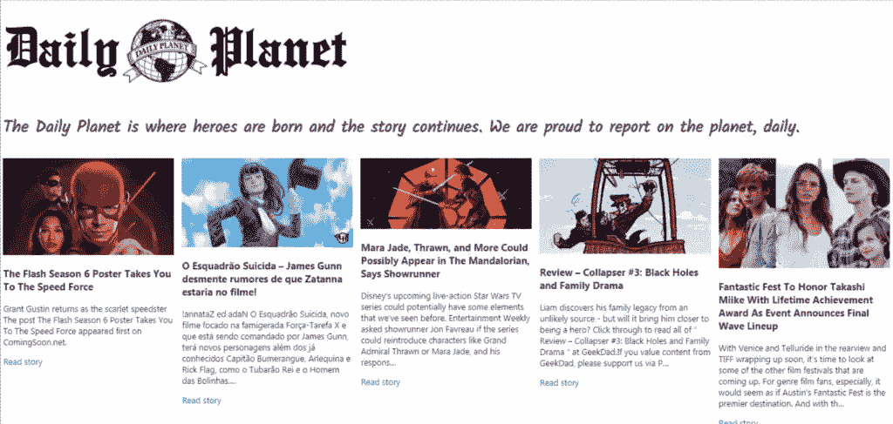

# 苗条应用程序项目:构建每日星球的新闻应用程序用户界面

> 原文：<https://www.sitepoint.com/svelte-news-app-build/>

Svelte 是一个新的 JavaScript UI 库，在许多方面与 React 等现代 UI 库相似。一个重要的区别是它没有使用虚拟 DOM 的概念。

在本教程中，我们将通过构建一个新闻应用程序来介绍 Svelte，该应用程序的灵感来自于《星球日报》，一份来自超人世界的虚构报纸。

## 关于苗条

Svelte 使用了一种新的方法来构建用户界面。Svelte 没有在浏览器中做必要的工作，而是将工作转移到编译时阶段，在开发机器上构建应用程序。

简而言之，这就是 Svelte 的工作方式(如[官方博客](https://svelte.dev/blog/svelte-3-rethinking-reactivity)所述):

> Svelte 在*构建时间*运行，将你的组件转换成高效的*命令式*代码，以外科手术的方式更新 DOM。因此，您能够编写具有出色性能特征的雄心勃勃的应用程序。

Svelte 比最强大的框架(React、Vue 和 Angular)更快，因为它不使用虚拟 DOM，只对发生变化的部分进行外科手术式更新。

我们将学习一些基本概念，比如细长组件，以及如何获取和迭代数据数组。我们还将学习如何初始化一个瘦项目，运行一个本地开发服务器并构建最终的包。

## 先决条件

您需要具备一些先决条件，以便能够轻松地学习本教程，例如:

*   熟悉 HTML、CSS 和 JavaScript (ES6+)，
*   Node.js 和 npm 安装在开发机器上。

Node.js 可以从[官方网站](https://nodejs.org/downloads)轻松安装，或者您也可以使用 NVM 在您的系统中轻松安装和管理多个版本的 Node。

我们将使用一个 [JSON API](https://newsapi.org/) 作为我们应用的新闻来源，所以你需要通过简单地免费创建一个帐户并记下你的 API 密钥来获得一个 API 密钥。

## 入门指南

现在，让我们通过使用用于生成苗条项目的 [degit](https://github.com/Rich-Harris/degit) 工具来开始构建我们的每日星球新闻应用程序。

你可以在你的系统上全局安装`degit`或者使用 [npx](https://alligator.io/workflow/npx/) 工具从 npm 执行它。打开一个新终端并运行以下命令:

```
npx degit sveltejs/template dailyplanetnews 
```

接下来，在您的项目文件夹中导航，并使用以下命令运行开发服务器:

```
cd dailyplanetnews
npm run dev 
```

您的开发服务器将从`http://localhost:5000`地址监听。如果你做了任何更改，它们将被重新构建并实时重新加载到你正在运行的应用程序中。

打开项目的`main.js`文件，您应该会发现以下代码:

```
import App from './App.svelte';

const app = new App({
    target: document.body,
    props: {
        name: 'world'
    }
});

export default app; 
```

这是通过创建和导出根组件的一个实例来引导 Svelte 应用程序的地方，这个实例通常被称为`App`。该组件接受一个具有`target`和`props`属性的对象。

`target`包含将要安装组件的 DOM 元素，`props`包含我们想要传递给`App`组件的属性。在这种情况下，它只是一个带有*世界*值的名字。

打开`App.svelte`文件，您应该会发现以下代码:

```
<script> export let name; </script>

<style> h1 {
        color: purple;
    } </style>

<h1>Hello {name}!</h1> 
```

这是我们应用程序的**根**组件。所有其他组件都将是`App`的子组件。

Svelte 中的组件对源文件使用`.svelte`扩展名，源文件包含组件的所有 JavaScript、样式和标记。

`export let name;`语法创建了一个名为`name`的组件**属性**。我们使用变量插值——`{...}`——来显示通过名称 prop 传递的值。

您可以简单地使用您熟悉的普通旧 JavaScript、CSS 和 HTML 来创建苗条的组件。Svelte 还在 HTML 中添加了一些模板语法，用于变量插值和遍历数据列表等。

由于这是一个小应用程序，我们可以简单地在`App`组件中实现所需的功能。

在`<script>`标签中，从“svelte”导入`onMount()`方法，并定义`API_KEY`、`articles`和`URL`变量，这些变量将保存新闻 API 键、获取的新闻文章和提供数据的端点:

```
<script>
    export let name;

    import { onMount } from "svelte";

    const API_KEY = "<YOUR_API_KEY_HERE>";
    const URL = `https://newsapi.org/v2/everything?q=comics&sortBy=publishedAt&apiKey=${API_KEY}`;
    let articles = [];

</script> 
```

`onMount`是一种生命周期方法。以下是[官方教程](https://svelte.dev/tutorial/onmount)对此的说法:

> 每个组件都有一个*生命周期*，从它被创建时开始，到它被销毁时结束。有一些函数允许您在生命周期的关键时刻运行代码。最常用的是`onMount`，它在组件第一次呈现到 DOM 后运行。

接下来，当组件安装在 DOM 中时，让我们使用 fetch API 从新闻端点获取数据，并将文章存储在`articles`变量中:

```
<script>
    // [...]

    onMount(async function() {
        const response = await fetch(URL);
        const json = await response.json();
        articles = json["articles"];
    });
</script> 
```

由于`fetch()`方法返回一个 JavaScript 承诺，我们可以使用 async/await 语法使代码看起来同步并消除回调。

接下来，让我们添加以下 HTML 标记来创建应用程序的 UI 并显示新闻数据:

```
<h1>
    
    <p class="about">
            The Daily Planet is where heroes are born and the story continues. We are proud to report on the planet, daily.
    </p>
</h1>

<div class="container">

        {#each articles as article}
            <div class="card">
                
                <div class="card-body">
                    <h3>{article.title}</h3>
                    <p> {article.description} </p>
                    <a href="{article.url}">Read story</a>
                </div>
            </div>
        {/each}

</div> 
```

我们使用`each`块循环浏览新闻文章，并显示每篇文章的`title`、`description`、`url`和`urlToImage`。

《星球日报》的标志和标题是从这个受 DC 漫画启发的非营利新闻组织借来的。

我们将使用 Kalam，这是一种手写字体，可从 [Google fonts](https://fonts.googleapis.com/css?family=Kalam) 获得，因此打开`public/index.html`文件并添加以下标签:

```
<link  href="https://fonts.googleapis.com/css?family=Kalam"  rel="stylesheet"> 
```

接下来，返回到`App.svelte`文件，添加以下样式:

```
<style>
h1 {
    color: purple;
    font-family: 'kalam';
}

.container {
    display: grid;
    grid-template-columns: repeat(auto-fill, minmax(305px, 1fr));
    grid-gap: 15px;
}

.container > .card img {
    max-width: 100%;
}
</style> 
```

这是我们每日新闻应用的截图:



## 生产建筑

开发完应用程序后，您可以通过在终端中运行 build 命令来创建生产包:

```
npm run build 
```

该命令将生成一个缩小的、可用于生产的包，您可以将它托管在您首选的托管服务器上。

现在让我们使用 [ZEIT Now](https://zeit.co/now) 托管应用程序。

ZEIT Now 是一个网站和无服务器功能的云平台，你可以使用它将你的项目部署到一个`.now.sh`或个人域。

回到您的终端，运行以下命令立即安装 CLI:

```
npm  install -g now 
```

接下来，导航到`public`文件夹并运行`now`命令:

```
cd public
now 
```

就是这样！您的应用程序将被部署到云中。在我们的例子中，可以从 [public-kyqab3g5j.now.sh](https://public-kyqab3g5j.now.sh/) 获得。

您可以从这个 [GitHub 存储库](https://github.com/techiediaries/svelte-news-app)中找到这个应用程序的源代码。

## 结论

在本教程中，我们使用 Svelte 构建了一个简单的新闻应用程序。我们还看到了什么是苗条，以及如何使用 npm 的`degit`工具创建苗条的项目。

你可以参考[官方文件](https://svelte.dev/tutorial/basics)获得详细的教程，了解每一个苗条的特征。

## 分享这篇文章