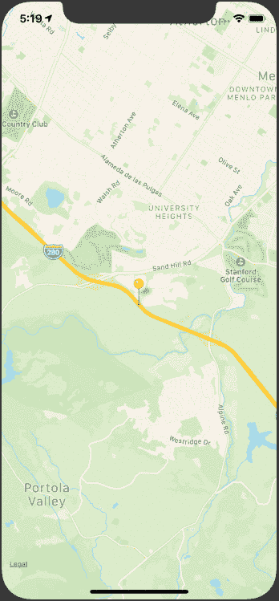

# 使用 React Native 和 PubNub 进行实时位置跟踪

> 原文：<https://www.sitepoint.com/react-native-pubnub-real-time-location-tracking/>

随着移动应用的使用不断增加，大多数应用都具有地理定位和追踪功能。实时地理位置跟踪在许多按需服务中发挥着重要作用，例如:

*   优步、Lyft 或 Ola 等出租车服务
*   像 Uber Eats、Foodpanda 或 Zomato 这样的送餐服务
*   监控无人机群

在本指南中，我们将使用 React Native 创建一个实时位置跟踪应用程序。我们将构建两个 React 原生应用。一个将充当跟踪应用程序(称为“跟踪应用程序”)，另一个将是被跟踪的应用程序(“被跟踪者应用程序”)。

以下是本教程的最终输出:

<video class="wp-video-shortcode" id="video-173710-2" width="640" height="480" preload="metadata" controls=""><source type="video/mp4" src="https://uploads.sitepoint.com/wp-content/uploads/2019/09/1569381508tracking.mp4?_=2">[https://uploads.sitepoint.com/wp-content/uploads/2019/09/1569381508tracking.mp4](https://uploads.sitepoint.com/wp-content/uploads/2019/09/1569381508tracking.mp4)</video>

*想从头开始学习 React Native？这篇文章是从我们的优质图书馆摘录的。使用 SitePoint Premium 获得 React 本地书籍的完整收藏，涵盖基础知识、项目、技巧和工具&。[现在就加入，每月仅需 9 美元](https://www.sitepoint.com/premium/products/Z2lkOi8vbGVhcm5hYmxlL1Byb2R1Y3QvMzA3?utm_source=blog&utm_medium=articles)。*

## 先决条件

本教程需要 React Native 的基本知识。要设置您的开发机器，请遵循这里的官方指南。

除了 React Native，我们还将使用 [PubNub](https://www.pubnub.com/) ，这是一种提供实时数据传输和更新的第三方服务。我们将使用该服务实时更新用户坐标。

在此注册一个免费的 PubNub 账户[。](https://dashboard.pubnub.com/signup)

由于我们将在 Android 上使用谷歌地图，我们还需要一个谷歌地图 API 密钥，您可以在谷歌地图[获取 API 密钥](https://developers.google.com/maps/documentation/javascript/get-api-key)页面上获得。

为了确保我们在同一页上，这些是本教程中使用的版本:

*   节点 v10.15.0
*   国家预防机制 6.4.1
*   纱线 1.16.0
*   react-原生 0.59.9
*   反应-原生-映射 0.24.2
*   pubnub-react 1.2.0

## 入门指南

如果你想马上看看我们的 Tracker 和 Trackee 应用程序的源代码，这里是它们的 GitHub 链接:

*   [Tracy app repo](https://github.com/vikrantnegi/trackee-app)
*   [追踪器 App 回购](https://github.com/vikrantnegi/tracker-app)

先从 Trackee app 说起吧。

## 追踪器应用

要使用`react-native-cli`创建新项目，请在终端中键入以下内容:

```
$ react-native init trackeeApp 
```

```
$ cd trackeeApp 
```

现在让我们进入有趣的部分——编码。

### 添加 React 原生贴图

因为我们将在应用程序中使用地图，所以我们需要一个库。我们将使用[反应-本地-地图](https://github.com/react-native-community/react-native-maps)。

按照此处的安装说明[安装`react-native-maps`。](https://github.com/react-native-community/react-native-maps/blob/master/docs/installation.md)

### 添加 PubNub

除了地图，我们还将安装 PubNub React SDK 来实时传输我们的数据:

```
$ yarn add pubnub-react 
```

之后，您现在可以运行应用程序:

```
$ react-native run-ios
$ react-native run-android 
```

您应该在模拟器/仿真器上看到类似这样的内容:


### 跟踪代码

现在，打开`App.js`文件和以下导入:

```
import React from "react";
import {
  StyleSheet,
  View,
  Platform,
  Dimensions,
  SafeAreaView
} from "react-native";
import MapView, { Marker, AnimatedRegion } from "react-native-maps";
import PubNubReact from "pubnub-react"; 
```

除了将在组件中呈现地图的 MapView 之外，我们还从`react-native-mas`导入了`Marker`和`AnimatedRegion`。

`Marker`在地图上标识一个位置。我们将使用它来识别用户在地图上的位置。

允许我们利用动画 API 来控制地图的中心和缩放。

导入必要的组件后，我们将为地图定义一些常量和初始值:

```
const { width, height } = Dimensions.get("window");

const ASPECT_RATIO = width / height;
const LATITUDE = 37.78825;
const LONGITUDE = -122.4324;
const LATITUDE_DELTA = 0.0922;
const LONGITUDE_DELTA = LATITUDE_DELTA * ASPECT_RATIO; 
```

然后，我们将使用一些状态、生命周期方法和自定义助手方法来定义我们的类组件:

```
export default class App extends React.Component {
  constructor(props) {
    super(props);

    this.state = {
      latitude: LATITUDE,
      longitude: LONGITUDE,
      coordinate: new AnimatedRegion({
        latitude: LATITUDE,
        longitude: LONGITUDE,
        latitudeDelta: 0,
        longitudeDelta: 0
      })
    };

    this.pubnub = new PubNubReact({
      publishKey: "X",
      subscribeKey: "X"
    });
    this.pubnub.init(this);
  }

  componentDidMount() {
    this.watchLocation();
  }

  componentDidUpdate(prevProps, prevState) {
    if (this.props.latitude !== prevState.latitude) {
      this.pubnub.publish({
        message: {
          latitude: this.state.latitude,
          longitude: this.state.longitude
        },
        channel: "location"
      });
    }
  }

  componentWillUnmount() {
    navigator.geolocation.clearWatch(this.watchID);
  }

  watchLocation = () => {
    const { coordinate } = this.state;

    this.watchID = navigator.geolocation.watchPosition(
      position => {
        const { latitude, longitude } = position.coords;

        const newCoordinate = {
          latitude,
          longitude
        };

        if (Platform.OS === "android") {
          if (this.marker) {
            this.marker._component.animateMarkerToCoordinate(
              newCoordinate,
              500 // 500 is the duration to animate the marker
            );
          }
        } else {
          coordinate.timing(newCoordinate).start();
        }

        this.setState({
          latitude,
          longitude
        });
      },
      error => console.log(error),
      {
        enableHighAccuracy: true,
        timeout: 20000,
        maximumAge: 1000,
        distanceFilter: 10
      }
    );
  };

  getMapRegion = () => ({
    latitude: this.state.latitude,
    longitude: this.state.longitude,
    latitudeDelta: LATITUDE_DELTA,
    longitudeDelta: LONGITUDE_DELTA
  });

  render() {
    return (
      <SafeAreaView style={{ flex: 1 }}>
        <View style={styles.container}>
          <MapView
            style={styles.map}
            showUserLocation
            followUserLocation
            loadingEnabled
            region={this.getMapRegion()}
          >
            <Marker.Animated
              ref={marker => {
                this.marker = marker;
              }}
              coordinate={this.state.coordinate}
            />
          </MapView>
        </View>
      </SafeAreaView>
    );
  }
}

const styles = StyleSheet.create({
  container: {
    ...StyleSheet.absoluteFillObject,
    justifyContent: "flex-end",
    alignItems: "center"
  },
  map: {
    ...StyleSheet.absoluteFillObject
  }
}); 
```

咻！这有很多代码，所以让我们一点一点地来看。

首先，我们在`constructor()`中初始化了一些本地状态。我们还将初始化一个 PubNub 实例:

```
constructor(props) {
  super(props);

  this.state = {
    latitude: LATITUDE,
    longitude: LONGITUDE,
    coordinate: new AnimatedRegion({
      latitude: LATITUDE,
      longitude: LONGITUDE,
      latitudeDelta: 0,
      longitudeDelta: 0,
    }),
  };

  // Initialize PubNub
  this.pubnub = new PubNubReact({
    publishKey: 'X',
    subscribeKey: 'X',
  });

  this.pubnub.init(this);
} 
```

您需要用您自己的 PubNub 发布和订阅密钥替换“X”。要获取您的密钥，请登录您的 PubNub 帐户并转到仪表板。

你会发现一个已经可用的演示项目应用程序。你可以自由创建一个新的应用程序，但是在本教程中，我们将使用这个**演示**项目。

复制并粘贴 PubNub 构造函数实例中的键。

之后，我们将使用`componentDidMount()` [生命周期](https://reactjs.org/docs/react-component.html#the-component-lifecycle)来调用`watchLocation`方法:

```
componentDidMount() {
  this.watchLocation();
}

watchLocation = () => {
  const { coordinate } = this.state;

  this.watchID = navigator.geolocation.watchPosition(
    position => {
      const { latitude, longitude } = position.coords;

      const newCoordinate = {
        latitude,
        longitude,
      };

      if (Platform.OS === 'android') {
        if (this.marker) {
          this.marker._component.animateMarkerToCoordinate(newCoordinate, 500); // 500 is the duration to animate the marker
        }
      } else {
        coordinate.timing(newCoordinate).start();
      }

      this.setState({
        latitude,
        longitude,
      });
    },
    error => console.log(error),
    {
      enableHighAccuracy: true,
      timeout: 20000,
      maximumAge: 1000,
      distanceFilter: 10,
    }
  );
}; 
```

`watchLocation`使用`geolocation` API 来观察用户位置坐标的变化。因此，每当用户移动并且他的位置坐标改变时，`watchPosition`将返回用户的新坐标。

`watchPosition`接受两个参数— `options`和`callback`。

作为选项，我们将把`enableHighAccuracy`设置为`true`以获得高精度，将`distanceInterval`设置为`10`以仅在位置改变了至少十米的距离时接收更新。如果你想要最大的准确性，使用`0`，但是要注意它会使用更多的带宽和数据。

在`callback`中，我们得到位置坐标，我们调用这些坐标来设置局部状态变量。

```
const { latitude, longitude } = position.coords;

this.setState({
  latitude,
  longitude
}); 
```

现在我们有了用户坐标，我们将使用它们在地图上添加一个标记，然后随着用户坐标随其位置的变化而不断更新该标记。

为此，我们将使用`animateMarkerToCoordinate()`表示`Android`，使用`coordinate.timing()`表示 iOS。我们将把带有`latitude`和`longitude`的对象`newCoordinate`作为参数传递给这些方法:

```
if (Platform.OS === "android") {
  if (this.marker) {
    this.marker._component.animateMarkerToCoordinate(newCoordinate, 500); // 500 is the duration to animate the marker
  }
} else {
  coordinate.timing(newCoordinate).start();
} 
```

我们还希望用户的坐标被不断发送到我们的追踪器应用程序。为此，我们将使用 React 的`componentDidUpdate`生命周期方法:

```
 componentDidUpdate(prevProps, prevState) {
  if (this.props.latitude !== prevState.latitude) {
    this.pubnub.publish({
      message: {
        latitude: this.state.latitude,
        longitude: this.state.longitude,
      },
      channel: 'location',
    });
  }
} 
```

在更新发生后立即调用`componentDidUpdate`。所以每次用户的坐标改变时都会调用它。

我们进一步使用了一个`if`条件，仅在纬度改变时发布坐标。

然后我们调用 PubNub `publish`方法来发布坐标，以及我们想要发布这些坐标的通道名`location`。

*注意:确保两个应用程序中的`channel`名称相同。否则，您将收不到任何数据。*

现在我们已经完成了所有需要的方法，让我们来呈现我们的`MapView`。将这段代码添加到您的`render`方法中:

```
return (
  <SafeAreaView style={{ flex: 1 }}>
    <View style={styles.container}>
      <MapView
        style={styles.map}
        showUserLocation
        followUserLocation
        loadingEnabled
        region={this.getMapRegion()}
      >
        <Marker.Animated
          ref={marker => {
            this.marker = marker;
          }}
          coordinate={this.state.coordinate}
        />
      </MapView>
    </View>
  </SafeAreaView>
); 
```

我们使用了`Marker.Animated`，当用户移动和坐标改变时，它会以动画的方式移动。

```
componentWillUnmount() {
  navigator.geolocation.clearWatch(this.watchID);
} 
```

我们还将清除`componentWillUnmount()`中的所有`geolocation`观察方法，以避免任何内存泄漏。

让我们通过添加一些样式来完成 Trackee 应用程序:

```
const styles = StyleSheet.create({
  container: {
    ...StyleSheet.absoluteFillObject,
    justifyContent: "flex-end",
    alignItems: "center"
  },
  map: {
    ...StyleSheet.absoluteFillObject
  }
}); 
```

由于我们希望我们的地图覆盖整个屏幕，我们必须使用绝对定位，并将每一边设置为零(`position: 'absolute', left: 0, right: 0, top: 0, bottom: 0`)。

`StyleSheet`提供了`absoluteFill`，可以方便使用，减少这些重复样式的重复。

## 运行 Trackee 应用程序

在我们继续之前，测试我们的应用总是一个好主意。我们可以通过以下步骤做到这一点。

### 在 iOS 上

如果你用的是 iOS 模拟器，你很幸运。与 Android 相比，在 iOS 中测试这项功能非常容易。

在你的 iOS 模拟器设置中，进入**调试** > **位置** > **高速公路行驶**，刷新你的 app ( `Cmd` + `R`)。您应该会看到类似这样的内容:



### 在 Android 上

不幸的是，对于 Android 来说，没有直接测试这个特性的方法。

你可以用第三方应用模仿 GPS 定位应用。我发现 [GPS 操纵杆](https://play.google.com/store/apps/details?id=com.theappninjas.fakegpsjoystick)很有帮助。

您也可以使用 [Genymotion](https://www.genymotion.com/) ，它有一个用于模拟位置的实用程序。

### 在 PubNub 上测试

为了测试 PubNub 是否正在接收数据，你可以打开实时分析，这将显示你的应用程序正在接收或发送的消息数量。

在你的**键**标签中，走到底部，打开**实时分析**。然后转到实时分析，以检查是否正在接收数据。

<video class="wp-video-shortcode" id="video-173710-3" width="1280" height="720" preload="metadata" controls=""><source type="video/mp4" src="https://uploads.sitepoint.com/wp-content/uploads/2019/09/1569380698realtime.mp4?_=3">[https://uploads.sitepoint.com/wp-content/uploads/2019/09/1569380698realtime.mp4](https://uploads.sitepoint.com/wp-content/uploads/2019/09/1569380698realtime.mp4)</video>

这是 Trackee 应用程序需要做的所有事情，所以让我们继续讨论 Tracker 应用程序。

## 追踪器应用

按照我们为 Trackee app 所做的相同步骤，创建一个名为`trackerApp`的新 React 原生项目。

Tracker 和 Trackee 应用程序共享大部分代码。

唯一的区别是在`trackerApp`中，我们将通过 PubNub 从`trackeeApp`获取位置坐标。

添加`pubnub-react` SDK，导入并初始化，就像我们在 Trackee 应用程序中做的那样。

在`componentDidMount()`中，添加以下内容:

```
// same imports as trackeeApp

componentDidMount() {
  /* remove
    watchLocation = () => {}
  */

 // add:
  this.subscribeToPubNub();
}

// add:
subscribeToPubNub = () => {
  this.pubnub.subscribe({
    channels: ['location'],
    withPresence: true,
  });
  this.pubnub.getMessage('location', msg => {
    const { coordinate } = this.state;
    const { latitude, longitude } = msg.message;
    const newCoordinate = { latitude, longitude };

    if (Platform.OS === 'android') {
      if (this.marker) {
        this.marker._component.animateMarkerToCoordinate(newCoordinate, 500);
      }
    } else {
      coordinate.timing(newCoordinate).start();
    }

    this.setState({
      latitude,
      longitude,
    });
  });
};

/* remove
watchLocation = () => {
}
*/ 
```

下面是追踪器 app 更新后的[代码](https://github.com/vikrantnegi/tracker-app/blob/master/App.js)的偷偷峰。

在上面的代码中，我们使用 PubNub 的`subscribe`方法在组件安装后立即订阅我们的`location`通道。

之后，我们使用`getMessage`来获取该通道上接收到的消息。

我们将使用这些坐标来更新追踪器应用程序的地图视图。

由于这两个应用程序共享相同的坐标集，我们应该能够在 Tracker 应用程序中看到 Trackee 应用程序的坐标。

## 同时运行两个应用程序

我们终于到了最后一步。在开发模式下，在同一台机器上测试这两个应用程序并不简单。

为了在 iOS 机器上测试这两款应用，我将按照以下步骤操作:

1.  我们将在 iOS 模拟器上运行 Trackee 应用程序，因为它具有调试模式，我可以在其中模拟移动的车辆。我还将在发布模式下运行它，因为我们不能同时运行两个包:

    ```
     $ react-native run-ios --configuration Release 
    ```

    现在，前往**调试** > **地点** > **高速公路行驶**。

2.  我们将在 Android 模拟器上运行跟踪器应用程序:

    ```
     $ react-native run-android 
    ```

追踪器应用程序现在应该能够像在 Trackee 应用程序中一样看到`Marker`移动。

你可以在 GitHub 上找到这两个应用的源代码。

*   [Tracy app repo](https://github.com/vikrantnegi/trackee-app)
*   [追踪器 App 回购](https://github.com/vikrantnegi/tracker-app)

## 结论

这只是实时位置跟踪服务的一个非常基本的实现。我们只是触及了定位追踪的皮毛。事实上，可能性是无穷无尽的。例如:

*   你可以创建一个叫车服务，像优步、Lyft 等。
*   使用位置跟踪，您可以跟踪您的订单，如来自当地卖家的食品或杂货。
*   你可以追踪你孩子的位置(对父母或老师有用)。
*   你可以在受保护的国家公园里追踪动物。

如果您使用它来创建自己的位置跟踪实现，我很想看看结果。在推特上告诉我。

## 分享这篇文章