# 如何用 Node.js 构建你的第一个电报聊天机器人

> 原文：<https://www.sitepoint.com/how-to-build-your-first-telegram-chatbot-with-node-js/>

所以，今天早上你醒来的时候想到要开发一种方法来存储和标记你读过的有趣的文章。在考虑了这个想法之后，你认为电报聊天机器人是解决这个问题最方便的方法。

在本指南中，我们将带您了解使用 JavaScript 和 Node.js 构建第一个 Telegram 聊天机器人所需的一切。

首先，我们必须向所谓的 Botfather 注册我们的新 bot，以接收我们的 API 访问令牌。

## 向@BotFather 注册机器人

走向我们自己的电报机器人的第一步是向机器人父亲注册这个机器人。机器人父亲本身就是一个机器人，它让你的生活变得更加轻松。它帮助您注册机器人，更改机器人描述，添加命令，并为您的机器人提供 API 令牌。

API 令牌是最重要的一步，因为这允许您运行可以为机器人执行任务的代码。

### 1.寻找僵尸父亲

通过搜索“僵尸父亲”可以在电报上找到僵尸父亲。点击官方的机器人父亲，蓝色圆圈中的白色勾号图标表示。

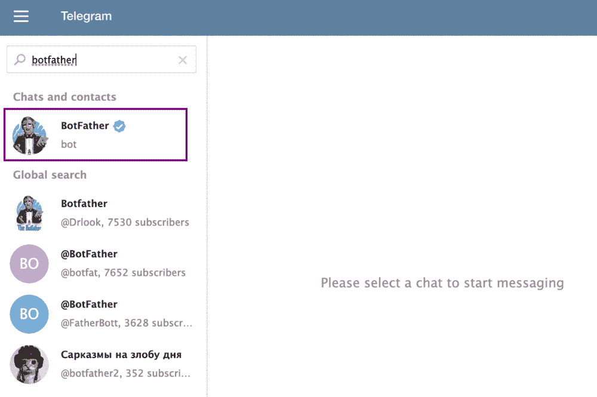

### 2.注册新的机器人

现在我们找到了僵尸爸爸，让我们和他谈谈！您可以通过键入`/newbot`开始对话。爸爸会要求你为你的两个孩子取一个名字。该名称可以是任何名称，不必是唯一的。为了简单起见，我将我的机器人命名为`ArticleBot`。

接下来，系统会提示您输入机器人的用户名。用户名必须是唯一的，并以`bot`结尾。因此，我选择了`michiel_article_bot`，因为那个用户名还没有被使用。这也将是您在 Telegram 的搜索栏中查找机器人时使用的用户名。

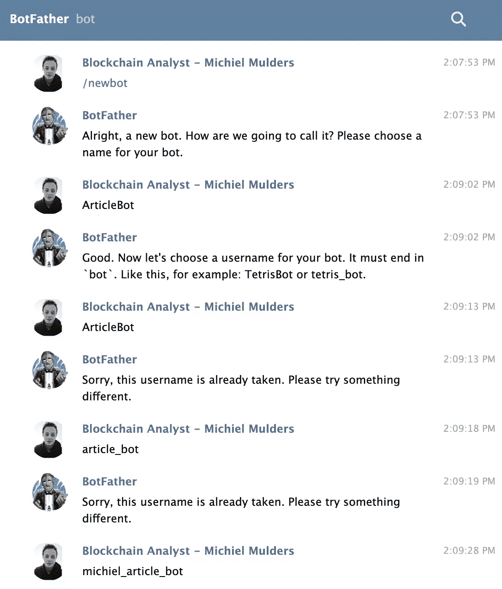

FatherBot 将返回一条成功消息，其中包含您访问 Telegram HTTP API 的令牌。请确保安全地存储此令牌，当然也不要与其他任何人共享。

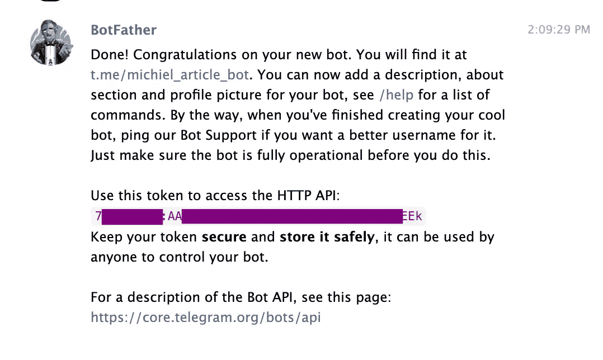

### 3.修改机器人

我们可以通过添加描述或设置我们希望机器人知道的命令来进一步修改机器人。你可以用文本`/setcommands`给机器人发消息。它将向您展示如何输入格式为`command1 - Description`的命令。

对于我的机器人，我设置了命令`bookmark - save interesting article URL`。

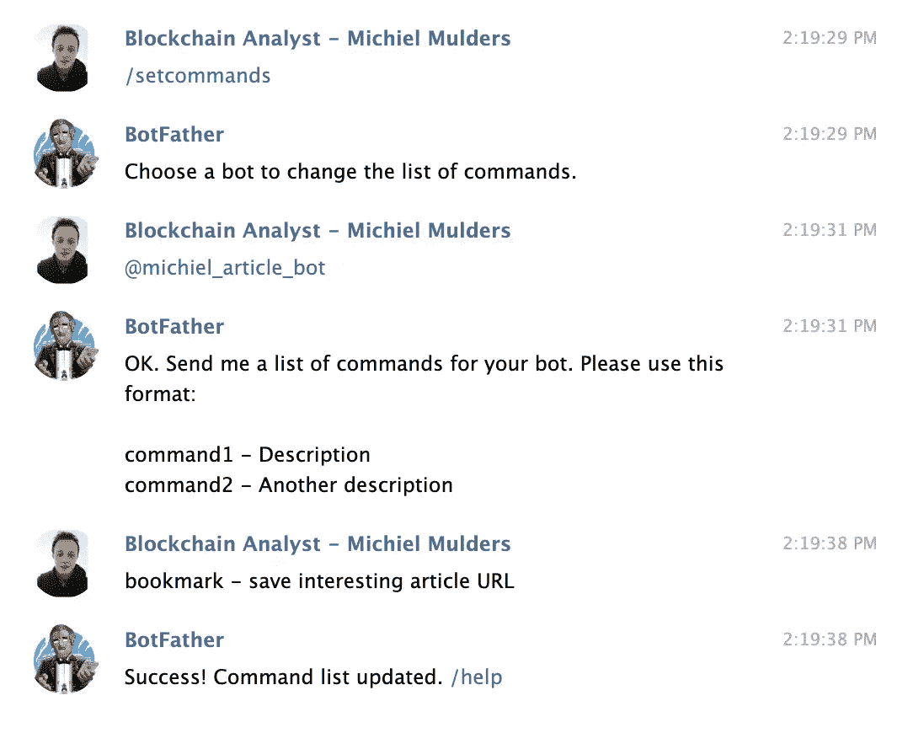

如果你现在查找你的机器人，你会在对话框中看到一个命令图标，显示可用的命令。您可以创建更多有效的命令，而不是通过 BotFather 列出它们。然而，从 UX 的角度来看，我建议向 BotFather 注册所有可用的命令。

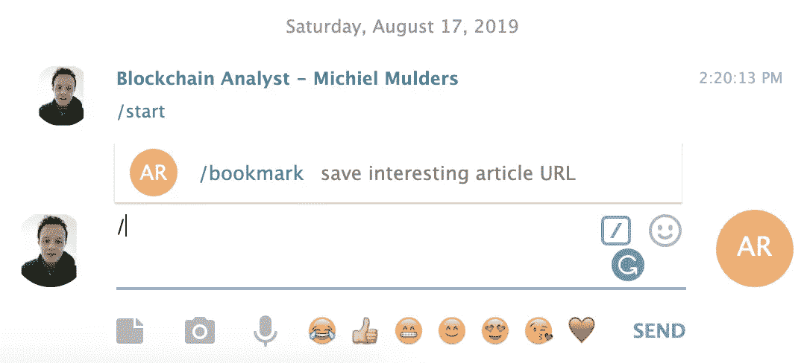

我们可以用`/setprivacy`设置 bot 的隐私。你可以选择`enable`或者`disable`它。默认情况下，隐私值设置为`enabled`，这意味着您的机器人将只接收以`/`符号开头或提到机器人用户名的消息。

可以禁用此设置，这意味着您的 bot 可以接收发送到组的所有消息。您必须将一个机器人添加到您的群中，它才能接收所有这些消息。

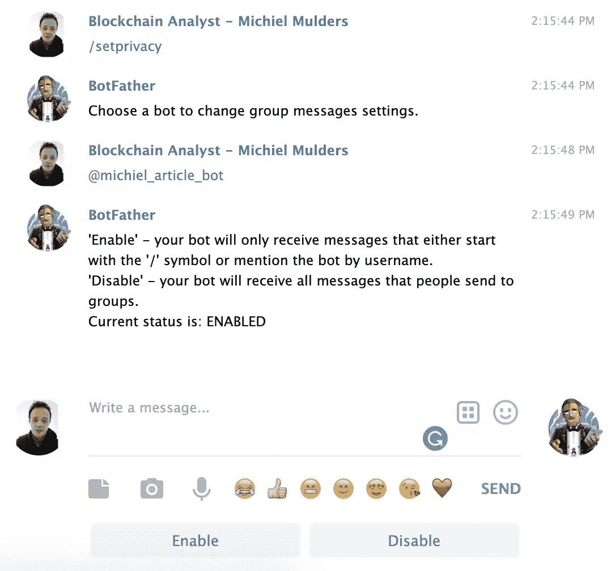

可以在以下位置找到所有可用命令的列表:

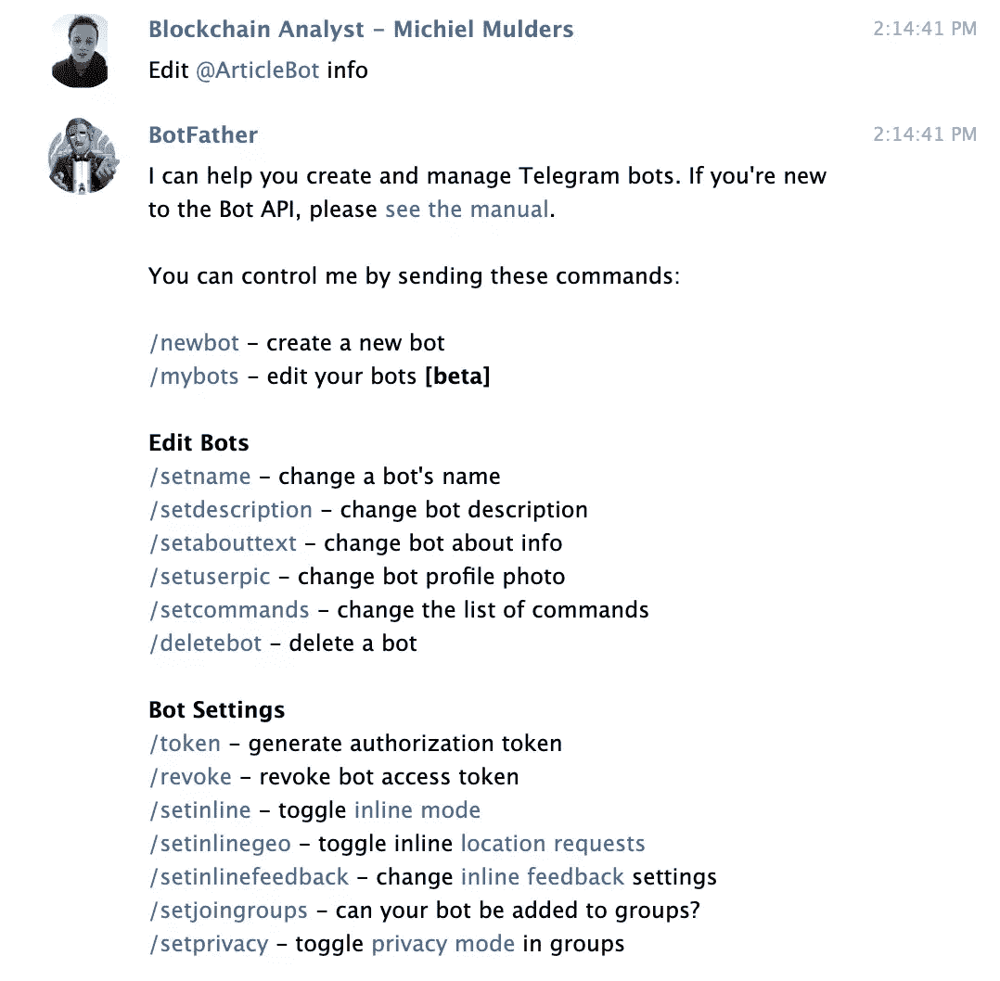

最后，我们都准备好开始编码了。确保您已经准备好 API 访问令牌。

## 编写您的第一个 Bot 命令

首先，在本教程中，我们将使用我准备的下面的[代码](https://github.com/michielmulders/sitepoint-telegram-bot)。

这是一个简单的 Node.js 项目，只有两个依赖项: [`dotenv`](https://www.npmjs.com/package/dotenv) 和 [`node-telegram-bot-api`](https://github.com/yagop/node-telegram-bot-api/blob/master/doc/usage.md) 。第一个包用于创建一个`.env`配置文件，该文件将保存我们的 API 访问令牌。第二个包充当 Telegram Bots API 的 Node.js 包装器，我们将在本教程中使用它。

### 1.设置项目

首先，克隆 [GitHub 库](https://github.com/michielmulders/sitepoint-telegram-bot)，并在您最喜欢的编辑器中打开项目。接下来，在项目的根目录下创建一个`.env`文件，并添加一行代码— `TOKEN=yourtoken`。用你从机器人父亲那里得到的令牌替换`yourtoken`。

为了确保连接正常工作，在终端中导航到项目的根目录并运行`npm start`。`npm start`命令将运行您的`app.js`文件，并应该连接到您的机器人。如果您没有看到任何错误，我们就可以开始了！

### 2.创建第一个 Bot 命令

首先，我们必须通过向它传递我们的 API 访问令牌并将轮询选项设置为`true`来创建 bot。这意味着机器人将定期检查传入的消息。

```
require('dotenv').config();
const TelegramBot = require('node-telegram-bot-api');

const token = process.env.TOKEN;

// Created instance of TelegramBot
const bot = new TelegramBot(token, {
   polling: true
}); 
```

现在机器人已经创建好了，让我们看看下面代表我们的`/bookmark`命令的代码片段。我们为传入的文本消息设置了一个监听器`onText`，并指定查找以`/bookmark`开头的消息，正如我们在 regex 字符串中指定的那样。

当消息以`/bookmark`开头时，我们的代码将会执行。首先，我们存储聊天 ID，因为我们希望能够向该用户的聊天发送回消息。

接下来，我们检查用户是否正确使用了命令。我们期望使用如下命令传递一个 URL:`/bookmark www.google.com`。

如果没有指定 URL，我们向存储的`chatID`发送一条消息，告诉用户向我们提供一个 URL。如果他们发送了 URL，我们会存储该 URL 并向他们发送成功消息。

```
// Listener (handler) for telegram's /bookmark event
bot.onText(/\/bookmark/, (msg, match) => {
   const chatId = msg.chat.id;
   const url = match.input.split(' ')[1];
   // 'msg' is the received Message from Telegram
   // 'match' is the result of executing the regexp above on the text content
   // of the message

   if (url === undefined) {
       bot.sendMessage(
           chatId,
           'Please provide URL of article!',
       );
       return;
   }

   URLs.push(url);
   bot.sendMessage(
       chatId,
       'URL has been successfully saved!',
   );
}); 
```

您可能已经注意到我们为回调函数使用了两个参数`msg`和`match`。`msg`属性表示您收到的完整消息，而`match`表示我们定义的正则表达式的结果。下图显示的是完整的`msg`，在`----`之后显示的是`match`。

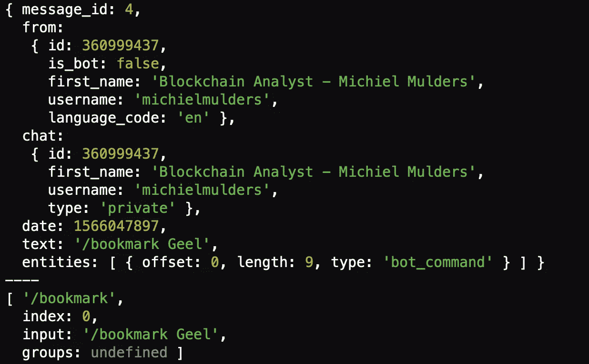

当我们在与机器人的聊天中尝试我们的命令时，我们会收到以下结果:

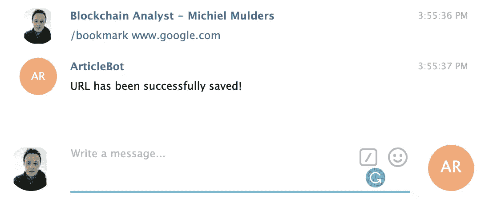

如果你看到同样的结果，恭喜你！您刚刚创建了第一个 bot 命令。让我们看看更高级的选项，如发送带有预定义选项的键盘。

## 3.键盘选项

现在我们知道了如何创建自定义命令，让我们更深入地了解一下键盘选项。可以发送一个预定义的键盘和你的命令来限制用户的选择。可以简单到限制用户用`Yes`或者`No`回答。

### 3.1 普通键盘

让我们看看下面的代码片段。我们已经向我们的`bot.sendMessage`函数添加了第三个参数。这个对象定义了键盘的选项。如果你仔细看看`reply_markup.keyboard`，你会发现一个包含更多数组的数组。这里的每个数组代表一行选项。这有助于您设置更重要或按钮文本更长的格式选项。

```
// Listener (handler) for showcasing different keyboard layout
bot.onText(/\/keyboard/, (msg) => {
   bot.sendMessage(msg.chat.id, 'Alternative keybaord layout', {
       'reply_markup': {
           'keyboard': [['Sample text', 'Second sample'], ['Keyboard'], ['I\'m robot']],
           resize_keyboard: true,
           one_time_keyboard: true,
           force_reply: true,
       }
   });
}); 
```

这段代码在向我们的机器人发送消息`/keyboard`时给出了以下结果。

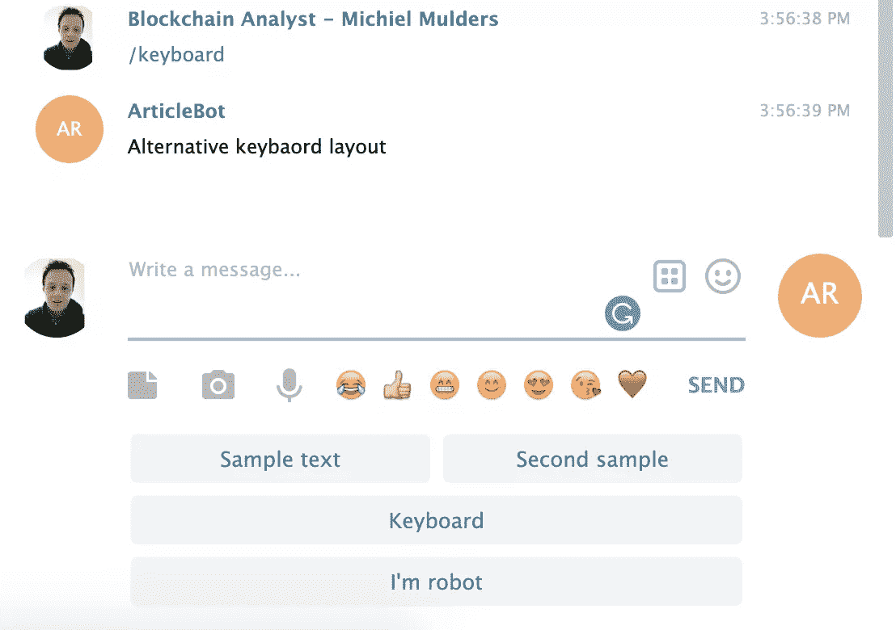

此外，我们还可以为每个选项定义带有额外数据的内嵌键盘。

### 3.1 直插键盘

聊天中会显示一个内嵌键盘，而不是在你的信息输入框下面。因为我们想要标记我们提交的 URL，我们可以通过向用户显示可用的类别来做到这一点。这是我们的键盘现在的样子:

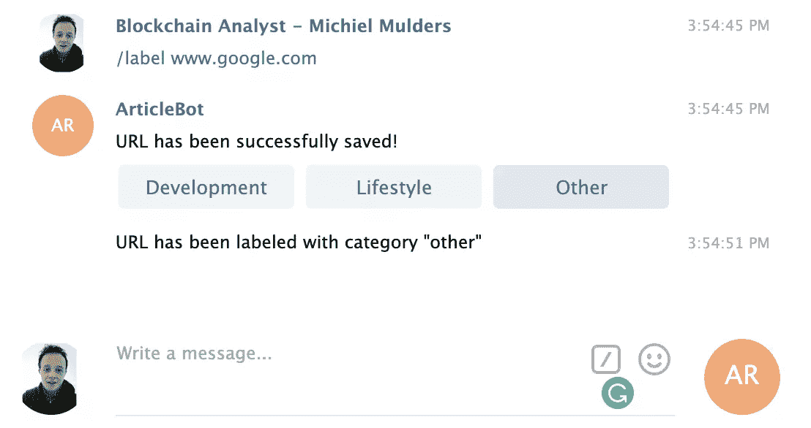

让我们看看下面的代码。`reply_markup`现在定义了属性`inline_keyboard`。标记的其余部分保持不变。每个数组代表一行。然而，除了传递文本，我们还可以传递一个带有`text`和`callback_data`的对象来知道你选择了什么选项。

```
// Listener (handler) for telegram's /label event
bot.onText(/\/label/, (msg, match) => {
   const chatId = msg.chat.id;
   const url = match.input.split(' ')[1];

   if (url === undefined) {
       bot.sendMessage(
           chatId,
           'Please provide URL of article!',
       );
       return;
   }

   tempSiteURL = url;
   bot.sendMessage(
       chatId,
       'URL has been successfully saved!',
       {
           reply_markup: {
               inline_keyboard: [[
                   {
                       text: 'Development',
                       callback_data: 'development'
                   }, {
                       text: 'Lifestyle',
                       callback_data: 'lifestyle'
                   }, {
                       text: 'Other',
                       callback_data: 'other'
                   }
               ]]
           }
       }
   );
}); 
```

下一节解释如何使用处理程序接收回调数据。

### 3.2 键盘回调

如果我们想要接收回调数据，我们必须监听这种类型的事件。

```
// Listener (handler) for callback data from /label command
bot.on('callback_query', (callbackQuery) => {
   const message = callbackQuery.message;
   const category = callbackQuery.data;

   URLLabels.push({
       url: tempSiteURL,
       label: category,
   });

   tempSiteURL = '';

   bot.sendMessage(message.chat.id, `URL has been labeled with category "${category}"`);
}); 
```

`callbackQuery`上的消息属性包含来自用户的整个消息。属性包含我们的类别回调数据。

现在你可能已经发现了一个设计错误。如果我们有两个发回回调数据的命令呢？你可能会得到一些非常奇怪的行为或回复。

因此，建议发送回一个 stringified JSON 对象，该对象也包含一个标签来标识回调数据属于哪个命令。看看下面的最佳实践:

```
// Inline keyboard options
const inlineKeyboard = {
   reply_markup: {
       inline_keyboard: [
           [
               {
                   text: 'YES',
                   callback_data: JSON.stringify({
                       'command': 'mycommand1',
                       'answer': 'YES'
                   })
               },
               {
                   text: 'NO',
                   callback_data: JSON.stringify({
                       'command': 'mycommand1',
                       'answer': 'NO'
                   })
               },
           ]
       ]
   }
}; 
```

您可以使用来自`command`选项的数据切换到该命令的特定业务逻辑。

我们正在成为电报机器人的路上。要成为一名精通的大师，让我们来研究数据请求。

### 3.3 数据请求-电话号码

请求数据是可能的，比如一个人的电话号码或地理位置。在本教程中，我们将展示如何使用备用键盘请求电话号码。

```
// Keyboard layout for requesting phone number access
const requestPhoneKeyboard = {
   "reply_markup": {
       "one_time_keyboard": true,
       "keyboard": [[{
           text: "My phone number",
           request_contact: true,
           one_time_keyboard: true
       }], ["Cancel"]]
   }
};

// Listener (handler) for retrieving phone number
bot.onText(/\/phone/, (msg) => {
   bot.sendMessage(msg.chat.id, 'Can we get access to your phone number?', requestPhoneKeyboard);
}); 
```

用户将在聊天中收到以下请求:

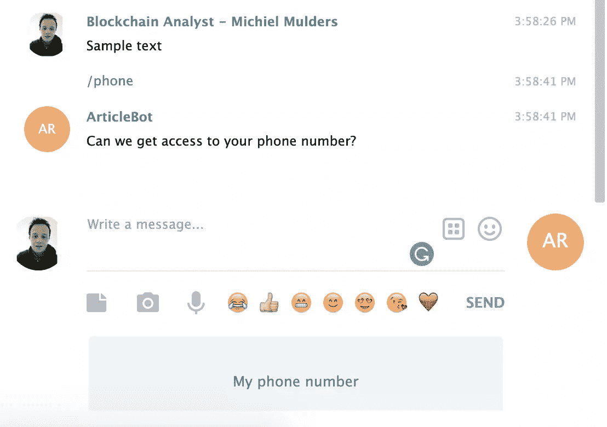

当您点击按钮`My phone number`时，您会得到以下电话号码请求:

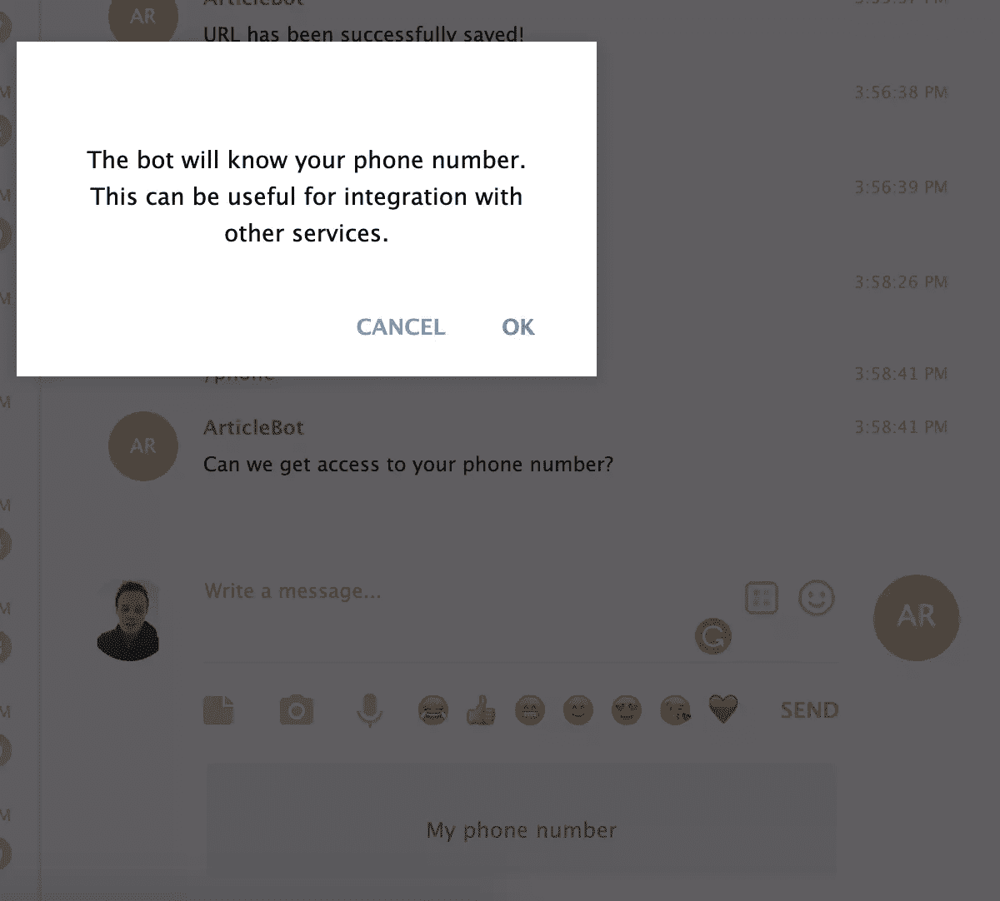

这是我们授予访问权限后的样子:

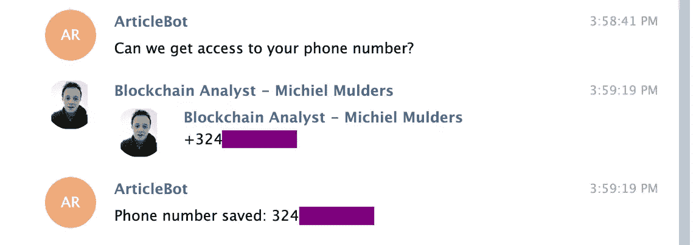

终于！你是一个博学的电报机器人绝地。现在，更多信息和资源可以在这里找到:

*   [私人信息和公共信息的区别](https://medium.com/tsangyoujun/telegram-bots-telecast-v1-0-b030dce855a8)
*   [不同类型的事件](https://github.com/yagop/node-telegram-bot-api/blob/master/doc/usage.md)
*   [GitHub 上 Hosein2398 的教程](https://github.com/hosein2398/node-telegram-bot-api-tutorial#keyboards)

请继续关注这里——我们将在下个月带着一篇教程回来，深入探讨 Telegram API 的高级特性。

## 分享这篇文章