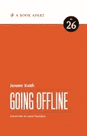
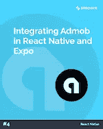

# SitePoint Premium 新版本:离线+本地反应

> 原文：<https://www.sitepoint.com/sitepoint-premium-new-releases-going-offline-react-native/>

我们正努力通过 SitePoint Premium 让您在自己的领域保持领先地位。我们有很多新书可以在图书馆借阅——让我们给你介绍一下。

## 离线

Jeremy Keith 向您介绍服务人员(以及他们背后的代码)，向您展示离线页面中的最新策略。了解获取和缓存的来龙去脉，提高网站的性能，并为每个用户创造理想的离线体验，无论他们的连接如何。

➤读到[下线](https://www.sitepoint.com/premium/books/going-offline?utm_source=blog&utm_medium=articles)。

## 在 React Native 和 Expo 中集成 AdMob

谷歌 AdMob 是一种在任何移动应用程序中安装广告的方式，目的是赚钱。在裸 React Native 中安装和配置 AdMob 可能是一个繁琐的过程。但是当使用 Expo 这样的工具链时，安装起来相对简单——我们将向您展示如何安装。

➤阅读[在 React Native 和 Expo](https://www.sitepoint.com/premium/books/integrating-admob-in-react-native-and-expo?utm_source=blog&utm_medium=articles) 中集成 AdMob。

## 还会有更多…

我们会定期在 SitePoint Premium 上发布新内容，因此我们将在下周为您带来最新更新。别忘了:如果你还没有查看我们的产品，可以去我们的[图书馆转转](https://www.sitepoint.com/?utm_source=blog&utm_medium=articles)。

## 分享这篇文章