# 如何使用 Bannersnack 在几秒钟内生成惊人的横幅

> 原文：<https://www.sitepoint.com/generate-ad-banners-bannersnack/>

*本文是与 [StudioWorks](http://studioworks.me/) 合作创作的。感谢您对使 SitePoint 成为可能的合作伙伴的支持。*

自从互联网出现以来，横幅广告就一直存在。让许多用户烦恼的设计糟糕的横幅广告已经存在很久了。但是 30 年后，企业仍然付费将它们放在网站上和广告循环中，所以它们必须在正确的情况下工作。对吗？

随着营销人员意识到视频在吸引注意力方面的力量，横幅广告，尤其是动画广告，在社交媒体简介和社交广告中的使用比以往任何时候都多。今天的横幅广告是复杂和精心设计的，可以非常有效。但是对于设计师来说，它们是一个巨大的挑战。

## 编写横幅广告既困难又昂贵

众所周知，横幅广告，尤其是动画广告，很难用 HTML5 编码。当然，你可以在 Flash 中创建动画横幅，但苹果的 iOS 不支持它们，Adobe 表示他们将在 2020 年完全关闭 Flash。

gif 是另一种可能的解决方案，但它们通常分辨率很低，大多数网络用户将 gif 与迷因和幽默联系在一起，而不是严肃的产品。所以你只剩下 HTML5 了。

编码 HTML5 广告——尤其是动画广告——需要专业知识，而专业知识是昂贵的。优秀的程序员知道他们的价值，找到一个你可以信任的人可能是一项不可能的任务。自由平台似乎是显而易见的起点，但是称职的编码员很快就会离开第三方网站。

幸运的是，这是 SaaS 的时代，设计师现在可以使用像 [Bannersnack](https://www.bannersnack.com/) 这样带有拖放界面的应用程序，让你快速有效地设计横幅广告。

## 班纳斯纳克是做什么的？

Bannersnack 是一个在线应用程序，可以帮助您为网站和社交媒体平台设计完全响应的横幅广告，而无需任何编码或设计技能。Bannersnack 的创建者解决了所有的硬编码问题，所以你只需登录，选择你的尺寸，添加你的图像，选择颜色和字体，然后开始创作。

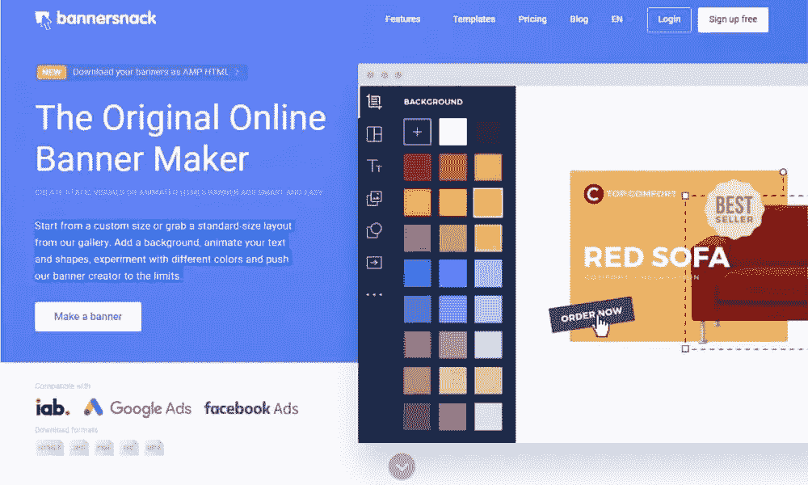Image source: [Bannersnack](https://www.bannersnack.com/?bs_tags=AW,S_Brand,JUL2019&gclid=CjwKCAjwpuXpBRAAEiwAyRRPgRI0pHQ_oEbyYTNfDgOLzZuXIcWtOtOPDHRWBsrwsPRRsSM9hUa6ThoC3VIQAvD_BwE)

让我们快速浏览一下 Bannersnack 平台，看看它能做些什么。

### 1.选择你的尺寸

从自定义大小和方向(垂直、水平和方形)开始，或选择预设大小。你甚至可以选择脸书广告或 Instagram 帖子:

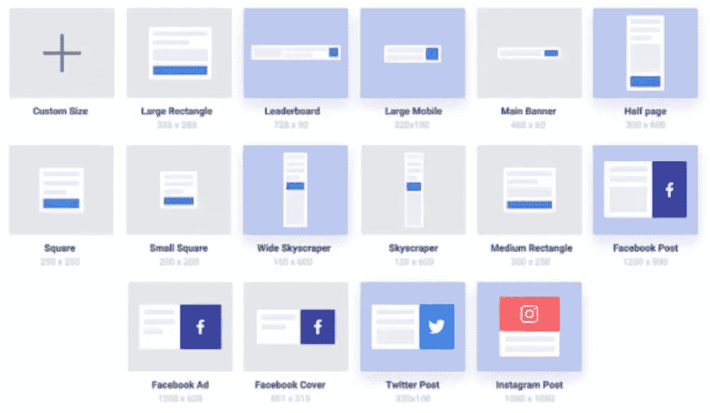Image source: [Bannersnack](https://www.bannersnack.com/?bs_tags=AW,S_Brand,JUL2019&gclid=CjwKCAjwpuXpBRAAEiwAyRRPgRI0pHQ_oEbyYTNfDgOLzZuXIcWtOtOPDHRWBsrwsPRRsSM9hUa6ThoC3VIQAvD_BwE)

### 2.设计你的广告

您可以从头开始设计，也可以使用现有的 Bannersnack 模板。Bannersnack 在其模板库中提供静态或动画设计，因此即使没有设计想法，您也可以开始使用。

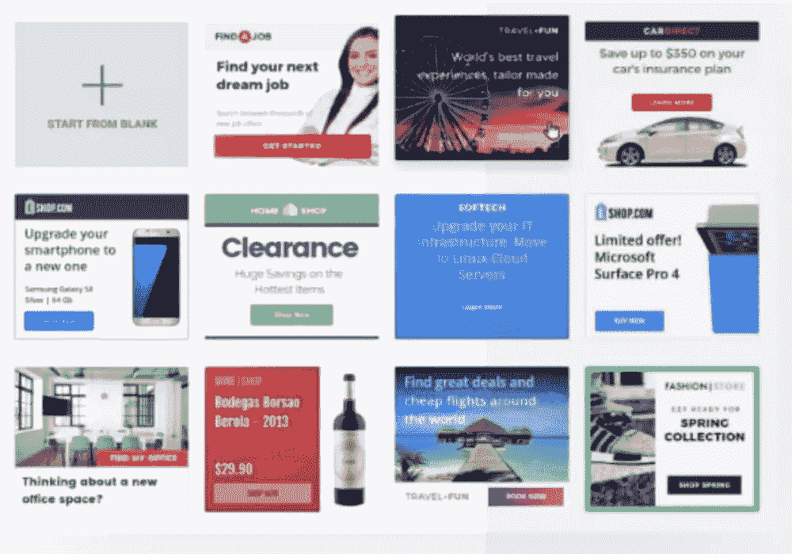Image source: [Bannersnack](https://www.bannersnack.com/?bs_tags=AW,S_Brand,JUL2019&gclid=CjwKCAjwpuXpBRAAEiwAyRRPgRI0pHQ_oEbyYTNfDgOLzZuXIcWtOtOPDHRWBsrwsPRRsSM9hUa6ThoC3VIQAvD_BwE)

### 3.添加图像和文本

只需点击几下鼠标即可定制您的设计。如果你能使用 Mailchimp 或其他 SaaS 营销工具，你可以使用 Bannersnack。编辑标题、文本、按钮、背景，添加您自己的徽标和图像，以及更改行高和透明度等设计细节。您可以创建设计精美的横幅广告，与您现有的品牌标准和颜色完美匹配。

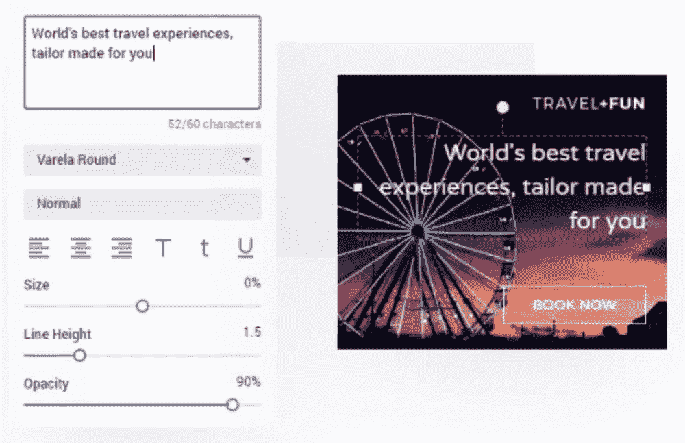Image source: [Bannersnack](https://www.bannersnack.com/?bs_tags=AW,S_Brand,JUL2019&gclid=CjwKCAjwpuXpBRAAEiwAyRRPgRI0pHQ_oEbyYTNfDgOLzZuXIcWtOtOPDHRWBsrwsPRRsSM9hUa6ThoC3VIQAvD_BwE)

### 4.轻松制作动画

众所周知，动画广告比静态广告更吸引人，更能推动行动。与非动画内容相比，读者更有可能对视频做出反应，也更有可能访问出版商的页面或网站。

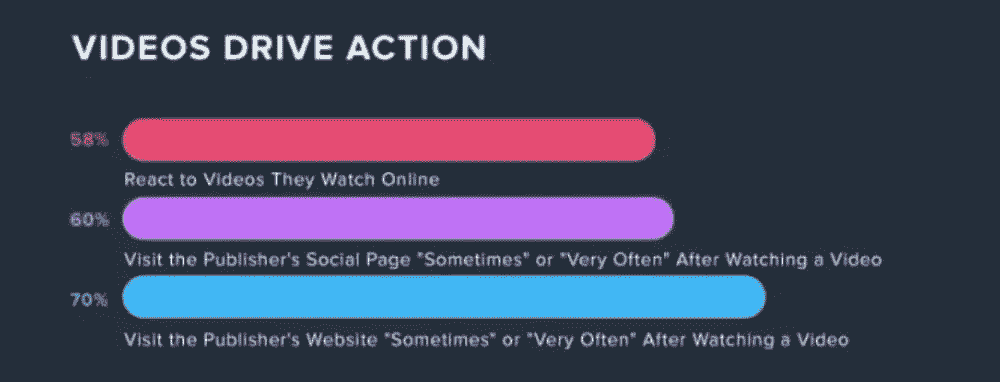Image source: [Impactbnd.com](https://www.impactbnd.com/blog/online-video-habits-statistics-infographic)

但是动画是出了名的棘手。Bannersnack 已经成功解决了这个障碍 HTML5 动画包括淡入、滑入和反弹。这些不是完整的视频广告，但它们仍然会在繁忙的网页上吸引用户的注意力，并提高你的参与度。它们还有加载速度快的额外优势——这对于防止移动用户在你的广告加载之前就滚动浏览至关重要。

Bannersnack 的 HTML5 编辑器具有直观和用户友好的界面和幻灯片管理系统，使动画变得简单。尝试 32 个预设动画中的一个来制作广告的任何部分动画:

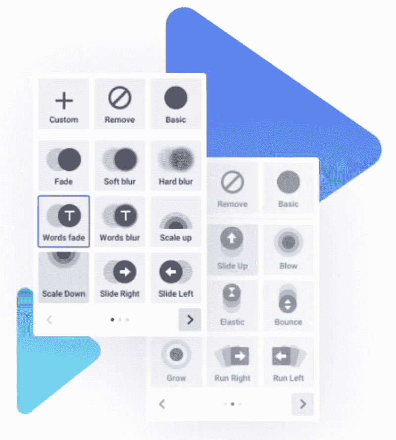[Screenshot source](https://www.bannersnack.com/html5-banner-maker.html)

或者，创建自定义动画并调整持续时间、延迟和过渡等内容。

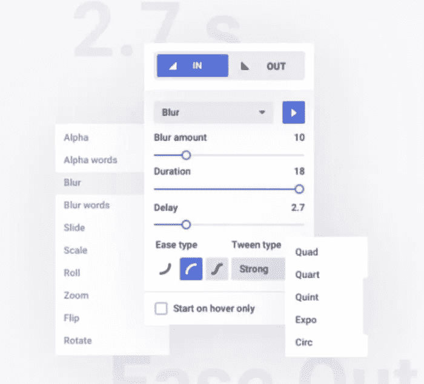

### 5.创建各种尺寸和形状的全套横幅

一旦你完成了布局，试试 Bannersnack 的[智能调整选项](https://www.bannersnack.com/resize.html)。您可以在几分钟内制作一组 30 多个横幅广告，全部基于相同的设计，因此您可以在客户的网站、广告活动和社交媒体平台上使用相同的广告。(看看这个 [YouTube 视频](https://www.youtube.com/watch?v=EBEgZ9P96bg&t=0s)。)

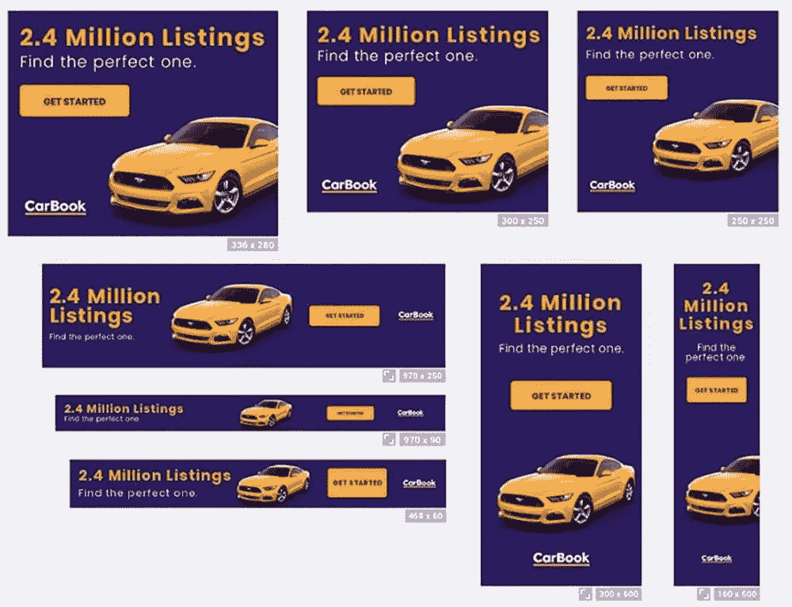Image source: [Bannersnack](https://www.bannersnack.com/?bs_tags=AW,S_Brand,JUL2019&gclid=CjwKCAjwpuXpBRAAEiwAyRRPgRI0pHQ_oEbyYTNfDgOLzZuXIcWtOtOPDHRWBsrwsPRRsSM9hUa6ThoC3VIQAvD_BwE)

如果您愿意，可以通过更改过渡时间轴或重新排列特定层来调整单个横幅的布局，但由于 Bannersnack 直观的调整大小功能，这通常是不必要的。

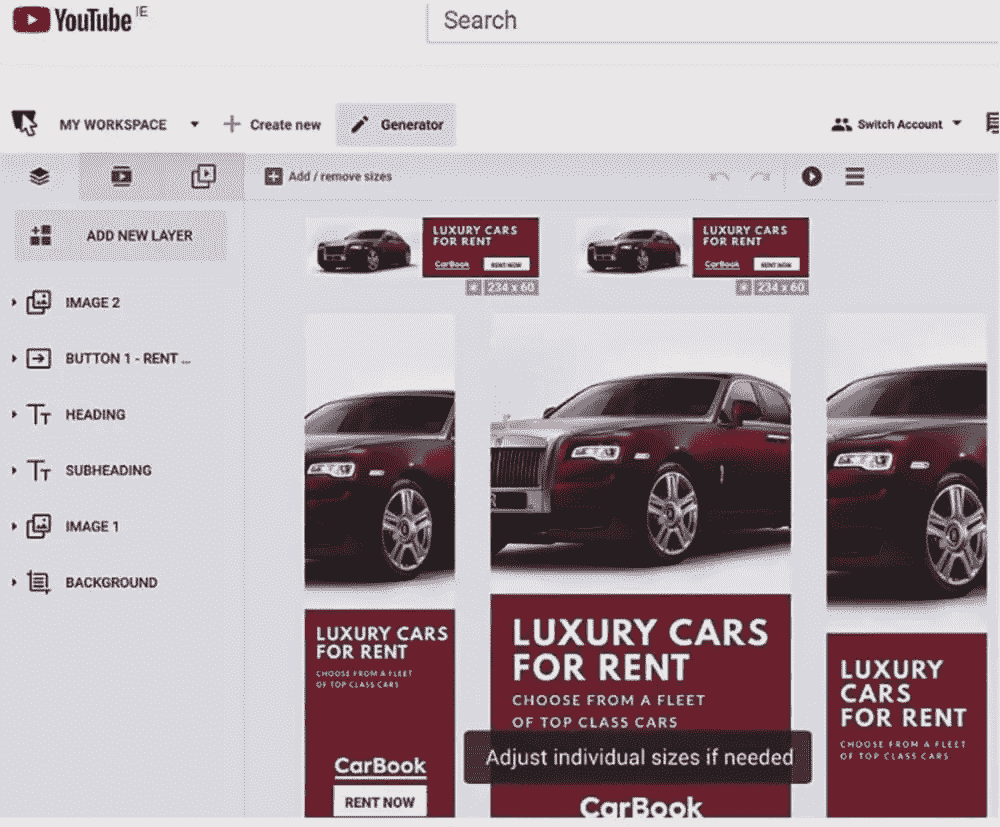The new Smart Resize feature: [Screenshot source](https://www.youtube.com/watch?v=EBEgZ9P96bg&t=0s)

上图中的 YouTube 视频向您展示了从一个基本设计创建一组方形、水平和垂直横幅的过程。

### 6.轻松协作

没有什么比发送设计样本来征求意见和标记更浪费时间的了。使用 Bannersnack 的在线协作界面，而不是下载文件和通过电子邮件获得批准。您的团队可以查看广告，留下评论和建议，甚至将广告标记为已批准—所有这些都在系统中完成。

您可以通过设置自己的文件夹和工作空间来组织所有的设计。

### 7.导出并运行

一旦每个人都对广告感到满意，只需选择您想要的格式并将其导出。您的横幅已准备好嵌入。你可以选择 JPG、PNG、GIF 或 html 5——兼容所有主要的显示广告平台，包括谷歌广告、重定向器等。

对于 HTML 广告，您可以下载为 HTML5 或 AMP HTML(谷歌的首选格式，用于安全和快速下载)。

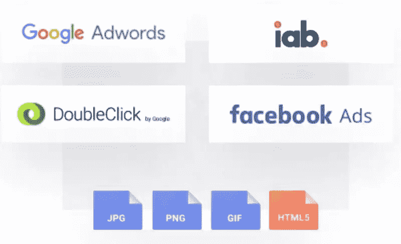

**专业提示** : Bannersnack 甚至可以帮你制作[脸书的视频广告](https://blog.bannersnack.com/facebook-video-ads/)，这种广告已经被证明可以带动更多的访问者，并比静态广告提高转化率。

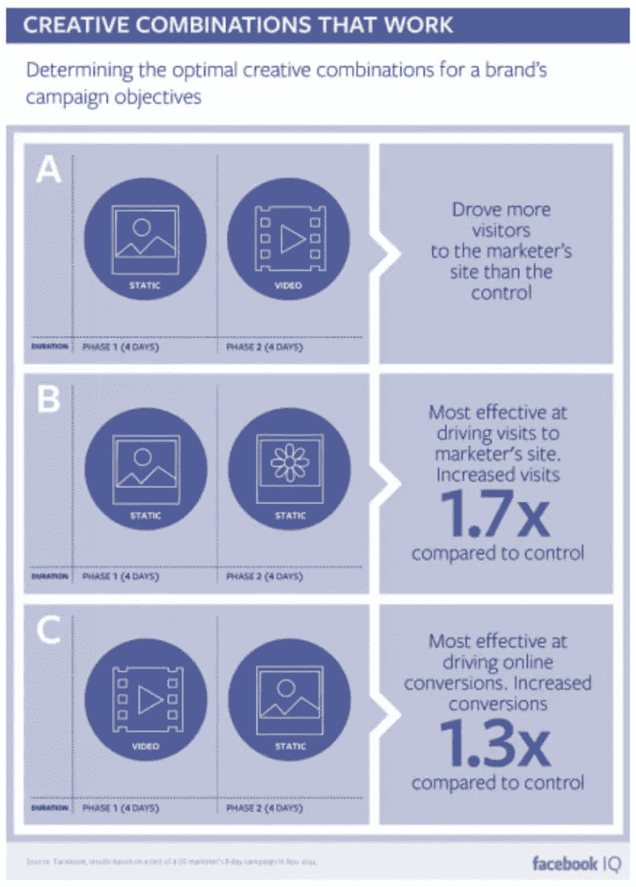

当你订阅了 Pro 或 Plus Bannersnack，你可以按照脸书的要求下载 MP4 格式的广告。

## 这要花我多少钱？

您可以免费测试 Bannersnack，但要充分利用该工具，包括横幅集、AMP HTML 和 MP4 下载，您需要订阅 Pro 或 Plus。虽然这听起来有点吓人，但价格却出人意料地实惠。当你考虑到雇佣一个程序员或自己做这项工作可以节省多少时间时，你会发现你创建的第一个项目就物有所值。

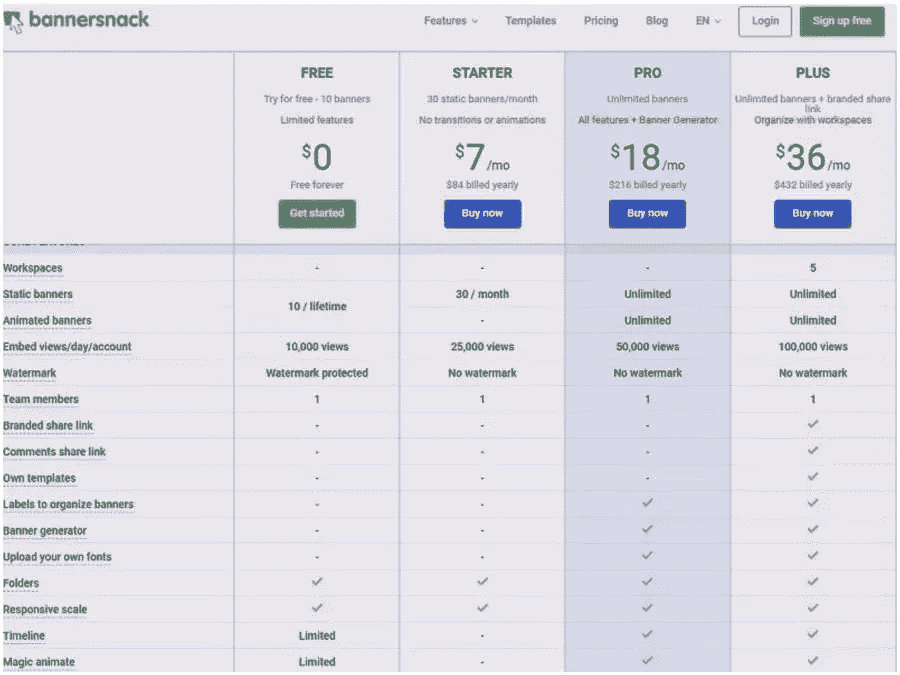[Screenshot source](https://www.bannersnack.com/go-premium/?plan=individual)

## 设计横幅广告的专业技巧

现在你已经有了一个制作横幅广告的好工具，让我们为你提供一些专业建议，让你从广告投资中获得最大收益。

### 1.重新定位

横幅广告通常因回复率低而名声不佳。这是真的，但是任何媒体都可以这么说，从电视广告到广告牌。这取决于创意有多好，以及广告的针对性和针对性有多强。

重新定位横幅广告给你第二次机会来影响购买决策。观众是第二次或第三次看到你的营销图形。另一个因素是网络用户会再次看到你的广告，因为他们对你的服务感兴趣。

重定向广告的[点击率是首次展示广告的十倍。](https://www.digitalinformationworld.com/2014/09/infographic-retargeting-advertising-statistics.html)

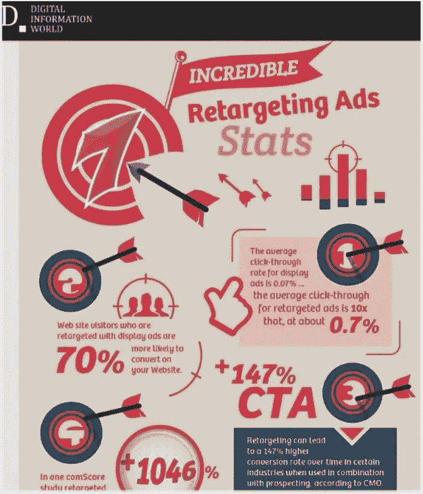[Screenshot source](https://www.digitalinformationworld.com/2014/09/infographic-retargeting-advertising-statistics.html)

数字信息世界有一些好主意可以帮助你像专业人士一样重新定位。

### 2.克服广告盲

读者越来越擅长忽略展示广告。Jeff Bullas 有一些有用的建议来帮助你克服广告盲:

*   把你的广告放在不寻常的地方
*   让你的广告与你的受众相关
*   使用独特的颜色、格式和大小
*   使用更少的广告为移动用户进行优化
*   让你的广告成为你设计的一部分

根据这一逻辑，如果符合以下条件，您将获得更好的广告参与度:

*   你对你展示的东西是有选择性的
*   你使用自定义的尺寸和颜色，与你的主网站颜色形成对比(不冲突)
*   把你的横幅放在用户必须看到的地方，比如博客文章的中间

### 3.测试，测试，测试

分割测试，多元测试，或 A/B 测试:不管你叫它什么，测试你的广告是提高其性能的关键。

[ConversionXL](https://conversionxl.com/blog/multivariate-tests/) 表示，在多元测试有意义之前，你需要大量的流量(每月超过 100，000 个独立访问者)。大多数企业应该做简单的 A/B 测试，你测试一个广告的两个变体，让一半的访问者去看一个广告，另一半去看第二个广告。

设计你的横幅广告，并能够快速修改，是拆分测试的关键；使用 Bannersnack 这样的服务可以让你的成本更低。

在你的分割测试中，你可以改变任何东西。从大变量开始:过渡类型、静态与动态、字体、颜色、CTA 颜色和图像。一旦你的 A/B 结果相似，并且你认为你在主要变量方面找到了最好的广告，是时候测试不太明显的变量了——例如过渡时间、图像位置、字体大小和轻微的颜色变化。

此外，一定要使用这个测试工具来检查你的 A/B 结果是随机的还是具有统计学意义的[。](https://vwo.com/ab-split-test-significance-calculator/)

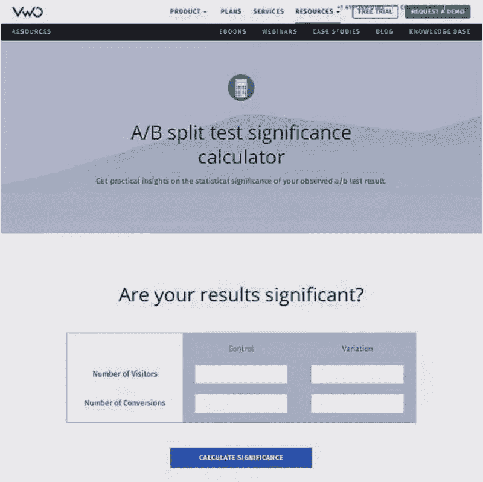Image source: [VWO](https://vwo.com/ab-split-test-significance-calculator/)

一旦你为你的一个广告胜过另一个广告而高兴，抛弃表现较差的广告。即使点击率的微小提高也需要持续的测试。

### 4.对分析保持警惕

你的在线广告平台可能包括分析。横幅广告自动化平台当然包括它们，以及查看互动热图和知道哪些广告最适合你的能力。

检查你的开发者或广告平台提供的分析界面，寻找用户行为模式，以帮助影响你的下一个广告设计和文案。

## 横幅可以很强大…如果你做得对的话

要真正利用你的横幅广告，你需要脱颖而出——以一种好的方式。以你的客户为中心进行创作，以某种方式娱乐或启发客户，而不是用推销来打击客户。

Bannersnack 等横幅广告生成应用程序允许您快速设计横幅广告，并轻松进行更改，因此您可以使用修改后的广告与原始广告进行对比，以提高您的投资回报率，并真正吸引您的客户。

你自己试试。看看你从零开始设计的横幅广告所得到的结果，并与你从专业的横幅广告设计者那里得到的结果进行比较。看看你或你的客户是否能看出任何不同——因为毫无疑问他们的客户会。

## 分享这篇文章