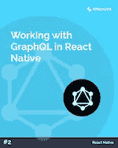

# SitePoint Premium 新版本:粉碎 6 + GraphQL 和 React Native

> 原文：<https://www.sitepoint.com/sitepoint-premium-new-releases-smashing-6-graphql-react-native/>

我们正努力通过 SitePoint Premium 让您在自己的领域保持领先地位。我们有很多新书可以在图书馆借阅——让我们给你介绍一下。

## 粉碎书 6:网页设计的新前沿

是时候最终理解所有前端和 UX 的疯狂了。满足粉碎书 6，一切你需要知道的网页设计。从设计系统到可访问的单页应用程序、CSS 自定义属性、CSS 网格、服务人员、性能模式、AR/VR、对话式 ui 和响应式艺术指导。

➤读了非常棒的书 6:网页设计的新领域。

## 使用 GraphQL 和 React Native

在本教程中，我们将通过创建一个简单的咖啡豆比较应用程序，在 React 本地设置中演示 GraphQL 的强大功能。为了让您能够专注于 GraphQL 提供的所有优秀功能，Jamie 使用 Expo 为该应用程序构建了基础模板。

➤阅读了使用 GraphQL 和 React Native 的文章。

## 还会有更多…

我们会定期在 SitePoint Premium 上发布新内容，因此我们将在下周为您带来最新更新。别忘了:如果你还没有查看我们的产品，可以去我们的[图书馆转转](https://www.sitepoint.com/?utm_source=blog&utm_medium=articles)。

## 分享这篇文章