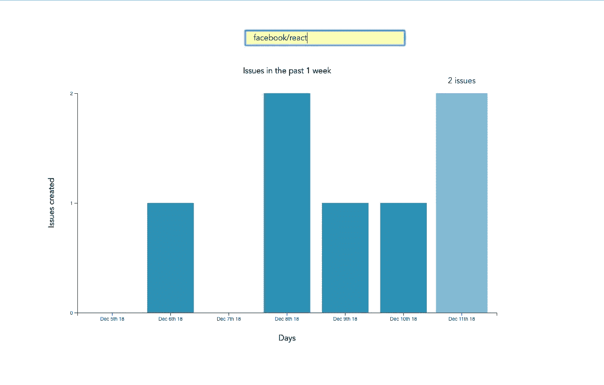
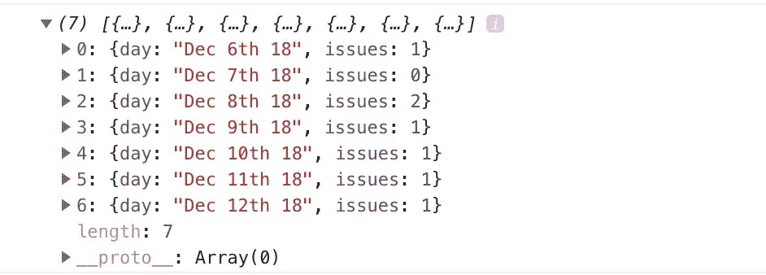
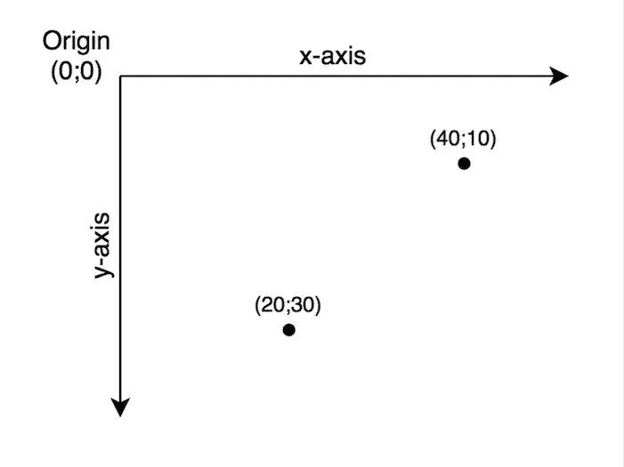
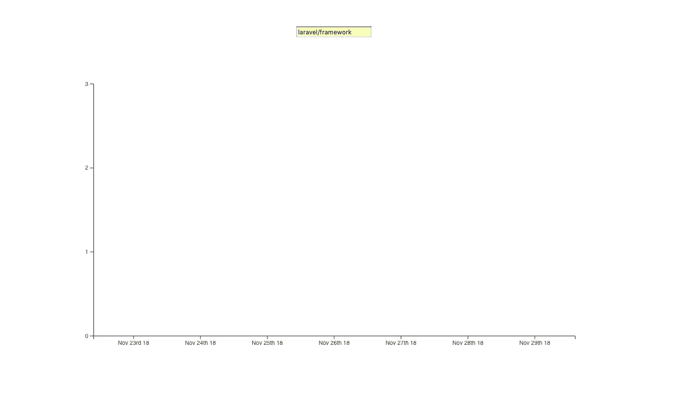
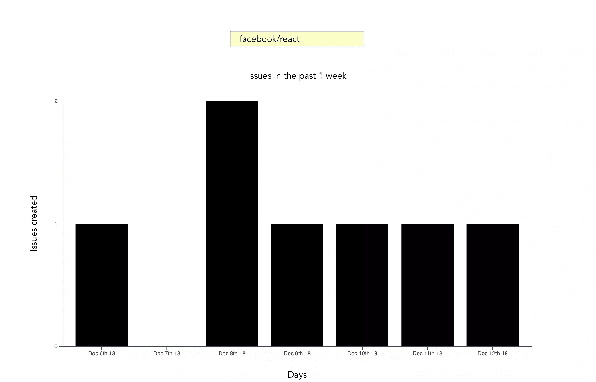
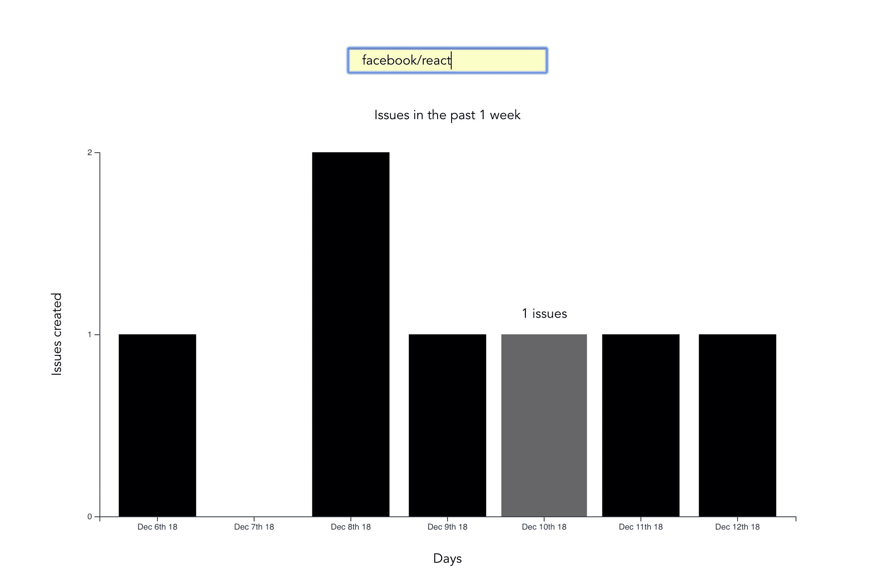

# Vue 和 D3.js 数据可视化简介

> 原文：<https://www.sitepoint.com/vue-d3-data-visualization-intro/>

Web 应用程序通常是数据驱动的，经常需要可视化这些数据。这就是图表和图形出现的原因。它们使传递信息变得更容易，也展示了相关性或统计关系。以图表形式呈现的信息也更容易被非母语人士理解。

在本教程中，我们将学习如何可视化 Vue 项目中的数据。为此，我们将使用流行的 D3.js 库，它结合了强大的可视化组件和数据驱动的 DOM 操作方法。

让我们开始吧。

*注意:本教程的代码可以在 [GitHub](https://github.com/sitepoint-editors/D3.js) 上找到。*

*想从头学起 Vue.js？这篇文章是从我们的优质图书馆摘录的。使用 SitePoint Premium 获得涵盖基础知识、项目、技巧和工具&的 Vue 书籍全集。[现在就加入，每月仅需 9 美元](https://www.sitepoint.com/premium/products/Z2lkOi8vbGVhcm5hYmxlL1Byb2R1Y3QvMzA3?utm_source=blog&utm_medium=articles)。*

## D3 是什么？

正如你在项目主页上看到的，D3.js 是一个 JavaScript 库，用于基于数据操作文档。D3 帮助您使用 HTML、SVG 和 CSS 将数据变得生动。它强调 web 标准，让您拥有现代浏览器的全部功能，而无需将自己束缚在专有框架中。

鉴于大多数人将 D3.js 称为数据可视化库，*它不是*。D3 更像是一个由不同部分组成的框架——比如 jQuery 部分(帮助我们选择和操作 DOM 元素)、Lodash 部分、动画部分、数据分析部分和数据可视化部分。

在本教程中，我们将处理 D3 的可视化方面。D3 在可视化数据时的真正优势是:

*   使用绘图指令装饰数据的功能的可用性
*   从源数据创建新的可绘制数据
*   生成 SVG 路径
*   从数据和方法中创建 DOM 中的数据可视化元素(如轴)

## 我们将会建造什么

我们希望创建一个应用程序，让用户在 GitHub 上搜索回购，然后获得过去一周打开的问题的可视化表示，这些问题仍然存在。最终结果将如下所示:



## 先决条件

本教程假设您已经掌握了 Vue 的工作知识。不要求以前有 D3.js 的知识，但是如果你想快速上手，你可能想读一下我们的 [D3 by example 教程](https://www.sitepoint.com/d3-js-data-visualizations/)。

您还需要在系统上安装 Node。你可以从[官方网站](https://nodejs.org)为你的系统下载二进制文件，或者使用[版本管理器](https://www.sitepoint.com/quick-tip-multiple-versions-node-nvm/)来完成。

最后，我们将使用以下软件包来构建我们的应用程序:

*   为项目搭建脚手架
*   [D3 . js](https://d3js.org/)——可视化我们的数据
*   Lodash——它提供了一些实用的方法
*   [时刻 JS](https://momentjs.com/) —用于日期和时间格式化
*   [axios](https://github.com/axios/axios) —帮助我们向外部 API 发出请求的 HTTP 客户端

## 新 Vue 项目

我更喜欢使用 Vue CLI 创建新的 Vue 项目。(如果你不熟悉 Vue CLI，我们在这个 Vue 系列中的初学者指南给出了完整的介绍。)Vue CLI 提供了一个很好的文件夹结构来放置代码的不同部分，比如样式、组件等等。

确保您的计算机上安装了 CLI:

```
npm install -g @vue/cli 
```

然后使用以下命令创建一个新项目:

```
vue create issues-visualization 
```

*注意:使用 Vue CLI 创建新项目时，系统会提示您选择一个预置。对于这个特定的项目，我们将坚持使用默认值(Babel + ESLint)。*

创建好新的 Vue 项目后，我们进入项目文件夹，添加我们需要的各种节点模块:

```
npm install lodash d3 axios moment 
```

即使这是一个简单的应用程序，没有很多运行的部分，我们仍然会采用组件方法，而不是将所有代码都放在`App.vue`文件中。我们将有两个组件，一个是`App`组件，另一个是我们尚未创建的`Chart`组件。

`App`组件将处理从 GitHub 获取数据，然后将这些数据作为 props 传递给`Chart`组件。图表的实际绘制将发生在`Chart`组件内部。以这种方式构建的好处是，如果您想使用 axios 之外的库来获取数据，将它换出会更容易。另外，如果你想把 D3 换成一个不同的图表库，那也更容易。

## 构建搜索界面

我们将首先构建一个搜索界面，让用户输入他们希望可视化的回购名称。

在`src/App.vue`中，删除`<template>`标签中的所有内容，并用以下内容替换:

```
<template>
  <div id="app">
    <form action="#" @submit.prevent="getIssues">
      <div class="form-group">
        <input
          type="text"
          placeholder="owner/repo Name"
          v-model="repository"
          class="col-md-2 col-md-offset-5"
        >
      </div>
    </form>
  </div>
</template> 
```

这里我们有一个表单，在提交时，它阻止浏览器的默认提交动作，然后调用一个我们还没有定义的`getIssues`方法。我们还使用一个`v-model`指令将表单的输入绑定到 Vue 实例的数据模型中的一个`repository`属性。让我们将属性`repository`声明为一个空字符串。我们还将添加一个`startDate`属性，稍后我们将使用它作为我们时间范围内的第一个日期:

```
import moment from "moment";
import axios from "axios";

export default {
  name: "app",
  data() {
    return {
      issues: [],
      repository: "",
      startDate: null
    };
  },
  methods: {
    getIssues() {
      // code goes in here
    }
  }
}; 
```

现在开始创建`getIssues`方法:

```
getIssues() {
  this.startDate = moment()
    .subtract(6, "days")
    .format("YYYY-MM-DD");

  axios
    .get(
      `https://api.github.com/search/issues?q=repo:${this.repository}+is:issue+is:open+created:>=${this.startDate}`,
      { params: { per_page: 100 } }
    )
    .then(response => {
      const payload = this.getDateRange();

      response.data.items.forEach(item => {
        const key = moment(item.created_at).format("MMM Do YY");
        const obj = payload.filter(o => o.day === key)[0];
        obj.issues += 1;
      });

      this.issues = payload;
      console.log(this.issues);
    });
} 
```

在上面的代码块中，我们首先将`startDate`数据属性设置为六天前，并将其格式化以供 GitHub API 使用。

然后，我们使用 axios 向 GitHub 发出一个 API 请求，以获取某个特定存储库在过去一周内打开并且仍然打开的所有问题。如果需要更多关于如何得出查询字符串参数的例子，可以参考 [GitHub 的搜索 API](https://help.github.com/articles/searching-for-repositories/) 。

当发出 HTTP 请求时，我们将结果计数设置为每页 100(最大可能值)。几乎没有每周发布 100 期以上的库，所以这对我们的目的来说应该没问题。默认情况下，`per_page`值为 30。

如果请求成功完成，我们使用一个定制的`getDateRange`方法来初始化一个`payload`变量，我们将能够把这个变量传递给`Chart`组件。这个有效负载是一个对象数组，它会这样:

```
[
  {day: "Dec 7th 18", issues: 0},
  {day: "Dec 8th 18", issues: 0},
  {day: "Dec 9th 18", issues: 0},
  {day: "Dec 10th 18", issues: 0},
  {day: "Dec 11th 18", issues: 0},
  {day: "Dec 12th 18", issues: 0},
  {day: "Dec 13th 18", issues: 0}
] 
```

之后，我们迭代 API 的响应。我们感兴趣的数据在`response`对象的`data`属性的`items`键中。由此，我们获取`created_at`键(这是一个时间戳)并将其格式化为上面对象中的`day`属性。然后，我们在`payload`数组中查找相应的日期，并将该日期的问题计数加 1。

最后，我们将`payload`数组分配给我们的`issues`数据属性，并记录响应。

接下来，让我们添加`getDateRange`方法:

```
methods: {
  getDateRange() {
    const startDate = moment().subtract(6, 'days');
    const endDate = moment();
    const dates = [];

    while (startDate.isSameOrBefore(endDate)) {
      dates.push({
        day: startDate.format('MMM Do YY'),
        issues: 0
      });

      startDate.add(1, 'days');
    }

    return dates;
  },
  getIssues() { ... }
} 
```

在我们开始可视化之前，让我们也记录在向控制台发出请求时可能遇到的任何错误(出于调试目的):

```
axios
  .get( ...)
  .then(response => {
    ...
  })
  .catch(error => {
    console.error(error);
  }); 
```

我们将添加一些 UX，以便在以后出现问题时通知用户。

到目前为止，我们有一个输入字段，让用户输入他们希望搜索问题的组织/存储库名称。提交表单后，过去一周内打开的所有问题都会记录到控制台中。

以下是控制台上为`facebook/react`回购记录的内容示例:



如果您使用`npm run serve`启动 Vue dev 服务器并输入一些不同的 repos，您应该会看到类似的内容。如果你没有灵感，可以去看看 GitHub 的趋势页面。

接下来是有趣的部分——可视化这些数据。

## 用 D3 绘制条形图

之前，我们提到所有的绘图都将在一个`Chart`组件中处理。让我们创建组件:

```
touch src/components/Chart.vue 
```

D3 处理 SVG 元素，为了让我们用 D3 绘制任何东西，我们需要在页面上有一个 SVG 元素。在我们新创建的组件(`src/components/Chart.vue`)中，让我们创建一个 SVG 标记:

```
<template>
  <div>
    <svg></svg>
  </div>
</template> 
```

对于这个特定的教程，我们将使用条形图来可视化我们的数据。我选择了条形图，因为它代表了一个低复杂度的视觉元素，同时它教授了 D3.js 本身的基本应用。条形图也是对最重要的 D3 概念的一个很好的介绍，同时也很有趣！

在继续之前，让我们更新我们的`App`组件，在表单下面包含新创建的`Chart`组件:

```
<template>
  <div id="app">
    <form action="#" @submit.prevent="getIssues">
      ...
    </form>

    <chart :issues="issues"></chart>
  </div>
</template> 
```

让我们也将其注册为一个组件:

```
import Chart from './components/Chart.vue';

export default {
  name: "app",
  components: {
    Chart
  },
  ...
} 
```

注意我们是如何将`issues`数据属性的值作为[属性](https://vuejs.org/v2/guide/components-props.html)传递给`Chart`组件的:

```
<chart :issues="issues"></chart> 
```

现在让我们更新我们的`Chart`组件来利用这些数据:

```
<script>
import * as d3 from "d3";
import _ from "lodash";

export default {
  props: ["issues"],
  data() {
    return {
      chart: null
    };
  },
  watch: {
    issues(val) {
      if (this.chart != null) this.chart.remove();
      this.renderChart(val);
    }
  },
  methods: {
    renderChart(issues_val) {
      // Chart will be drawn here
    }
  }
};
</script> 
```

在上面的代码块中，我们导入了 D3 和 Lodash。然后我们将一个`chart`数据属性实例化为`null`。当我们稍后开始绘制时，我们会给它赋值。

因为我们想在每次发行价值变化时绘制图表，所以我们为`issues`创建了一个[观察器](https://vuejs.org/v2/guide/computed.html#Watchers)。每当这个值改变时，我们将销毁旧图表，然后绘制一个新图表。

绘制将发生在`renderChart`方法内部。让我们开始充实它:

```
renderChart(issues_val) {
  const margin = 60;
  const svg_width = 1000;
  const svg_height = 600;
  const chart_width = 1000 - 2 * margin;
  const chart_height = 600 - 2 * margin;

  const svg = d3
    .select("svg")
    .attr("width", svg_width)
    .attr("height", svg_height);
} 
```

这里，我们设置刚刚创建的 SVG 元素的高度和宽度。margin 属性是我们用来给图表填充的。

D3 带有 DOM 选择和操作功能。在整个教程中，你会看到大量的`d3.select`和`d3.selectAll`语句。不同的是，[选择](https://github.com/d3/d3-selection#select)将返回第一个匹配的元素，而[选择全部](https://github.com/d3/d3-selection#selectAll)将返回所有匹配的元素。

### 斧头

对于条形图，数据可以用垂直或水平格式表示。D3 附带了[轴方法](https://github.com/d3/d3-axis/blob/master/README.md#axisTop)，它让我们按照自己想要的方式定义轴:

*   轴左侧
*   空气停止
*   axisBottom
*   轴右

今天，我们将创建一个垂直条形图。对于垂直条形图，我们只需要`axisLeft`和`axisBottom`方法:

```
renderChart(issues_val) {
  ...

  this.chart = svg
    .append("g")
    .attr("transform", `translate(${margin}, ${margin})`);

  const yScale = d3
    .scaleLinear()
    .range([chart_height, 0])
    .domain([0, _.maxBy(issues_val, "issues").issues]);

  this.chart
    .append("g")
    .call(d3.axisLeft(yScale).ticks(_.maxBy(issues_val, "issues").issues));

  const xScale = d3
    .scaleBand()
    .range([0, chart_width])
    .domain(issues_val.map(s => s.day))
    .padding(0.2);

  this.chart
    .append("g")
    .attr("transform", `translate(0, ${chart_height})`)
    .call(d3.axisBottom(xScale));
} 
```

上面的代码块在 SVG 元素上绘制了轴。让我们一步一步来看:

```
this.chart = svg.append('g')
  .attr('transform', `translate(${margin}, ${margin})`); 
```

我们首先指定我们希望图表在 SVG 元素中从哪里开始。当使用 D3 时，对于我们想要添加到 SVG 中的任何元素，我们通常调用`append`方法，然后为这个新元素定义属性。

为了给元素添加属性，我们通常调用`attr`方法，它接受两个参数。第一个参数是我们希望应用于所选 DOM 元素的属性，第二个参数是我们想要的值，或者是返回所需值的回调函数。这里我们将图表的起点移动到 SVG 的`60, 60`位置:

```
const yScale = d3.scaleLinear()
  .range([chart_height, 0])
  .domain([0, _.maxBy(issues_val, 'issues').issues]);

this.chart.append('g')
  .call(d3.axisLeft(yScale)
  .ticks(_.maxBy(issues_val, 'issues').issues)); 
```

该代码块绘制 y 轴，同时利用 D3 [刻度](https://github.com/d3/d3-scale)得出 y 刻度。比例是通过增加或减少数据值来转换数据的功能，以便更好地可视化。

`range`功能指定输入数据极限之间应划分的长度。你可能已经注意到，当调用 range 时，我使用高度作为第一个参数，而不是零。这是因为 SVG 坐标系从左上角开始。当我们画出酒吧的高度时，你会更好地理解这一点。



另一方面，`domain`功能表示输入数据的最小值和最大值。对于这个特定的数据集，我们希望从零开始到数据集中的最高值。将域视为输入，将范围视为输出。

在定义了一个 y 轴刻度之后，我们通过调用`axisLeft`方法来利用这个刻度绘制轴，该方法将`y-scale`作为参数。

下面的代码片段绘制了 x 轴:

```
const xScale = d3.scaleBand()
  .range([0, chart_width])
  .domain(issues_val.map((s) => s.day))
  .padding(0.2)

this.chart.append('g')
  .attr('transform', `translate(0, ${chart_height})`)
  .call(d3.axisBottom(xScale)); 
```

对于`xScale`,我们使用了`scaleBand`函数，它有助于将范围分割成带，并计算带有额外填充的条的坐标和宽度。假设所有日期中出现的最大问题数为 3，图表输出应该如下所示:



如果您在浏览器中用我们到目前为止介绍过的代码对此进行测试，您应该会看到类似的内容。

现在别再用斧子了。来吐槽一些吧！

### 绘图栏

对于我们的条形图，条形宽度将是固定的，条形高度将根据数据集的大小而变化:

```
renderChart(issues_val) {
  ...

  const barGroups = this.chart
    .selectAll("rect")
    .data(issues_val)
    .enter();

  barGroups
    .append("rect")
    .attr("class", "bar")
    .attr("x", g => xScale(g.day))
    .attr("y", g => yScale(g.issues))
    .attr("height", g => chart_height - yScale(g.issues))
    .attr("width", xScale.bandwidth());
} 
```

让我们来解决如何添加酒吧。首先，我们创建了一个`barGroups`元素:

```
const barGroups = this.chart
  .selectAll('rect')
  .data(issues_val)
  .enter() 
```

在我们的图表上调用`selectAll`方法会返回一个空的选择/数组，因为到目前为止我们的图表中没有任何矩形。然后我们链接`data`方法，传入我们想要可视化的数据集。这使数据处于等待状态，等待进一步处理。

下一步是链接`enter`方法。`enter`方法既查看我们传递给`data()`的数据集，也查看我们调用`selectAll()`后得到的选择，然后试图寻找“匹配”——更像是我们的样本数据和已经存在于 DOM 中的元素之间的映射。在这种特殊情况下，没有找到匹配。

*注意:[这篇文章](http://knowledgestockpile.blogspot.no/2012/01/understanding-selectall-data-enter.html)是理解使用 D3 操作 DOM 时的`select`、`enter`和`append`序列的极好指南。*

由于`selectAll('rect')`返回了一个空数组，`enter`方法将返回一个新的选择，表示我们数据集中的元素。

注意，在链接`enter()`之后，返回数组中的每一项都被单独处理。这意味着链接到`barGroups`上的任何方法都将定义单个项目的行为。

```
barGroups
  .append('rect')
  .attr('class', 'bar')
  .attr('x', (g) => xScale(g.day))
  .attr('y', (g) => yScale(g.issues))
  .attr('height', (g) => chart_height - yScale(g.issues))
  .attr('width', xScale.bandwidth()); 
```

上面的代码块为数据集中的每一项创建了一个矩形。我们给每个矩形一个类`bar`。

为了设置矩形的 x 和 y 坐标，我们使用前面定义的缩放函数。到目前为止，这些矩形都是叠放在一起的，我们需要给矩形一些高度和宽度。

我们的条的宽度将由`scaleBand`函数决定。将`bandwidth`函数链接到`xScale`会返回根据提供给 x 标尺的范围和填充计算出的带宽。

为了设置条形的高度，我们从 SVG 的高度中减去计算出的条形的 y 坐标，以获得作为列的值的正确表示。记住，使用 SVG 时，x 和 y 坐标总是从左上角开始计算。

### 添加标签

到目前为止，我们有一个条形图。但是这个图表并没有真正的帮助，因为它没有告诉用户每个轴代表什么。为了给我们的图表提供更多的上下文，我们必须为轴和图表标题添加标签。

为了添加标签，我们将文本元素追加到我们的 SVG 中:

```
svg
  .append('text')
  .attr('class', 'label')
  .attr('x', -(chart_height / 2) - margin)
  .attr('y', margin / 2.4)
  .attr('transform', 'rotate(-90)')
  .attr('text-anchor', 'middle')
  .text('Issues opened')

svg
  .append('text')
  .attr('class', 'label')
  .attr('x', chart_width / 2 + margin)
  .attr('y', chart_height + margin * 1.7)
  .attr('text-anchor', 'middle')
  .text('Days')

svg
  .append('text')
  .attr('class', 'title')
  .attr('x', chart_width / 2 + margin)
  .attr('y', 40)
  .attr('text-anchor', 'middle')
  .text('Issues in the past 1 week') 
```

文本元素可以用 x 和 y 坐标定位，而文本对齐是用`text-anchor`属性完成的。为了添加文本本身，我们在文本元素上调用`text`方法。

我们可以通过提供我们的应用程序来测试，然后搜索回购。搜索任何流行的回购——例如`facebook/react`:



回到我们的`App`组件，我们现在可以去掉`getIssues`方法中的控制台语句:

```
console.log(this.issues) 
```

尽管我们的图表在可视化数据方面做得很好，但在用户体验方面还有很多工作要做。在下一节中，我们将看看如何向 D3 图表添加过渡。

### 添加转场

对于这个特殊的图表，我们希望当鼠标悬停在一个条形元素上时，它的阴影会发生变化，条形表示的发行数量会显示在条形的顶部。

为此，我们必须在`mouseEnter`和`mouseLeave`为`barGroups`做一些[事件处理](https://github.com/d3/d3-selection/blob/master/README.md#handling-events)。

编辑三个`svg`块上方的`barGroups`代码块:

```
barGroups
  ...
  .attr("width", xScale.bandwidth())
  .on("mouseenter", function(actual, i) {
    d3.select(this)
      .transition()
      .duration(300)
      .attr("opacity", 0.6)
      .attr("x", a => xScale(a.day) - 5)
      .attr("width", xScale.bandwidth() + 10);
    barGroups
      .append("text")
      .attr("class", "value")
      .attr("x", a => xScale(a.day) + xScale.bandwidth() / 2)
      .attr("y", a => yScale(a.issues) - 20)
      .attr("text-anchor", "middle")
      .text((a, idx) => {
        return idx !== i ? "" : `${a.issues} issues`;
      });
  }); 
```

当使用 D3 时，我们调用[转换方法](https://github.com/d3/d3-transition/blob/master/README.md#selection_transition)来给元素添加动画。

每当光标悬停在一个条上时，我们减少条的不透明度并增加宽度`10px`。我们还在条形顶部添加文本，说明条形代表的问题数量。这种转换持续时间为 300 毫秒。

因为我们不想在鼠标离开时让这个条保持新的状态，所以让我们定义一个`mouseleave`事件，它移除了我们在`mouseenter`事件中应用的选择特性:

```
barGroups
  ...
  .attr("width", xScale.bandwidth())
  .on("mouseenter", function(actual, i) { ... })
  .on("mouseleave", function() {
    d3.selectAll(".issues").attr("opacity", 1);

    d3.select(this)
      .transition()
      .duration(300)
      .attr("opacity", 1)
      .attr("x", a => xScale(a.day))
      .attr("width", xScale.bandwidth());

    svg.selectAll(".value").remove();
  }); 
```

我们在上面所做的是将条的不透明度设置为原始值，并从条中移除文本。

```
svg.selectAll('.value').remove(); 
```

上面的代码删除了 DOM 中任何具有类`value`的文本。

下面是最终结果:



如果您现在在您的浏览器中尝试一些东西，您应该会看到类似上面的内容。

## 一些最终的用户界面/UX 触摸

当向 GitHub 发出请求时，我们预计在从 GitHub 得到响应之前需要一些加载时间。出于 UX 的目的，我们将通过在页面上闪烁加载警告来让用户意识到我们仍在从 GitHub 检索结果。在`App`组件中，将这段代码添加到代码的 HTML 部分，就在`Chart`组件的上方:

```
<div class="alert alert-info" v-show="loading">Loading...</div>
<chart :issues="issues"></chart> 
```

出于原型制作的目的，我们将利用 Bootstrap。Vue 有一个我们将要安装的官方引导软件包:

```
npm install bootstrap-vue 
```

一旦安装了这个包，我们必须将 Bootstrap 的 CSS 类导入到我们的`main.js`文件中，以显示警告:

```
[...]
import "bootstrap/dist/css/bootstrap.css";
import "bootstrap-vue/dist/bootstrap-vue.css"; 
```

我们差不多完成了，但是我们需要添加一个`loading`属性到我们的数据模型——它的值将决定是否显示加载警告:

```
data() {
  return {
    loading: false,
    ...
  };
}, 
```

每当我们发出一个新的请求时，我们将把`loading`的值设置为`true`，这样警报就会出现，然后我们将最终把这个值设置为`false`，以表示请求成功，或者在应用出错的情况下:

```
getIssues() {
  this.loading = true;
  ...
  axios.get( ... )
  .then( ... )
  .catch( ... )
  .finally(() => (this.loading = false));
} 
```

### 错误处理

就目前情况而言，我们只是记录我们可能在控制台上遇到的任何错误——一些用户没有意识到的错误。为了让用户知道在发出请求时是否出错，我们将在页面上显示一个错误提示。将这个代码片段添加到我们刚刚创建的加载警报下面:

```
<div class="alert alert-danger" v-show="errored">An error occured</div>
<chart :issues="issues"></chart> 
```

我们还需要用`errored`属性更新我们的数据模型，我们用一个`false`值初始化它:

```
data() {
  return {
    loading: false,
    errored: false,
    ...
  };
}, 
```

每次遇到错误时，我们都会将`errored`的值设置为`true`。这应该发生在 catch 块内部:

```
 getIssues() {
  this.loading = true;
  this.errored = false;
  ...
  axios.get( ... )
  .then( ... )
  .catch(error => {
    console.error(error);
    this.errored = true;
  })
  .finally( ... );
} 
```

### 一些基本的造型

眼尖的读者会注意到，在本指南顶部的屏幕截图中，条形的颜色是蓝色的。让我们把它作为最后一笔添加到我们的`App`组件中:

```
<style>
.bar {
  fill: #319bbe;
}
</style> 
```

## 结论

恭喜你走到这一步。尽管我们已经有了一个可用的条形图，但我们还可以做更多的工作来使图表更具视觉吸引力。例如，我们可以添加网格线，或者使用折线图可视化这些数据。

我们画的是一个简单的条形图，但是 D3.js 在你能做什么方面有惊人的能力。你在任何地方看到的任何数据可视化——包括 powerpoint 演示——都可能被 D3 处理。对于 D3 能够做的一些事情，这篇文章是很好的读物。你也可以在 GitHub 上查看 D3，看看其他的[用例](https://github.com/d3/d3/wiki/Gallery)。

## 分享这篇文章