# 如何为无头 CMS 构建 Vue 前端

> 原文：<https://www.sitepoint.com/headless-cms-vue/>

在本指南中，我们将学习如何使用 Vue.js 和 [GraphCMS](https://graphcms.com/) (一个无头 CMS 平台)构建一个现代博客网站。

如果你想今天就开始一个快速博客，我建议你直接去 WordPress。

但是，如果您是一家媒体巨头，并且希望尽可能快地将您的内容传送到多种设备，该怎么办呢？你可能还需要将你的内容与广告和其他第三方服务整合起来。嗯，你可以用 WordPress 做到这一点，但是你会在这个平台上遇到一些问题。

1.  你需要安装一个插件来实现额外的功能。你安装的插件越多，你的网站就变得越慢。
2.  与大多数 JavaScript web 框架相比，PHP 相当慢。从开发人员的角度来看，在 JavaScript 驱动的前端上实现定制特性要容易得多，也快得多。

在浏览器加载测试中，JavaScript 提供了优于 PHP 的性能。此外，在快速构建新的 web 体验方面，现代 JavaScript 及其生态系统提供了更令人愉快的开发体验。

*想从头学起 Vue.js？这篇文章是从我们的优质图书馆摘录的。使用 SitePoint Premium 获得涵盖基础知识、项目、技巧和工具&的 Vue 书籍全集。[现在就加入，每月仅需 9 美元](https://www.sitepoint.com/premium/products/Z2lkOi8vbGVhcm5hYmxlL1Byb2R1Y3QvMzA3?utm_source=blog&utm_medium=articles)。*

因此,**无头 CMS** 解决方案一直在增长——它们只是管理内容的后端。通过这种方法，开发人员可以使用他们选择的 JavaScript 框架专注于构建快速的交互式前端。定制一个 JavaScript 驱动的前端比在 WordPress 站点上进行修改要容易得多。

GraphCMS 与大多数 Headless CMS 平台的不同之处在于，它不是通过 REST 交付内容，而是通过 GraphQL。这项新技术优于 REST，因为它允许我们在单个请求中构造触及属于多个模型的数据的查询。

考虑以下模型模式:

**发帖**

*   id:号码
*   标题:字符串
*   内容:字符串
*   注释:注释数组

**评论**

*   id:号码
*   名称:字符串
*   消息:字符串

以上模型具有一(后)对多(评论)关系。让我们看看如何获取一个附加了所有链接评论记录的帖子记录。

如果数据在关系数据库中，您必须构建一个低效的 SLQ 语句，或者两个 SQL 语句来干净地获取数据。如果数据存储在 NoSQL 数据库中，您可以使用像 [Vuex ORM](https://vuex-orm.github.io) 这样的现代 ORM 来轻松获取数据，如下所示:

```
const post = Post.query()
  .with('comments')
  .find(1); 
```

相当简单！您可以很容易地通过 REST 将这些数据传递给目标客户机。但问题是:每当客户端的数据需求发生变化时，您将被迫返回到后端代码，要么更新现有的 API 端点，要么创建一个新的端点来提供所需的数据集。这个来回的过程很累，也很重复。

如果在客户端级别，您只需要请求您需要的数据，后端就会为您提供，而不需要您做额外的工作，会怎么样？这就是 GraphQL 的用途。

## 先决条件

在我们开始之前，我想指出这是一个针对中级到高级用户的指南。我不会重复基础知识，而是向您展示如何使用 GraphCMS 作为后端快速构建 Vue.js 博客。您需要精通以下领域:

*   ES6 和 ES7 JavaScript
*   Vue.js(使用 CLI 版本 3)
*   GraphQL

这就是开始学习本教程所需要知道的全部内容。此外，有使用 REST 的背景会很好，因为我会经常提到这一点。如果你想重温一下，这篇文章可能会有所帮助:“ [REST 2.0 在这里，它的名字是 GraphQL](https://www.sitepoint.com/rest-2-0-graphql/) ”。

## 关于项目

我们将构建一个非常简单的带有基本评论系统的博客应用程序。以下是您可以访问的链接，以查看已完成的项目:

*   [代码手册。我演示](https://codesandbox.io/s/01zo6v221p)
*   [GitHub 回购](https://github.com/sitepoint-editors/vue-axios-graphcsms)

请注意，演示中使用了只读令牌，因此评论系统无法工作。您需要按照本教程中的说明提供您的 OPEN permission 令牌和端点，这样它才能工作。

## 创建 GraphCMS 项目数据库

前往 GraphCMS 网站，点击“开始免费构建”按钮。您将被带到他们的注册页面。

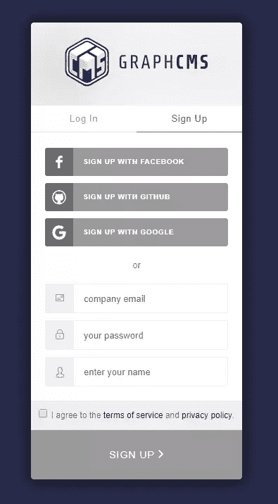

用你喜欢的方式注册。一旦您完成了帐户认证和验证过程，您应该能够访问主控制面板。

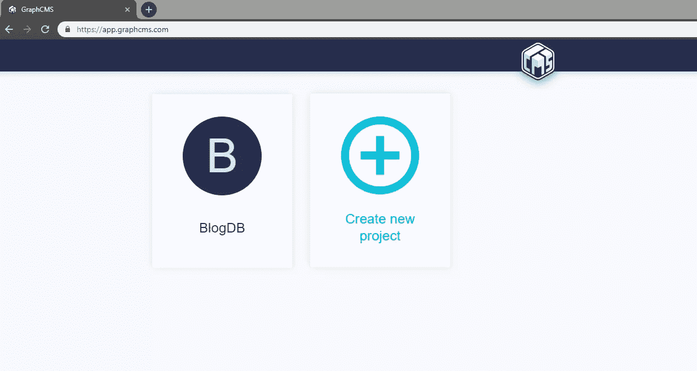

在上面的例子中，我已经创建了一个名为“BlogDB”的项目。继续创建一个新的，你想怎么叫都行。输入名称后，您可以保留其余字段的默认值。点击*创建*，你将被带到他们的项目计划。

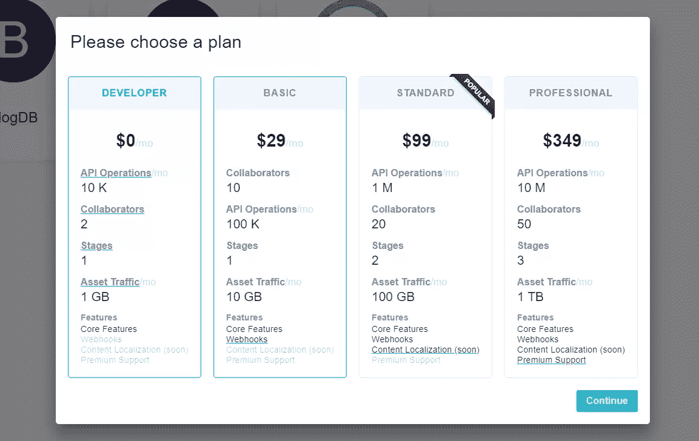

出于本教程的目的，选择免费开发者计划，然后点击*继续*。您将被带到项目的仪表板，它看起来像这样:

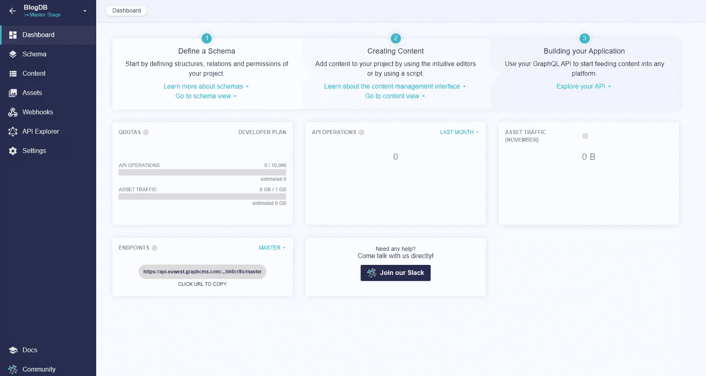

转到*模式*选项卡。我们将创建以下模型，每个模型包含以下字段:

**类别**

*   名称:单行文本，必需，唯一

**发帖**

*   slug:单行文本，必需，唯一
*   标题:单行文本，必需，唯一
*   内容:多行文本

**评论**

*   名称:单行文本，必需
*   消息:多行文本，必需

使用*创建模型*按钮创建模型。在右边，你会发现一个隐藏的字段面板，点击*字段*按钮激活。将适当的字段类型拖到模型的面板上。您将看到一个表单，用于填写您的字段属性。请注意底部有一个标有*高级*的粉色按钮。单击它将展开面板，为您提供更多可以启用的字段属性。

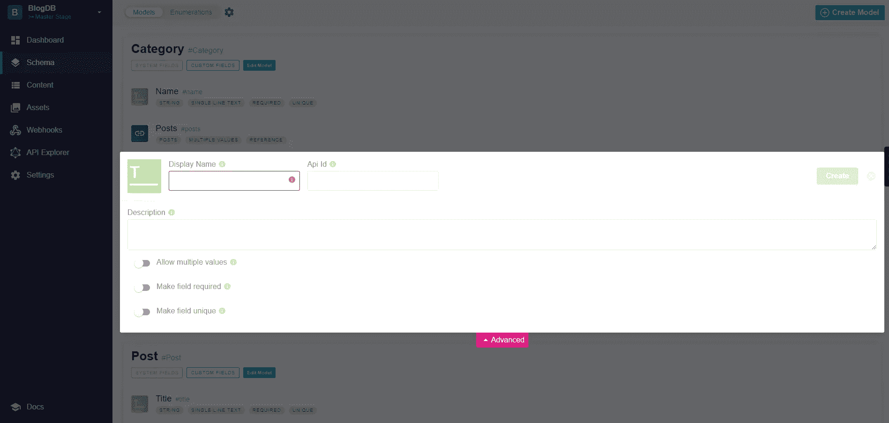

接下来，您需要添加模型之间的关系，如下所示:

*   帖子>类别(多对多)
*   帖子>评论(一对多)

使用*引用*字段定义这种关系。您可以将此字段添加到任何一侧；GraphCMS 将自动在引用的模型中创建相反的关系字段。当您完成了模型的定义后，您应该会看到这样的内容:

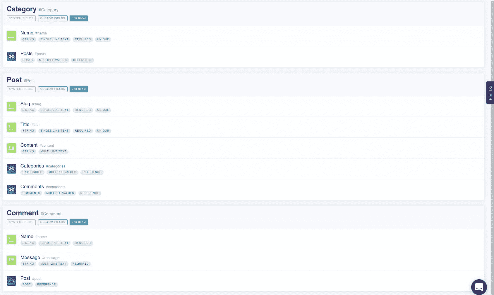

您现在已经完成了第一部分。现在让我们为我们的模型提供一些数据。

## GraphQL 数据迁移

要向您的模型添加内容，您可以简单地点击项目仪表板中的 *Content* 选项卡，在这里您可以为您的每个模型创建新的记录。然而，如果您发现这是一个很慢的方法，您会很高兴地知道，我已经创建了一个 GraphCMS 迁移工具，它可以从 CSV 文件中复制数据，并将它们上传到您的 GraphCMS 数据库。你可以在这个 [GitHub 库](https://github.com/sitepoint-editors/graphcsms-data-migration)中找到这个项目。要开始使用该项目，只需将它下载到您的工作区，如下所示:

```
git clone git@github.com:sitepoint-editors/graphcsms-data-migration.git
cd graphcsms-data-migration
npm install 
```

接下来，您需要从仪表板的*设置*页面获取 GraphCMS 项目的 API 端点和令牌。您需要创建一个新令牌。对于权限级别，使用 OPEN，因为这将允许该工具在您的 GraphCMS 数据库上执行读写操作。创建一个名为`.env`的文件，并将其放在项目的根目录下:

```
ENDPOINT=<Put api endpoint here>
TOKEN=<Put token with OPEN permission here> 
```

接下来，您可能需要将自己的 CSV 文件填充到 data 文件夹中。下面是一些已经使用过的样本数据:

```
// Categories.csv
name
Featured
Food
Fashion
Beauty

// Posts.csv
title,slug,content,categories
Food Post 1,food-post-1,Breeze through Thanksgiving by making this Instant Pot orange cranberry sauce,Food|Featured
Food Post 2,food-post-2,This is my second food post,Food
Food Post 3,food-post-3,This is my last and final food post,Food
Fashion Post 1,fashion-post-1,This is truly my very first fashion post,Fashion|Featured
Fashion Post 2,fashion-post-2,This is my second fashion post,Fashion
Fashion Post 3,fashion-post-3,This is my last and final fashion post,Fashion
Beauty Post 1,Beauty-post-1,This is truly my very first Beauty post,Beauty|Featured
Beauty Post 2,Beauty-post-2,This is my second beauty post,Beauty 
```

如果你愿意，你可以改变内容。确保不要碰到顶行，否则你会更改字段名称。请注意，对于列`categories`，我使用了竖线`|`字符作为分隔符。

要将 CSV 数据上传到 GraphCMS 数据库，请按此顺序执行以下命令:

```
npm run categories
npm run posts 
```

每个脚本将打印出成功上传的记录。我们首先上传`categories`的原因是为了让`posts`记录可以成功链接到现有的`category`记录。

如果要清理数据库，可以运行以下命令:

```
npm run reset 
```

这个脚本将删除模型的所有内容。您将得到一个报告，显示每个模型删除了多少条记录。

我希望你觉得这个工具很方便。返回仪表板，确认`Posts`和`Categories`的数据已成功上传。

考虑到后端，让我们开始构建我们的前端博客界面。

## 使用 Vue.js 构建博客的前端

如前所述，我们将构建一个由 GraphCMS 数据库后端支持的非常简单的博客应用程序。启动终端并导航到您的工作区。

如果您还没有安装 Vue CLI，现在就安装:

```
npm install -g @vue/cli 
```

然后创建一个新项目:

```
vue create vue-graphcms 
```

选择手动选择功能，然后选择以下选项:

*   功能:巴别塔，路由器
*   路由器历史模式:Y
*   仅带防错功能的 ESLint
*   保存时 Lint
*   配置文件放置:专用配置文件
*   保存预设:您的选择

项目创建过程完成后，转到项目目录并安装以下依赖项:

```
npm install bootstrap-vue axios 
```

要在我们的项目中设置`Bootstrap-Vue`，只需打开`src/main.js`并添加以下代码:

```
import BootstrapVue from "bootstrap-vue";
import "bootstrap/dist/css/bootstrap.css";
import "bootstrap-vue/dist/bootstrap-vue.css";

Vue.config.productionTip = false;
Vue.use(BootstrapVue); 
```

接下来，我们需要开始制定我们的项目结构。在`src/components`文件夹中，删除现有文件并创建以下新文件:

*   `CommentForm.vue`
*   `CommentList.vue`
*   `Post.vue`
*   `PostList.vue`

在`src/views`文件夹中，删除`About.vue`并创建一个名为`PostView.vue`的新文件。从演示中可以看出，我们将有几个类别页面，每个页面显示一个按类别过滤的帖子列表。从技术上来说，只有一个页面会根据一个活动的路由名称显示不同的帖子列表。`PostList`组件将根据当前路线过滤帖子。

让我们首先设置路线。打开`src/router.js`并用以下代码替换现有代码:

```
import Vue from "vue";
import Router from "vue-router";
import Home from "./views/Home.vue";
import Post from "./views/PostView.vue";

Vue.use(Router);

export default new Router({
  mode: "history",
  base: process.env.BASE_URL,
  linkActiveClass: "active",
  routes: [
    {
      path: "/",
      name: "Featured",
      component: Home
    },
    {
      path: "/food",
      name: "Food",
      component: Home
    },
    {
      path: "/fashion",
      name: "Fashion",
      component: Home
    },
    {
      path: "/beauty",
      name: "Beauty",
      component: Home
    },
    {
      path: "/post/:slug",
      name: "Post",
      component: Post
    }
  ]
}); 
```

现在我们有了路线，让我们设置导航菜单。打开`src/App.vue`并用以下代码替换现有代码:

```
<template>
  <div id="app">
    <b-navbar toggleable="md" type="dark" variant="info">
      <b-navbar-toggle target="nav_collapse"></b-navbar-toggle>
      <b-navbar-brand href="#">GraphCMS Vue</b-navbar-brand>
      <b-collapse is-nav id="nav_collapse">
        <b-navbar-nav>
          <router-link  class="nav-link" to="/" exact>Home</router-link>
          <router-link  class="nav-link" to="/food">Food</router-link>
          <router-link  class="nav-link" to="/fashion">Fashion</router-link>
          <router-link  class="nav-link" to="/beauty">Beauty</router-link>
        </b-navbar-nav>
      </b-collapse>
    </b-navbar>

    <b-container>
      <router-view/>
    </b-container>
  </div>
</template> 
```

这将在我们网站的顶部添加一个导航栏，链接到我们不同的类别。

保存文件并相应地更新以下文件:

**src/views/Home.vue**

```
<template>
  <div class="home">
    <PostList />
  </div>
</template>

<script>
import PostList from "@/components/PostList.vue";

export default {
  name: "home",
  components: {
    PostList
  }
};
</script> 
```

**src/components/postlist . vue**

```
<template>
  <section class="post-list">
    <h1>{{ category }} Articles</h1>
    <hr/>
    <p>Put list of posts here!</p>
  </section>
</template>

<script>
export default {
  name: "PostList",
  data() {
    return {
      category: ""
    };
  },
  created() {
    this.category = this.$route.name;
  },
  watch: {
    $route() {
      this.category = this.$route.name;
    }
  }
};
</script> 
```

注意，在`PostList`组件中，我们使用一个定制的[观察器](https://it.vuejs.org/v2/guide/computed.html#Watchers)来根据我们当前的 URL 更新我们的`category`数据属性。

现在，我们准备执行一个快速测试，以确认路由工作正常。使用命令`npm run serve`启动 Vue.js 服务器。在 [localhost:8080](http://localhost:8080) 打开浏览器，测试每个导航链接。`category`属性应该输出我们在 route name 属性中定义的相同值。

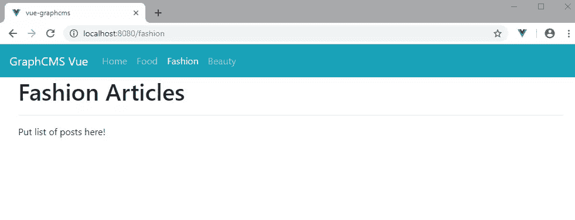

## 从 GraphCMS 提取数据

现在我们已经有了路由代码，让我们看看如何从 GraphCMS 后端获取信息。在项目的根目录下，创建一个`env.local`文件，并用以下字段的值填充它:

```
VUE_APP_ENDPOINT=
VUE_APP_TOKEN= 
```

请注意，Vue.js 单页应用程序只加载以`VUE_APP`开头的自定义环境变量。您可以从 GraphCMS 仪表板设置页面中找到 API 端点和令牌。对于令牌，请确保创建一个具有 OPEN 权限的令牌，因为这将允许读写操作。接下来，创建文件`src/graphcms.js`并复制以下代码:

```
import axios from "axios";

export const ENDPOINT = process.env.VUE_APP_ENDPOINT;
const TOKEN = process.env.VUE_APP_TOKEN;

const headers = {
  "Content-Type": "application/json",
  Authorization: `Bearer ${TOKEN}`
};

export const apiClient = axios.create({
  headers
});

export const POSTS_BY_CATEGORY_QUERY = `
  query PostsByCategory($category: String!){
    category(where: {
      name: $category
    }
    ){
      name,
      posts {
        id
        slug
        title
        content
        categories {
          name
        }
      }
    }
  }
`;

export const POST_BY_SLUG_QUERY = `
  query PostBySlug($slug: String!){
    post(where: {
      slug: $slug
    })
    {
      id
      title
      content
      categories {
        name
      }
      comments {
        name
        message
      }
    }
  }
`;

export const CREATE_COMMENT_MUTATION = `
  mutation CreateComment($post: PostWhereUniqueInput!, $name: String!, $message: String!){
    createComment(data: {
      name: $name,
      message: $message,
      post: {
        connect: $post
      },
      status: PUBLISHED
    })
    {
      id
      name
      message
    }
  }
`; 
```

我们刚刚创建的这个助手文件提供了两个主要功能:

*   它创建了一个 axios 实例，该实例被配置为执行对 GraphCMS 后端的授权请求。
*   它包含这个项目中使用的 GraphQL 查询和变异。它们负责获取帖子(按类别或按 slug)，以及创建新的评论。如果你想了解更多关于 GraphQL 查询和变异的信息，请查阅 GraphQL 文档。

您还可以使用项目仪表板中的 API explorer 来测试这些查询和变化。为此，从上面的代码中复制查询或变异，并将其粘贴到 API explorer 的顶部窗口中。在下面的窗口中输入任何查询变量，然后点击*播放*按钮。您应该会在右侧的新窗格中看到结果。

下面是一个查询示例:

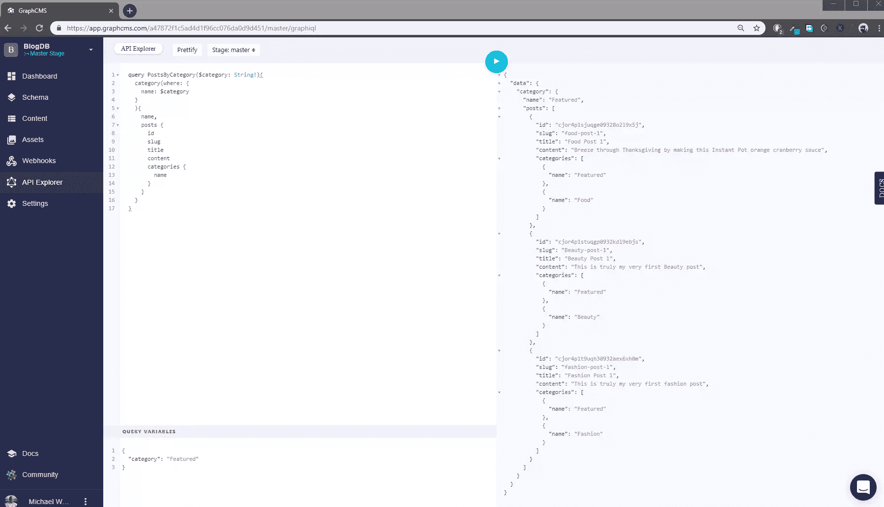

这里有一个突变的例子:

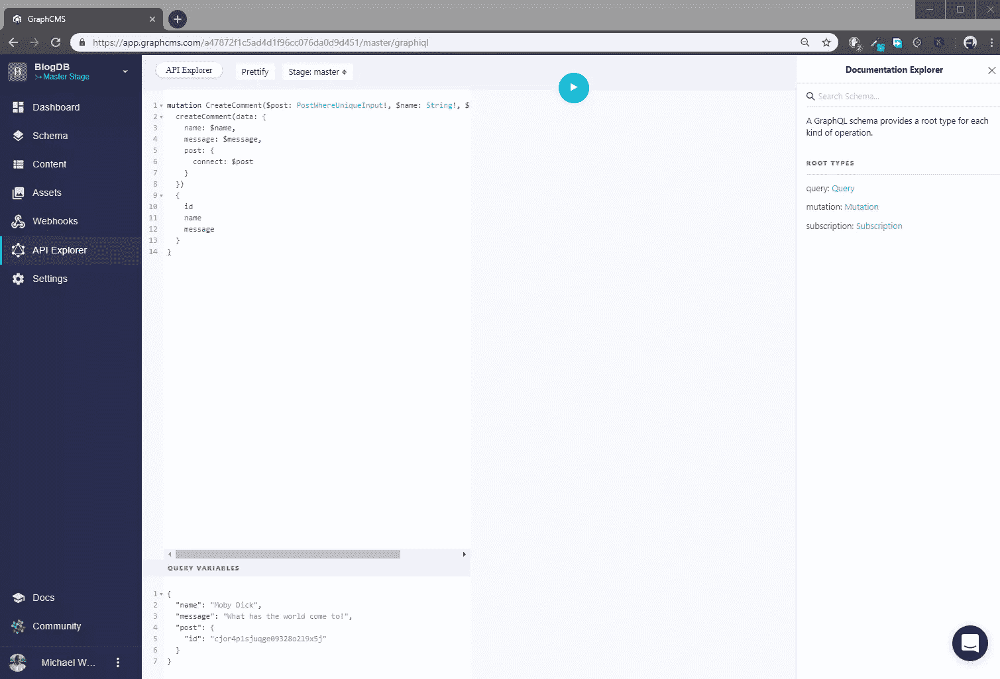

## 在模板中显示数据

现在，让我们在`src/components/PostList.vue`中创建一个 HTML 模板，以简洁的方式显示帖子列表。我们还将添加 axios 代码，该代码将从我们的 GraphCMS 数据库中获取`posts`数据:

```
<template>
  <section class="post-list">
    <h1>{{ category }} Articles</h1>
    <hr/>
    <b-row v-if="loading">
      <b-col class="text-center">
        <div class="lds-dual-ring"></div>
      </b-col>
    </b-row>
    <div v-if="!loading" >
      <b-card tag="article" v-for="post in posts" :key="post.id" :title="post.title" :sub-title="post.categories.map(cat => cat.name).toString()">
        <p class="card-text">
          {{ post.content }}
        </p>
        <router-link class="btn btn-primary" :to="'post/' + post.slug">
          Read Post
        </router-link>
      </b-card>
    </div>
  </section>
</template>

<script>
import { ENDPOINT, apiClient, POSTS_BY_CATEGORY_QUERY } from "../graphcms.js";

export default {
  name: "PostList",
  data() {
    return {
      category: "",
      loading: false,
      posts: []
    };
  },
  methods: {
    async fetchPosts() {
      try {
        this.loading = true;
        const response = await apiClient.post(ENDPOINT, {
          query: POSTS_BY_CATEGORY_QUERY,
          variables: {
            category: this.category
          }
        });

        const body = await response.data.data;
        this.posts = await body.category.posts;
        this.loading = false;
      } catch (error) {
        console.log(error);
      }
    }
  },
  created() {
    this.category = this.$route.name;
    this.fetchPosts();
  },
  watch: {
    $route() {
      this.category = this.$route.name;
      this.posts = [];
      this.fetchPosts();
    }
  }
};
</script>

<style>
h1{
  margin-top: 25px !important;
}
.lds-dual-ring {
  display: inline-block;
  width: 64px;
  height: 64px;
}
.lds-dual-ring:after {
  content: " ";
  display: block;
  width: 46px;
  height: 46px;
  margin: 1px;
  border-radius: 50%;
  border: 5px solid #ccc;
  border-color: #ccc transparent #ccc transparent;
  animation: lds-dual-ring 1.2s linear infinite;
}
@keyframes lds-dual-ring {
  0% {
    transform: rotate(0deg);
  }
  100% {
    transform: rotate(360deg);
  }
}
</style> 
```

让我们快速浏览一下代码的主要特性:

*   **加载**。当发出一个请求时，会显示一个 loading 微调器，向用户表明正在进行中。当请求被满足时，loading 微调器被一个 posts 列表所取代。
*   **查询**。为了按类别获得帖子列表，我发现查询类别更容易，然后使用类别到帖子的关系来访问过滤后的帖子。
*   **创造了**。当页面第一次加载时，从`created`生命周期钩子中调用`fetchPosts()`函数。
*   **观看**。当路由 URL 改变时，每次都会调用`fetchPosts()`函数。

完成这些更改后，您现在应该有以下视图:

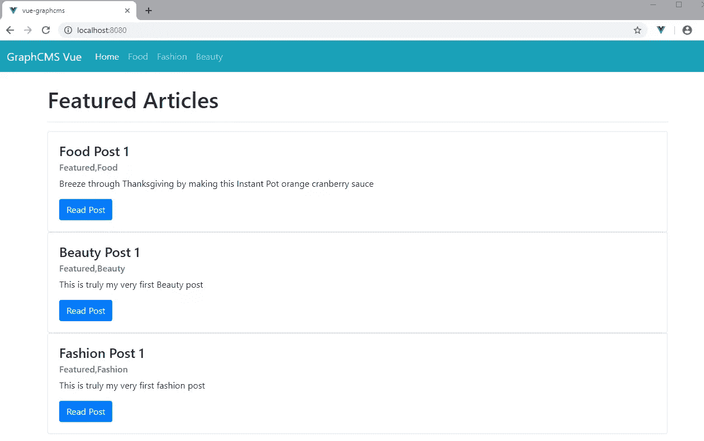

## 显示单个帖子

确保顶部主导航按预期工作。现在让我们来研究一下`Post`组件。它将有自己的`fetchPost()`函数，通过`slug`进行查询。如果您想知道`slug`参数来自哪里，让我提醒您我们放在`router.js`中的这段代码:

```
//...
{
  path: '/post/:slug',
  name: 'Post',
  component: Post
},
//... 
```

这表明 URL 中在`/post/`之后的任何内容在组件中都可以作为`this.$route.params.slug`使用。

`post`组件是`CommentForm`和`CommentList`组件的父组件。`comments`数据将作为道具从帖子记录传递给`CommentList`组件。现在让我们插入`src/components/CommentList.vue`的代码:

```
<template>
  <section class="comment-list">
    <hr/>
    <h4 class="text-muted">Comments</h4>
    <b-card v-for="comment in comments" :title="comment.name" title-tag="h5" :key="comment.id">
      <p class="card-text text-muted">{{ comment.message }}  </p>
    </b-card>
    <p v-if="comments.length === 0" class="text-center text-muted">No comments posted yet!</p>
  </section>
</template>

<script>
export default {
  name: "CommentsList",
  props: ["comments"]
};
</script> 
```

除非您已经通过 GraphCMS 仪表板手动输入了注释，否则不要期望看到任何结果。让我们向`src/components/CommentForm.vue`添加代码，使用户能够向博客文章添加评论:

```
<template>
  <section class="comment-form">
    <h4 class="text-muted">Comment Form</h4>
    <b-form @submit.prevent="onSubmit">
      <b-form-group label="Name">
        <b-form-input id="input-name" type="text" v-model="name" placeholder="Enter your name" required></b-form-input>
      </b-form-group>
       <b-form-group label="Message">
         <b-form-textarea id="input-message" v-model="message" placeholder="Enter your comment" :rows="3" :max-rows="6" required>
         </b-form-textarea>
      </b-form-group>
      <b-button type="submit" variant="primary">Submit</b-button>
    </b-form>
  </section>
</template>

<script>
import { apiClient, ENDPOINT, CREATE_COMMENT_MUTATION } from "../graphcms.js";

export default {
  name: "CommentForm",
  props: ["post"],
  data() {
    return {
      name: "",
      message: ""
    };
  },
  methods: {
    async onSubmit() {
      const formattedComment = {
        name: this.name,
        message: this.message,
        post: {
          id: this.post.id
        }
      };
      try {
        const response = await apiClient.post(ENDPOINT, {
          query: CREATE_COMMENT_MUTATION,
          variables: formattedComment
        });

        const body = await response.data.data;
        const newComment = body.createComment;
        this.post.comments.push(newComment);
        this.name = "";
        this.message = "";
      } catch (error) {
        console.log(error);
      }
    }
  }
};
</script>

<style>
  .comment-form {
    margin-top: 35px;
  }
</style> 
```

我们现在有了一个基本的评论表单，可以向我们的 GraphQL 后端系统提交新的评论。一旦保存了新的注释，我们将获取返回的对象并将其添加到`post.comments`数组中。这应该会触发`CommentList`组件来显示新添加的`Comment`。

现在让我们构建`src/components/Post.vue`组件:

```
<template>
  <section class="post">
    <b-row v-if="loading">
      <b-col>
        <div class="lds-dual-ring text-center"></div>
      </b-col>
    </b-row>
   <b-row v-if="!loading">
     <b-col>
      <h1>{{post.title}}</h1>
      <h4 class="text-muted">{{post.categories.map(cat => cat.name).toString()}}</h4>
      <hr>
      <p>{{ post.content }}</p>
     </b-col>
   </b-row>
   <!-- List of comments -->
   <b-row v-if="!loading">
     <b-col>
       <CommentList :comments="post.comments" />
     </b-col>
   </b-row>
   <!-- Comment form -->
    <b-row v-if="!loading">
     <b-col>
      <CommentForm :post="post" />
     </b-col>
   </b-row>
  </section>
</template>

<script>
import { ENDPOINT, apiClient, POST_BY_SLUG_QUERY } from "../graphcms.js";
import CommentList from "@/components/CommentList";
import CommentForm from "@/components/CommentForm";

export default {
  name: "Post",
  components: {
    CommentList,
    CommentForm
  },
  data() {
    return {
      loading: false,
      slug: "",
      post: {}
    };
  },
  methods: {
    async fetchPost() {
      try {
        this.loading = true;
        const response = await apiClient.post(ENDPOINT, {
          query: POST_BY_SLUG_QUERY,
          variables: {
            slug: this.slug
          }
        });

        const body = await response.data.data;
        this.post = body.post;
        this.loading = false;
      } catch (error) {
        console.log(error);
      }
    }
  },
  created() {
    this.slug = this.$route.params.slug;
    this.fetchPost();
  }
};
</script> 
```

最后，这里是`src/views/PostView.vue`将一切联系在一起的代码:

```
<template>
  <div class="post-view">
    <Post/>
  </div>
</template>

<script>
import Post from "@/components/Post.vue";

export default {
  name: "PostView",
  components: {
    Post
  }
};
</script> 
```

现在，您应该对帖子有了以下视图。注意 URL `localhost:8080/post/fashion-post-1`末尾的`:slug`:

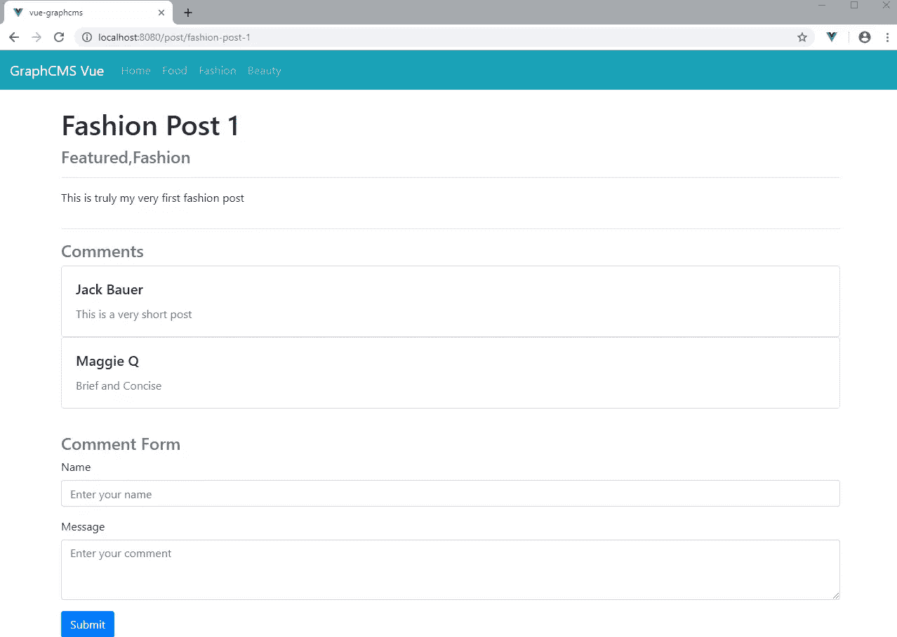

在上面的例子中，我添加了一些注释来测试新特性。确保你也这样做。

## 摘要

我希望您已经看到了使用 Vue.js 和 GraphQL 构建一个博客网站是多么容易。如果你使用普通的 PHP 和 MySQL，你会写更多的代码。即使使用 PHP 框架，您仍然需要为一个简单的博客应用程序编写更多的代码。

为了这篇教程，我不得不尽可能保持简单。你可能会注意到，这个博客项目甚至远没有达到一个简约的博客设置。有几件事我们还没有解决，比如错误处理、表单验证和缓存。对于最后一点，我推荐 [Apollo Client](https://www.npmjs.com/package/apollo-client) ，因为它有缓存 GraphQL 查询结果的机制。当然，还需要一个作者模型，以及一个支持认证和消息批准的合适的评论系统。

如果你准备好了，请继续前进，让这个简单的 Vue.js GraphCMS 博客更进一步。

## 分享这篇文章