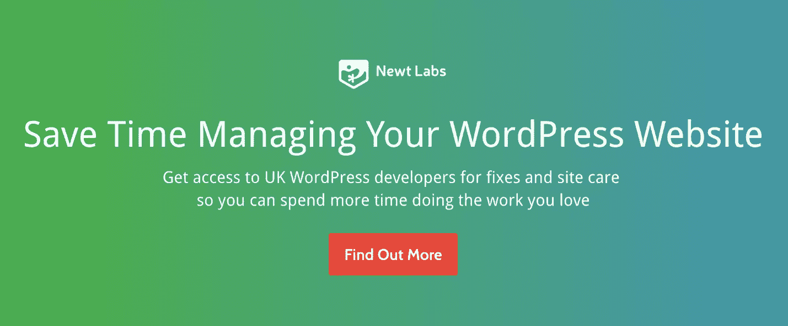
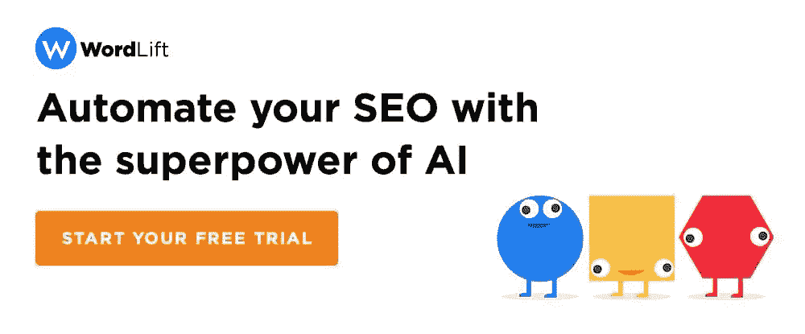

# 2019 年你可以使用的 5 大 WordPress 工具和服务

> 原文：<https://www.sitepoint.com/5-top-wordpress-tools-and-services-for-you-to-use-in-2019/>

*这篇赞助文章由我们的内容合作伙伴 [BAW 媒体](https://bawmedia.com)创作。感谢您对使 SitePoint 成为可能的合作伙伴的支持。*

如果你正在寻找最好的 WordPress 工具和服务，让你的业务在今年更上一层楼，你有足够的选择——确切地说，有 54，991 个 WordPress 插件和服务。

这听起来确实是个好消息，直到是时候为你的网站建设项目找到合适的匹配了。你需要一个游戏计划来定义你想要的插件，使你的网站能够吸引访问者。

你还需要一个游戏计划来进行可能会非常冗长乏味的搜索。

通过查看下面列出的必备 WordPress 工具和服务，你可以节省很多时间和麻烦——其中一个或多个可能就是你所需要的。

## 1.[元素或](https://elementor.com/?utm_source=sitepoint.com&utm_medium=pr&utm_campaign=bawmedia)

Elementor 拥有快速而强大的拖放编辑器，让你无需任何编码就能创建 WordPress 登录页面和站点。这一点和它的其他几个特点结合起来，使 Elementor 成为当今市场上最先进的 WordPress 页面生成器。

Elementor 可以处理任何主题，这样做可以避免一些主题对网页设计者的约束和限制。Elementor 还可以与任何 WordPress 插件一起工作，而不会降低你网站的速度，这个工具干净整洁的代码也有助于你网站的整体性能。

您可以在 Elementor 或使用其大量选择的小部件从头开始构建您的网站，或者您可以从数百个预设计的模板中进行选择，这些模板可以插入到任何页面中，以快速启动或加快您的工作流程。

如果你只能在这个列表中选择一个，你可能会选择元素或元素。幸运的是，您没有受到限制，所以也可以随意选择剩余的 5 个工具和服务中的任意一个或全部。

## 2. [Brizy WordPress 网站构建器](https://www.brizy.io/?utm_source=articles&utm_medium=referrer&utm_campaign=baw_06_2019)

Brizy WordPress 网站生成器是另一个工具，可以解决你的大部分设计问题。这个拖放式的网站构建器非常容易使用，不需要任何编码或编码技能，你不用花一分钱就可以开始使用它。

需要一个快速启动并运行的网站？Brizy 的 240 个设计模块、150 个布局和 16 个弹出窗口将带你走很长一段路，特别是如果你发现从头开始创建一个网站有点吓人。

至于你的网站设计的更详细的方面，Brizy 包包括 4000 个免费图标，如果你想创建一个独特的弹出设计，还有一个弹出生成器，以及容易改变的字体和配色方案。

另一个很酷的功能是，你可以轻松控制你的网站在平板电脑和移动设备上的显示方式。

## 3. [WordPress 网站关怀](https://newtlabs.co.uk/?utm_source=baw&utm_medium=articles&utm_campaign=top_10_wordpress_tools_services)

如果你手头有合适的工具，在 WordPress 上创建一个网站可以简单高效地完成。一旦一个网站建立并运行，你通常可以毫不费力地维护它。然而，情况并非总是如此，尤其是如果你负责保持多个网站的更新和正常运行。

让 Newt Labs 负责管理和维护你的 WordPress 网站，这样你就可以花时间做你最喜欢做的事情——建立一个又一个高性能、令客户满意的网站。

Newt Labs 团队可以帮助你进行小的修复、管理 WordPress 更新、提供备份、WordPress 优化的云托管等等。

他们提供的 WordPress 网站服务不仅会让你的工作生活变得更轻松，还会在潜在问题变成现实之前解决它们，从而保护你的声誉。

## 4.[好东西](https://goodiewebsite.com/?utm_source=sitepoint.com&utm_medium=content&utm_campaign=wptools)

Goodie 平台将最终客户与开发人员直接连接起来，使他们能够避免中间人的介入，这种介入有时可能是昂贵、耗时的，或者是在试图将设计准确地转换为代码时的通信瓶颈。Goodie 可以以 999 美元的特价完全编码你的网站。

Goodie 唯一需要你的是你的设计——一个为需要精心编码网站的小企业提供的伟大解决方案。

## 5.[提词](https://wordlift.io/ai-powered-seo/?utm_source=baw)

WordLift 是第一个使用人工智能进行 SEO 的 WordPress 插件。它通过创建机器友好的内容来增加网站的有机流量，聊天机器人、搜索爬虫和个人数字助理如谷歌助理、Siri 和 Alexa 使用这些内容来帮助消费者采取行动。

WordLift 增加了一层元数据，并构建了一个知识图，谷歌用它来匹配搜索者的意图。此外，它根据每个主题的流量来衡量内容表现，并以这种方式帮助编辑改善他们的编辑计划，增加他们的覆盖面。

## 使你的 WordPress 站点安全的提示

### 选择一个好的托管公司

不要试图选择廉价的主机提供商。选择一款提供多层安全保护的产品，可以让您免于以后丢失或重定向数据的噩梦。

### 安装一个 WordPress 安全插件

安装一个 WordPress 安全插件 24/7 监控你的站点并检查站点安全问题比你自己定期进行站点安全检查要容易得多，尤其是如果你缺乏开发技能的话。

### 定期更新 WordPress

每当 WordPress 被更新时，都会有改进，错误被消除，安全性被提高。如果你不定期更新，其中一些病毒可能会咬你。要更新 WordPress，请访问仪表板，查看是否发布了新版本。如果是，点击更新，然后点击*立即更新*按钮。

### 定期备份您的网站

这一切都是关于创建一个你的网站的所有数据的副本，并将其存储在一个安全的地方。通过这样做，如果发生任何不好的事情，您将能够从您的备份副本中恢复站点。

## 结论

9 项价值-5 项顶级工具和服务以及 4 项操作和维护技巧。选择一个或多个工具和服务，在完成你的网站时按照提示去做，你应该会有很好的状态。

您可以自己(或在开发人员的帮助下)构建高性能的网站，一个可靠的安全和维护程序应该结合起来，使您的生活轻松许多。

## 分享这篇文章