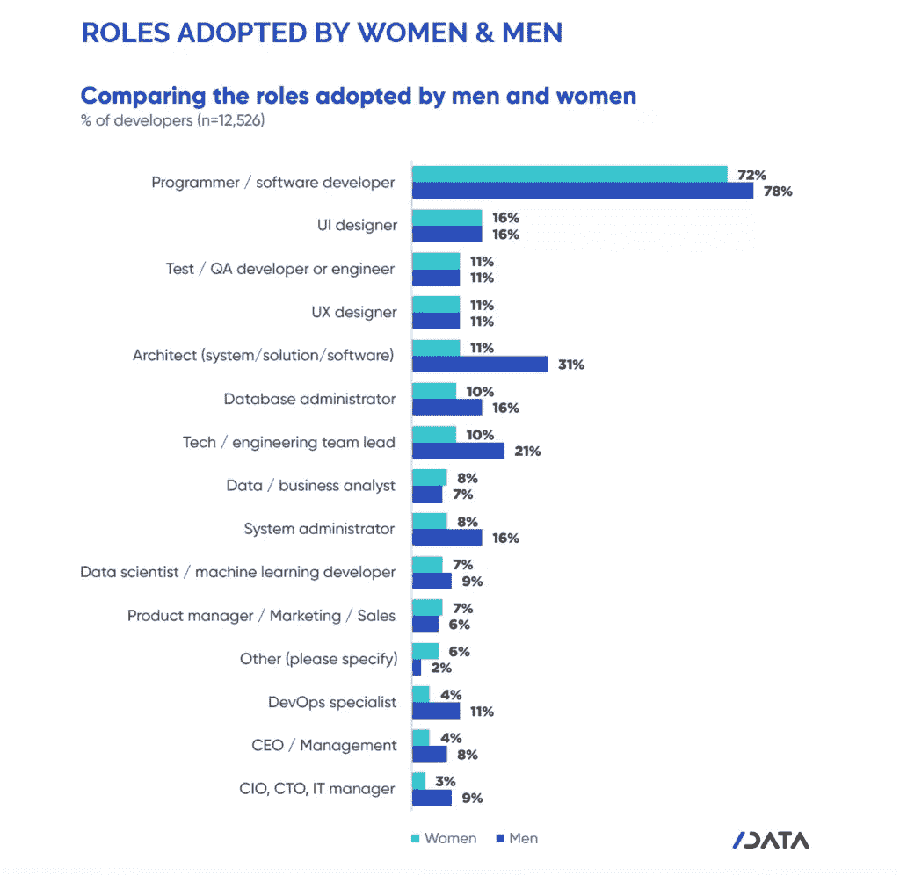
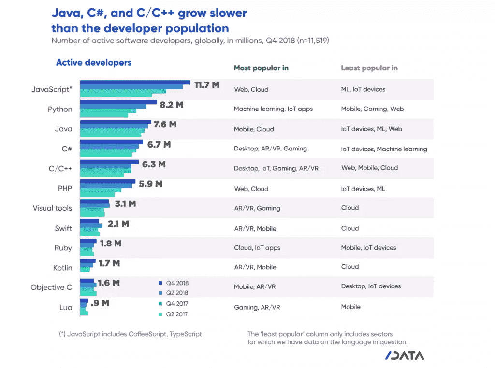

# 千禧一代女性在科技领域的崛起只是一种幻觉吗？

> 原文：<https://www.sitepoint.com/rise-of-younger-women-in-tech/>

*本文是与[开发商经济调查](https://developereconomics.net?member_id=sitepoint&lang=en)合作创作的。感谢您对使 SitePoint 成为可能的合作伙伴的支持。希望与 SitePoint 合作？在这里获得[更多信息。](https://www.sitepoint.com/advertise/)*

最新的[开发者经济调查](https://developereconomics.net?member_id=sitepoint&lang=en)又来了，一如既往，我们强烈建议每个人都参与进来。这是一个很好的机会来表达你对 web 开发世界中正在发生的事情的看法，并且它有助于描绘一幅有凝聚力的图景。

在 2019 年 4 月发布的[最后一次调查](https://slashdata-website-cms.s3.amazonaws.com/sample_reports/ZAamt00SbUZKwB9j.pdf)中，我们收集了许多关于现代发展在工作中的有趣见解。在上次调查的参与者中，9%是女性，这表明全球女性开发人员有 170 万，而男性有 1700 万。然而，该报告还发现，在 35 岁以下的开发人员中，36%是女性，而男性为 33%。相比之下，该调查的另一项发现是，37%的男性开发人员年龄超过 35 岁，而同一年龄段的女性只有 29%。这表明年轻一代的妇女正越来越多地走向职业发展。希望在接下来的几年里，我们将开始在更高级的职位上看到男女开发人员的平等。目前，男性担任高级或首席执行官职位的可能性几乎是女性的三倍。

然而，正如该报告也指出的那样，对数据的一个不太乐观的解读可能是，女性“一直都在参与，但随着年龄的增长，她们倾向于离开软件开发，无论是出于选择还是出于需要。”

来源:开发商经济学:开发商国家状况，第 16 版

4 月份调查的另一个有趣但最终并不令人惊讶的发现是，工作开发人员最受欢迎的学习方法是自学，尽管这方面的正式教育课程数量激增。这预示着流行文化中一个科技神童的形象，他学会了独自成为一个“电脑语者”。虽然这是一个受欢迎的、公认的行业酷形象，但现实是，大多数在职开发人员仍然严重依赖在线课程材料进行学习，并且由于行业不断变化的性质，他们还“在整个[长期]职业生涯中参与持续教育”，以跟上时代并保持相关性。

这一趋势实际上与我们在 SitePoint 的发现一致。最近对我们的 [SitePoint Premium](https://www.sitepoint.com/premium/?utm_source=blog&utm_medium=slashdata&utm_campaign=article1) 成员的一项调查显示，工作和就业是开发人员加入像我们这样的学习平台的主要原因，以了解最新的语言和平台。虽然工作保障不是用户关注的主要问题，但职业发展和确保他们在下一份工作中保持相关性和竞争力才是。

那么应该学习哪种编程语言才能留在游戏中呢？就在 2019 年 4 月，调查发现 JavaScript 仍是使用最广泛的编程语言，拥有 1170 万开发者社区。Python 拥有 820 万活跃开发者，受欢迎程度已经超过 Java，但仍然是 JavaScript 的伴娘……至少目前是这样。

来源:开发商经济学:开发商国家状况，第 16 版

## 分享这篇文章