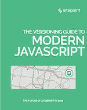
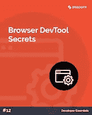
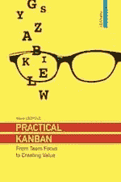

# SitePoint Premium 新版本:现代 JavaScript、看板+开发工具

> 原文：<https://www.sitepoint.com/sitepoint-premium-new-releases-modern-javascript-kanban-devtools/>

我们正努力通过 SitePoint Premium 让您在自己的领域保持领先地位。我们有很多新书可以在图书馆借阅——让我们给你介绍一下。

## 现代 JavaScript 版本指南

这是一个关于现代 JavaScript 广度的指南，包括框架、状态管理、GraphQL、节点、电子、设计模式、工具、测试等等。

➤阅读了现代 JavaScript 版本指南。

## 浏览器开发工具的秘密

浏览器开发工具已经从基本的控制台发展到完全集成的开发环境。改变和检查 web 应用程序的任何方面已经变得可能，但是很少有人敢于超越基础。在本指南中，我们将探索您可能没有考虑到的功能。

➤阅读了浏览器开发工具的秘密。

## 实用看板

这本书将为你提供这些问题的实际答案:我们正在正确地使用看板吗？我们如何改进看板？我们如何扩展看板？我们的工作如何变得更可预测？如何才能分清轻重缓急？

➤阅读[实用看板](https://www.sitepoint.com/premium/books/practical-kanban/read?utm_source=blog&utm_medium=articles)。

## 还会有更多…

我们几乎每天都在 SitePoint Premium 上发布新内容，所以下周我们将带着最新更新回来。别忘了:如果你还没有查看我们的产品，可以去我们的[图书馆转转](https://www.sitepoint.com/?utm_source=blog&utm_medium=articles)。

## 分享这篇文章