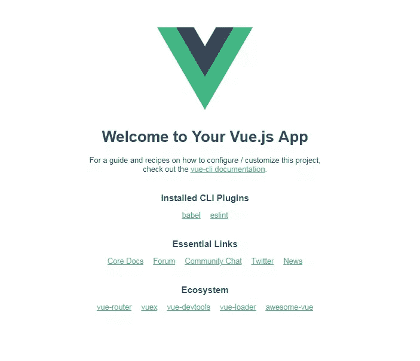
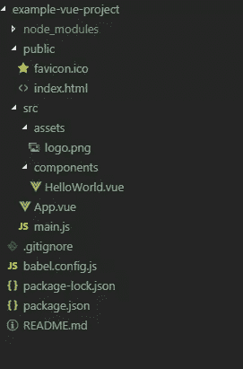
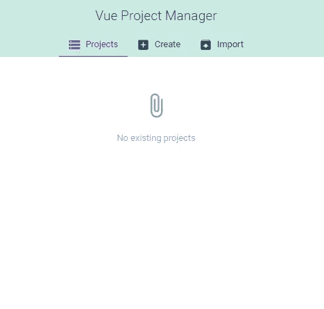
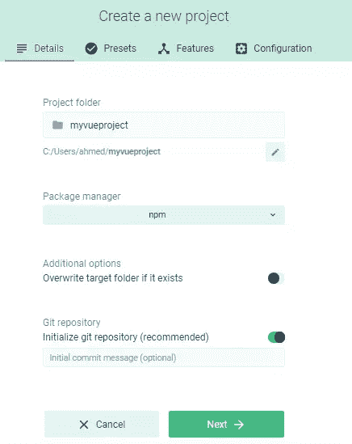
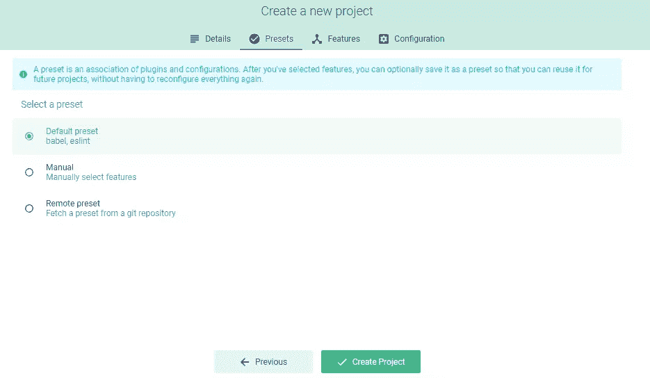
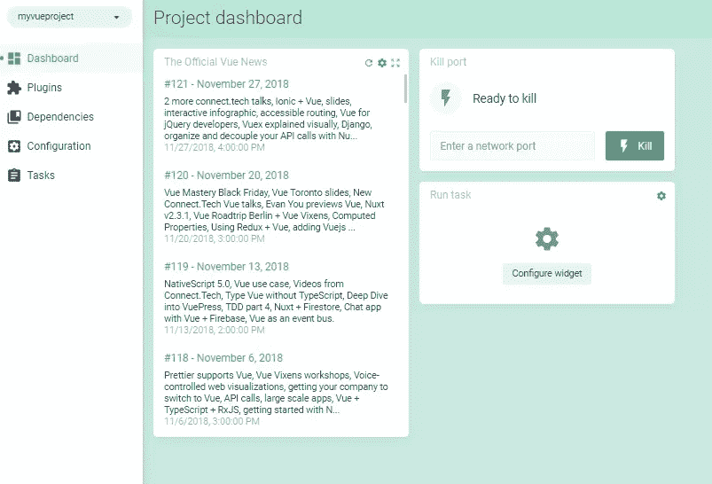
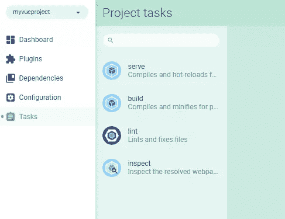
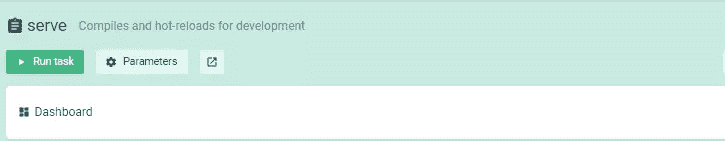
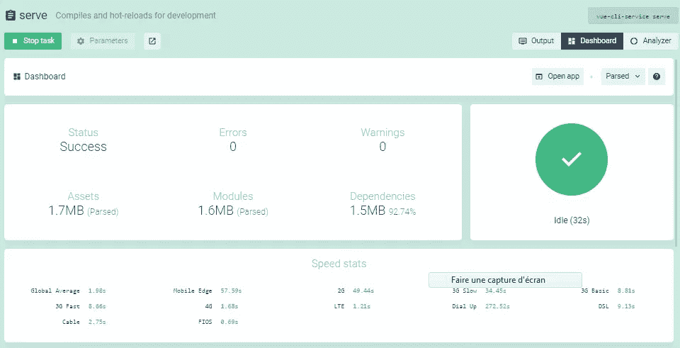

# Vue CLI 初学者指南

> 原文:# t0]https://www . site point . com/view-CLI-intro/

当构建一个新的 Vue 应用程序时，快速启动并运行的最佳方式是使用 [Vue CLI](https://cli.vuejs.org/) 。这是一个命令行实用程序，允许您从一系列构建工具中进行选择，然后它会为您安装和配置这些工具。它还将为您的项目搭建支架，为您提供一个可以构建的预配置起点，而不是从头开始。

Vue CLI 的最新版本是版本 3。它为 Vue 开发者提供了新的体验，帮助他们开始开发 Vue 应用，而无需处理 webpack 等工具的复杂配置。同时，它可以配置和扩展插件，用于高级用例。

Vue CLI v3 是用于快速 Vue.js 开发和原型制作的完整系统。它由不同的组件组成，如 [CLI 服务](https://cli.vuejs.org/guide/cli-service.html)、 [CLI 插件](https://cli.vuejs.org/guide/plugins-and-presets.html#plugins)和最近的 [web UI](https://cli.vuejs.org/guide/creating-a-project.html#using-the-gui) ，它允许开发者通过一个易于使用的界面执行任务。

在整篇文章中，我将介绍 Vue CLI 的最新版本及其新特性。我将演示如何安装最新版本的 Vue CLI，以及如何创建、服务和构建一个示例项目。

*想从头学起 Vue.js？这篇文章是从我们的优质图书馆摘录的。使用 SitePoint Premium 获得涵盖基础知识、项目、技巧和工具&的 Vue 书籍全集。[现在就加入，每月仅需 9 美元](https://www.sitepoint.com/premium/products/Z2lkOi8vbGVhcm5hYmxlL1Byb2R1Y3QvMzA3?utm_source=blog&utm_medium=articles)。*

## Vue CLI v3 安装和要求

在本节中，我们将了解 Vue CLI v3 的要求以及如何安装它。

### 要求

先说要求。Vue CLI v3 需要 Node.js 8.9+，但建议使用 v8.11.0+。

您可以通过多种方式安装 Node.js 的最新版本:

*   通过从[官方网站](https://nodejs.org)为你的系统下载二进制文件。
*   通过为你的系统使用官方的软件包管理器。
*   使用版本管理器。这可能是最简单的方法，因为它允许您在同一台机器上管理 Node 的多个版本。如果您想了解关于这种方法的更多信息，请参阅我们的快速提示[使用 nvm](https://www.sitepoint.com/quick-tip-multiple-versions-node-nvm/) 安装 Node.js 的多个版本。

Vue 的创建者尤雨溪将 CLI 第 3 版描述为与其前身“完全不同的怪兽”。因此，在继续学习本教程之前，卸载任何早期版本的 CLI(即 2.x.x)非常重要。

如果您的系统上全局安装了`vue-cli`包，您可以通过运行以下命令来删除它:

```
npm uninstall vue-cli -g 
```

### 安装 Vue CLI v3

现在，您只需从终端运行以下命令，即可安装 Vue CLI v3:

```
npm install -g @vue/cli 
```

*注意:如果您发现自己需要在 macOS 或基于 Debian 的系统中的命令前添加`sudo`，或者在 Windows 中使用管理员 CMD 提示符来全局安装软件包，那么您应该修改您的权限。npm 网站有[关于如何做这个的指南](https://docs.npmjs.com/resolving-eacces-permissions-errors-when-installing-packages-globally)，或者仅仅使用一个版本管理器，你就可以完全避免这个问题。*

成功安装 CLI 后，您将能够在终端中访问`vue`可执行文件。

例如，您可以通过执行`vue`命令来列出所有可用的命令:

```
vue 
```

您可以通过运行以下命令来检查您已安装的版本:

```
vue --version
$ 3.2.1 
```

## 创建 Vue 项目

安装 Vue CLI 后，现在让我们看看如何使用它，通过现代前端工具集快速搭建完整的 Vue 项目。

使用 Vue CLI，您可以通过在终端中运行以下命令来创建或生成新的 Vue 应用程序:

```
vue create example-vue-project 
```

*提示:`example-vue-project`是项目的名称。显然，您可以为您的项目选择任何有效的名称。*

CLI 将提示您输入要在项目中使用的预设。一个选项是选择默认的预置，安装两个插件:Babel 用于翻译现代 JavaScript，ESLint 用于确保代码质量。或者你可以从一组官方插件中手动选择你的项目所需的特性。其中包括:

*   [巴别塔](https://github.com/vuejs/vue-cli/tree/dev/packages/@vue/cli-plugin-babel)
*   [打字稿](https://github.com/vuejs/vue-cli/tree/dev/packages/@vue/cli-plugin-typescript)
*   [渐进式网络应用支持](https://github.com/vuejs/vue-cli/tree/dev/packages/@vue/cli-plugin-pwa)
*   [检视路由器](https://github.com/vuejs/vue-router)
*   Vuex (Vue 的官方状态管理库)
*   CSS 预处理器( [PostCSS](https://postcss.org/) 、 [CSS 模块](https://github.com/css-modules/css-modules)、 [Sass](https://sass-lang.com/) 、 [Less](http://lesscss.org/) & [Stylus](http://stylus-lang.com/) )
*   使用 [ESLint](https://github.com/vuejs/vue-cli/tree/dev/packages/@vue/cli-plugin-eslint) 和[漂亮器](https://github.com/vuejs/vue-cli/tree/dev/packages/@vue/eslint-config-prettier)的棉绒/格式化器
*   使用[摩卡](https://github.com/vuejs/vue-cli/tree/dev/packages/@vue/cli-plugin-unit-mocha)或[笑话](https://github.com/vuejs/vue-cli/tree/dev/packages/@vue/cli-plugin-unit-jest)的单元测试
*   E2E 测试使用[柏树](https://github.com/vuejs/vue-cli/tree/dev/packages/@vue/cli-plugin-e2e-cypress)或者[守夜人](https://github.com/vuejs/vue-cli/tree/dev/packages/%40vue/cli-plugin-e2e-nightwatch)

无论您选择什么，CLI 都将下载适当的库并配置项目以使用它们。如果您选择手动选择功能，在提示的最后，您还可以选择将您的选择保存为预设，以便在将来的项目中重复使用。

现在让我们看看为项目服务的其他脚本(使用 webpack 开发服务器和热模块重载)以及为生产构建项目。

在项目文件夹中导航:

```
cd example-vue-project 
```

接下来，运行以下命令在本地服务您的项目:

```
npm run serve 
```

该命令将允许您从 [http://localhost:8080](http://localhost:8080) 地址运行本地开发服务器。如果您使用 web 浏览器导航到此地址，您应该会看到以下页面:



开发服务器支持像热代码重载这样的特性，这意味着您不需要在每次对项目源代码进行任何更改时停止和启动服务器。它甚至会保存你的应用程序的状态！

当您完成项目开发后，您可以使用下面的命令来构建一个产品包:

```
npm run build 
```

这会将所有内容输出到项目中的一个`dist`文件夹中。你可以[在这里](https://cli.vuejs.org/guide/deployment.html)阅读更多关于部署的信息。

### 什么是 Vue CLI 服务？

[Vue CLI 服务](https://cli.vuejs.org/guide/cli-service.html)是一个运行时依赖项(`@vue/cli-service`)，它抽象 webpack 并提供默认配置。它可以升级，配置和扩展插件。

它提供了多个用于处理 Vue 项目的脚本，比如`serve`、`build`和`inspect`脚本。

我们已经看到了运行中的`serve`和`build`脚本。`inspect`脚本允许你用`vue-cli-service`检查项目中的 webpack 配置。尝试一下:

```
vue inspect 
```

如您所见，这产生了大量输出。稍后，我们将看到如何在 Vue CLI 项目中调整 webpack 配置。

### 项目剖析

使用 CLI 生成的 Vue 项目具有符合最佳实践的预定义结构。如果您选择安装任何额外的插件(如 Vue 路由器)，CLI 还将创建使用和配置这些库所需的文件。

让我们看看使用默认预设时 Vue 项目中的重要文件和文件夹。

*   `public`。该文件夹包含`index.html`和`favicon.ico`等公共文件。放在这里的任何静态资产都将被简单地复制，而不会通过 webpack。
*   `src`。该文件夹包含项目的源文件。大部分工作将在这里完成。
*   `src/assets`。该文件夹包含项目的资产，如`logo.png`。
*   `src/components`。该文件夹包含 Vue 组件。
*   `src/App.vue`。这是该项目的主要 Vue 组件。
*   `src/main.js`。这是启动 Vue 应用程序的主项目文件。
*   `babel.config.js`。这是 Babel 的配置文件。
*   `package.json`。该文件包含项目依赖项的列表，以及 ESLint、PostCSS 和支持的浏览器的配置选项。
*   `node_modules`。该文件夹包含已安装的 npm 软件包。

这是项目剖析的截图:



## CLI 插件视图

Vue CLI v3 的设计考虑了插件架构。在这一节中，我们将看看什么是插件以及如何在项目中安装它们。我们还将看看一些流行的插件，它们可以通过自动安装所需的库和进行各种设置来帮助添加高级功能，否则所有这些都必须手动完成。

### 什么是 Vue 插件

CLI 插件只是为您的 Vue 项目提供附加功能的 npm 包。`vue-cli-service`二进制文件自动解析并加载`package.json`文件中列出的所有插件。

Vue CLI 3 项目的基本配置是 webpack 和 Babel。所有其他功能都可以通过插件添加。

有 Vue 团队提供的官方插件，也有社区开发的社区插件。官方插件名称以`@vue/cli-plugin-`开头，社区插件名称以`vue-cli-plugin-`开头。

官方 Vue CLI 3 插件包括:

*   以打字打的文件
*   艾滋病患者
*   武契特
*   路由器视图
*   埃斯林特
*   单元测试等。

### 如何添加 Vue 插件

插件要么在创建项目时自动安装，要么由开发人员稍后显式安装。

在初始化项目时，您可以在项目中安装许多内置插件，并在项目的任何位置使用`vue add my-plugin`命令在项目中安装任何其他插件。

您还可以安装带有预置的插件，并将您喜爱的插件分组为可重复使用的预置，以便以后用作其他项目的基础。

### 一些有用的 Vue 插件

有许多 Vue CLI 插件，您可能会发现对您的下一个项目有用。例如， [Vuetify UI 库是作为插件](https://github.com/vuetifyjs/vue-cli-plugin-vuetify)提供的，还有[故事书](https://github.com/storybooks/vue-cli-plugin-storybook)。你也可以使用[电子构建器插件](https://github.com/nklayman/vue-cli-plugin-electron-builder)来快速搭建一个基于电子的 Vue 项目。

我还写了几个你可以使用的插件:

*   vue-cli-plugin-nuxt :一个 vue CLI 插件，用于使用 Nuxt.js 快速创建通用的 Vue 应用
*   vue-cli-plugin-bootstrap :一个 Vue CLI 插件，用于将 Bootstrap 4 添加到您的项目中

如果你想了解更多关于插件的信息，可以看看这篇关于 Vue Mastery 的文章:[为你的 Vue 项目提供 5 个 Vue CLI 3 插件](https://medium.com/vue-mastery/5-vue-cli-3-plugins-for-your-vue-project-df5af357d076)。

## webpack 呢？

webpack 由 Vue CLI 抽象出来，它提供不同的 API 来访问和修改 webpack 配置。

Vue CLI 的大多数项目配置被抽象成插件，并在运行时合并到基本配置中。但是在某些情况下，您可能想要手动调整项目的 webpack 配置。在这种情况下，您可以:

*   在您的项目根目录中创建一个`vue.config.js`文件，然后在一个`configureWebpack`选项中进行任何配置:

    ```
     module.exports = {
        configureWebpack: {
          // custom config here
        }
      } 
    ```

*   使用类似 [webpack-chain](https://neutrino.js.org/webpack-chain.html) 的工具改变 webpack 配置

您可以点击了解关于使用 Vue CLI 和 webpack 的更多信息[。](https://cli.vuejs.org/guide/webpack.html)

## CLI UI 视图

现在让我们看一下 [Vue CLI UI](https://cli.vuejs.org/guide/creating-a-project.html#using-the-gui) ，包括如何启动它以及用于创建和管理图形用户界面项目的不同视图。

Vue CLI v3 提供了一个现代化的 web 界面，允许您在不使用终端命令的情况下创建和管理项目。您可以按如下方式启动用户界面:

```
vue ui 
```

UI 应该可以从 [http://localhost:8000](http://localhost:8000) 地址获得。



从*创建*选项卡创建一个新项目。浏览您想要创建项目的位置，然后点击 *+在此创建新项目*按钮。


您将被带到一个新的界面，在这里您需要输入关于您的项目的不同细节，比如名称、项目的位置、包管理器以及您是否想要初始化 Git 存储库。



输入详细信息并点击*下一个*按钮。您将被带到*预设*选项卡，在这里您可以为您的项目指定预设。

您可以选择:

*   *默认预置*为带有 Babel 和 ESLint 插件的默认预置
*   *手动*用于手动选择插件
*   *远程预置*用于使用来自 Git 存储库的远程预置

让我们继续使用默认预设:



提示:预置是插件和配置的关联。

接下来，您可以点击*创建项目*按钮来开始生成您的项目。您将被带到一个新的界面，向您显示项目生成的进度。

接下来，您将被带到项目仪表板，在那里您可以放置小部件，您可以使用页面右上角的*自定义*按钮添加小部件，之后它们将被自动保存。



在仪表板的左侧，您可以找到不同的页面:

*   *插件*用于添加新的 Vue CLI 插件
*   用于管理软件包的*依赖关系*
*   *配置*用于配置工具
*   *运行脚本的任务*

切换到*任务*页面。



接下来，点击*服务*按钮，然后点击*运行任务*按钮为您的项目服务。



您可以使用*停止任务*按钮停止服务项目。您还可以从这个界面打开应用程序，并查看关于项目的信息，例如资产的大小、模块和依赖项、速度统计等等。



## 结论

在本文中，我们看到了新 Vue CLI 版本的概述，它提供了一系列开发人员友好的功能，如交互式项目搭建、集成了前端生态系统中最佳工具的丰富官方插件集合，以及用于创建和管理 Vue.js 项目的完整图形用户界面。

对于 Vue 开发人员来说，CLI 是一个强大的工具，但是如果您不需要它的所有功能，那么在您的项目中使用 Vue.js 而不使用 CLI 可能更好。你可以在我们的教程 *[中看到如何使用 Vue.js 2.0 框架](https://www.sitepoint.com/up-and-running-vue-js-2-0/)* 开始运行。

## 分享这篇文章