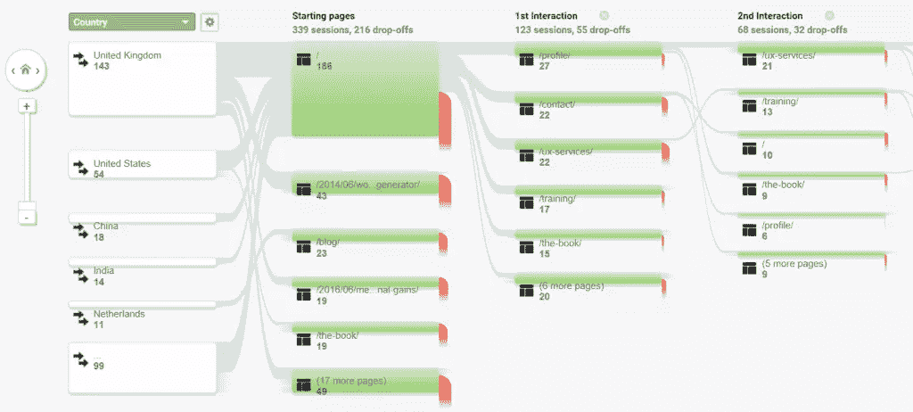
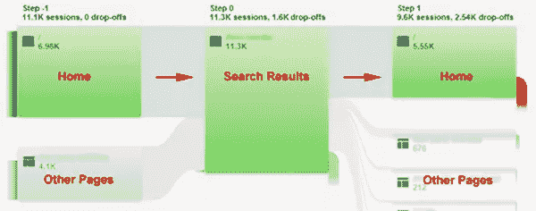
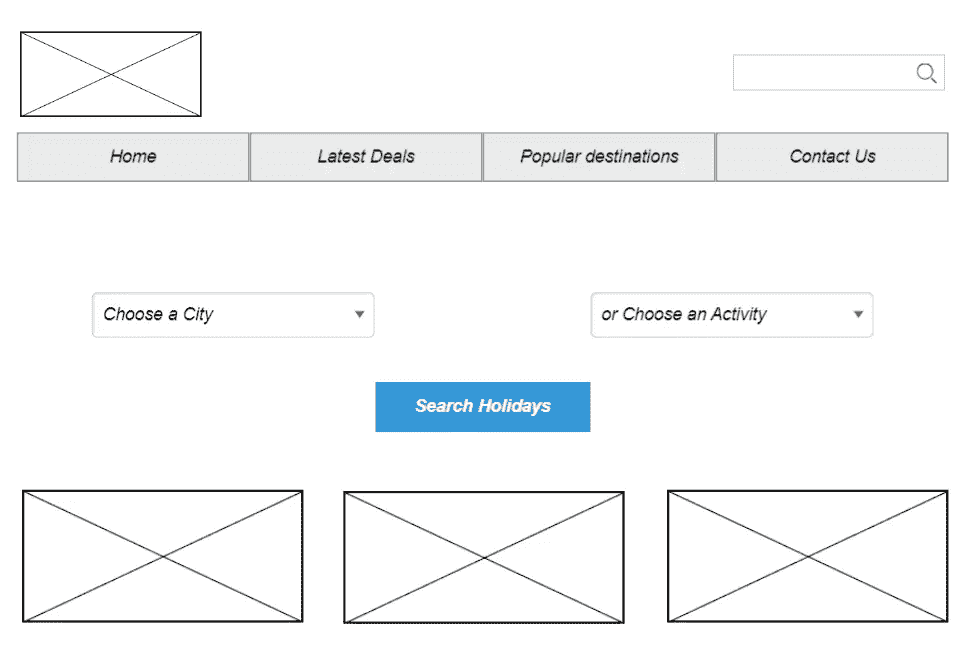
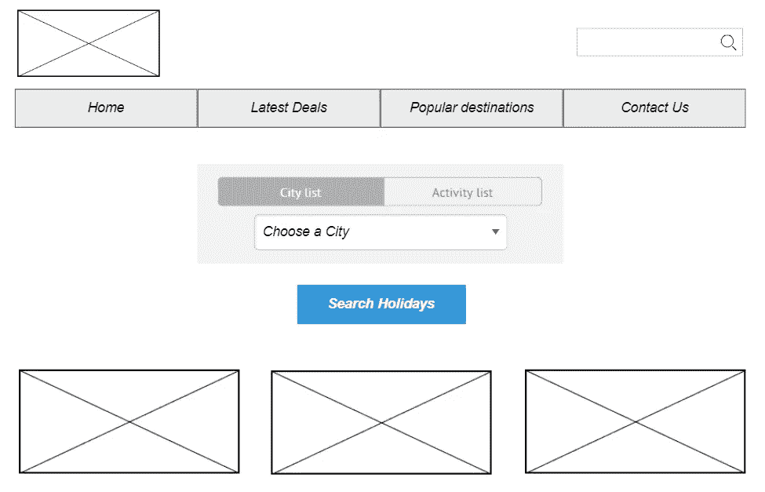
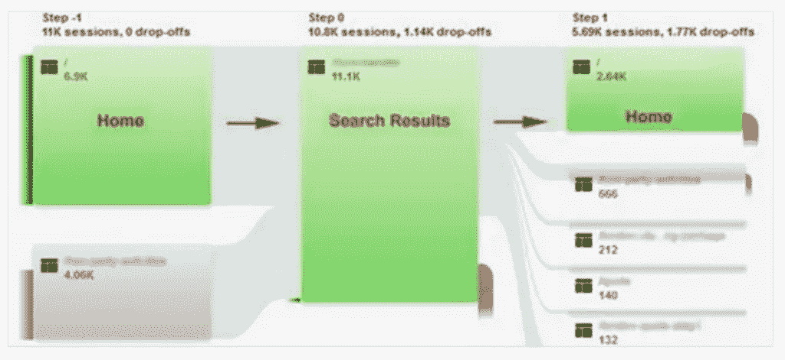

# 分析如何帮助解决 UX 问题

> 原文：<https://www.sitepoint.com/how-analytics-helped-solve-a-ux-issue/>

UX 和分析公司是一个伟大的团队。你的网站分析可以给你洞察，让你了解你的用户，跟踪他们的旅程，并找到潜在的问题领域。您可以使用定量数据来告知您的定性 UX 方法。记住，你的分析告诉你网站上发生了什么，而可用性测试等 UX 技术将有助于揭示事情发生的原因。

有多种方法可以使用谷歌分析来发现你的用户如何浏览你的网站。在 **Pages** 报告中，您可以深入查看用户如何在您的网站中导航到所选页面，以及如何从所选页面中导航。但是**用户流**和**行为流**报告给出了从你最受欢迎的登陆页面开始的多步旅程的更多信息。

这些报告可能很难分析，特别是对于大型网站，因为事实上不可能有一系列清晰的路径通过您的网站。您会发现不同的用户可以选择大量的途径，这使得从这些报告中寻找见解非常具有挑战性。然而，它们对于获得良好的顶层概览和显示站点中最主要的路径是很有用的。虽然他们苦于对多个页面进行分组，但您通常可以很好地了解用户最常经历的旅程。

我过去如何利用这些报告来为我在 UX 的工作提供信息的一个例子是寻找 pogo sticking。

## Pogo 粘住

**Pogo sticking** 描述的是用户在网站的两个页面之间跳跃，而不是在网站中前进。这可能是用户感到困惑的一个迹象，并且不太可能帮助你转化这些用户。

尼尔森/诺曼小组编写了[这份弹簧高跷贴](https://www.nngroup.com/articles/pogo%20sticking/)指南，对其进行了更详细的解释。它涵盖了 pogo 粘附行为背后的一些可能原因，并给出了这些问题的一些潜在解决方案。

## Pogo 卡钻案例研究

我的一个客户经营着一个旅游网站，提供基于各种活动和地点的定制假期。他们认为有机会提高他们的转化率，我开始在他们的分析中寻找这些机会。

### 问题是

当我第一次看他们的行为流报告时，一个大问题变得很明显。如下图所示，主页和搜索结果页面之间明显存在 pogo 粘连。

正如下面所看到的，有很多用户在进入搜索结果页面之前就已经登陆了主页。问题是，这些用户的下一步是返回主页，而不是转到其他页面。

主页将搜索放在最前面和中心，所以搜索结果页面是主页上最受欢迎的目的地也就不足为奇了。然而，令人惊讶的是，这表明用户没有看到他们期望的搜索结果。仔细查看主页，我们注意到了一个潜在的问题。搜索功能允许用户通过活动或位置进行搜索，但是主页上的框的布局方式让用户看起来像是能够通过位置*和*活动进行搜索。

这意味着用户认为他们正在搜索某个目的地的特定活动，但随后显示的搜索结果显示了某个目的地的所有活动。

我们在网站上进行了一些可用性测试，正如预期的那样，这些测试显示了对搜索功能的困惑。在测试过程中，用户会试图通过位置和活动进行搜索，而没有意识到该选项不可用。这导致了意想不到的搜索结果和用户返回到主页再次尝试他们的搜索。看到单个用户表现出与 Google Analytics 中相同的 pogo sticking 行为，使我们能够更深入地了解为什么会出现这个问题。

### 解决方案

客户没有可用的开发资源来对搜索功能的工作方式进行重大改变，所以我们不能建议大规模的改变。相反，我们开始寻找一种设计，通过简化搜索功能，让用户清楚地知道他们可以根据目的地或活动进行搜索，来最大限度地减少 pogo 粘连。

在勾画和讨论了各种解决方案后，我们决定引入标签是最好的方法——以确保有两个单独的搜索选项可用。这意味着用户可以选择“活动”或“位置”搜索。下面的线框显示了我们的初步设计。

这种设计只需要很少的开发，并且专门针对解决 pogo 粘连问题。

### 结果呢

这种设计在主页上实现，并且看到主页和搜索页面之间的 pogo 粘连立即减少。这反过来导致更多的用户开始浏览目的地和活动页面，也导致了转化率的整体增长。下面的屏幕截图显示，pogo sticking 仍然是一个问题，但这种行为已经明显减少。

更长期的计划是通过增加一个层次的[分面搜索](https://en.wikipedia.org/wiki/Faceted_search)来进一步改进搜索功能——允许用户过滤他们的搜索结果，并根据他们的要求找到正确的目的地和活动。这将进一步减少弹簧单高跷，并导致一个更有效的方式来找到正确的假期。

## 使用分析为您的 UX 提供信息的其他方法

我们已经看了一个如何使用分析数据来识别用户旅程中的特定问题的例子。还有许多其他方式可以使用分析来帮助你的 UX 决策。

通过查看你的网站潜在问题分析来开始你的 UX 工作，这是发现你可能没有意识到的问题的好方法。在 UX 过程中，网站分析经常被忽视，但您的分析可用于:

*   分析关键用户旅程
*   找出你网站上潜在的问题
*   了解更多关于您的网站用户的信息
*   衡量设计变更的影响
*   创建报告以展示您的 UX 工作的价值

对你在 UX 的工作采取分析优先的方法是开始你最初的 UX 调查的好方法，也是低成本的方法。像谷歌分析这样的网站分析工具可以免费使用，你可以很快从中获得一些关键的见解。

要了解更多关于在你的 UX 工作中采取分析优先的方法，请查阅我的书 *[研究 UX:分析](https://www.sitepoint.com/premium/books/researching-ux-analytics)* 。

## 分享这篇文章