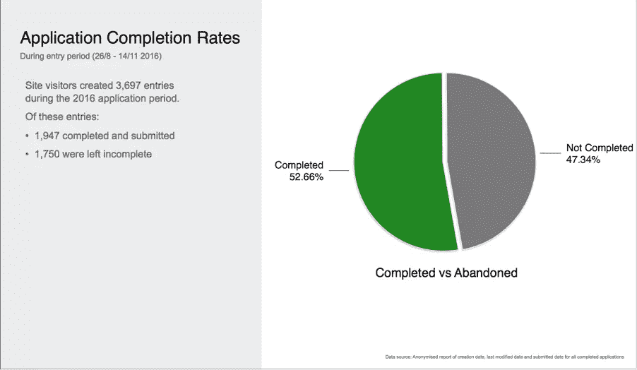
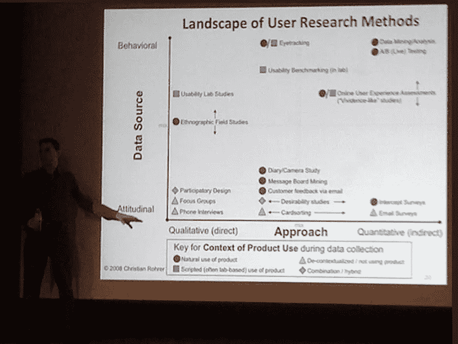
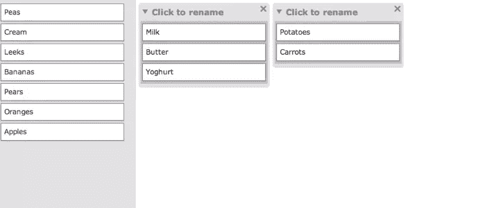
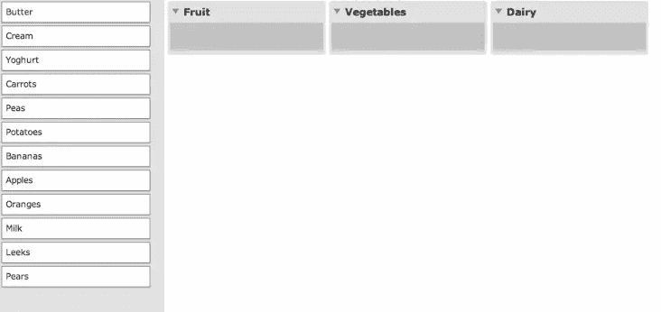
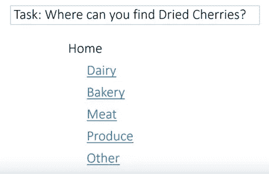

# 对用户研究方法的深入探究

> 原文：<https://www.sitepoint.com/user-research-methods-deep-dive/>

用户研究在塑造任何成功的产品或服务中扮演着至关重要的角色。它通过根据用户的需求进行定制，让用户始终处于体验的核心，从而提供超越竞争对手的真正优势。但是随着不同研究方法的不断增加，知道什么时候使用哪种方法最好是一个挑战。

本指南概述了每种最常用方法的基础知识，提供了何时使用它们的指导，更重要的是，为什么要使用它们。

我们将涵盖:

*   用户研究的起源
*   发现和探索性研究
*   quant 和 qual，以及它们之间的区别
*   核心方法:
    *   用户访谈
    *   民族志和实地研究
    *   调查和问卷
    *   分析和热图
    *   卡片分类和树测试
    *   可用性研究
*   进一步阅读和资源
*   关键要点

想从头开始学习 UX 吗？使用 SitePoint Premium 获得 UX 设计书籍的完整收藏，涵盖基础、项目、技巧和工具&。[现在就加入，每月仅需 9 美元](https://www.sitepoint.com/premium/products/Z2lkOi8vbGVhcm5hYmxlL1Byb2R1Y3QvMzA3?utm_source=blog&utm_medium=articles)。

## 用户研究的起源

几个世纪以来，产品设计师和工程师已经将用户反馈融入到他们的过程中。然而，直到 1993 年，“用户体验”(UX)一词才由唐·诺曼在苹果公司任职期间创造出来。

随着 UX 学科的发展和成熟，从业者开始使用其他领域的调查研究技术，如科学和市场研究。这使得最终用户能够做出决策，而不是设计团队的假设，为我们今天所知的 UX 研究奠定了基础。

这是一个起源的快速纲要。现在让我们深入一些研究框架。

## 发现和评估研究

> 以用户为中心的设计意味着在整个项目中与用户一起工作

从广义上讲，用户研究被用来发现人们想要什么和需要什么，或者评估想法是否有效。实现这两种不同结果的方法可以大致分为两组。

### 制定战略:发现研究

在项目开始时帮助回答未知问题的方法可以被称为发现研究。这些方法包括审查现有报告、数据和分析，以及进行访谈、调查和人种学研究。这些方法确保你对你的用户是谁、他们需要什么以及他们面临的问题有一个坚实的了解，以便开始开发一个解决方案。

### 执行和评估:评估性研究

一旦对最终用户及其环境有了更清晰的了解，就该探索可能的解决方案并测试其有效性了。可用性研究是这里最常用的方法。评估研究为你提供了关注用户及其特定需求所需的知识。

**例题**

| 发现研究方法 | 评估研究方法 |
| *   field research*   Research diary*   One-on-one interview*   Focus group*   Behavioral analysis review*   Open card sorting*   Mail survey*   Contextual query | *   Remote usability testing*   Closed card sorting*   Tree test*   Benchmarking analysis review*   Heat map*   Pop-up voting*   Usability benchmark test*   Impression test |

## Quant 和 Qual，以及它们之间的区别

尽管每一个设计问题都是不同的，但人们普遍认为，定性和定量研究见解的结合将为形成更成功的设计解决方案提供一个平衡的基础。但是这些厌恶发音的单词是什么意思呢？

**定量(统计)研究技术**包括收集大量用户数据，以了解*当前正在发生什么*。这回答了一些重要的问题，如“人们在支付过程中在哪里下车”，或“哪些产品最受某些用户群的欢迎”，以及“哪些内容最具/最不具吸引力”。

定量研究方法通常用于在项目开始时制定正确的方向，并在项目结束时使用数字或指标评估绩效。共同目标包括:

*   比较两种或多种产品或设计
*   获取未来设计的比较基准
*   计算一些设计变更带来的预期成本节约

Quantitative data analysis can offer useful insights such as abandonment points on a form. This can lead to further qualitative studies to understand why.

**定性(观察)研究技术**包括直接观察小型用户群，以了解他们的态度、行为和动机。这就是我们开始理解*为什么*事情会发生以及*如何*解决问题的地方。

> 你可以优化一切，但仍然会失败。这就是定性方法的用武之地。通过问“为什么”,我们可以看到超越当前最佳状态的更好的机会。―艾丽卡大厅

定性研究方法也用于在项目开始时策划正确的方向，并在整个构思过程中告知设计决策。共同目标包括:

*   揭示思想和观点的趋势
*   更深刻地理解问题
*   为定量研究提出假设

Christian Rohrer authored a popular framework for understanding user research methods, illustrating where 20 popular methods appear along three dimensions, including quantitative and qualitative. [Source](https://www.nngroup.com/articles/which-ux-research-methods/).

## 核心方法

这些方法背后的背景已经足够了。让我们深入研究方法本身。值得注意的是，由于每个项目都是不同的，没有快速的方法来严格说明哪种方法最适合什么。然而，利弊已被列为每一个。

### 1.用户访谈

*定性|发现/评估*

面试允许你提问，帮助你从参与者的角度看问题。它们通常被记录下来，然后进行分析，以找出用户的信念、态度和驱动力，同时发现新的考虑因素来帮助构思。

> 故事是最富有洞察力的地方。你的目标是在每次面试中都达到这一点。—史蒂夫·波蒂戈尔

面试的长度、风格和结构可以根据你想要达到的目标以及参与者的可及性而变化。以下是一些不同类型的面试。

一对一面试通常在实验室或咖啡厅进行，但只要稍加准备，几乎可以在任何地方进行。面对面的采访比远程(通过电话或视频)更可取，因为他们通过肢体语言提供了更多的见解。会议是根据大致遵循讨论指南的问题进行的。这可以让你围绕一个目标发现新的知识，而不会偏离主题。

**焦点小组**用于在您时间紧迫或没有空闲的参与者时，从目标受众的 3-10 名代表那里获得共识。焦点小组采取讨论和练习的形式，是评估人们想从产品或服务中得到什么以及他们对事物的看法的好方法。不建议用它们来评估界面的可用性，因为它们缺乏焦点，并且有可能产生群体思维偏差。

**情境探究式面试**是面试方法中的圣杯。他们在参与者的日常环境中进行日常活动。研究人员可以观察参与者，讨论他们做了什么，以及为什么，同时活动发生。与其他访谈不同，研究人员通常会在最后向参与者总结调查结果，让他们有机会做出最后的更正和澄清。这种方法用于从真实情况中生成高度相关和可靠的见解，但它可能非常耗时。

关于用户访谈的更多信息，在交互设计基金会网站上有一些很好的资源。

### 2.实地研究

*定性|发现*

**实地研究**包括观察人们在自然的工作或生活环境中(而不是在实验室中)与产品、服务或相互之间的互动，以更好地了解用户的行为和动机。这些研究通常比大多数其他方法进行更长的时间，记录大量的现场笔记供以后分析。

**人种学研究**让研究人员积极参与到一个群体环境中，让他们自己成为研究对象。这种方法在研究文化或社会背景与你不同的目标受众时特别有用，它可以发现许多未知和重要的考虑因素。

**直接观察**涉及从远处被动观察(就像墙上的一只好奇的苍蝇)，允许研究人员发现用户旅程和流程中的问题和解决方法(如零售店布局)，也允许未来的改进。

**用户日志**涉及日记研究和视频日志，有时被称为“穷人的实地研究”。他们允许用户通过记录他们在一段时间内每天特定时间对研究焦点的体验来为您生成数据。所提供的实时洞察有助于了解长期行为，如习惯、工作流程、态度、动机或行为变化。

### 3.调查和问卷

*定量|发现/评估*

**调查**是一种快速、经济且相对简单的方式，可以获得关于现有、失效或潜在用户的数据洞察。它们可以用于各种目的，例如获得关于新功能的定量反馈，或者目标受众的态度和信念趋势。

与面试指南一样，撰写调查问题也是一门艺术，可以收集适量的有用且有针对性的数据，以达到研究目标。调查应该简短，以避免遗漏，并防止误导或混淆问题引起的误解或确认偏差。参与者也需要筛选，以确保研究是由正确的受众完成的。

调查可以通过多种方式从参与者那里收集数据。

使用在线工具，如[调查猴子](http://www.surveymonkey.com/)、[谷歌表单](https://www.google.com.au/forms/about/)和[类型表单](http://www.typeform.com/)，可以非常快速地将电子邮件调查汇总在一起。他们依靠你已经有一个电子邮件列表来招募参与者，这往往会产生更高的回复率，因为他们可能会被产品或服务所吸引。电子邮件的额外好处是允许研究人员更好地锁定和控制他们的样本量，并允许参与者在方便的时候做出回应。

**当你没有客户数据库时，拦截调查和弹出窗口**是接触现有和潜在用户的好方法。这是一种在产品体验背景下快速获得洞察力的有用方法，例如通过[客户满意度调查](https://www.qualtrics.com/experience-management/customer/what-is-csat/)。不利的一面是，这种方法可能会提供较低的完成率，并会导致负面的整体体验，因为你会打断用户手头的任务。

面对面的调查不太可能提供足够有用的结果。它们消除了匿名性，但对总结和改进其他研究很有用。例如，简短的调查可以与可用性研究相结合，以衡量任务完成的难易程度。当被密切监视时，这些调查容易出现偏差，因为参与者可能不希望冒犯主持人。

有关创建调查的更多信息，请参见[通过调查进行更好的用户研究](https://uxmastery.com/better-user-research-through-surveys/)。

### 4.网络分析和热图

*定量|发现/评估*

分析是一种非常强大且通常廉价的研究工具。它们是一个很好的起点，可以看到人们实际上是如何使用你的产品或服务的，也可以作为基准来衡量改进。

**Web analytics** ，以免费工具的形式，如 [Google Analytics](https://analytics.google.com/analytics/web/) (GA)，允许你追踪有多少访问者来到你的网站，他们来自哪里，他们到达那里后做了什么，他们停留了多长时间，有多少人完成了特定的任务，等等。您可以观察常见的行为模式，并调整 GA 来跟踪特定于业务或项目的目标和事件，例如表单的完成率。如果尚未建立 GA，可以从免费的在线工具(如[相似网站](https://www.similarweb.com/))收集基本的客户信息，如推荐来源。

许多现代平台，如 Adobe Experience Manager，也允许更复杂的漏斗测量和详细的受众细分。

热图是 UX 分析工具包的一个新成员。一旦设置好，它们就提供了页面上行为数据的丰富多彩的图形化表示。付费工具如 [Hotjar](https://www.hotjar.com/) 和 [Crazy Egg](http://www.crazyegg.com/) 还包括其他功能，如会话回放，可以设置为匿名记录特定旅程中的短会话，从用户的角度来看——如结账过程。总的来说，这些工具有助于更全面地了解正在发生的事情。

有关分析的更多信息，请参见[UX 设计师谷歌分析终极指南](https://uxdesign.cc/google-analytics-ux-alice-emma-walker-958d6f0f0af3)。

### 5.卡片分类和树测试

*定量/定性|评估*

**卡片分类**是一种研究技术，通常用于通过允许人们将项目分类成组来告知或评估网站或应用程序的信息架构。这是一个很好的方式来了解用户可能期望如何组织和标记内容，帮助定义导航和过滤器集。卡片分类通常由大约 20 个不同的人进行，要么使用[优化工作室](https://www.optimalworkshop.com/101/card-sorting)等软件远程进行，要么亲自进行，通过试探性问题获得更多见解。

当计划一项研究时，你需要决定是开放还是封闭排序。

**开放式卡片分类**参与者都拿到相同的卡片，但被归入各自的类别并贴上标签。然后可以对结果进行分析，找出常见的模式和注意事项。例如，在关于音乐的卡片分类中，一个用户可以按照流派对艺术家进行分类，而另一个用户可以按照时间段进行分类。

在**封闭式分类**中，你为参与者提供一个物品列表和固定类别，让他们对卡片进行分类。封闭排序通常遵循开放排序来验证建议的类别。

**树测试**是封闭排序的一种替代方法，由于导航界面的视觉相似性，它对验证菜单很有用。这有助于确保人们能够使用您建议的类别轻松找到内容。

这里有一个方便的[资源](http://cardsort.ignorethecode.net/)，可以快速创建卡片进行打印。参见[卡片分类:权威指南](http://boxesandarrows.com/card-sorting-a-definitive-guide/)了解详细的操作方法。

### 6.可用性研究

*定性|评估*

可用性测试(或称用户测试)是最常见的用户研究类型之一，它提供了对现有或提议的产品如何与真实用户一起完成重要任务的宝贵见解。观察参与者在努力完成辅导员提供的一系列任务时的表现。会议通常在一个受控的“实验室”环境中亲自进行，由一名观察者记录和记录调查结果，以供以后分析。

> 当你在一个网站上工作了几个星期后，你就再也看不到新鲜的了。如果你想要一个伟大的网站，你必须进行测试。——史蒂夫·克鲁格。

测试报告通过支持照片、引用和视频剪辑总结了调查结果。这使得这种方法在说服涉众允许推荐的变更、进一步的研究或产品发布方面非常有效。缺点是环境是人为的，当测试部分完成的原型时，结果可能不可靠。

面对面的可用性测试通常是首选的，这样可以让主持人读懂肢体语言，知道什么时候问后续问题。然而，当时间表、预算和距离不允许时，**远程测试**可以使用软件来筛选和执行同一组任务。你只能希望没有技术上的困难。

**自由在线测试**涉及参与者使用在线工具单独进行测试，例如 usertesting.com。虽然通常不鼓励使用这种方法，但是当测试一个小的元素或微小的变化时，这种方法会很有用。大多数工具允许跟进问题，但这些问题必须预先定义，并且没有实时支持或澄清的能力。

**需要考虑样本大小**。用户测试在发现可用性问题方面很棒，即使是在早期的纸上原型阶段，只需要向两三个用户展示你的草图。随着设计的进展，高保真、可点击的原型应该由五到八个用户在一系列设备上进行测试。

虽然**可用性基准测试**主要被认为是一种定性的研究方法，但是可以通过测量任务的成功率和完成任务所需的时间来收集定量的见解。这需要更大的样本量(20 多个用户)和更紧凑的脚本。

测试产品时，可用性不是唯一要考虑的因素。其他测试已经被开发出来以满足其他需求，如**印象**或**概念**测试，这些测试评估行为和观点。这有助于衡量品牌和内容对受众的美学吸引力和影响。A/B 或**多元**测试也很受欢迎，用于测量从用户界面模式和标题到按钮颜色和图像的偏好。

关于可用性测试的更多信息，请参见[游击可用性测试的艺术](https://www.uxbooth.com/articles/the-art-of-guerrilla-usability-testing/)和[可用性测试提示、技巧和指南](http://www.uxforthemasses.com/usability-testing/)。

## 关键要点

在开始任何 UX 项目之前，留出一些时间来计划哪些方法、技术和工具最有可能获得最佳结果。少往往可以多，所以不要让自己负担过重，把学习控制在你可用的时间表、预算和资源之内。

这一切都是为了找到正确的平衡，这来自于经验。例如，如果是一个新产品或完全的重新设计，在开发的早期发现阶段和后期评估阶段，尝试为定量和定性方法包括一些时间和预算。

有时约束是无法克服的，你所能做的就是小样本的游击测试。请记住，即使是一些研究见解也比纯粹的猜测要好，随着时间的推移，一点点的迭代会给体验带来很大的不同。

研究是一个耗时且复杂的过程，经常充满了相互矛盾的观点。如果你第一次做得不完美，不要对自己太苛刻。将这些知识用于下一个研究项目计划。

不管你听到什么，没有什么是一成不变的；方法和技术可以结合和改变，以适应你正在解决的项目和问题。请记住，这些都是由许多有经验的专业人士尝试和测试过的，所以在实验之前，尽你所能确保你理解为什么和如何做。

最后，记住你将向谁展示研究成果，以及他们将利用这些成果做什么。确保它尽可能的相关和简洁。

## 推荐读物和资源

有大量令人惊叹的免费文章向您展示如何使用经过尝试和测试的技术和考虑因素来实施每种方法，其中一些已经在上面介绍过了。

### 书

致力于用户研究的书籍越来越多。以下是我的几个最佳选择。

*   Leah Buley 的《一个人的用户体验团队:研究和设计生存指南》
*   史蒂夫·波蒂戈尔的《采访用户:如何发现引人注目的见解》
*   [刚刚够的研究](https://abookapart.com/products/just-enough-research)，作者 Erika Hall
*   史蒂夫·克鲁格的《不要让我思考，重访:网站可用性的常识方法》
*   苏珊·温申克的《每个设计师需要了解的关于人的 100 件事》
*   [量化用户体验:用户研究实用统计](https://measuringu.com/book/quantifying-the-user-experiencepractical-statistics-for-user-research/)，作者 James R. Lewis 和 Jeff Sauro
*   《观察用户体验:用户研究从业者指南》，作者伊丽莎白·古德曼、迈克·库尼亚夫斯基和安德里亚·莫德

### 额外资源

*   [UX 100 年](https://www.nngroup.com/articles/100-years-ux/)，尼尔森诺曼集团文章
*   [UX 研究备忘单](https://www.nngroup.com/articles/ux-research-cheat-sheet/)，尼尔森诺曼集团 PDF

## 分享这篇文章