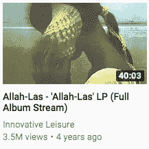
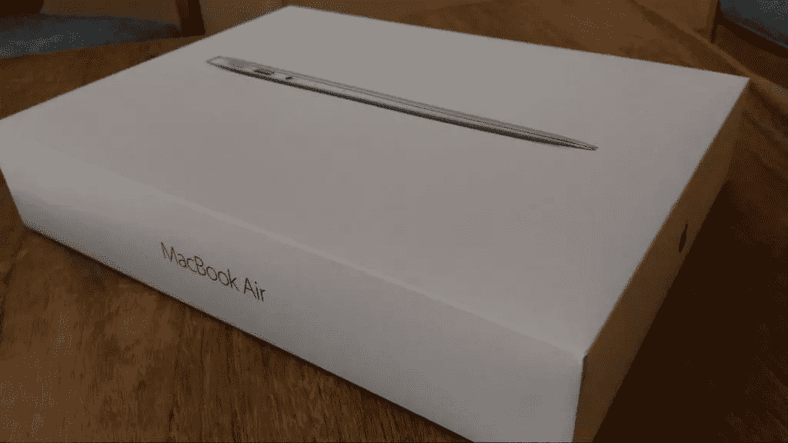
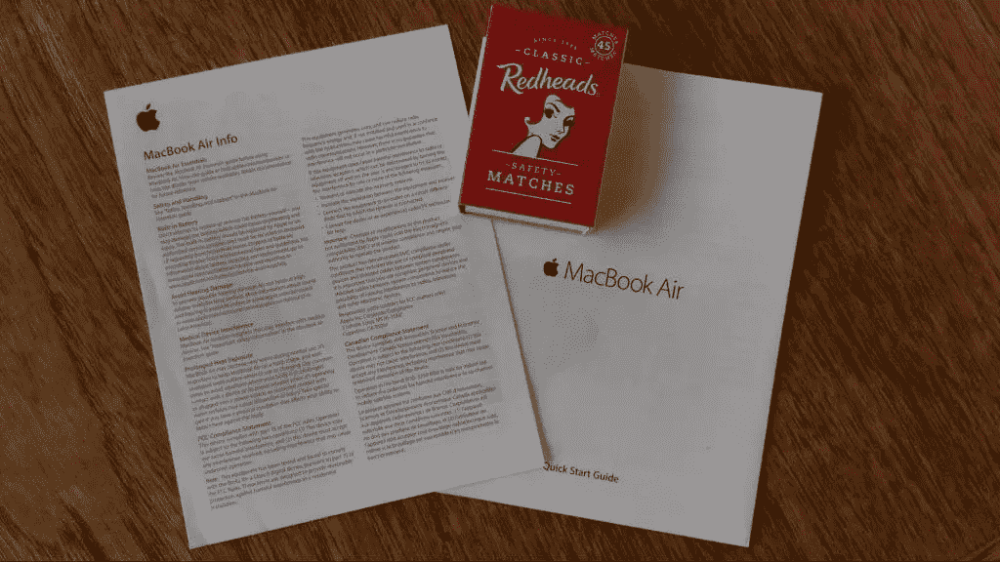
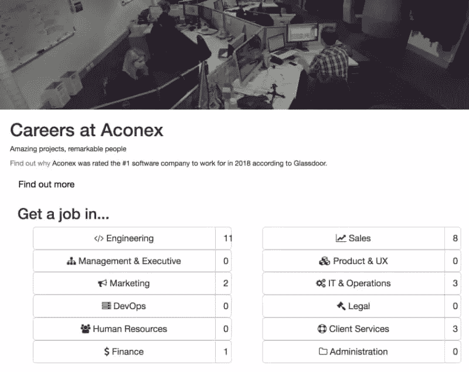
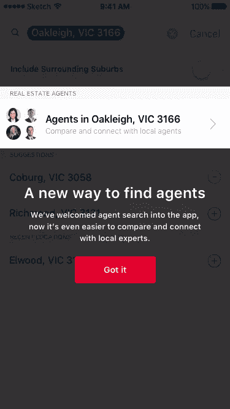
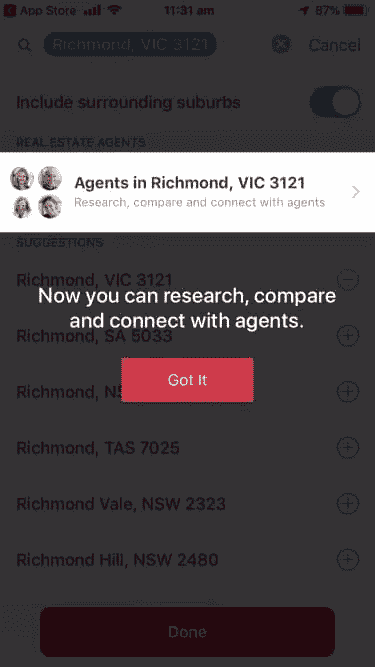

# 内容如 UX:建立一个更人性化的网络

> 原文：<https://www.sitepoint.com/content-as-ux-building-a-more-human-web/>

***传说自己是一个伟大的诗人，有着丰富的智慧。***

到目前为止，你觉得这篇文章怎么样？不管你的感受如何，我敢打赌你会同意内容是用户体验的重要组成部分。

等等。我说了“至关重要的部分”吗？我指的是“关键部分”。毕竟，每个用户的旅程，无论其目标是什么，最终都涉及到用户获取内容，或者添加他们自己的内容。这些内容可能是文本，就像这篇文章，也可能是图像、视频、音频——随便你怎么说。但不管它是什么，它是用户与每个网站或产品交互的点。

然而，传统上(并且仍然经常)当我们设计网站或制作产品时，我们进行视觉设计，内容空间是空白的。如果你像大多数人一样做事，你可能会把线框或模型展示给内部的某个人——甚至可能是你的创始人——并让他们填补空白。

呃。至少，此时你的同事可能是这么想的。现在，他们有负担和责任来填补字面上和隐喻上的空白——但这一空白已经有了目标或方向，而他们没有参与选择。

在这里，我将提出另一种考虑内容的方式，其中内容是 UX。

想从头开始学习 UX 吗？使用 SitePoint Premium 获得 UX 设计书籍的完整收藏，涵盖基础、项目、技巧和工具&。[现在就加入，每月仅需 9 美元](https://www.sitepoint.com/premium/products/Z2lkOi8vbGVhcm5hYmxlL1Byb2R1Y3QvMzA3?utm_source=blog&utm_medium=articles)。

## 1.内容怎么可能是 UX？

我在上面说过，内容是 UX 的关键部分。现在让我们在此基础上继续努力。

内容*就是*用户体验。

看看像 YouTube 这样的网站。登录页面是一个内容列表。更好的是，这些内容是基于您(或我)过去的使用模式呈现的。与该内容相关的数据——图片、标题、上传媒体的帐户名称、总浏览量和上传日期——也是内容。当你访问一个视频时，它下面的评论就是内容。

都是内容。内容就是用户体验。这就是我们在这里要用的。

好吧，你说，但这是 YouTube。我的产品不满意。

好吧，让我们考虑一台新电脑的例子。在六年值得信赖的服务之后，我不得不换掉我的。我买了一台 MacBook Air，它装在一个可爱的盒子里。不错的用户体验。除了实际的计算机，这里没有太多的内容，对吗？

嗯，没有。但是我打开盒子，插上插头，注意到这些小传单藏在里面。

我已经把火柴盒放进去做了尺寸比较。我戴眼镜，但我觉得我需要一个放大镜来阅读标题为 *MacBook Air 信息*的传单。其实我只看了第一句话(很伤眼睛):

> 在使用 MacBook Air 之前，请阅读《Macbook Air 基本指南》。

“你说得对，苹果，”我想。

但这是什么？盒子里唯一的另一份传单是一本 MacBook Air 快速入门指南。这是……他们的意思吗？我希望如此，因为它的文字稍微大一点，而且这是我在打开我激动人心的新购买之前浏览的唯一其他东西。

问题:如果我不能阅读说明内容来启动这个设备，我将如何开始在这个设备上创建精彩的内容，或者在网上访问精彩的内容？如果我不需要这些内容来让它工作，那么为什么首先要在产品中包含这些疯狂的、微小的、不可读的传单呢？

这一经历并没有让我充满信心，也没有让我相信苹果会关心真实的人。当然，包装很好。但是现在感觉企业更喜欢自己的产品，而不是用户。

一句话:内容*就是*用户体验。即使在现实世界中。

## 2.内容和 UX 哪个更重要？

都不是。业务和用户目标是第一位的，它们决定了你需要开发什么:内容，以及用户交互和添加内容的机会。显然，从这一点来说，作家和设计师或研究员一样重要。为什么？

原因有二:内容第一的设计，和叙事 UX。

内容第一的设计是一个很酷的口号，其背后的现实是，内容是用户在这里的目的，所以我们需要对内容有一个坚如磐石的把握，以便考虑我们可能如何为它设计。即使是为了一本小册子。或者一个网络软件网站。我们想说的话将指导我们如何展示这些信息。(我在看你，苹果。)

叙事 UX 是另一个很酷的口号，但这一个承认我需要在这里说的，此时此刻，实际上是一个更大的沟通的一部分，包括用户可能需要完成的其他任务，你可能想要实现的目标，或者他们可能想要在这个品牌的保护伞下添加或消费的内容。

所以我们拿出我们的内容，并找出它还需要连接到什么。或者，我们抓住机会让用户添加内容，然后我们看看还需要连接哪些内容。当然，我们会根据用户需求以及对品牌的意义来考虑这一点。

我说的不是卖。我说的是什么符合我们品牌的个性、价值观等等。

举个例子，让我告诉你墨尔本软件公司 Aconex 的招聘网站的故事，我曾经在那里工作过。开发这个网站主要是为了吸引顶尖的开发人员，所以工作列表是关键内容。这就是为什么在主页上的英雄图片告诉你你在哪里之后，你会看到*工作列表*。

没有什么戏剧性的；这是一个非常标准的页面布局。这个网站现在已经不在线了。Aconex 被 Oracle 收购，Aconex 招聘网站上没有工作列表显示:大概所有的工作都是通过母公司的招聘网站提供的。然而，几个月来，Aconex 网站仍然在线，只是没有任何工作列表。因此，没有存在的理由。一个没有工作的职业网站算什么？什么都没有，只有一张蒙太奇照片，上面写满了鼓舞人心的语句，人们在尽情欢乐。这对于 Aconex 品牌来说并不是一个好的外观。

这个小案例说明了商业决策如何影响我们讲述品牌故事的方式。更好的选择是将相关的工作放入 Aconex 职业网站，或者立即将该页面重定向到 Oracle 招聘页面(就像他们现在做的那样)。

这也说明了为什么一个作家从一开始就对任何项目如此重要:作家不仅仅是把文字组合在一起。他们是构建故事的专家。用户旅程*是*一个故事。品牌故事就是一个故事。故事对用户有意义。作家可以利用他们讲故事的技巧，帮助把内容和用户添加内容的机会放入上下文中。

了解你的产品和用户的好处是，作者也可以为你的产品找到更好的词语。这是我在一个房产列表网站上做的一些工作的前后例子。他们想在他们的移动应用程序中引入一个新的房地产代理搜索，有点夸张——尽管他们承认这种夸张确实打断了用户流。所以他们想快点结束。这是产品内 coachmark 的初始版本。

这里怎么了？除了对于一个非常简单的信息来说有很多文字之外，信息本身是以我们、品牌和我们所做的事情来表达的，而不是以用户为中心。

经过几次迭代，我们到了这一步。

如果我在这里有自由裁量权，我会删除“郊区代理商”下的灰色文字以减少重复，但不管怎样，你可以看到使用一个真正的作家，而不是一个设计师，来编写你的产品 microcopy 可以对产品体验产生很大的影响。

更多例子(很多包括那些难以捉摸的快乐时刻)，请看推特上的[微拷贝模式](https://twitter.com/tinywordsmatter)和[好微拷贝](https://twitter.com/goodmicrocopy)。

## 3.我如何与团队中的作家合作？

简单的答案是:在项目的最开始就让他们参与进来，像对待其他 UXer 一样和他们一起工作，每一步都是如此。

首先，找一个能帮助你在用户眼中诠释你的品牌的人，即使你刚刚开始为一项新功能构建流程，或者想出你将如何在新公司网站上重新定位你的产品。

当我在 Aconex 工作的时候，一个 UXer 让我参与了一个非常棘手的功能添加:一些客户(但不是全部)将开始使用双因素身份验证。考虑到我们没有产品内帮助层，我们如何为用户平滑这个过程呢？

最终结果是这里记录的，但简短的故事是，通过与他一起分析过程中的步骤，我能够帮助他在“设置向导”中构建步骤，以便它尽可能简单，在有用的起点链接到更多信息，并且，事实证明，对于客户组织中采用它的用户来说，使过程尽可能简单。

这还没有考虑到向导本身使用的文本，它如何与图像(当然，作为作者，我也参与了)一起工作，以及真正有用的支持材料的编写，包括电子邮件通信。

像任何其他 UXer 一样，我也能够在发布前和发布后，通过向导和所有其他材料，帮助和响应测试和用户反馈。

一句话:从一开始就让一个优秀的作者参与进来，我保证你会比只使用研究人员和设计人员获得更好的用户体验。

什么是好作家？在为产品界面写作、为网络写作和为直接数字响应写作方面有经验并了解挑战的人。如果你不知道从哪里开始寻找这个人，那么从你的职业关系网开始询问。一旦你有一些竞争者，要求看看他们以前的工作，并彻底检查他们的参考资料。然后，在你开始大的和/或高风险的项目之前，让他们先做一个小的试验项目。

## 建立一个更人性化的网络

几十年来，企业已经将技术作为内容的宿主或持有者。实际上，他们已经将内容视为填充物，一些他们并不真正关心的东西。

现在我们可以看到，这种方法并不是我们可以采取的最明智的方法。用户将内容——你的和他们的——视为终极游戏。不管是你做的还是他们做的，内容都是用户体验的重要部分。这就是我们来这里的目的。

所以，在你开始设计内容之前，先弄清楚你的内容。首先了解内容将包括什么以及它将如何工作。之后，你可以开始设计界面，开发交互点，在用户需要的时候，毫不费力地把他们带到内容中。找一个作家来帮助构建故事情节，以一种自然的方式将你的品牌与用户的目标联系起来。我们可以共同努力，让网络成为每个用户更加愉快、有用和自然的体验。

同时，如果您想了解更多关于内容和 UX 的信息，请尝试以下资源:

*   在推特上的
*   *[Microcopy，完整指南](https://www.writingmicrocopy.com/)* ，也是由 Kinneret
*   Twitter 上的 Lauxcritora (以及他们的[网站](https://www.lauxcritora.com/)
*   [UX 集体](https://uxdesign.cc/)在媒体上，经常刊登关于 UX 写作的内容
*   Word Design Doctor ，我自己的关于 UX 写作的半月刊时事通讯。

## 分享这篇文章