# Vue.js 和 Quasar 框架简介

> 原文：<https://www.sitepoint.com/vue-js-quasar-framework/>

近年来，我们已经看到了 JavaScript 工具和框架的激增，比如 [Angular](https://angular.io/) 和 [React](https://reactjs.org/) 。我记得当我买了一本关于 [Grunt.js](https://gruntjs.com/) 的书时:它已经被开发人员放弃了，他们已经开始使用其他工具，如 [Gulp](https://gulpjs.com/) “流构建系统”。但是任何跳上那列火车的人都可能会很快再次切换，因为 webpack 出现并取代了它们。

但是在 JavaScript 框架中，有一个在最近几年增长特别迅速: [Vue.js](https://vuejs.org/) 。它非常受欢迎，与这个领域的其他公司相比，它的增长率[已经成为爆炸性的](https://michaelnthiessen.com/react-vs-vue-which-is-growing-faster)。

Vue 已经成为主要竞争者之一，因为它的学习曲线比较软。它非常适合逐步实现。它有一个模块化的、基于组件的架构。它有着广泛的用途和发达的工具生态系统。如果你对开始使用 Vue 感兴趣，你可以看看我们的书 [Jump Start Vue.js](https://www.sitepoint.com/premium/books/jump-start-vue-js?utm_source=blog&utm_medium=referralarticle&utm_campaign=tonino) 开始在你的项目中使用 Vue。

## Vue 工具、术语和前景

和大多数冒险去掌握的技术一样，掌握 Vue 包括了解术语和概念，熟悉它的工具和构建模块的生态系统。

[Vue 路由器](https://router.vuejs.org/)是所有 Vue 单页应用不可或缺的一部分。它提供导航控制、嵌套路由、路由视图映射和许多其他功能。

[Vuex](https://vuex.vuejs.org/) 是 Vue apps 的“状态管理模式+库”。它就像一个集中的数据存储，帮助我们管理应用程序中所有组件的状态。处理阶段跨越前端应用程序的多个部分会很快失控，因此需要一个全面的解决方案。在我们的 [Vuex 初学者指南](https://www.sitepoint.com/premium/books/getting-started-with-vuex-a-beginner-s-guide?utm_source=blog&utm_medium=referralarticle&utm_campaign=tonino)中，我们会更多地讨论 Vuex。

Vue devtools 可以让开发者的生活更轻松。它帮助您跟踪我们的应用程序中的组件、状态和事件。你可以在我们关于 Vue 工具的书的第 2 章的[中找到更多关于这个工具的信息。](https://www.sitepoint.com/premium/books/vue-js-tools-skills/read?bookmark=div%5Bid%3D%27reeedr%27%5D%20%3E%20div%5Bid%3D%27reeedr-body%27%5D%20%3E%20div%3Anth-of-type(3)%20%3E%20h2%5Bid%3D%27vue-browser-tools%27%5D&utm_source=blog&utm_medium=referralarticle&utm_campaign=tonino)

[Vue Cli](https://cli.vuejs.org/) 为构建 Vue 应用程序提供了一个命令行工具集——原型开发、JavaScript 应用程序的快速搭建，包括 CSS 预处理器、ESLint、Babel、Typescript 支持、PWA 支持等等。vue CLI——尤其是其最新版本——是一个游戏改变者，并呈现了一个自己的小生态系统。用于构建电子应用的 [Vue CLI 3 插件](https://github.com/nklayman/vue-cli-plugin-electron-builder)就是一个很好的例子。我们还为此专门写了一整本书，即《Vue CLI 初学者指南》，所以你可以一头扎进去。

[Vue 组件系统](https://vuejs.org/v2/guide/#Composing-with-Components)是 Vue 的另一个强项。它使我们能够模块化我们的应用程序，封装标记、逻辑和样式，并重用它们。

David Desmaisons 开发的 Vue Cli 插件组件帮助开发将在 [npm](https://www.npmjs.com/) 上发布的组件。

如果你想深入了解这些和其他 Vue.js 工具，我推荐你浏览一下 *[Vue.js:工具&技能](https://www.sitepoint.com/premium/books/vue-js-tools-skills?utm_source=blog&utm_medium=referralarticle&utm_campaign=tonino)* 。

[Awesome Vue](https://github.com/vuejs/awesome-vue) 也是一个极好的资源。这是对 Vue 生态系统和 Vue.js 资源所有部分的深入、分类和最新收集/回购。

Quasar，我们在这里讨论的 Vue 框架，也有 [Awesome Quasar](https://github.com/quasarframework/quasar-awesome) ，一个优秀的回购页面，有许多有用的资源。

## 类星体

Vue 是一个用于构建用户界面的 JavaScript 框架。然而，就其本身而言，它并没有提供实际的 UI 元素，或者组件，或者我们可以使用的一致设计。这就是为什么在 Vue 之上，已经建立了许多 UI 框架，为用户提供可重用的、风格化的组件。我们可以把它想成对 Twitter 的 Bootstrap 的不同看法——只针对 Vue。

如果你有兴趣了解更多，我推荐你看一看“[为你的下一个项目](https://www.sitepoint.com/premium/books/vue-js-tools-skills/read?bookmark=div%5Bid%3D%27reeedr%27%5D%20%3E%20div%5Bid%3D%27reeedr-body%27%5D%20%3E%20div%3Anth-of-type(4)%20%3E%20div%3Anth-of-type(1)%20%3E%20h1&utm_source=blog&utm_medium=referralarticle&utm_campaign=tonino)准备的五个 Vue UI 库”，这是 *[Vue.js:工具&技能](https://www.sitepoint.com/premium/books/vue-js-tools-skills?utm_source=blog&utm_medium=referralarticle&utm_campaign=tonino)* 的第三章。这个领域的一个重要竞争者是 [Vuetify](https://vuetifyjs.com/en/) ，它是一个材料设计组件框架，拥有[和](https://github.com/vuetifyjs/vuetify)的大量追随者。另一个是[类星体](https://v1.quasar-framework.org/)。

Quasar 是一款高性能、材料设计 2、用于 Vue.js 的全前端堆栈。

这是一个麻省理工学院许可的，简单易用但功能强大的 UI 工具包，它补充了 Vue.js，为构建响应性前端应用程序提供了一个全功能的工具集，而不必深入研究脚手架和配置。

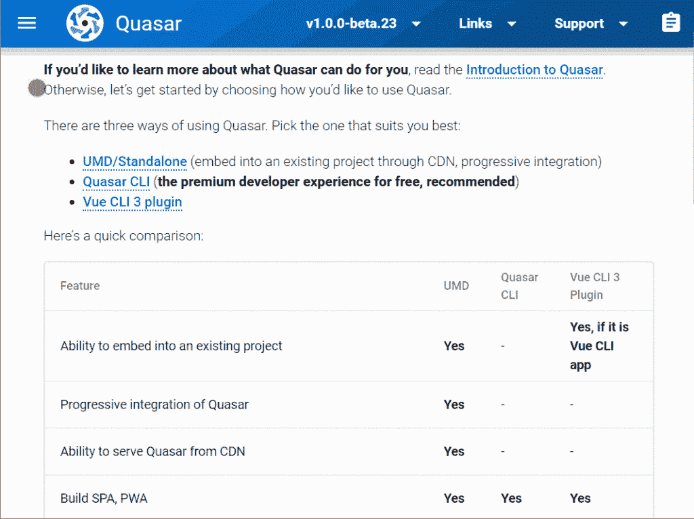

正如我们在 [Quasar 文档](https://v1.quasar-framework.org/start/pick-quasar-flavour)中看到的，它附带了许多 UI 组件、布局元素和助手。

它为我们提供了三种方法来引导我们的应用:

*   [UMD /单机版](https://v1.quasar-framework.org/start/umd)通过包含我们需要的来自 CDN 的脚本和样式，使从小处着手成为可能。这种方法不依赖于 VUE CLI 或资产的构建。
*   [Quasar CLI](https://v1.quasar-framework.org/start/quasar-cli) 号称“类星体框架的骄傲”，是构建类星体应用的推荐方式。它可用于构建:
    *   spa(单页应用程序/网站)
    *   SSRs(服务器端呈现的应用程序/网站)
    *   渐进式网络应用程序
    *   移动应用程序(通过科尔多瓦)
    *   电子应用
*   [vista CLI 3 插件](https://v1.quasar-framework.org/start/vue-cli-plugin)

我们将遵循 Quasar 团队的建议，使用 Quasar CLI。

## 使用 Quasar CLI 引导 Quasar 应用程序

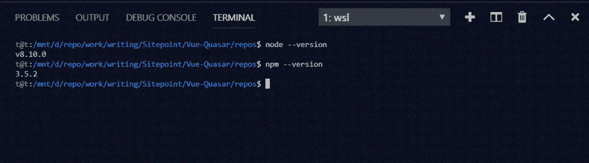

在我们安装 Quasar CLI 之前，我们需要确保我们有正确版本的[节点](https://nodejs.org/en/download/) ( > = 8，在撰写本文时)和 [npm](https://www.npmjs.com/get-npm) ( > = 5)。如果没有，我们需要安装或更新它。然后我们可以安装 Quasar CLI:

```
sudo npm install -g @quasar/cli 
```

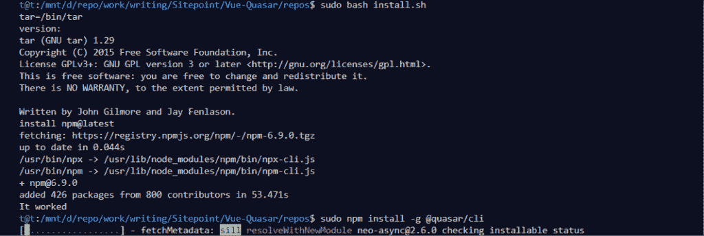

现在我们可以用它来引导我们的项目。Quasar 拥有关于 Quasar CLI 的[完整文档。我们将快速浏览并讨论最相关的部分。](https://v1.quasar-framework.org/quasar-cli/cli-documentation)

我们使用的命令是`quasar` +子命令。只需`quasar`将为我们列出命令，`quasar <command> --help`将为我们获得给定子命令的帮助。

我们用`quasar create`来支撑一个类星体项目。

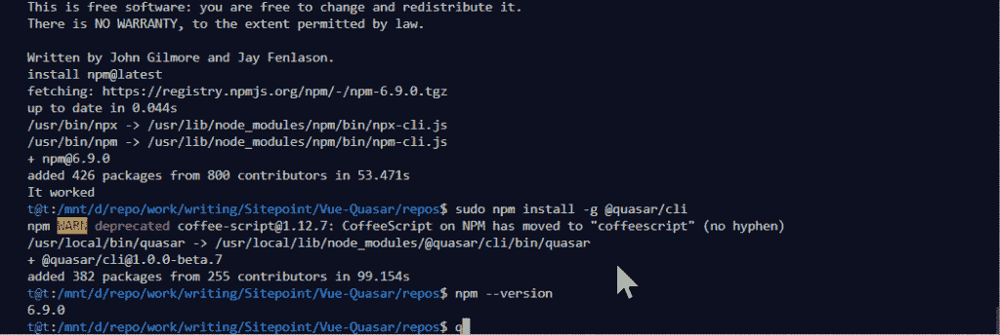

然后我们会看到一个关于我们想要引导的项目的选择列表。


项目搭建完成后，我们可以`cd`进入目录，用`quasar dev`启动一个开发服务器。项目构建完成，浏览器将在本地主机上打开临时索引页面。

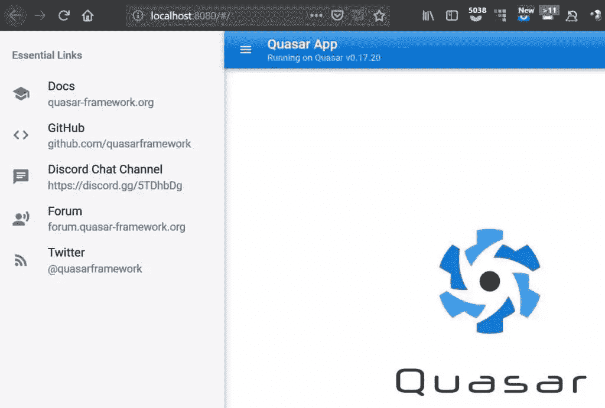

*注意:对于生产，一旦我们的项目完成，我们将使用`quasar build`来编译我们的资源。*

dev 服务器为我们提供了热重载，它可以在重载过程中保持浏览器的状态。

热重装不仅仅是在代码改变时刷新浏览器。它跳过刷新并动态更新您的代码，同时保持您的应用程序的状态(如您的 Vue 的模型数据)。

当我们编写代码并保存我们的文件/Vue 组件，以及在浏览器中重新加载页面时，启动 dev 服务器的终端 shell 将在代码中输出许多错误。在 *[Vue.js:工具&技能](https://www.sitepoint.com/premium/books/vue-js-tools-skills/read?bookmark=div%5Bid%3D%27reeedr%27%5D%20%3E%20div%5Bid%3D%27reeedr-body%27%5D%20%3E%20div%3Anth-of-type(3)%20%3E%20p%3Anth-of-type(51)&utm_source=blog&utm_medium=referralarticle&utm_campaign=tonino)* 中的这一节很好地解释了为什么。

一旦我们引导了我们的项目，我们得到这个目录结构(不包括`node_modules`):

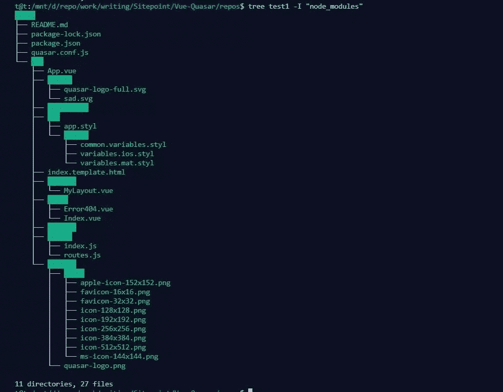

## 类星体成分

类星体组件只是 Vue 组件，在第 3 章的[组件](https://www.sitepoint.com/premium/books/jump-start-vue-js/read?bookmark=div%5Bid%3D%27reeedr%27%5D%20%3E%20div%5Bid%3D%27reeedr-body%27%5D%20%3E%20div%3Anth-of-type(4)%20%3E%20p%3Anth-of-type(3)&utm_source=blog&utm_medium=referralarticle&utm_campaign=tonino)中的 *[Jump Start Vue.js](https://www.sitepoint.com/premium/books/jump-start-vue-js?utm_source=blog&utm_medium=referralarticle&utm_campaign=tonino)* 中有很好的解释，在 *[使用 Vue](https://www.sitepoint.com/premium/books/a-beginner-s-guide-to-working-with-components-in-vue?utm_source=blog&utm_medium=referralarticle&utm_campaign=tonino)* 中的组件的初学者指南中也有。当我们引导我们的项目时，quasar 在根文件夹中创建了一个文件`quasar.conf.js`，它保存了我们所有的配置设置。

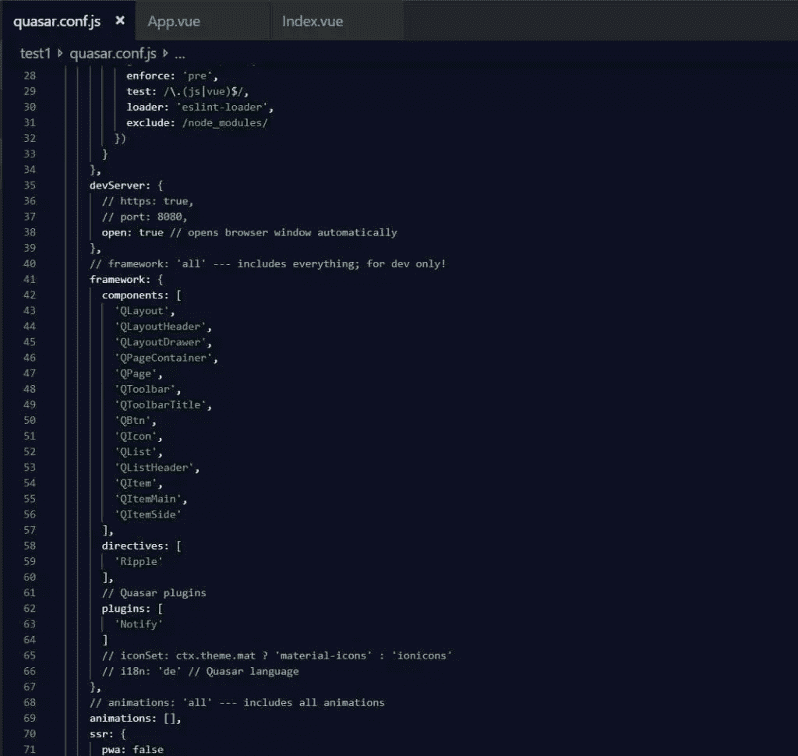

在这里，我们可以更改我们的项目配置，您可以添加或删除依赖项、quasar 组件等等。我们可以看到，默认情况下，quasar 包括类似于`QLayout`、`QPage`和`QPageContainer`的组件，它们属于 CSS 布局。你可以在这里找到更多关于[的信息。但是有一点需要注意:当使用这些组件时，不应该对它们使用`margin` css 属性，因为这会破坏布局。Quasar 还提供了一个](https://v1.quasar-framework.org/layout/layout)[布局生成器](https://v1.quasar-framework.org/layout-builder)——一个小的网络应用程序，可以帮助我们通过网络用户界面进行构建，然后导出并使用我们的布局。

Quasar 已经创建了带有索引路径的`router/routes.js`文件，为根路径指定了布局和页面:

```
const routes = [
  {
    path: '/',
    component: () => import('layouts/MyLayout.vue'),
    children: [
      { path: '', component: () => import('pages/Index.vue') }
    ]
  }
]

// Always leave this as last one
if (process.env.MODE !== 'ssr') {
  routes.push({
    path: '*',
    component: () => import('pages/Error404.vue')
  })
}

export default routes 
```

因此，为了添加组件或更改索引页面，我们将更改根(`/`)路径中引用的`MyLayout.vue`或`Index.vue`文件。

现在，`quasar create`生成器默认创建一个 Quasar 0.17 版本项目，而不是最新的主要版本，后者仍处于测试阶段。显然，新版本对组件使用了不同的命名法——比如用`QLayout`代替`QLayoutHeader`——所以这是需要注意的。

如果我们想使用新的测试版本，我们需要像这样搭建我们的项目:
`quasar create <folder_name> -b dev`。请记住，我们刚才提到的生成器也是针对新的测试版的。

然后，生成器将生成我们可以导出的标记，如下所示:

```
<template>
  <q-layout view="hHh lpR fFf">

    <q-header reveal class="bg-primary text-white">
      <q-toolbar>
        <q-toolbar-title>
          <q-avatar>
            
          </q-avatar>
          Title
        </q-toolbar-title>

        <q-btn dense flat round icon="menu" @click="right = !right" />
      </q-toolbar>
    </q-header>

    <q-drawer v-model="right" side="right" bordered>
      <!-- drawer content -->
    </q-drawer>

    <q-page-container>
      <router-view />
    </q-page-container>

  </q-layout>
</template>

<script> export default {
  data () {
    return {
      right: true
    }
  }
} </script> 
```

现在我们将用上面的内容替换`src/layouts/MyLayout.vue`的内容，并将`QAvatar`组件添加到`quasar.conf.js`文件中。

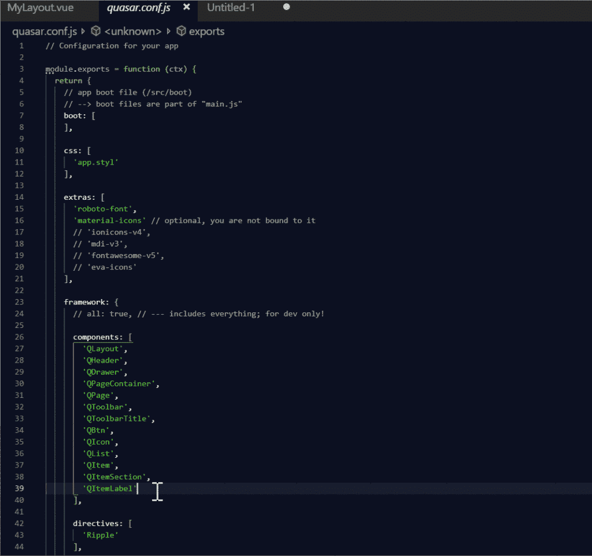

一旦我们保存了这些更改，我们应该会在浏览器中看到结果。

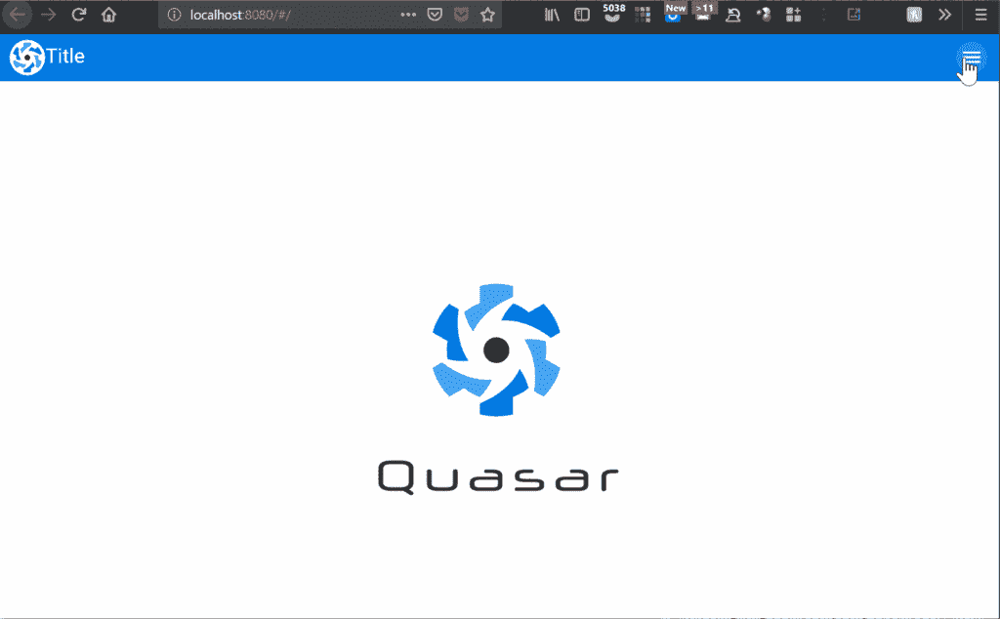

现在，我们将通过向`src/pages/Index.vue`添加代码，向中心区域添加一个类星体表组件。我们将简单地替换类星体标志`img`标签:

```
 
```

…带表格代码:

```
<div class="q-pa-md">
  <q-table
    title="Treats"
    :data="data"
    :columns="columns"
    row-key="name"
  />
</div> 
```

我们还将在同一个文件的`<script>`标记中向`export default`对象添加以下内容:

```
data () {
    return {
      columns: [
        {
          name: 'name',
          required: true,
          label: 'Dessert (100g serving)',
          align: 'left',
          field: row => row.name,
          format: val => `${val}`,
          sortable: true
        },
        { name: 'calories', align: 'center', label: 'Calories', field: 'calories', sortable: true },
        { name: 'fat', label: 'Fat (g)', field: 'fat', sortable: true },
        { name: 'carbs', label: 'Carbs (g)', field: 'carbs' },
        { name: 'protein', label: 'Protein (g)', field: 'protein' },
        { name: 'sodium', label: 'Sodium (mg)', field: 'sodium' },
        { name: 'calcium', label: 'Calcium (%)', field: 'calcium', sortable: true, sort: (a, b) => parseInt(a, 10) - parseInt(b, 10) },
        { name: 'iron', label: 'Iron (%)', field: 'iron', sortable: true, sort: (a, b) => parseInt(a, 10) - parseInt(b, 10) }
      ],
      data: [
        {
          name: 'Frozen Yogurt',
          calories: 159,
          fat: 6.0,
          carbs: 24,
          protein: 4.0,
          sodium: 87,
          calcium: '14%',
          iron: '1%'
        },
        {
          name: 'Ice cream sandwich',
          calories: 237,
          fat: 9.0,
          carbs: 37,
          protein: 4.3,
          sodium: 129,
          calcium: '8%',
          iron: '1%'
        },
        {
          name: 'Eclair',
          calories: 262,
          fat: 16.0,
          carbs: 23,
          protein: 6.0,
          sodium: 337,
          calcium: '6%',
          iron: '7%'
        },
        {
          name: 'Cupcake',
          calories: 305,
          fat: 3.7,
          carbs: 67,
          protein: 4.3,
          sodium: 413,
          calcium: '3%',
          iron: '8%'
        },
        {
          name: 'Gingerbread',
          calories: 356,
          fat: 16.0,
          carbs: 49,
          protein: 3.9,
          sodium: 327,
          calcium: '7%',
          iron: '16%'
        },
        {
          name: 'Jelly bean',
          calories: 375,
          fat: 0.0,
          carbs: 94,
          protein: 0.0,
          sodium: 50,
          calcium: '0%',
          iron: '0%'
        },
        {
          name: 'Lollipop',
          calories: 392,
          fat: 0.2,
          carbs: 98,
          protein: 0,
          sodium: 38,
          calcium: '0%',
          iron: '2%'
        },
        {
          name: 'Honeycomb',
          calories: 408,
          fat: 3.2,
          carbs: 87,
          protein: 6.5,
          sodium: 562,
          calcium: '0%',
          iron: '45%'
        },
        {
          name: 'Donut',
          calories: 452,
          fat: 25.0,
          carbs: 51,
          protein: 4.9,
          sodium: 326,
          calcium: '2%',
          iron: '22%'
        },
        {
          name: 'KitKat',
          calories: 518,
          fat: 26.0,
          carbs: 65,
          protein: 7,
          sodium: 54,
          calcium: '12%',
          iron: '6%'
        }
      ]
    }
  }
} 
```

(这是我们从 Quasar docs 中获取的一个对象。)

我们还需要像添加`QAvatar`一样将`QTable`组件添加到`quasar.conf.js`中，现在我们应该会在布局的中间看到一个表格:

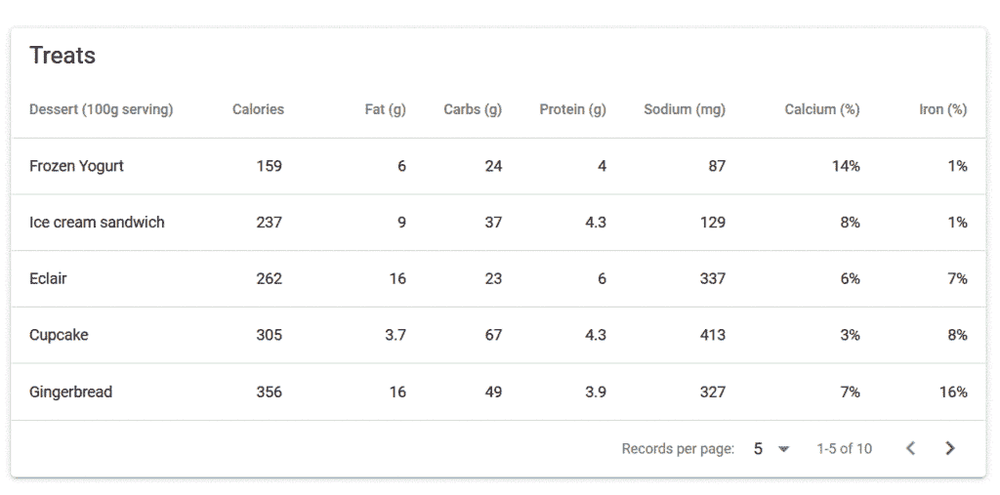

表格组件的参考可以在[这里](https://v1.quasar-framework.org/vue-components/table)找到。

Quasar v1 的新成员是`QMarkupTable`，一个[组件](https://v1.quasar-framework.org/vue-components/markup-table)，它可以用来包装一个常规的 HTML 表格，赋予它*材质设计*风格。

为了测试另一个组件，我们将向`router/routes.js`添加一条`/editor`路由:

```
const routes = [
  {
    path: '/',
    component: () => import('layouts/MyLayout.vue'),
    children: [
      { path: '', component: () => import('pages/Index.vue') }
    ]
  },
  {
    path: '/editor',
    component: () => import('layouts/MyLayout.vue'),
    children: [
      { path: '', component: () => import('pages/Editor.vue') }
    ]
  }
]

// Always leave this as last one
if (process.env.MODE !== 'ssr') {
  routes.push({
    path: '*',
    component: () => import('pages/Error404.vue')
  })
}

export default routes 
```

我们现在添加一个[编辑器组件](https://v1.quasar-framework.org/vue-components/editor)。我们将把`QEditor`加到`quasar.conf.js`，我们将把`src/pages/Index.vue`复制到`src/pages/Editor.vue`。

然后我们将这段代码添加到最初替换了`Index.vue`文件中的`img`标签的副本中:

```
 <div class="q-pa-md q-gutter-sm">
    <q-editor
      v-model="editor"
      :definitions="{
        save: {
          tip: 'Save!',
          icon: 'save',
          label: 'Save',
          handler: saveWork
        },
        upload: {
          tip: 'Upload!',
          icon: 'cloud_upload',
          label: 'Upload',
          handler: uploadIt
        }
      }"
      :toolbar="[
        ['bold', 'italic', 'strike', 'underline'],
        ['upload', 'save']
      ]"
    />
  </div> 
```

*注意:我们也从 Editor.vue 的 q-page 标签中删除了 flex 类*

我们还需要确保`Editor.vue`文件中的`script`标签看起来像这样:

```
<script>
  export default {
    name: 'PageEditor',
    data () {
      return {
          editor: 'this is a test'
      }
    },
    methods: {
      saveWork () {
        this.$q.notify({
          message: 'Saved your text in the browser storage',
          color: 'green-4',
          textColor: 'white',
          icon: 'fas fa-check-circle'
        })
      },
      uploadIt () {
        this.$q.notify({
          message: 'Error! Check your connection',
          color: 'red-5',
          textColor: 'white',
          icon: 'fas fa-exclamation-triangle'
        })
      }
    }
  }
</script> 
```

注意:当我们编译时，我们可能会遇到缩进错误，这应该不难解决。

当我们导航到`http://localhost:8080/#/editor`时，我们应该看到编辑器:

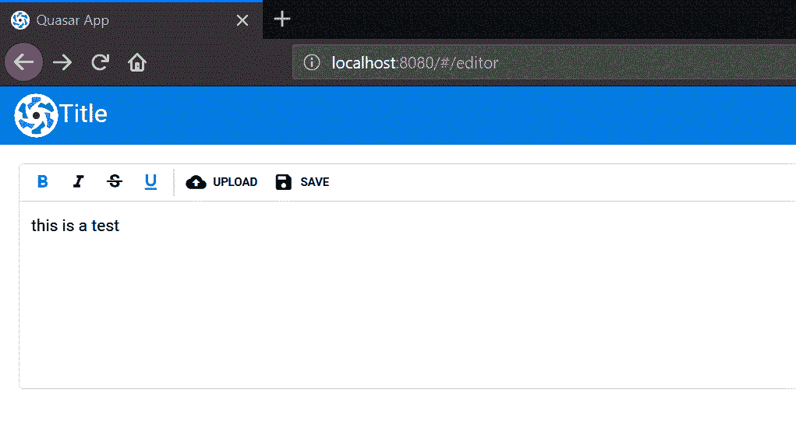

这是一个<abbr title="what you see is what you get">所见即所得</abbr>编辑器——并且[它的工具栏有更多可用的](https://v1.quasar-framework.org/vue-components/editor)项。

实际上，我们将会在我们的应用程序中添加[axios](https://github.com/axios/axios)——一个用于 Ajax 请求的[推荐库](https://quasar-framework.org/guide/ajax-requests.html)——以及用于处理其他 Quasar 工具中的数据的 [Vuex](https://www.sitepoint.com/premium/books/getting-started-with-vuex-a-beginner-s-guide?utm_source=blog&utm_medium=referralarticle&utm_campaign=tonino) 。

## 结论

Quasar 提供了比我们在本教程中所能涵盖的更多的组件、特性、风格和工具。这是一个用于创建单页面应用程序的全面框架，但并不局限于此。

这仅仅是对它的一个介绍，决不是全面的介绍。但是我们已经讨论了最常成为采用的最大障碍的部分:理解设置和搭建过程。有了我们图书馆中关于 Vue.js 的[其余文献，以及 Quasar 网站上的优秀文档，本教程将使您有可能直接进入制作真实生活中的 Quasar 应用程序。](https://www.sitepoint.com/premium/library/javascript?utm_source=blog&utm_medium=referralarticle&utm_campaign=tonino)

## 分享这篇文章