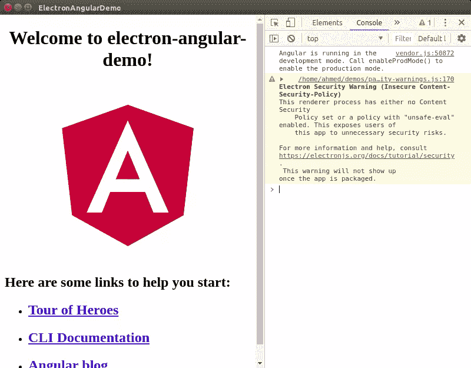
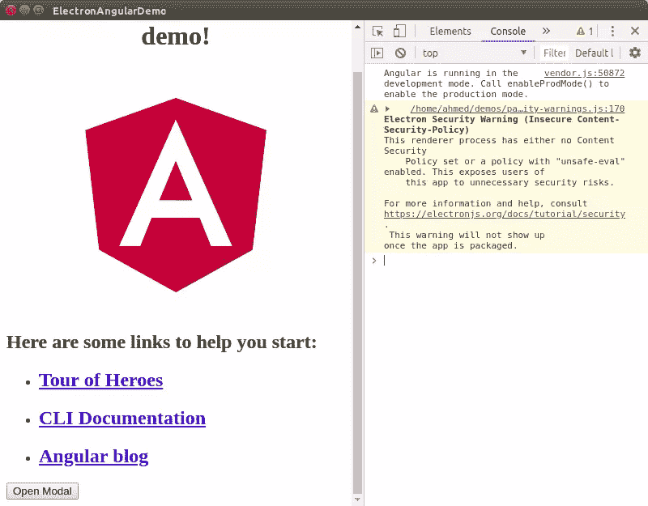
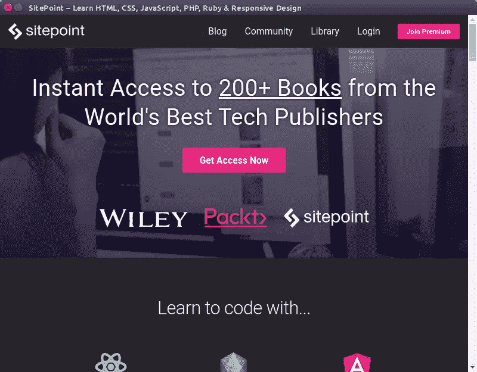

# 用电子和角度构建一个桌面应用程序

> 原文：<https://www.sitepoint.com/build-a-desktop-application-with-electron-and-angular/>

在本教程中，我们将使用电子和 web 技术(如 TypeScript 和 Angular)构建一个跨平台的桌面应用程序。

[Electron.js](https://electronjs.org/) 是一个流行的平台，用于使用 JavaScript、HTML 和 CSS 构建 Windows、Linux 和 macOS 的跨平台桌面应用程序。它是由 GitHub 创建和维护的，在 MIT 许可协议下是可用的。它最初是为 GitHub 的 [Atom 编辑器](https://atom.io/)创建的，但后来被微软( [Visual Studio Code](https://code.visualstudio.com/) )、脸书、Slack 和 Docker 等公司用来创建应用程序。

Electron 利用了 Google Chromium 和 Node.js 等强大的平台，但也提供了自己的一套丰富的 API 来与底层操作系统进行交互。

Electron 提供了一个本机容器来包装 web 应用程序，因此它们看起来和感觉上就像可以访问操作系统功能的桌面应用程序(类似于移动应用程序的 Cordova)。这意味着我们可以使用任何 JavaScript 库或框架来构建我们的应用程序。在本教程中，我们将使用角度。

## 先决条件

对于本教程，您需要具备以下先决条件:

*   熟悉打字稿和 Angular。
*   Node.js 和 npm 安装在开发机器上。

## 安装角度 CLI

让我们从安装 Angular CLI 开始，它是创建和使用 Angular 项目的官方工具。打开一个新终端并运行以下命令:

```
npm install -g @angular/cli 
```

我们将在我们的系统上全局安装 Angular CLI。如果命令失败并出现 **EACCESS** 错误，在 Linux 或 macOS 中，在命令前添加`sudo`，或者在 Windows 中以管理员身份运行命令提示符。

如果 CLI 安装成功，请导航到您的工作目录，并使用以下命令创建一个新的 Angular 项目:

```
cd ~
ng new electron-angular-demo 
```

等待生成项目文件，并从 npm 安装依赖项。接下来，导航到项目的根目录并运行以下命令，从 npm 安装最新版本的 Electron 作为开发依赖项:

```
npm install --save-dev electron@latest 
```

在撰写本文时，该命令将安装**电子版本 4.1.4** 。

接下来，创建一个`main.js`文件并添加以下代码:

```
 const {app, BrowserWindow} = require('electron')
    const url = require("url");
    const path = require("path");

    let mainWindow

    function createWindow () {
      mainWindow = new BrowserWindow({
        width: 800,
        height: 600,
        webPreferences: {
          nodeIntegration: true
        }
      })

      mainWindow.loadURL(
        url.format({
          pathname: path.join(__dirname, `/dist/index.html`),
          protocol: "file:",
          slashes: true
        })
      );
      // Open the DevTools.
      mainWindow.webContents.openDevTools()

      mainWindow.on('closed', function () {
        mainWindow = null
      })
    }

    app.on('ready', createWindow)

    app.on('window-all-closed', function () {
      if (process.platform !== 'darwin') app.quit()
    })

    app.on('activate', function () {
      if (mainWindow === null) createWindow()
    }) 
```

这段代码简单地创建了一个 GUI 窗口，并加载了`index.html`文件，在我们构建了 Angular 应用程序之后，这个文件应该在`dist`文件夹下。这个示例代码改编自[官方入门库](https://github.com/electron/electron-quick-start/blob/master/main.js)。

接下来，打开项目的`package.json`文件，添加`main`键，将`main.js`文件设置为主入口点:

```
 {
      "name": "electron-angular-demo",
      "version": "0.0.0",
      "main": "main.js",
      // [...]
    } 
```

接下来，我们需要添加一个脚本，以便在构建 Angular 项目后轻松启动电子应用程序:

```
 {
      "name": "electron-angular-demo",
      "version": "0.0.0",
      "main": "main.js",
      "scripts": {
        "ng": "ng",
        "start": "ng serve",
        "build": "ng build",
        "test": "ng test",
        "lint": "ng lint",
        "e2e": "ng e2e",
        "start:electron": "ng build --base-href ./ && electron ."
      }, 
      // [...]
    } 
```

我们添加了运行`ng build --base-href ./ && electron .`命令的`start:electron`脚本:

*   该命令的`ng build --base-href ./`部分构建 Angular app，并将基本 href 设置为`./`。
*   命令的`electron .`部分从当前目录启动我们的电子应用程序。

现在，在您的终端中，运行以下命令:

```
npm run start:electron 
```

将会打开一个电子 GUI 窗口，但该窗口是空白的。在控制台中，你会看到**不允许加载本地资源:/electron-angular-demo/dist/index . html**错误。

Electron 无法从`dist`文件夹中加载该文件，因为它根本不存在。如果你查看你的项目文件夹，你会看到 Angular CLI 在`dist/electron-angular-demo`文件夹中构建你的应用，而不仅仅是在`dist`文件夹中。

在我们的`main.js`文件中，我们告诉电子公司在没有子文件夹的`dist`文件夹中寻找`index.html`文件:

```
 mainWindow.loadURL(
        url.format({
          pathname: path.join(__dirname, `/dist/index.html`),
          protocol: "file:",
          slashes: true
        })
      ); 
```

`__dirname`指的是我们运行电子程序的当前文件夹。

我们使用`path.join()`方法将当前文件夹的路径与`/dist/index.html`路径连接起来。

您可以将路径的第二部分更改为`/dist/electron-angular-demo/index.html`，或者更好的是，更改 Angular 配置以输出`dist`文件夹中的文件，而不使用子文件夹。

打开`angular.json`文件，找到`projects → architect → build → options → outputPath`键，将其值从`dist/electron-angular-demo`改为`dist`:

```
 "projects": {
        "electron-angular-demo": {
          "root": "",
          "sourceRoot": "src",
          "projectType": "application",
          "prefix": "app",
          "schematics": {},
          "architect": {
            "build": {
              "builder": "@angular-devkit/build-angular:browser",
              "options": {
                "outputPath": "dist", 
```

回到您的终端，再次运行以下命令:

```
npm run start:electron 
```

该脚本将调用`ng build`命令在`dist`文件夹中构建 Angular 应用程序，并从当前文件夹调用`electron`来启动加载了 Angular 应用程序的电子窗口。

这是我们运行 Angular 的桌面应用程序的屏幕截图:



## 从 Angular 调用电子 API

现在让我们看看如何从 Angular 调用电子 API。

电子应用程序使用运行 Node.js 的主进程和运行 Chromium 浏览器的呈现器进程。我们不能从 Angular 应用程序直接访问所有的电子 API。

我们需要利用 IPC 或[进程间通信](https://en.wikipedia.org/wiki/Inter-process_communication)，这是操作系统提供的一种机制，允许不同进程之间的通信。

并非所有的电子 API 都需要从主进程中访问。有些 API 可以从渲染器进程访问，有些 API 可以从主进程和渲染器进程访问。

[BrowserWindow](https://electronjs.org/docs/api/browser-window) ，用于创建和控制浏览器窗口，仅在主进程中可用。[桌面捕获器](https://electronjs.org/docs/api/desktop-capturer) API(用于使用`navigator.mediaDevices.getUserMedia` API 从桌面捕获音频和视频)仅在渲染器进程中可用。同时[剪贴板](https://electronjs.org/docs/api/clipboard) API(用于在系统剪贴板上执行复制和粘贴操作)在主进程和渲染器进程上都可用。

你可以从[官方文档](https://electronjs.org/docs/api)中看到完整的 API 列表。

让我们看一个从 Angular 应用程序调用`BrowserWindow` API 的例子，这个 API 只在主进程中可用。

打开`main.js`文件，导入`ipcMain`:

```
 const {app, BrowserWindow, ipcMain} = require('electron') 
```

接下来，定义`openModal()`函数:

```
 function openModal(){
      const { BrowserWindow } = require('electron');
      let modal = new BrowserWindow({ parent: mainWindow, modal: true, show: false })
      modal.loadURL('https://www.sitepoint.com')
      modal.once('ready-to-show', () => {
        modal.show()
      })
    } 
```

这个方法将创建一个子模态窗口，在其中加载`https://www.sitepoint.com` URL，并在准备好的时候显示它。

接下来，监听渲染器进程发送的`openModal`消息，并在收到消息时调用`openModal()`函数:

```
 ipcMain.on('openModal', (event, arg) => {
      openModal()
    }) 
```

现在，打开`src/app/app.component.ts`文件并添加以下导入:

```
import { IpcRenderer } from 'electron'; 
```

接下来，定义一个`ipc`变量并调用`require('electron').ipcRenderer`将`ipcRenderer`导入到您的角度分量中:

```
 private ipc: IpcRenderer
      constructor(){
        if ((<any>window).require) {
          try {
            this.ipc = (<any>window).require('electron').ipcRenderer;
          } catch (e) {
            throw e;
          }
        } else {
          console.warn('App not running inside Electron!');
        }
      } 
```

`require()`方法是在运行时由 Electron 注入到 renderer 进程中的，因此，只有在 Electron 中运行 web 应用程序时，它才可用。

最后，添加下面的`openModal()`方法:

```
 openModal(){
        console.log("Open a modal");
        this.ipc.send("openModal");
      } 
```

我们使用`ipcRenderer`的`send()`方法向主进程发送一条`openModal`消息。

打开`src/app/app.component.html`文件，添加一个按钮，然后绑定到`openModal()`方法:

```
 <button (click)="openModal()">
      Open Modal
    </button> 
```

现在，使用以下命令运行您的桌面应用程序:

```
npm run start:electron 
```

这是带有按钮的主窗口的屏幕截图:



如果您点击**打开模态**按钮，将会打开一个模态窗口，显示 SitePoint 网站:



你可以从这个 [GitHub 库](https://github.com/techiediaries/electron-angular-demo)中找到这个演示的源代码。

## 结论

在本教程中，我们已经了解了如何使用 electronic 将 Angular 构建的 web 应用程序作为桌面应用程序运行。我们希望您已经了解了使用您的 web 开发工具包开始构建桌面应用程序是多么容易！

## 分享这篇文章