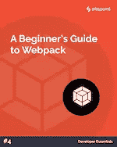
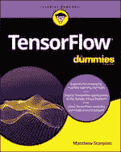
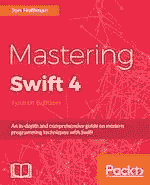
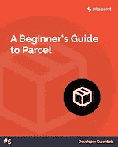
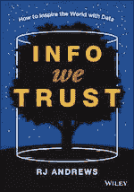

# SitePoint Premium 新版本:Webpack、TensorFlow、Swift & Parcel

> 原文：<https://www.sitepoint.com/sitepoint-premium-new-releases-webpack-tensorflow-swift-parcel/>

我们正努力通过 SitePoint Premium 让您在自己的领域保持领先地位。我们有很多新书可以在图书馆借阅——让我们给你介绍一下。

## Webpack 初学者指南

第一次使用 JavaScript 模块 bundler webpack 时，可能很难理解应该如何使用它。虽然它有很好的文档，但对于新手来说，它可能会令人望而生畏，并且有一个陡峭的学习曲线。在本教程中，我们将介绍所有的核心概念让你开始。

阅读[web pack](https://www.sitepoint.com/premium/books/a-beginner-s-guide-to-webpack/read?from=mailer&utm_source=email&utm_medium=newsletter&utm_campaign=24may2019)的初学者指南。

## 假人张量流

这本书涵盖了统计回归和神经网络，用 TensorBoard 可视化机器学习，用卷积神经网络执行图像识别，用递归神经网络分析序列数据，在移动设备和 Google Cloud 上执行 TensorFlow。

阅读 [TensorFlow For Dummies](https://www.sitepoint.com/premium/books/tensorflow-for-dummies/read?from=mailer&utm_source=email&utm_medium=newsletter&utm_campaign=24may2019) 。

## 掌握 Swift 4 第四版

通过这本高级开发书籍深入了解最新的 Swift 版本，以构建高性能应用程序。了解如何开发高质量的 iOS 和 macOS 应用程序，使用高级功能、协议扩展、错误处理以及设计技术和模式来编写更智能、更干净的代码。

阅读[掌握 Swift 4 第四版](https://www.sitepoint.com/premium/books/mastering-swift-4-fourth-edition/read?from=mailer&utm_source=email&utm_medium=newsletter&utm_campaign=24may2019)。

## 包裹初学者指南

用它来学习包裹！我们将使用普通的 JavaScript 构建一个简单的单页面应用程序。我们稍后将把它转换成 React，看看使用 Parcel 构建这样一个项目需要多少配置。

阅读[包裹](https://www.sitepoint.com/premium/books/a-beginner-s-guide-to-parcel/read?from=mailer&utm_source=email&utm_medium=newsletter&utm_campaign=24may2019)初学者指南。

## 我们信任的信息

这本书深入挖掘了丰富的“通知”艺术(数据可视化、数据讲故事、仪表板设计、信息图创建)，解释了如何将数据转化为可以娱乐、改善和激励的信息，并涵盖了视觉隐喻和数据转换等高级技术。

阅读[我们信任的信息](https://www.sitepoint.com/premium/books/info-we-trust/read?from=mailer&utm_source=email&utm_medium=newsletter&utm_campaign=24may2019)。

## 还会有更多…

我们几乎每天都在 SitePoint Premium 上发布新内容，所以下周我们将带着最新更新回来。别忘了:如果你还没有查看我们的产品，可以去我们的[图书馆转转](https://www.sitepoint.com/?utm_source=email&utm_medium=newsletter&utm_campaign=24may2019)。

## 分享这篇文章