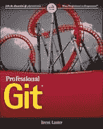
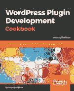
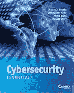
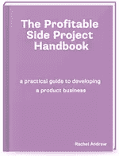
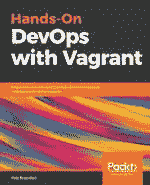

# SitePoint Premium 新版本:Git、网络安全、DevOps +等等

> 原文：<https://www.sitepoint.com/sitepoint-premium-new-releases-git-cybersecurity-devops-more/>

我们正努力通过 SitePoint Premium 让您在自己的领域保持领先地位。我们有很多新书可以在图书馆借阅——让我们给你介绍一下。

## 职业饭桶

这本书让你进入 Git 的思维模式，解释基本的 Git 模型和整体工作流程，Git 版本的通用源代码管理概念和命令，如何跟踪变更，与分支合作，利用 Git 的全部功能，以及如何避免失误和失误。

读[职业 Git](https://www.sitepoint.com/premium/books/professional-git/?utm_source=blog&utm_medium=articles) 。

## WordPress 插件开发指南

这本书详细介绍了创建 WordPress 4.x 插件的步骤、解释和代码示例。学习如何扩展 WordPress，如何使用 WordPress 插件 API，以及如何根据你的项目需求来改造 WordPress。

阅读 [WordPress 插件开发食谱](https://www.sitepoint.com/premium/books/wordpress-plugin-development-cookbook/?utm_source=blog&utm_medium=articles)。

## 网络安全基础知识

对网络安全概念和实践的全面介绍，专家涵盖了入门级网络安全认证所需的基本主题。了解安全和监控基础知识，如何保护远程访问，如何识别威胁并形成有效的防御。

阅读[网络安全基础知识](https://www.sitepoint.com/premium/books/cybersecurity-essentials/?utm_source=blog&utm_medium=articles)。

## 有利可图的副业项目手册

你梦想着能在睡觉的时候挣钱吗？当你出去吃饭的时候看到销售进来？创造一个伟大的产品，作为一个真正的，可持续发展的盈利企业？这本书将帮助你启动自己的创收项目。

阅读[有利可图的副业项目手册](https://www.sitepoint.com/premium/books/the-profitable-side-project-handbook/?utm_source=blog&utm_medium=articles)。

## 与流浪者一起实践 DevOps

使用 vagger 轻松构建完整的开发环境。有效实施与流浪者的 DevOps。整合流浪者与不同的工具，如木偶，厨师，码头工人。用实用的方法管理基础设施。

与流浪者一起阅读[手把手的 DevOps。](https://www.sitepoint.com/premium/books/hands-on-devops-with-vagrant/?utm_source=blog&utm_medium=articles)

## 还会有更多…

我们几乎每天都在 SitePoint Premium 上发布新内容，所以下周我们将带着最新更新回来。如果你还不是会员，[每月 14.99 美元](https://www.sitepoint.com/premium/?utm_source=blog&utm_medium=articles)来看看我们的图书馆。

## 分享这篇文章