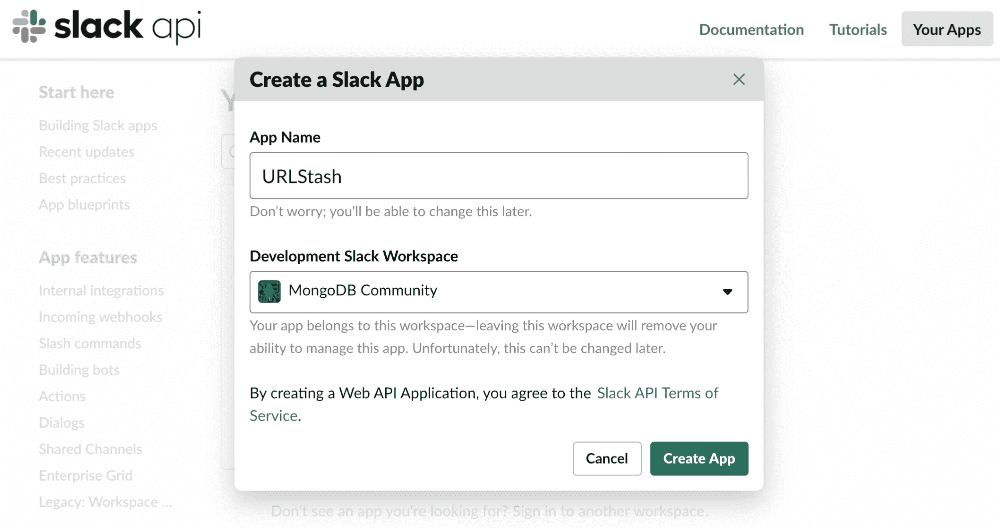
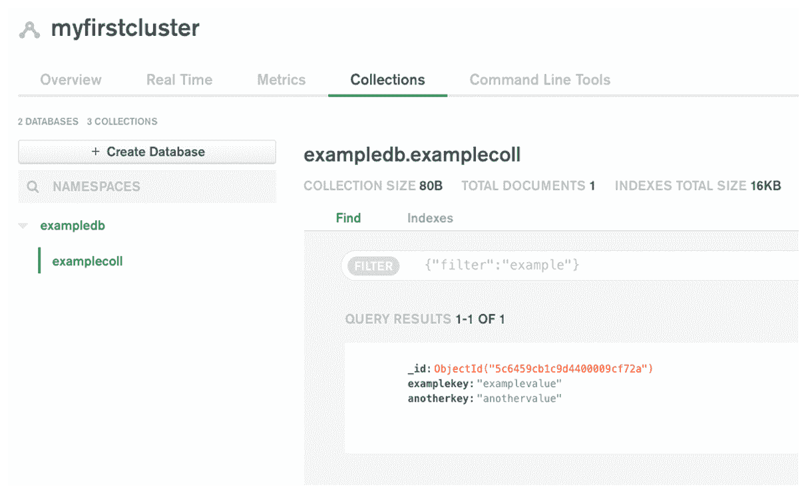
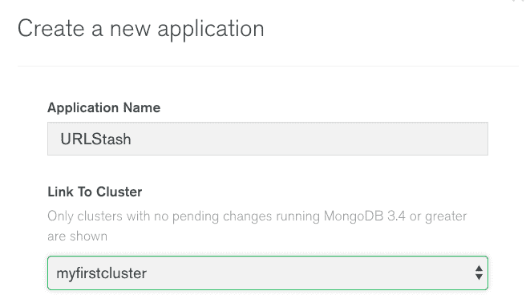
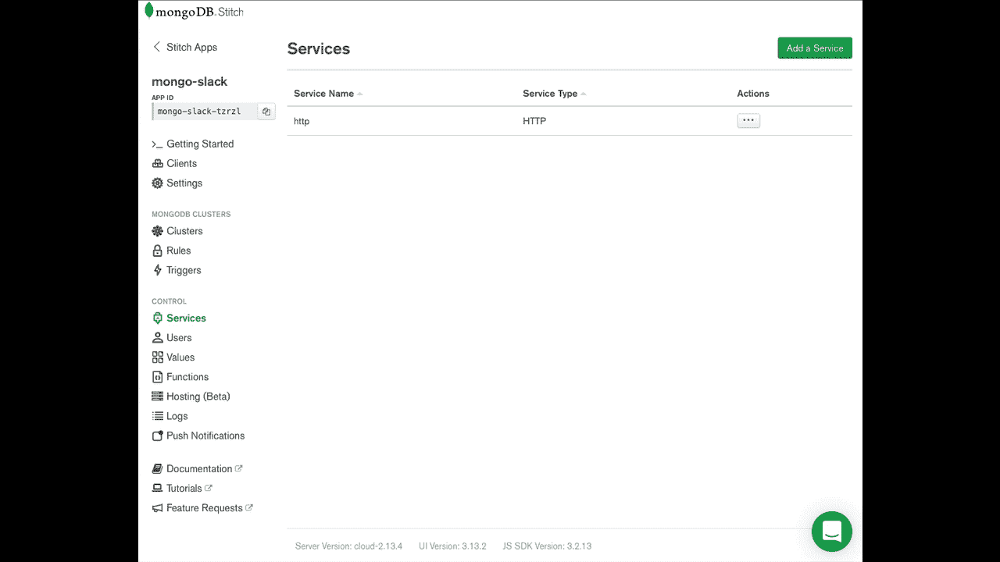
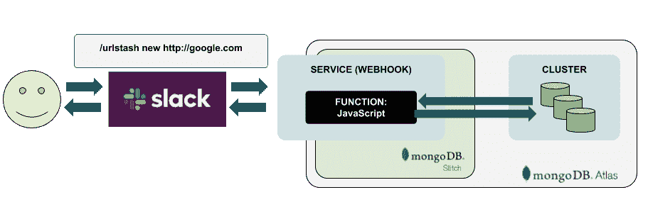
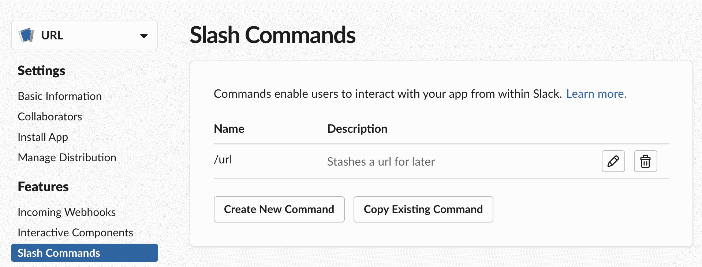
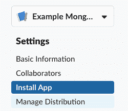
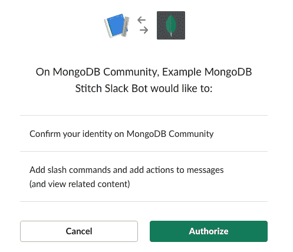
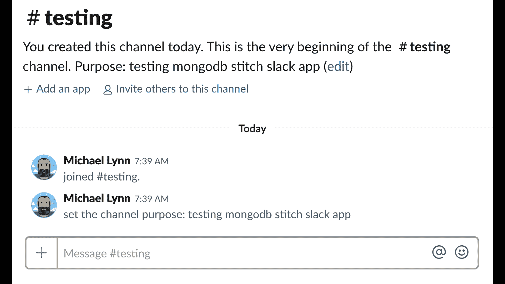

# 使用 MongoDB Stitch 在 10 分钟内构建一个 Slack 应用程序

> 原文：<https://www.sitepoint.com/build-a-slack-app-in-10-minutes-with-mongodb-stitch/>

*本文最初发表于 [MongoDB](https://synd.co/2OVKJQ1) 。感谢您对使 SitePoint 成为可能的合作伙伴的支持。*

Slack 不仅是历史上[发展最快的初创公司](https://www.forbes.com/sites/johnkoetsier/2018/11/30/how-slack-became-the-fastest-growing-enterprise-software-ever/)，它还是一款同名应用，也是当今最受欢迎的通信工具之一。我们在 MongoDB 广泛使用它来促进团队之间和整个公司之间的有效沟通。我们并不孤单。似乎我遇到的每个开发人员都在他们的公司使用它。

Slack 的一个有趣之处(有很多)是它的可扩展性。有几种方法可以延长时差。构建聊天机器人，即与通信服务交互的应用程序，并通过引入称为“斜杠命令”的附加命令来扩展 Slack，使 Slack 用户能够与外部服务通信。在本文中，我们将构建一个简单的 slash 命令，使用户能够在 MongoDB 数据库中存储和检索数据。我总是在互联网上找到有趣的信息，我想与我的团队成员分享，所以让我们构建一个名为 *URL Stash* 的应用程序，它将存储有趣的 URL，供以后通过 Slack slash 命令检索。现在，跟随下面的视频或者跳过视频继续阅读细节。

[https://www.youtube.com/embed/FLSvZ2WmYzc?feature=oembed](https://www.youtube.com/embed/FLSvZ2WmYzc?feature=oembed)

## 创建一个 Slack 应用程序

首先登录到您的 slack 团队，或者您可以创建一个新的团队进行测试。访问 [Slack API 控制台](https://api.slack.com/apps?new_app=1)创建一个新的 Slack 应用。



你需要有一个松散的团队或实例，我们可以安装和测试 URL 存储。我将使用 [MongoDB 社区 Slack](https://launchpass.com/mongo-db) 实例。一旦我们在团队工作区中创建了应用程序，我们可以暂时将 Slack 应用程序放在一边，创建应用程序的另一半 MongoDB Atlas 集群、数据库、集合和 Stitch 应用程序。

## 创建地图集集群、数据库和集合

隐藏 URL 意味着我们需要一个地方来存储它们。对于这个例子，我们将展示使用 MongoDB Atlas 来做这件事是多么容易。我们首先登录 MongoDB Atlas，[创建一个集群](https://docs.mongodb.com/manual/tutorial/atlas-free-tier-setup/)，一个数据库和一个集合。你可以[免费启动](https://docs.atlas.mongodb.com/getting-started/)并创建一个 [M0 类集群实例](https://docs.atlas.mongodb.com/reference/free-shared-limitations/)。启动集群后，使用 Atlas 中的集合查看器创建一个数据库和一个集合。我把我的命名为 *exampledb* 和 *examplecoll* ，但是你可以随便叫你的名字。您只需要确保在下一节我们将在 Stitch 中创建的函数中正确引用它们。



## 创建缝合应用程序

缝合应用程序与特定的集群相关联，因此创建集群后，您可以在 Atlas 的左侧导航菜单中单击缝合应用程序，然后单击创建新应用程序。



## 创建服务

Stitch 中的服务是与外部世界集成的主要点——在本例中是 Slack。让我们创建一个 HTTP 服务来提供 Slack 和 Stitch 之间的集成点。

单击服务，添加新服务，单击 HTTP，并命名服务。单击添加服务。然后，在“设置”标签中，给传入的 webhook 起一个有意义的名字。我选择了“懈怠”,但是你可以给它起任何你喜欢的名字。webhook 会提供一个外部网址，插入到你的 Slack 应用中。

插入这个 webhook URI，将告诉你的 Slack 应用程序将对话的某些细节从 Slack 发送到你新创建的 Stitch 应用程序。

一旦你点击保存，你新创建的 webhook 将被分配一个公共 URI，你将能够编辑 JavaScript 代码，当一个请求被发送到你的 webhook 时，该代码将被执行。您可能想要复制 Webhook URL，因为当我们创建 Slack slash 命令时，您将很快需要它。



这就是奇迹发生的地方。在短短几分钟内，我们就在 Slack 和 Stitch 之间创建了一个集成。为您的服务设置一些配置(命名)的简单操作就是所需要的全部。让我们把注意力转向我们将用来为我们的 Slack 用户存储和检索 URL 的代码。

一个 [Stitch 服务](https://docs.mongodb.com/stitch/services/http/)的核心是当它通过 Webhook URL 接收到一个传入请求时运行的函数。在这种情况下，我们选择响应 POST 请求。在 Slack 中，我们将通过 POST 将来自 slash 命令的数据发送到我们的 Stitch 函数。我们将评估用户作为 slash 命令的一部分发送的文本，或者隐藏一个 URL，或者列出先前已经隐藏的现有 URL。



由于该函数从 Slack 接收细节，我们将在 slash 命令本身之后启用一组简单的命令。我们希望用户能够存储 URL，所以我们将使用命令格式:

`/url stash https%3A%2F%2Feditor.sitepoint.com`

由于我们希望用户能够查看之前隐藏的 URL，我们将启用“列表”选项:

`/url list`

最后，由于我们希望用户能够删除他们之前添加的 URL，我们将启用“删除”选项:

`/url remove https%3A%2F%2Feditor.sitepoint.com`

记住这些基本命令，让我们为服务内部的函数编写一些基本的 JavaScript:

```
exports = async function (payload) {
   const mongodb = context.services.get("mongodb-atlas");
   const exampledb = mongodb.db("exampledb");
   const examplecoll = exampledb.collection("examplecoll");

   const args = payload.query.text.split(" ");

   switch (args[0]) {
       case "stash":
           const result = await examplecoll.insertOne({
               user_id: payload.query.user_id,
               when: Date.now(),
               url: args[1]
           });
           if (result) {
               return {
                   text: `Stashed ${args[1]}`
               };
           }
           return {
               text: `Error stashing`
           };
       case "list":
           const findresult = await examplecoll.find({}).toArray();
           const strres = findresult.map(x => `<${x.url}|${x.url}>  by <@${x.user_id}> at ${new Date(x.when).toLocaleString()}`).join("\n");
           return {
               text: `Stash as of ${new Date().toLocaleString()}\n${strres}`
           };
       case "remove":
           const delresult = await examplecoll.deleteOne({
               user_id: {
                   $eq: payload.query.user_id
               },
               url: {
                   $eq: args[1]
               }
           });
           return {
               text: `Deleted ${delresult.deletedCount} stashed items`
           };
       default:
           return {
               text: "Unrecognized"
           };
   }
} 
```

*Stitch 中 Slack HTTP 服务的示例函数*

我们函数的核心是 switch 语句，它评估 Slack 用户发送给命令的文本。

## 创建斜线命令

让我们完成这个过程的最后一步，向我们的 Slack 应用程序添加一个 slash 命令。要做到这一点，回到 Slack 应用控制台，点击“斜线命令”。



*在 Slack 中创建斜线命令*

命名您的斜杠命令。请记住，您需要获取我们在上一节中创建的 MongoDB Stitch 服务 webhook URI。一旦你保存了这个斜杠命令，你应该从 Slack 的应用管理控制台的左侧导航栏中选择 Install Your app。



*安装 App*

这将提示您确认您在 slack 团队中的身份，并授权该应用程序在您的工作区中使用。



*授权 app 安装*

一旦这个完成，你的应用程序就快完成了。您可以切换回您的 Slack 客户端，访问您自己的个人聊天频道以保护隐私，同时测试并键入您新创建的 Slack slash 命令。比如"/**URL**stash[http://MongoDB . com "](http://mongodb.com)。按回车键会把命令发送到 Slack，然后发送到你新创建的 Stitch 应用。您应该会看到类似下面这样的响应:



就是这么简单，您已经创建了一个功能完整的 Slack 聊天机器人，或者至少是一个 slash 命令，只有几行代码，不涉及服务器！

这仅仅是一个起点，现在你应该能够轻松地在你的新 Slack 应用中添加更多的功能。要查看更多细节和分叉项目，请前往 [GitHub 库](https://github.com/mrlynn/mongodb-stitch-slack-urlstash)。

## 分享这篇文章