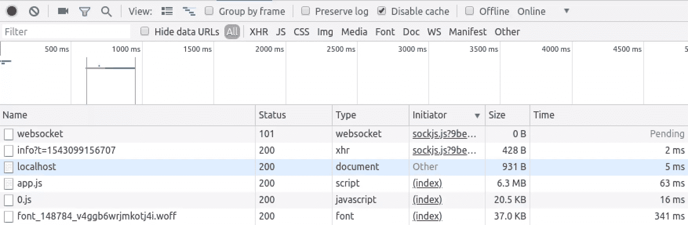
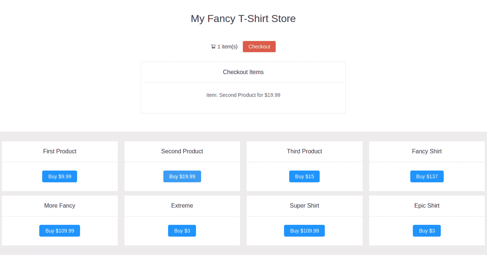

# 使用异步组件优化 Vue 应用的性能

> 原文：<https://www.sitepoint.com/vue-async-components/>

*想从头学起 Vue.js？使用 SitePoint Premium 获得涵盖基础知识、项目、技巧和工具&的 Vue 书籍全集。[现在就加入，每月仅需 14.99 美元](https://www.sitepoint.com/premium/products/Z2lkOi8vbGVhcm5hYmxlL1Byb2R1Y3QvMzE3?utm_source=blog&utm_medium=articles)。*

单页应用程序有时会因为其缓慢的初始加载而受到批评。这是因为传统上，服务器会向客户端发送一大堆 JavaScript，在屏幕上显示任何内容之前，必须下载并解析这些 JavaScript。你可以想象，随着你的应用程序变大，这可能会变得越来越有问题。

幸运的是，当使用 Vue CLI(使用 webpack)构建 Vue 应用程序时，有许多方法可以解决这个问题。在本文中，我将演示如何利用异步组件和 webpack 的代码分割功能在应用程序初始呈现后加载页面的部分内容。这将保持初始加载时间最短，给你的应用一个更快的感觉。

要学习本教程，您需要对 Vue.js 和 Node.js 有基本的了解。

## 异步组件

在我们开始创建异步组件之前，让我们看看我们通常是如何加载组件的。为此，我们将使用一个非常简单的消息组件:

```
<!-- Message.vue -->
<template>
  <h1>New message!</h1>
</template> 
```

现在我们已经创建了组件，让我们将它加载到我们的`App.vue`文件中并显示它。我们只需导入组件并将其添加到 components 选项，这样我们就可以在模板中使用它:

```
<!-- App.vue -->
<template>
  <div>
    <message></message>
  </div>
</template>

<script> import Message from "./Message";
export default {
  components: {
    Message
  }
}; </script> 
```

但是现在会发生什么呢？无论何时加载应用程序，都会加载`Message`组件，因此它包含在初始加载中。

对于一个简单的应用程序来说，这听起来可能不是一个大问题，但是考虑一下更复杂的东西，比如网络商店。假设用户向购物篮中添加商品，然后想要结帐，于是单击 check out 按钮，呈现一个包含所选商品所有详细信息的框。使用上面的方法，这个 checkout 框将被包含在初始包中，尽管我们只在用户单击 checkout 按钮时需要这个组件。甚至有可能用户没有点击 checkout 按钮就浏览了网站，这意味着浪费资源来加载这个潜在的未使用的组件是没有意义的。

为了提高应用程序的效率，我们可以将延迟加载和代码拆分技术结合起来。

延迟加载就是延迟组件的初始加载。你可以在像 medium.com 这样的网站上看到惰性加载，图片在需要的时候才被加载。这是有用的，因为我们不必浪费资源预先为一个特定的帖子加载所有的图片，因为读者可能会中途跳过文章。

webpack 提供的代码分割特性允许您将代码分割成不同的包，然后可以按需加载或在以后的某个时间点并行加载。只有在需要或使用时，它才能用来加载特定的代码片段。

## 动态导入

幸运的是，Vue 使用一种叫做**动态导入**的东西来满足这种场景。这个特性引入了一种新的类似函数的导入形式，它将返回一个包含所请求的(Vue)组件的承诺。由于导入是一个接收字符串的函数，我们可以做一些强大的事情，比如使用表达式加载模块。Chrome 从 61 版开始提供动态导入功能。关于他们的更多信息可以在[谷歌开发者网站](https://developers.google.com/web/updates/2017/11/dynamic-import)上找到。

代码分割由 webpack、Rollup 或 Parcel 等捆绑器负责，它们理解动态导入语法，并为每个动态导入的模块创建一个单独的文件。稍后我们将在控制台的网络选项卡中看到这一点。但是首先，让我们看看静态和动态导入之间的区别:

```
// static import
import Message from "./Message";

// dynamic import
import("./Message").then(Message => {
  // Message module is available here...
}); 
```

现在，让我们将这些知识应用到我们的`Message`组件中，我们将得到一个看起来像这样的`App.vue`组件:

```
<!-- App.vue -->
<template>
  <div>
    <message></message>
  </div>
</template>

<script> import Message from "./Message";
export default {
  components: {
    Message: () => import("./Message")
  }
}; </script> 
```

如您所见，`import()`函数将解析一个返回组件的承诺，这意味着我们已经成功地异步加载了组件。如果您查看一下 devtools 的 network 选项卡，您会注意到一个名为`0.js`的文件，其中包含了您的异步组件。



## 有条件地加载异步组件

现在我们已经掌握了异步组件，让我们通过只在真正需要的时候加载它们来真正收获它们的力量。在本文的前一部分中，我解释了只有当用户点击 checkout 按钮时才会加载的 checkout 框的用例。让我们把它建出来。

### 项目设置

如果您没有安装 Vue CLI，您应该现在就下载:

```
npm i -g @vue/cli 
```

接下来，使用 CLI 创建一个新项目，在出现提示时选择默认预设:

```
vue create my-store 
```

转到项目目录，然后安装 [ant-design-vue](https://www.npmjs.com/package/ant-design-vue) 库，我们将使用它进行样式设计:

```
cd my-store
npm i ant-design-vue 
```

接下来，在`src/main.js`中导入 Ant 设计库:

```
import 'ant-design-vue/dist/antd.css' 
```

最后，在`src/comonents`、`Checkout.vue`和`Items.vue`中创建两个新组件:

```
touch src/components/{Checkout.vue,Items.vue} 
```

### 制作商店视图

打开`src/App.vue`，用以下代码替换那里的代码:

```
<template>
  <div id="app">
    <h1>{{ msg }}</h1>
    <items></items>
  </div>
</template>

<script> import items from "./components/Items"

export default {
  components: {
    items
  },
  name: 'app',
  data () {
    return {
      msg: 'My Fancy T-Shirt Store'
    }
  }
} </script>

<style> #app {
  font-family: 'Avenir', Helvetica, Arial, sans-serif;
  -webkit-font-smoothing: antialiased;
  -moz-osx-font-smoothing: grayscale;
  text-align: center;
  color: #2c3e50;
  margin-top: 60px;
}

h1, h2 {
  font-weight: normal;
}

ul {
  list-style-type: none;
  padding: 0;
}

li {
  display: inline-block;
  margin: 0 10px;
}

a {
  color: #42b983;
} </style> 
```

这里没什么特别的。我们所做的只是显示一条消息并呈现一个`<items>`组件。

接下来，打开`src/components/Items.vue`并添加以下代码:

```
<template>
  <div>
    <div style="padding: 20px;">
      <Row :gutter="16">
        <Col :span="24" style="padding:5px">
          <Icon type="shopping-cart" style="margin-right:5px"/>{{shoppingList.length}} item(s)
          <Button @click="show = true" id="checkout">Checkout</Button>
        </Col>
      </Row>
    </div>
    <div v-if="show">
      <Row :gutter="16" style="margin:0 400px 50px 400px">
        <checkout v-bind:shoppingList="shoppingList"></checkout>
      </Row>
    </div>
    <div style="background-color: #ececec; padding: 20px;">
      <Row :gutter="16">
        <Col :span="6" v-for="(item, key) in items" v-bind:key="key" style="padding:5px">
          <Card v-bind:title="item.msg" v-bind:key="key">
            <Button type="primary" @click="addItem(key)">Buy ${{item.price}}</Button>
          </Card>
        </Col>
      </Row>
    </div>
  </div>
</template>

<script> import { Card, Col, Row, Button, Icon } from 'ant-design-vue';

export default {
  methods: {
    addItem (key) {
      if(!this.shoppingList.includes(key)) {
        this.shoppingList.push(key);
      }
    }
  },
  components: {
    Card, Col, Row, Button, Icon,
    checkout: () => import('./Checkout')
  },
  data: () => ({
    items: [
      { msg: 'First Product', price: 9.99 },
      { msg: 'Second Product', price: 19.99 },
      { msg: 'Third Product', price: 15.00 },
      { msg: 'Fancy Shirt', price: 137.00 },
      { msg: 'More Fancy', price: 109.99 },
      { msg: 'Extreme', price: 3.00 },
      { msg: 'Super Shirt', price: 109.99 },
      { msg: 'Epic Shirt', price: 3.00 },
    ],
    shoppingList: [],
    show: false
  })
} </script>
<style> #checkout {
  background-color:#e55242;
  color:white;
  margin-left: 10px;
} </style> 
```

在这个文件中，我们显示了一个购物车图标，上面显示了当前购买的商品数量。项目本身从一个`items`数组中取出，声明为一个数据属性。如果你点击一个商品的*购买*按钮，那么`addItem`方法被调用，它将把这个商品推到一个`shoppingList`数组中。反过来，这将增加购物车的总数。

我们还在页面上添加了一个 *Checkout* 按钮，这就是事情开始变得有趣的地方:

```
<Button @click="show = true" id="checkout">Checkout</Button> 
```

当用户点击这个按钮时，我们将参数`show`设置为`true`。这个`true`值对于有条件地加载我们的异步组件非常重要。

下面几行，可以找到一个`v-if`语句，它只在`show`设置为`true`时显示`<div>`的内容。这个`<div>`标签包含了 checkout 组件，我们只想在用户点击 checkout 按钮时加载它。

checkout 组件在`<script>`部分的`components`选项中异步加载。这里很酷的一点是，我们甚至可以通过`v-bind`语句向组件传递参数。如您所见，创建条件异步组件相对容易:

```
<div v-if="show">
  <checkout v-bind:shoppingList="shoppingList"></checkout>
</div> 
```

让我们快速地为`src/components/Checkout.vue`中的`Checkout`组件添加代码:

```
<template>
  <Card title="Checkout Items" key="checkout">
    <p v-for="(k, i) in this.shoppingList" :key="i">
      Item: {{items[Number(k)].msg}} for ${{items[Number(k)].price}}
    </p>
  </Card>
</template>

<script> import { Card } from 'ant-design-vue';

export default {
  props: ['shoppingList'],
  components: {
    Card
  },
  data: () => ({
    items: [
      { msg: 'First Product', price: 9.99 },
      { msg: 'Second Product', price: 19.99 },
      { msg: 'Third Product', price: 15.00 },
      { msg: 'Fancy Shirt', price: 137.00 },
      { msg: 'More Fancy', price: 109.99 },
      { msg: 'Extreme', price: 3.00 },
      { msg: 'Super Shirt', price: 109.99 },
      { msg: 'Epic Shirt', price: 3.00 },
    ]
  })
} </script> 
```

在这里，我们循环遍历作为`shoppingList`接收到的道具，并将它们输出到屏幕上。

您可以使用`npm run serve`命令运行应用程序。然后导航到 [http://localhost:8080/](http://localhost:8080/) 。如果一切按计划进行，您应该会看到下图所示的内容。



尝试在打开网络标签的情况下点击商店，确保只有当你点击*结帐*按钮时`Checkout`组件才会被加载。

你也可以在 GitHub 上找到[这个演示的代码。](https://github.com/sitepoint-editors/shopping-cart-async)

## 带加载和错误组件的异步

甚至可以定义一个加载和/或错误组件，用于异步组件需要一些时间来加载或无法加载。显示加载动画是很有用的，但是请记住，这会再次降低应用程序的速度。异步组件应该很小，并且加载速度很快。这里有一个例子:

```
const Message = () => ({
  component: import("./Message"),
  loading: LoadingAnimation,
  error: ErrorComponent
}); 
```

## 结论

创建和实现异步组件非常容易，应该成为标准开发例程的一部分。从 UX 的角度来看，尽可能减少初始加载时间以保持用户的注意力是很重要的。希望本教程已经帮助您异步加载您自己的组件，并对它们应用条件以延迟(延迟加载)组件的加载。

## 分享这篇文章