# 作为一名网络开发人员，如何建立一个令人惊叹的作品集网站

> 原文：<https://www.sitepoint.com/how-to-build-a-stunning-portfolio-website-as-a-web-developer/>

*这篇赞助文章由我们的内容合作伙伴 [BAW 媒体](https://bawmedia.com)创作。感谢您对使 SitePoint 成为可能的合作伙伴的支持。*

作为一名专业的网站开发人员，你可以应对任何网站建设的挑战。但是，为你自己的服务建立一个创造性的网站组合并不是你所习惯的。

尽管你热爱 web 开发，但你可能从未想过它是一个特别性感或有创造力的职业。

事实是，当你有了合适的工具，并有一系列鼓舞人心的相关概念可供选择时，把一个引人注目的投资组合放在一起并不困难。

这里有 8 个强有力的想法，以及 32 个例子，来激励你，让你在自己的网站上推广你的服务。

## 让你的网站开发组合网站脱颖而出的 8 个想法

### 1.拥有你所做的，并与他人分享

许多投资组合网站有一些共同点。由于他们的设计，访问者需要几秒钟才能弄清楚作者实际上是做什么的。

而且，访客花越长时间弄清楚你在做什么，你在为谁做，他或她就越有可能在看一眼你的作品集之前就离开。

你想让人们一进入你的主页就确切地知道你在做什么，这里有一些方法可以做到这一点。

[无谓的仇恨](http://cihadturhan.com/)

[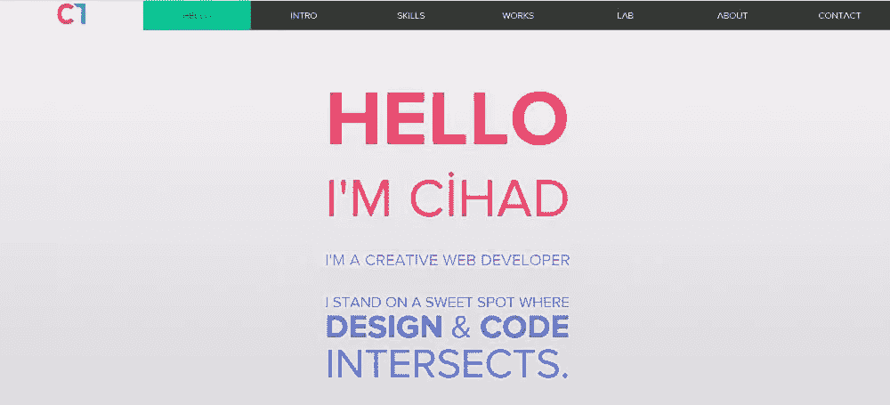](http://cihadturhan.com/)

[BeWebDeveloper](https://themes.muffingroup.com/be/webdeveloper/?utm_source=sitepoint.com&utm_medium=content&utm_campaign=apr19)

[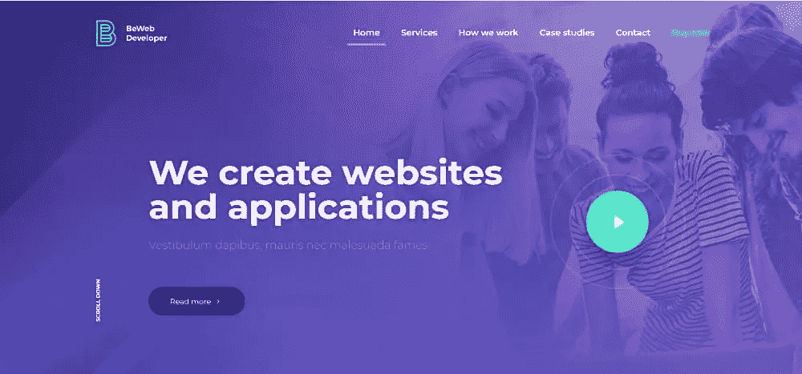](https://themes.muffingroup.com/be/webdeveloper/?utm_source=sitepoint.com&utm_medium=content&utm_campaign=apr19)

这个预先构建的网站清晰的标题信息立刻吸引了读者。

[BeCode](https://themes.muffingroup.com/be/code/?utm_source=sitepoint.com&utm_medium=content&utm_campaign=apr19)

[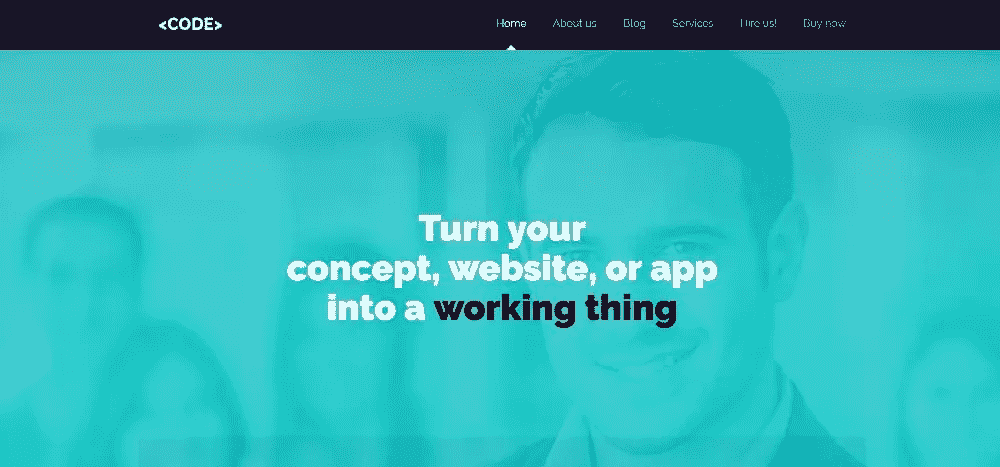](https://themes.muffingroup.com/be/code/?utm_source=sitepoint.com&utm_medium=content&utm_campaign=apr19)

约苏埃·埃斯皮诺萨

[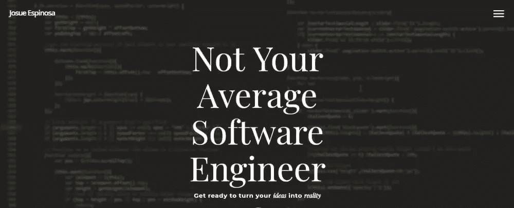](http://ejosue.com/)

这家伙直截了当地告诉你他做什么。他甚至为他的英雄镜头使用了满屏的代码。

### 2.简单是最复杂的

大多数网站访问者不喜欢杂乱，当然也不愿意费力地去寻找你提供的内容。既然你对自己写干净代码的能力感到自豪，那么干净的项目组合设计也应该对你有吸引力。

它肯定会吸引你的游客。

一个干净的设计将证明你的技能和职业道德，如果你觉得有必要，你可以随时使用颜色和纹理，让你的个性脱颖而出。

例如:

[简单 2](https://themes.muffingroup.com/be/simple2/?utm_source=sitepoint.com&utm_medium=content&utm_campaign=apr19)

[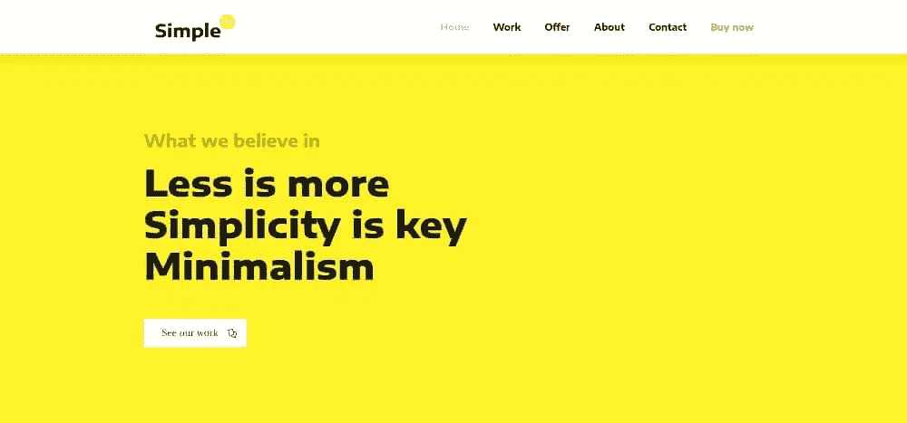](https://themes.muffingroup.com/be/simple2/?utm_source=sitepoint.com&utm_medium=content&utm_campaign=apr19)

[克里斯·比龙](http://biron.io/)

[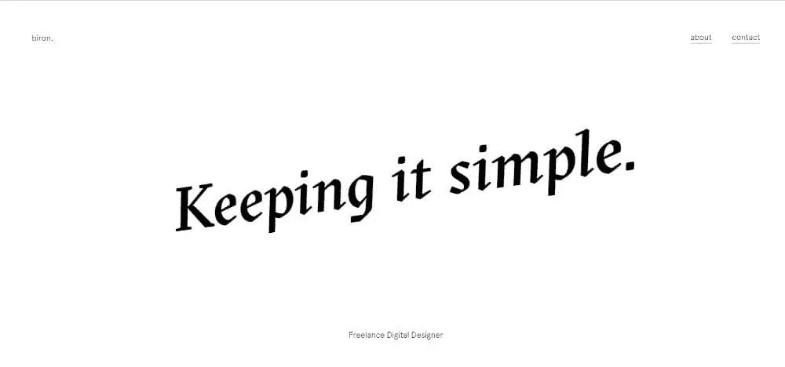](http://biron.io/)

这位自由职业的数字设计师用简单创造了一个品牌。这多酷啊。

[马修·威廉姆斯](http://findmatthew.com/)

[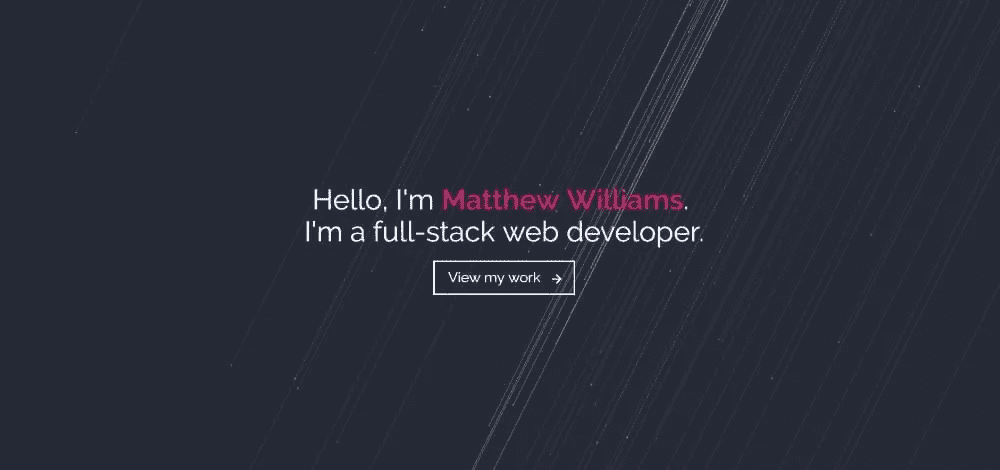](http://findmatthew.com/)

[成为公司 3](https://themes.muffingroup.com/be/company3/?utm_source=sitepoint.com&utm_medium=content&utm_campaign=apr19)

[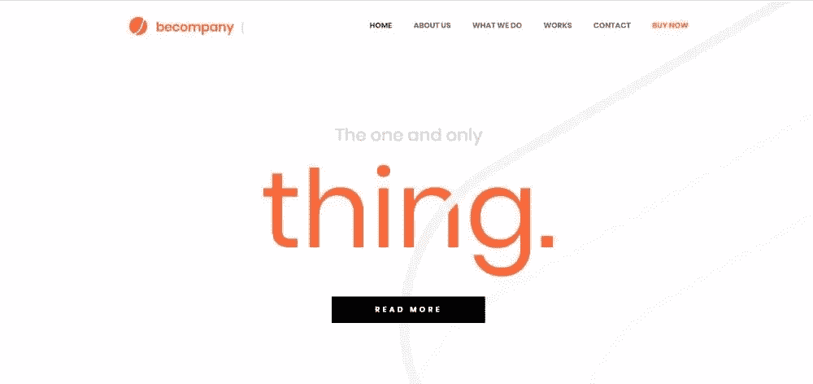](https://themes.muffingroup.com/be/company3/?utm_source=sitepoint.com&utm_medium=content&utm_campaign=apr19)

这是一个完美的例子，说明了设计的简单性如何能够产生一个干净的网站主页，这是不可忽视的

### 3.把一份简历从废话变成惊喜

简历太过时了。你不同意吗？

不是当你让你的艺术或产品自己说话的时候，这是作品集网站能做到的；如果做得好的话，尤其如此。

你仍然可以保持简历的经典结构，因为这是读者所期望的。

只要运用一点创意，让你的技能和经验脱颖而出。添加一些吸引人的视觉效果和/或互动元素，看着你正在制作的简历突然从废话或 Meh 变成 Wow。

现在，读者会想更多地了解你，你做什么，你能给他们提供什么。

这里有几份简历非常出色，值得进行第二次或第三次评估。

[贝雷索姆](https://themes.muffingroup.com/be/resume/?utm_source=sitepoint.com&utm_medium=content&utm_campaign=apr19)

[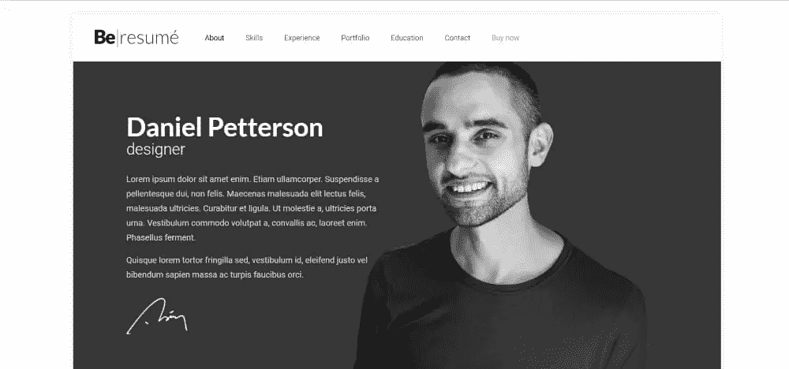](https://themes.muffingroup.com/be/resume/?utm_source=sitepoint.com&utm_medium=content&utm_campaign=apr19)

这个主题的微妙的动画元素将使完成的网站令人愉快的互动。

皮埃尔在

[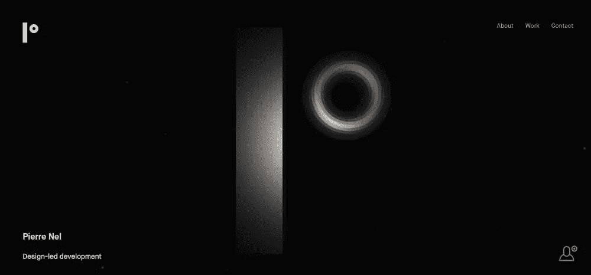](https://pierre.io/)

[前自由者](https://themes.muffingroup.com/be/freelancer/?utm_source=sitepoint.com&utm_medium=content&utm_campaign=apr19)

[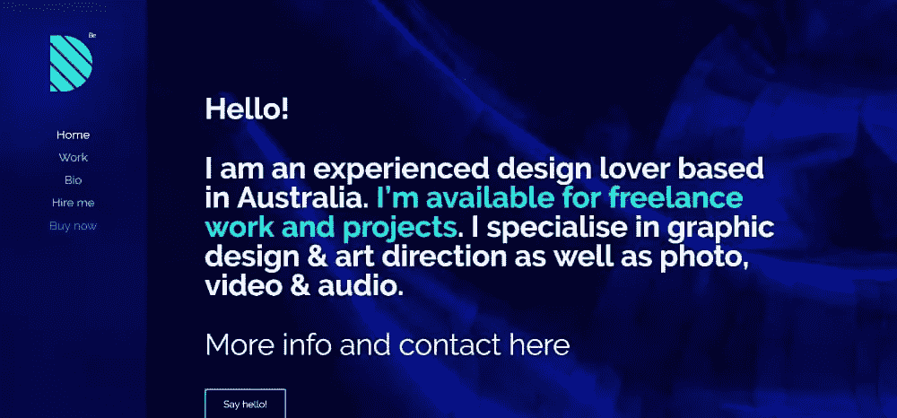](https://themes.muffingroup.com/be/freelancer/?utm_source=sitepoint.com&utm_medium=content&utm_campaign=apr19)

丹尼斯·钱德勒

[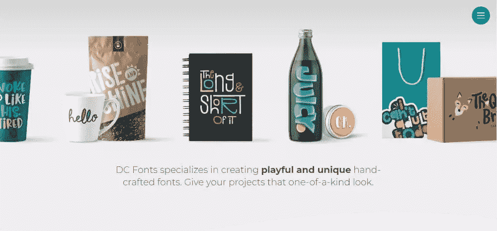](https://www.denisechandler.com/)

快速学习如何把你的简历变成充满个性的艺术品。

### 4.具有创造性的专业人士

和大多数专业人士一样，你是一个做事认真的人；你希望被人这样看待，以便能够获得更大的工作，吸引更好的客户。

从其他行业的顶级专业人士在网上展示自己的方式中“借鉴”一点不会有什么坏处。我们不是在说“模仿犯”。

这只是从律师、教练、顾问和其他专业人士那里获得一两个关于如何让你的网站看起来专业而不“自大”的想法。

[痛打](https://themes.muffingroup.com/be/lawyer3/?utm_source=sitepoint.com&utm_medium=content&utm_campaign=apr19)

[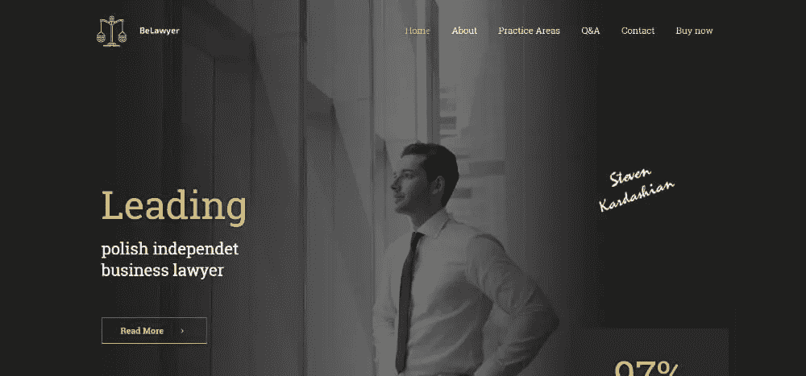](https://themes.muffingroup.com/be/lawyer3/?utm_source=sitepoint.com&utm_medium=content&utm_campaign=apr19)

这个主题的目标是独立律师，但它可以很容易地定制，以创建一个圆滑的投资组合网站。

亚采克·杰兹纳赫

[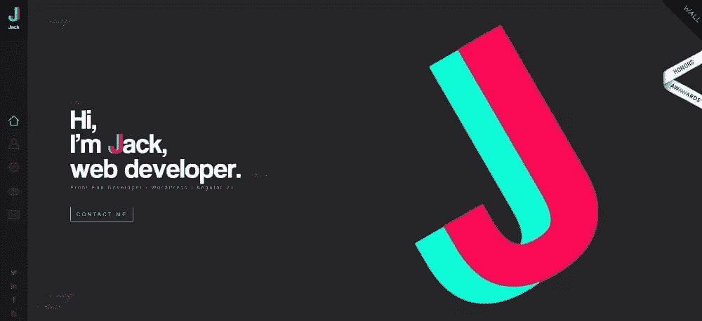](https://jacekjeznach.com/)

帕特里克大卫

[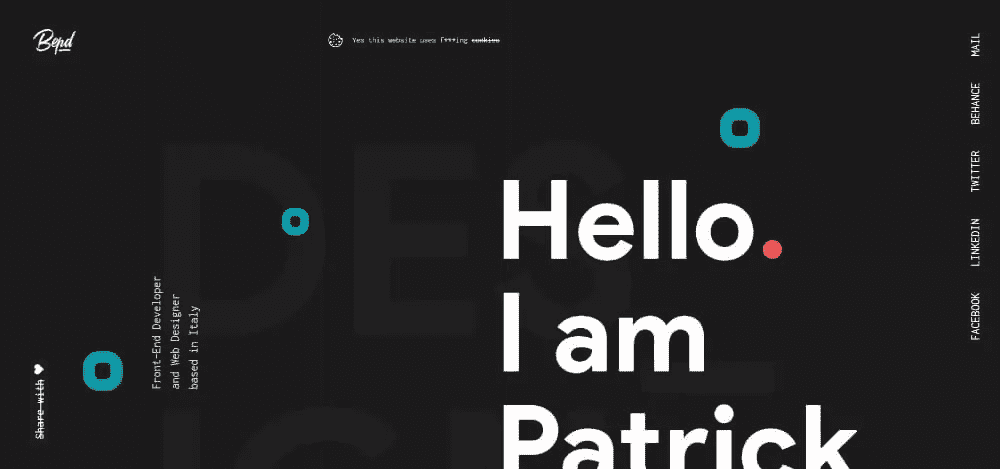](http://bepatrickdavid.com/)

[渐行渐远 2](https://themes.muffingroup.com/be/coaching2/?utm_source=sitepoint.com&utm_medium=content&utm_campaign=apr19)

[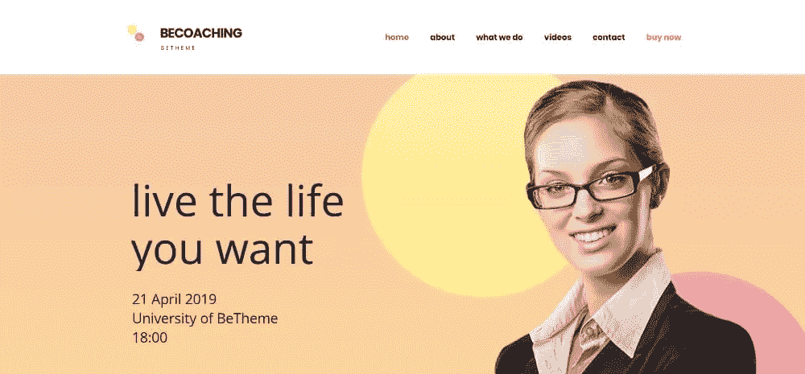](https://themes.muffingroup.com/be/coaching2/?utm_source=sitepoint.com&utm_medium=content&utm_campaign=apr19)

如果一个充满个性的投资组合网站是你的目标，你可以看看教练是如何吸引他们的客户的。

### 5.倾向于艺术方面

艺术家拥有最值得流口水的网站。你真的不会指望它是任何其他方式。面对它；你想和他们竞争会有困难。

幸运的是，你不必。已经有很多 web 开发人员成功地为自己甚至他人创建了一些很棒的作品集网站。

比如 Adham Dannaway，他用这种艺术的方式来展示他的网页开发和设计服务。

[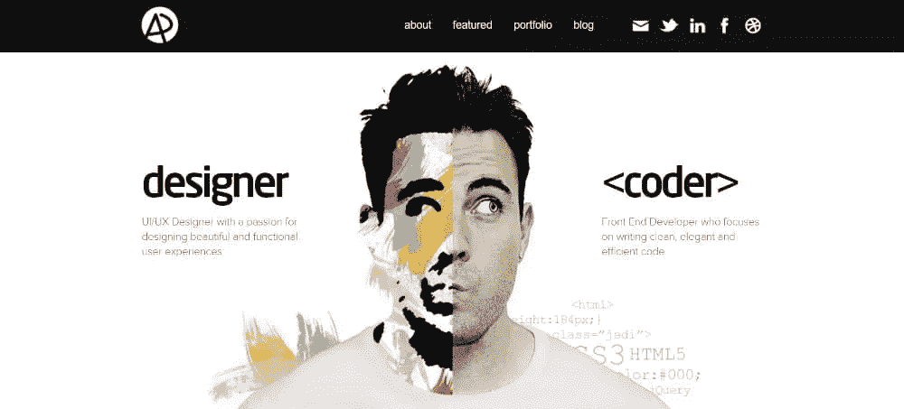](http://www.adhamdannaway.com)

或者[跑腿工作室](http://www.legworkstudio.com/)。这个动画工作室将插画和动画结合起来，并将其包装起来，以创建一个可识别的视觉品牌。

[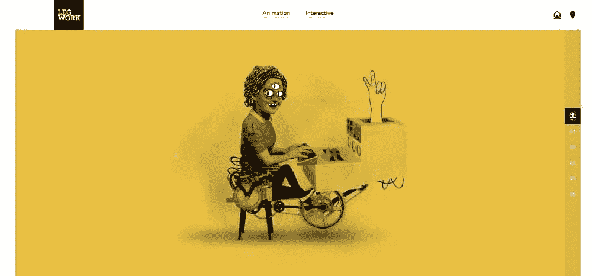](http://www.legworkstudio.com/)

您也可以从艺术家目前用来创建网站作品集的这两个主题中获得灵感:

熊人

[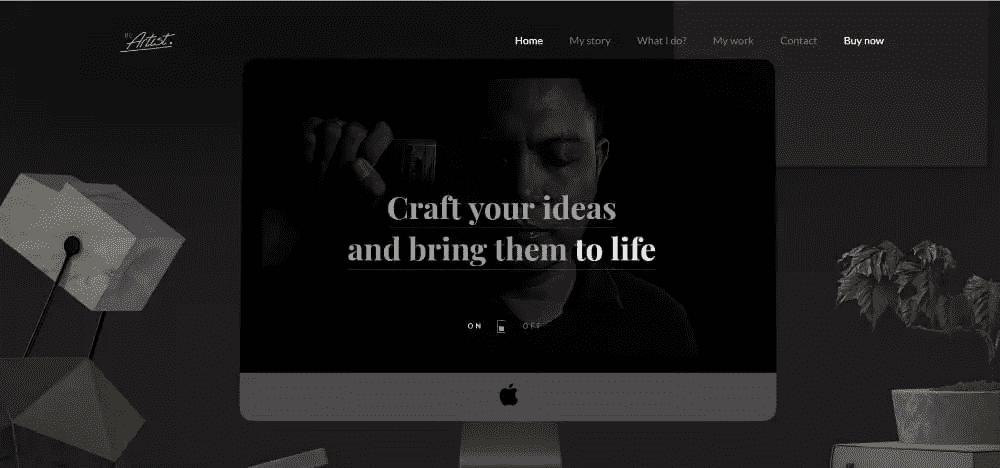](https://themes.muffingroup.com/be/artist/?utm_source=sitepoint.com&utm_medium=content&utm_campaign=apr19)

[熊出没 2](https://themes.muffingroup.com/be/artist2/?utm_source=sitepoint.com&utm_medium=content&utm_campaign=apr19)

[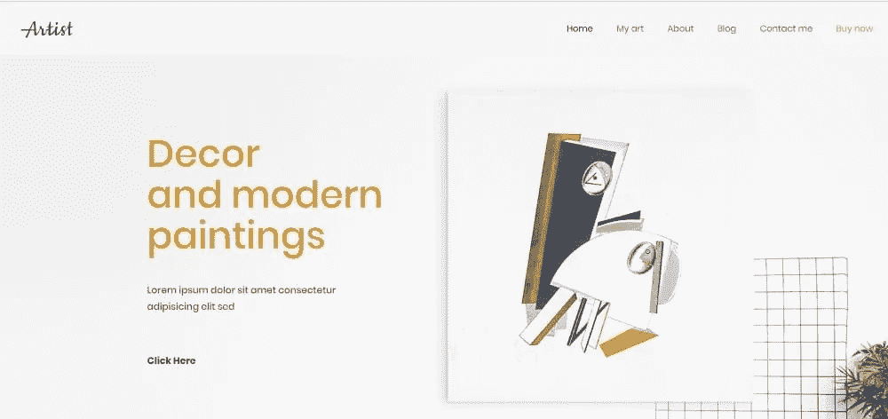](https://themes.muffingroup.com/be/artist2/?utm_source=sitepoint.com&utm_medium=content&utm_campaign=apr19)

### 6.用游戏化吸引注意力

想知道最有可能让你出名的网站组合类型吗？

试着把你的在线作品集变成一个游戏。

我们已经从废话变成了惊叹。为什么不瞄准更好的目标呢？

当你把你的投资组合变成一个游戏，任何人都很难通过它。几乎每个人都喜欢参与有趣的在线冒险，这比罗列技能和成就要有趣得多。

罗比莱昂纳迪

[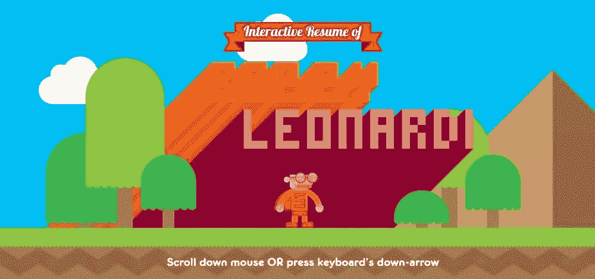
](http://www.rleonardi.com/interactive-resume/)

这位设计师、程序员、动画师因其屡获殊荣、令人兴奋的组合游戏而闻名。是的，它确实为他赢得了奖项；还有很多击掌。

[小工作室](http://smallstudio.com.au/)

[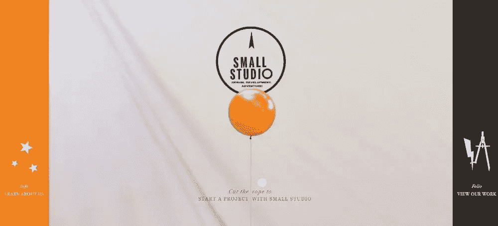](http://smallstudio.com.au/)

[BeFantasy](https://themes.muffingroup.com/be/fantasy/?utm_source=sitepoint.com&utm_medium=content&utm_campaign=apr19)

[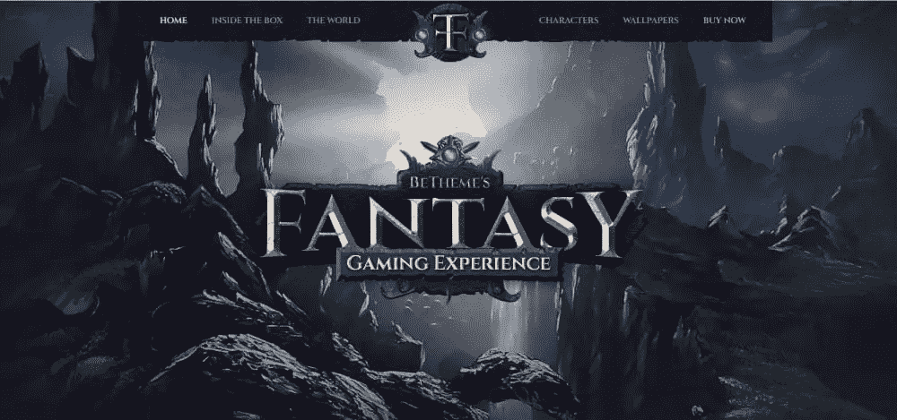](https://themes.muffingroup.com/be/fantasy/?utm_source=sitepoint.com&utm_medium=content&utm_campaign=apr19)

[开始](https://themes.muffingroup.com/be/game/?utm_source=sitepoint.com&utm_medium=content&utm_campaign=apr19)

[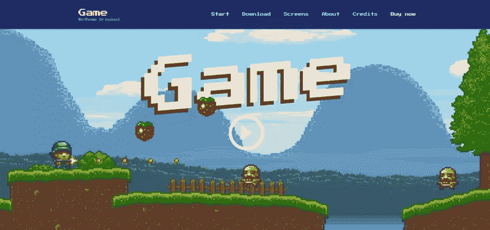](https://themes.muffingroup.com/be/game/?utm_source=sitepoint.com&utm_medium=content&utm_campaign=apr19)

你可以用这个游戏展示主题，轻松地把它变成一个互动作品集。

### 7.从公司网站上“偷”最好的

当你在经营一家公司时，你的任务是找到一种方法在同一个网站上销售多种产品或服务。

对于 web 开发人员来说，通常也是如此。

你有多种技能和服务，你想用最吸引人的方式展示它们。你还需要找到一种方式，以一种水晶般清晰的方式展示你的产品，这样客户就可以很容易地找到他们想要的东西。

如果你有多种技能和服务可以提供，你会发现这些例子是灵感的来源:

[BeAdAgency2](https://themes.muffingroup.com/be/adagency2/?utm_source=sitepoint.com&utm_medium=content&utm_campaign=apr19)

[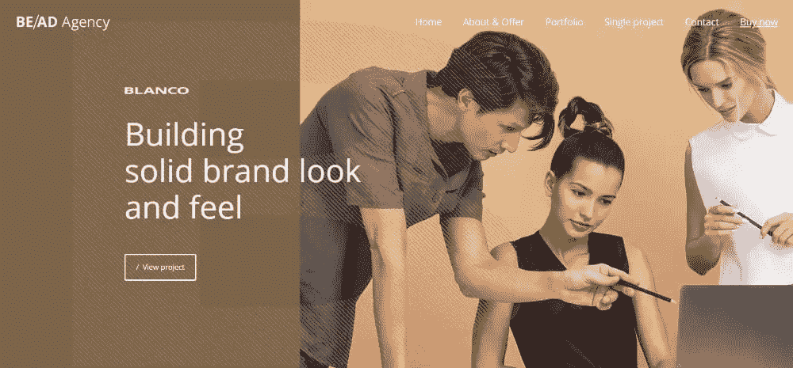
](https://themes.muffingroup.com/be/adagency2/?utm_source=sitepoint.com&utm_medium=content&utm_campaign=apr19)

这个广告代理主题非常适合混合服务。

[设施](https://facility.team/en/)

[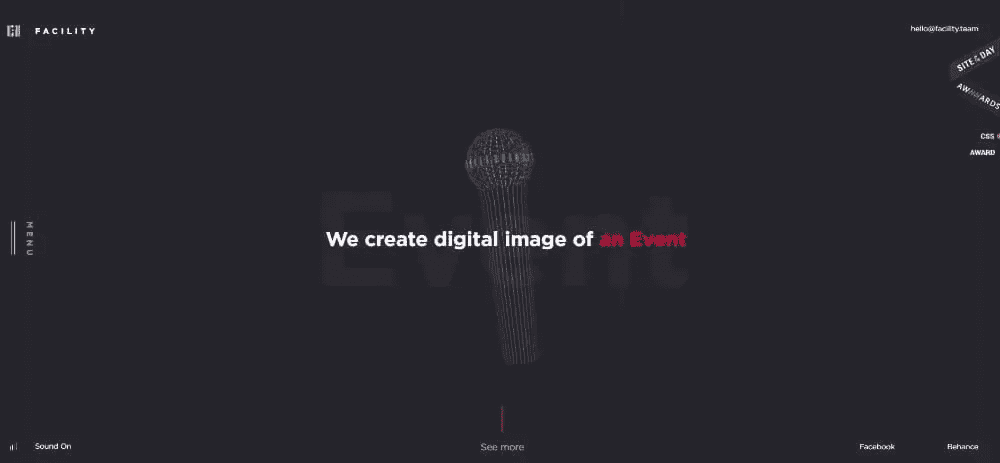](https://facility.team/en/)

[BeDigital](https://themes.muffingroup.com/be/digital/?utm_source=sitepoint.com&utm_medium=content&utm_campaign=apr19)

[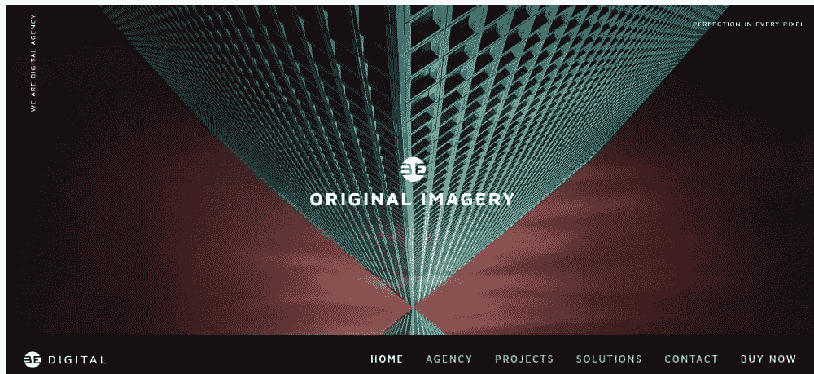](https://themes.muffingroup.com/be/digital/?utm_source=sitepoint.com&utm_medium=content&utm_campaign=apr19)

[TMS-外包](https://tms-outsource.com/)

[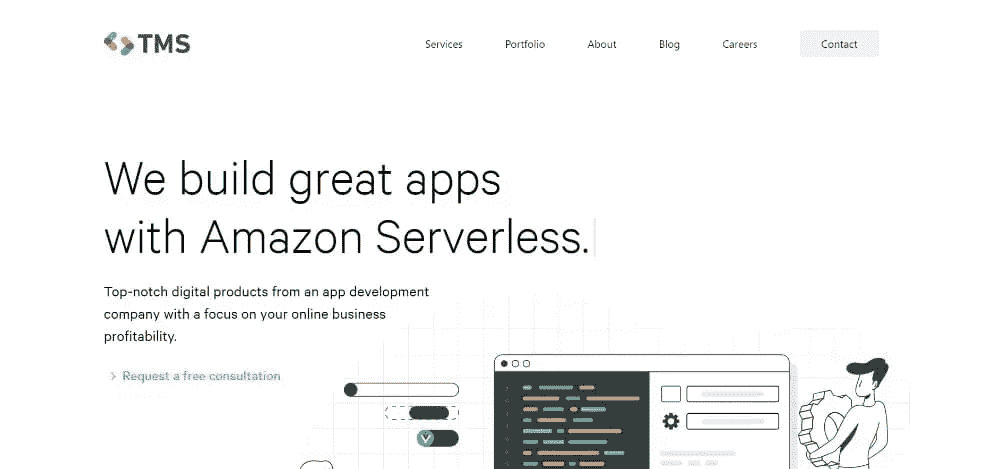](https://tms-outsource.com/)

这些人找到了一种简单而强大的方式来展示他们使用的所有技术。

### 8.像展示产品一样展示自己

想想高转化率网站是如何销售科技产品的。

他们坚持一种通用的架构，旨在吸引人们并说服他们购买或注册免费试用。使用同样的架构来建立你的网站组合，你可以期待吸引更多的潜在客户，并说服他们雇用你。

同时，如果他们选择与你合作，你可以向他们展示你能为他们做些什么。

观看

[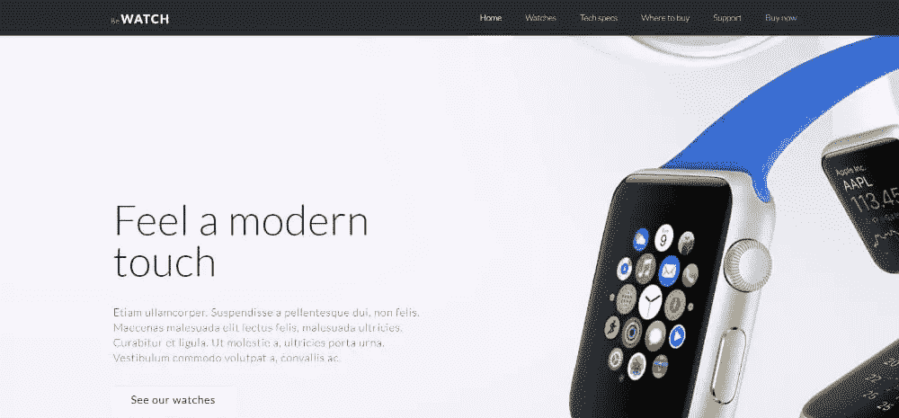](https://themes.muffingroup.com/be/watch/?utm_source=sitepoint.com&utm_medium=content&utm_campaign=apr19)

这种销售物联网产品的经典网站结构旨在吸引和转化。

[艾米莉·里奇](http://www.emilyridge.ie/)

[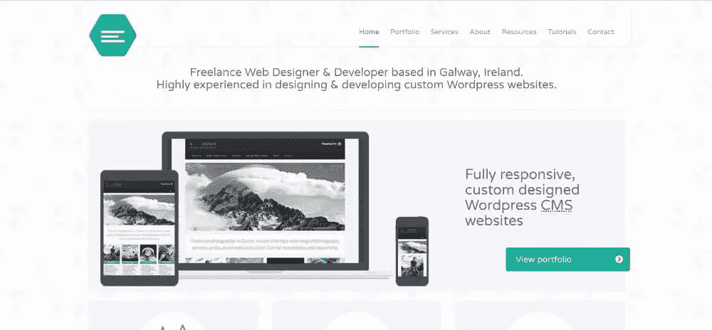](http://www.emilyridge.ie/)

一位 web 开发人员在她的在线文件夹中使用了类似的结构。

[BeProduct4](https://themes.muffingroup.com/be/product4/?utm_source=sitepoint.com&utm_medium=content&utm_campaign=apr19)

[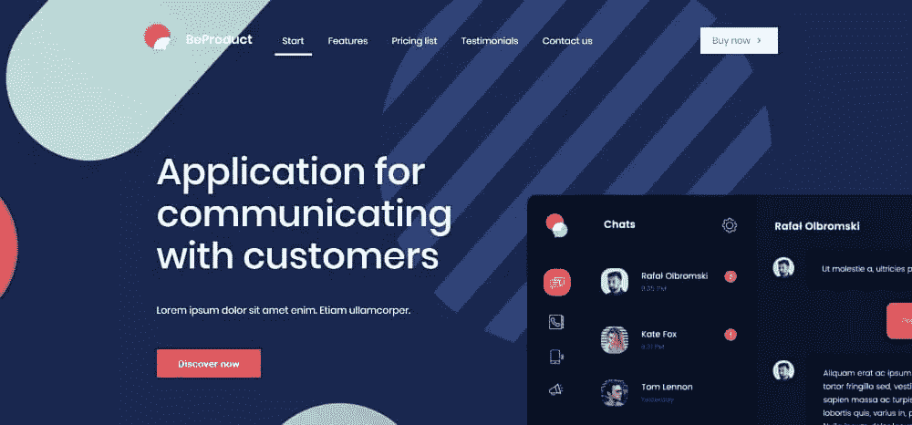](https://themes.muffingroup.com/be/product4/?utm_source=sitepoint.com&utm_medium=content&utm_campaign=apr19)

约翰尼·马奇亨

[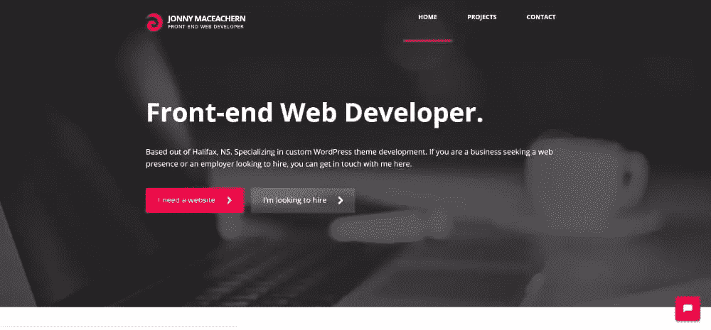](https://jonny.me/)

## 开始

有了一些创造性的概念，你就不再有理由或借口推迟建立自己的投资组合网站。

如果你担心你真的没有时间兼顾客户的工作和你的在线投资组合，你可以走一条捷径。

除非或者直到你有足够的时间从头开始建立它，一个预先建立的网站可以提供一个快速有效的方法来创建一个令人眼花缭乱的在线作品集来展示你的作品。

一个很好的资源是 Be Theme，它有 70 多个单页的庞大库(和 400 多个各种类型的预建网站)。

每个页面的设计都考虑到了易于导航，并且每个页面都包含了旨在增加用户参与度的交互元素。你所需要做的一切都是为了增加你的创造性视野，这足以让你的作品集从“嗯”到“惊艳”。

## 分享这篇文章