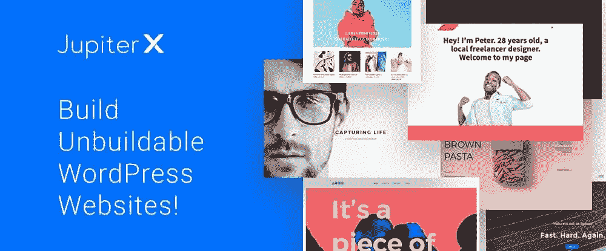
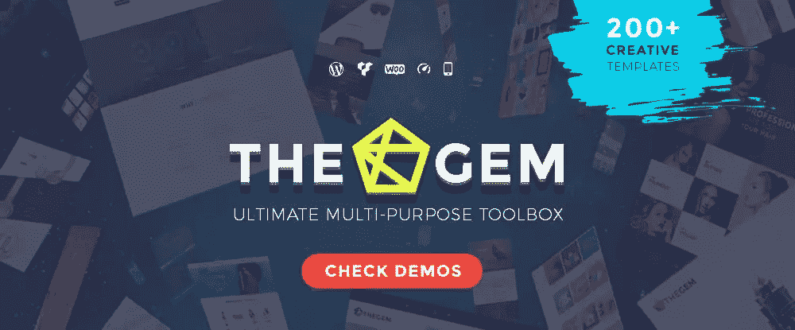
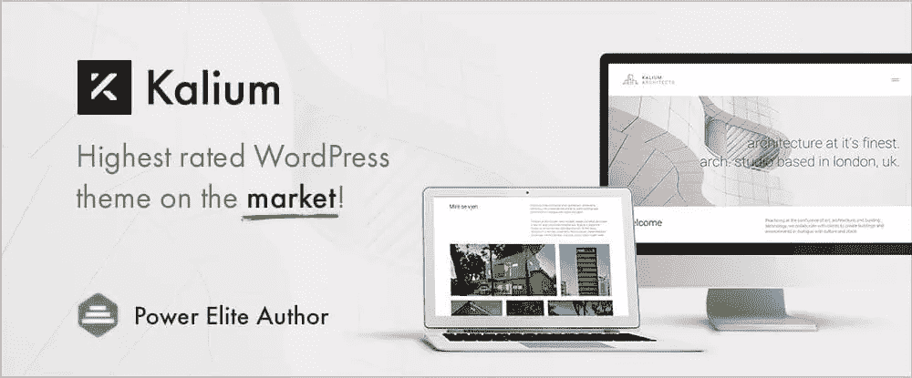
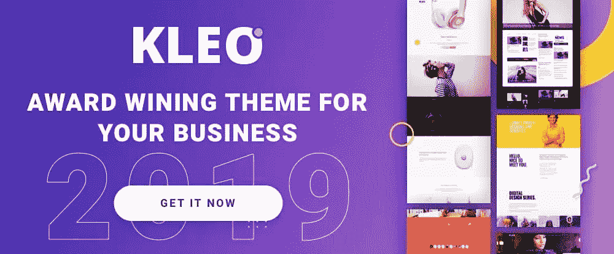
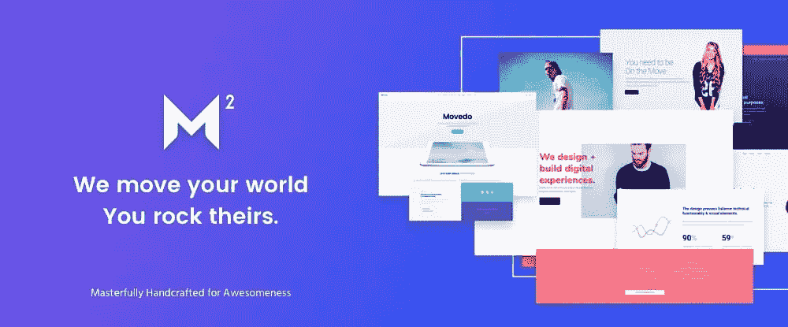
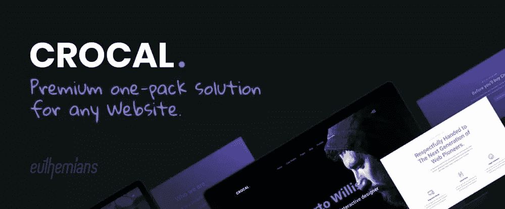

# 2019 年要选择的 12 个多用途 WordPress 主题

> 原文：<https://www.sitepoint.com/the-top-12-multipurpose-wordpress-themes-to-choose-in-2019/>

*这篇赞助文章由我们的内容合作伙伴 [BAW 媒体](https://bawmedia.com)创作。感谢您对使 SitePoint 成为可能的合作伙伴的支持。*

一些 WordPress 用户倾向于避免使用多用途主题。他们这样做的原因似乎是常识。他们信奉一句流行的谚语——“万事通，无所不能。”在这里，任何设计用来做所有事情的东西都不会做得特别好，如果有的话。

当然，有一些多功能或一体化的设计工具根本无法完成工作。有些可能编码很差，或者有其他错误。但是有很多网站是建立几乎任何类型网站的绝佳选择。

如果说有问题，那就是好的太多了。找到一个符合你需求的主题是一个挑战。

寻找一种替代方式来挖掘一大堆多用途的主题？考虑看看我们 2019 年最喜欢的 12 个多用途主题列表。

从流行的开始…

## 1.[成为主题](https://themes.muffingroup.com/be/splash/?utm_source=sitepoint.com&utm_medium=content&utm_campaign=multipurposewp19)

凭借其 400 多个预建网站的出色选择，以及大量的设计辅助工具、网站建设工具和其他核心功能，BeTheme 很容易成为当今市场上最大的多功能 WordPress 主题。

它的大小并不是我们把它放在名单首位的原因，而是因为它可以帮助你建立一个更好的任何类型或风格的网站，几乎可以用于任何目的。

你有能力建立一个令人惊叹的网站，并把它设计得近乎完美。在它的核心功能中，你会找到你需要的工具，来整合关键功能，如响应性、搜索引擎友好性和出色的 UX，同时创建因其出色的性能而闻名的网站。

Header Builder 是最新的新功能，它为用户提供了更多的设计选项和更大的灵活性。400 多个预建网站涵盖 30 多个不同的商业和工业类型和部门。

## 2.[木星](http://jupiterx.com/?ref=artbees&utm_campaign=BAWMedia2019Q2&utm_source=sitepoint.com)

Jupiter X WordPress 主题速度快，重量轻，功能强大，几乎可以构建任何你能想象到的网站。由于它强大的可视化编辑器，再加上 WordPress Elementor 页面生成器和它的定制技术，你可以定制你的网站的每一寸，同时能够体验到对你的页面内和全局设计元素的无缝和无限制的控制。

由于 Jupiter X 允许您从头开始设计页眉和页脚，因此您可以根据自己的具体要求设计页眉和页脚。多亏了商店定制器，你将能够定制你的 WooCommerce 商店的一些部分，包括购物清单、购物车、结账页面和单品页面。

这也是第一个主题，使其用户能够完全重塑他们的博客单页和博客列表，以及他们的投资组合列表的外观。

## 3.[未编码——创意多用途 WordPress 主题](https://undsgn.com/uncode/?utm_source=sitepoint.com&utm_medium=content&utm_campaign=multipurposewp19)

Uncode 是一个像素级的完美、平滑和时尚的 WordPress 主题，它在场景中爆发出你在其他地方找不到的创造性网站建设选项。功能包括一个独特的先进的网格系统，使您能够创建布局，你曾经认为这是不可能实际纳入一个真正的，生活的网站。

创造性的类型特别喜欢使用 Uncode，因为他们可以为自己的博客帖子、作品集、产品页面等创建各种独特的布局，同时保持对其内容和设计本身的完全控制。

到目前为止，了解 Uncode 能为您做什么的最佳方式是访问他们的网站，浏览用户创建的网站展示。当你看到其他人用这个多用途的 WordPress 主题所完成的事情时，你肯定会留下深刻的印象，并且很可能会受到启发。

## 4.[the gem–创意多用途高性能 WordPress 主题](http://preview.themeforest.net/item/thegem-creative-multipurpose-highperformance-wordpress-theme/full_screen_preview/16061685/?utm_source=sitepoint.com&utm_medium=content&utm_campaign=multipurposewp19)

作为第一次使用 TheGem 的用户，你可能会发现它有点令人难以招架，不是因为它的使用难度，而是因为它令人印象深刻的设计元素、风格和功能工具箱。

一系列独特的多用途设计概念和演示页面随软件包提供，使其成为初创公司、代理公司和各种类型的成熟企业的完美主题。

## 5.钾

Kalium 的易用性与其令人印象深刻的布局设计、高质量演示、主题选项、拖放内容元素和捆绑插件相结合，使您能够以您一直想要的方式展示您的作品，即使您是第一次使用。

钾是一个特别明智的选择，为企业或个人谁觉得需要创造一个杰出的投资组合。

## 6.[布鲁克——创意多用途 WordPress 主题](https://themeforest.net/item/brook-creative-multipurpose-wordpress-theme/22675741?utm_source=baw&utm_medium=content&utm_campaign=multipurposewp19)

Brook 是 ThemeForest 最畅销的多用途创意主题，其高级主题选项集将远远满足您的需求，无论您正在构建的网站的目的或类型如何。

元素丰富、可定制的主页和高级插件使得构建完全响应的 retina 就绪网站的任务变得轻松愉快。有一大堆更多的功能，即无限滚动，惰性加载，大型菜单，免费终身更新，最重要的是，专业人士的专门用户支持。

## 7.[Pofo——创意组合、博客和电子商务 WordPress 主题](http://wpdemos.themezaa.com/pofo/?utm_source=sitepoint.com&utm_medium=content&utm_campaign=multipurposewpthemes2019)

Pofo 是一个现代的，创造性的多用途设计主题，将特别吸引创意类型，因为它强调博客，投资组合和电子商务功能。WP Bakery 是 Pofo 的首选页面生成器。

该软件包包括 Revolution Slider，一个免费的捆绑插件集，一个优秀的精选主页和预建元素，演示页面，详细的文档和优秀的客户支持。

## 8.[KLEO——以专业社区为中心的多功能 BuddyPress 主题](https://themeforest.net/item/kleo-pro-community-focused-multipurpose-buddypress-theme/6776630?ref=SeventhQueen&utm_source=article&utm_medium=banner&utm_campaign=baw0717)

这个以社区为中心的多用途 BuddyPress 主题非常容易设置，通过其可视化的拖放构建器和一键导入鼓舞人心的即用型演示、插件、滑块和其他功能，可以在几分钟内建立并运行一个网站。

Kleo 实际上是插件最好的朋友，因为它可以和绝大多数插件一起工作。

## 9.[桥](http://bridgelanding.qodeinteractive.com/?utm_source=baw&utm_medium=baw_list2&utm_campaign=baw_top15)

它的 110，000 多名快乐的客户对这个最畅销的创意 WordPress 主题、它的功能和它的受欢迎程度说了一些话。Bridge 将是为任何商业领域创建网站的绝佳选择，因为它具有开放式的可定制功能，以及 WP Bakery 页面生成器、LayerSlider 和其他插件。

浏览 Bridge 的 370 多个预制网站库，您应该会找到一些东西来快速启动您的下一个项目。

## 10.[Movedo–我们确实改变了你的世界](https://themeforest.net/item/movedo-we-do-move-your-world/17923709?utm_source=bawmedia&utm_campaign=bawmedia_campaign)

当恰当地引入和应用时，网站中的运动效果看起来几乎是神奇的，而酷的运动效果是 MOVEDO 最擅长的。有了这个顶级的 WordPress 主题及其现代的视差功能和动画，你会很快发现给你的网站增加一点活力的方法。

MOVEDO 响应迅速、灵活，具有一些令人惊叹的响应选项，并提供 24/7 支持。

## 11.[Crocal-高级 WordPress 主题](https://themeforest.net/item/crocal-responsive-multipurpose-wordpress-theme/22785794?ref=euthemians&utm_source=bawmedia&utm_medium=email_article&utm_campaign=april_bawmedia)

Crocal 是新的(2019 年 1 月)，它是不同的，它很好。由 ThemeForest 排名第一的精英作者创建，这款多功能主题和顶级新 Envato 产品及其先进的网格系统已经获得了大量的追随者。Crocal 兼容古腾堡、WordPress 和 GDPR。

## 12.[模式](https://mythemeshop.com/themes/schema)

Schema 为你做了一些大多数网页设计者都很纠结或者有时完全忽略的事情——搜索引擎优化。如果搜索引擎找不到，设计一个看起来很吸引人的网站也没有多大用处。Schema 引导他们通过您的站点，一次一个元素，检查干净的代码和页面加载时间等等。模式是一个非常方便的工具。

## 结论

现在你有了:2019 年网站建设冒险中最好的多用途 WordPress 主题。另外，几个主题可以让你的网站建设体验更好。

希望我们能够在您寻找最适合您的产品的过程中节省一些时间和精力。

## 分享这篇文章