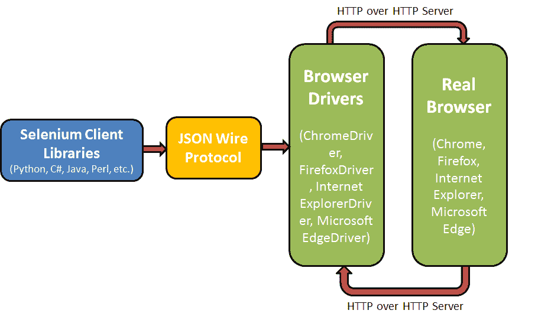
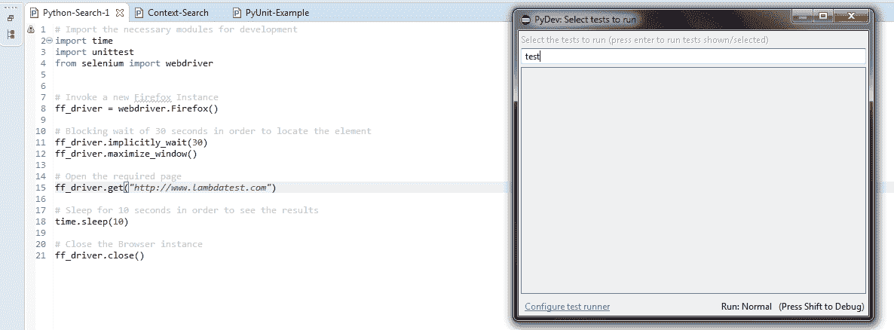
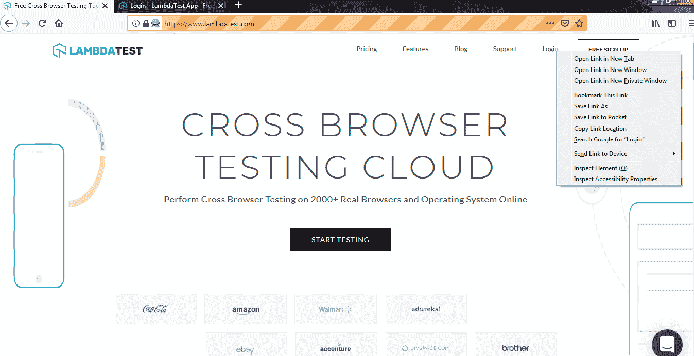
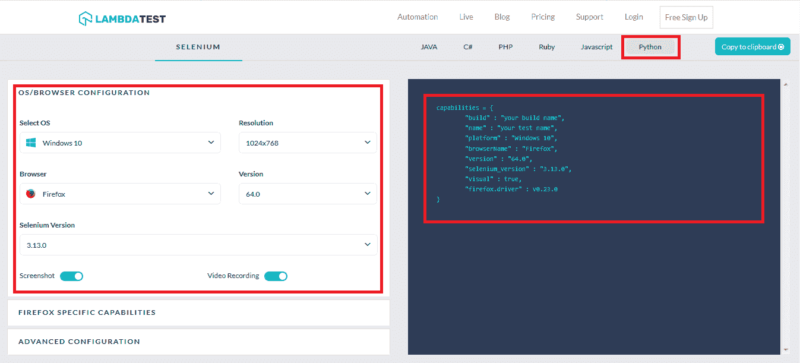
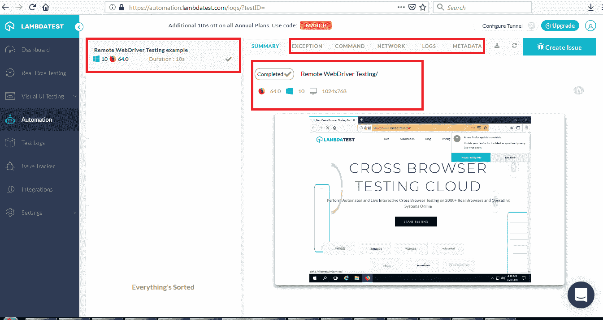
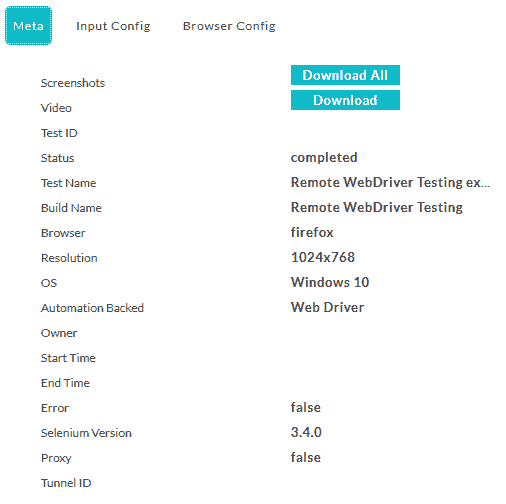
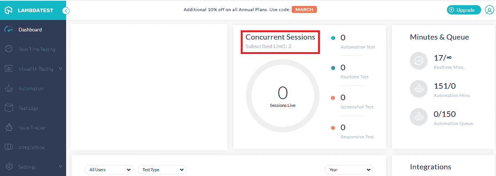
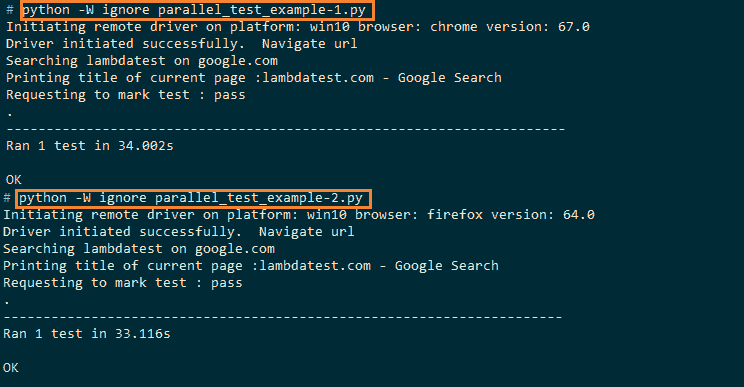
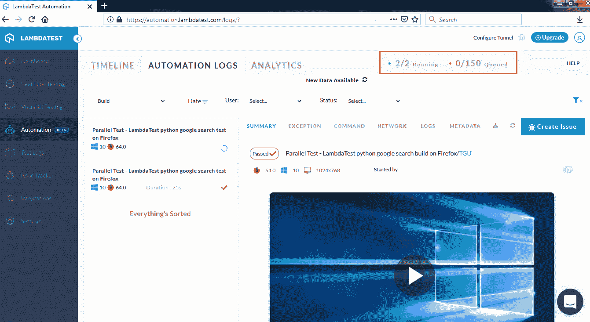

# 如何使用 Selenium WebDriver 进行跨浏览器测试

> 原文：<https://www.sitepoint.com/how-to-use-selenium-webdriver-for-cross-browser-testing/>

*本文最初发表于 [LambdaTest](https://www.lambdatest.com/blog/selenium-webdriver-tutorial-for-cross-browser-testing/?utm_source=Sitepoint&utm_medium=blog1&utm_campaign=SitepointAd1&utm_term=Sitepoint) 。感谢您对使 SitePoint 成为可能的合作伙伴的支持。*

Selenium 是一个流行的自动化测试框架，主要用于[跨浏览器测试](https://www.lambdatest.com/?utm_source=Sitepoint&utm_medium=blog1&utm_campaign=SitepointAd1&utm_term=Sitepoint)。它是开源的，非常适合于跨不同浏览器(如 Firefox、Chrome、Internet Explorer 和 Microsoft Edge)对 web 应用程序进行自动化测试的[。Selenium 已经成为一个著名的框架，正在与其他测试框架进行激烈的竞争，比如惠普 QTP(快速测试专家)和惠普 UFT(统一功能测试)。本 Selenium WebDriver 教程将帮助您对 Selenium 套件的组件、Selenium WebDriver 架构有一个基本的了解，并将向您展示如何使用 Selenium web driver for Google Chrome、Mozilla Firefox 和 Internet Explorer 运行自动化来测试网站的](https://www.lambdatest.com/blog/automation-testing-important-agile-development/?utm_source=Sitepoint&utm_medium=blog1&utm_campaign=SitepointAd1&utm_term=Sitepoint)[跨浏览器兼容性](https://www.lambdatest.com/feature?utm_source=Sitepoint&utm_medium=blog1&utm_campaign=SitepointAd1&utm_term=Sitepoint)。

Selenium 是不同工具的组合，每个工具在自动化 web 测试中都扮演着重要的角色。让我们深入 WebDriver 教程。

## Selenium 套件的组件

以下是 Selenium 测试套件的核心组件:

*   Selenium 集成开发环境(IDE)
*   硒遥控器(遥控)
*   Selenium WebDriver
*   硒栅

现在，让我们在 Selenium WebDriver 教程中详细了解一下这些组件。

## Selenium 集成开发环境(IDE)

Selenium IDE 是一个简单的 Firefox 插件，用于记录和回放脚本。然而，Selenium IDE 只能用于编写简单用例的自动化测试的自动化脚本。Selenium IDE 不支持条件语句、异常处理、循环、屏幕截图等。对于自动化复杂的用例，大多数开发人员和测试人员更喜欢选择[脚本测试，而不是记录&重放测试](https://www.lambdatest.com/blog/are-you-confused-between-scripting-testing-and-record-replay-testing/?utm_source=Sitepoint&utm_medium=blog1&utm_campaign=SitepointAd1&utm_term=Sitepoint)。Selenium 测试套件由 Selenium Remote Control (RC)或 Selenium WebDriver 组成。

Selenium IDE 可用于不同的操作系统，即 Windows、Linux、Mac OS 等。火狐的 Selenium IDE 可以从[这里](https://addons.mozilla.org/en-US/firefox/addon/selenium-ide/?src=search)下载。

## 硒遥控器(遥控)

为了测试复杂的场景，可以使用 Selenium 远程控制(RC)。它基于客户机-服务器模型，使得在由服务器控制的浏览器上执行测试成为可能。有不同编程语言的客户函数库，这使得开发人员可以很容易地用他们熟悉的编程语言编写有效的测试用例。从 2.25.0 版本开始，RC 已经支持 Java、C#、Python、Perl、Ruby 等。

Selenium 服务器是 Selenium RC 的核心组件。Selenium RC 的一些核心功能/职责如下:

*   包含核心 Selenium 框架，它主要负责在浏览器中注入相同的内容。
*   客户端程序向 RC 发送命令，这些命令由服务器解释，然后发送到浏览器。
*   执行后，结果被发送回客户端。
*   客户机和服务器通过正常的 HTTP GETS 和 POSTs 机制进行通信。

如前所述，Selenium RC 支持不同的浏览器，不像 Selenium IDE 只支持 Mozilla Firefox。Selenium RC 的缺点是它不支持记录和回放功能，这在任务重复的自动化测试用例中是至关重要的，特别是对于[回归测试](https://www.lambdatest.com/blog/building-a-regression-testing-strategy-for-agile-teams/?utm_source=Sitepoint&utm_medium=blog1&utm_campaign=SitepointAd1&utm_term=Sitepoint)。在使用 Selenium RC 执行测试之前，应该手动调用 Selenium RC 服务器的一个实例，并且该实例应该在整个[测试周期](https://www.lambdatest.com/blog/10-ways-to-speed-up-your-test-cycles/?utm_source=Sitepoint&utm_medium=blog1&utm_campaign=SitepointAd1&utm_term=Sitepoint)中运行。

## Selenium WebDriver

我们知道 Selenium IDE 是基于 GUI 的，其中 Selenium RC 是一个独立的 Java 程序，允许您执行 HTML 测试套件。与 Selenium IDE 和 Selenium RC 相比，Selenium WebDriver 框架使用得更广泛。与基于客户端-服务器模型的 Selenium RC 不同，Selenium WebDriver 框架是通过特定于浏览器的驱动程序实现的，例如，每个浏览器都有其相应的 WebDriver 应用程序，自动化测试将在该应用程序上执行。

Selenium WebDriver 直接与浏览器通信，因此它不需要像 Selenium 服务器那样的任何单独的组件。它支持对软件测试人员有帮助的顶级编程语言，即 C#、Ruby、Java、Python、Perl 等。在继续学习 Selenium WebDriver 教程之前，请确保下载用于正在进行跨浏览器测试的浏览器的 Selenium WebDriver。您可以从下面提到的链接下载 Selenium WebDriver:

*   [火狐](https://github.com/mozilla/geckodriver/releases)
*   [铬合金](http://chromedriver.chromium.org/downloads)
*   [网络浏览器](https://github.com/SeleniumHQ/selenium/wiki/InternetExplorerDriver)
*   [微软 Edge](https://blogs.windows.com/msedgedev/2015/07/23/bringing-automated-testing-to-microsoft-edge-through-webdriver/)

## 硒栅

当测试局限于少数浏览器、操作系统或设备的代码时，串行测试是好的。然而，一旦测试必须在具有多种组合的环境中执行，这种方法就会动摇。这就是并行测试非常有用的地方，因为它可以加速整个测试过程。[并行测试](https://www.lambdatest.com/blog/parallel-testing-in-selenium-webdriver-with-python-using-unittest/?utm_source=Sitepoint&utm_medium=blog1&utm_campaign=SitepointAd1&utm_term=Sitepoint)可以让你跨不同的测试配置同时执行一个相似的测试用例。您也可以在同一个浏览器中同时执行不同的测试用例。并行测试还有更多的内容，但这可能会偏离我们对 Selenium WebDriver 的关注。

回到基础:Selenium Grid 主要用于并行测试，因为它有助于在不同的机器上针对不同的浏览器和操作系统同时运行测试。它与 Selenium RC 协同工作。下面是一个展示 Selenium Grid 用法的示例:

```
from selenium import webdriver
from selenium.webdriver.common.keys import Keys

desired_cap = {
'platform' : 'win10',
'browserName' : 'chrome',
'version' :  "67.0",
}

url = "https://username:acsessToken@{LMABDA GRID URL}/wd/hub"

driver = webdriver.Remote(
    desired_capabilities=desired_cap,
    command_executor= url
) 

driver.implicitly_wait(1)
driver.get("http://www.google.com/")
driver.quit() 
```

## Selenium WebDriver 架构

看看组成 Selenium WebDriver 架构的主要模块:

*   Selenium 客户端库
*   JSON 有线协议
*   浏览器驱动程序
*   浏览器

让我们更详细地检查每个组件。

### Selenium 客户端库

如前所述，开发人员可以使用 Selenium 用不同的语言编写测试代码，如 C#、Java、Python、Perl 等。由于 Selenium 客户端库或 Selenium 语言绑定，多语言支持是可能的。例如，如果您正在用 Python 编写代码，您将需要 Python 客户端库。不同编程语言的 Selenium 客户端驱动可以从[这里](https://www.seleniumhq.org/download/#client-drivers?utm_source=Sitepoint&utm_medium=blog1&utm_campaign=SitepointAd1&utm_term=Sitepoint)下载。

### JSON 有线协议

JSON (JavaScript Object Notation)有线协议方便了客户机和服务器之间的数据传输。它是基于 REST(表述性状态转移)的 API。每个浏览器都有自己的浏览器驱动程序。

### 浏览器驱动程序

浏览器驱动程序主要用于与浏览器通信。由于浏览器的内部逻辑及其功能并未公开，浏览器驱动程序确保了必要的“封装”层，以保持执行级细节更加抽象。每个浏览器都有相应的浏览器驱动程序。

### 浏览器

由于浏览器驱动程序可用于 Chrome、Firefox、Internet Explorer、Safari 和 Microsoft Edge 等流行浏览器，因此您可以使用其中任何一种来执行跨浏览器测试。请注意，您不能在浏览器驱动程序未公开的浏览器上对网站执行跨浏览器测试。



### [LambdaTest 现在与云上硒网格一起运行](https://www.lambdatest.com/blog/lambdatest-now-live-with-an-online-selenium-grid-for-automated-cross-browser-testing/?utm_source=Sitepoint&utm_medium=blog1&utm_campaign=SitepointAd1&utm_term=Sitepoint)

LambdaTest 提供了一个云上的 Selenium Grid 来帮助你快速跟踪你的自动化测试过程。Selenium Grid 提供了 2000 多种真正的浏览器和运行在众多操作系统上的浏览器版本。您可以使用 LambdaTest Selenium Grid 执行并行测试，而不必担心在本地机器上安装任何繁重的基础设施，此外，您还可以使用各种各样的浏览器来最大化您的测试覆盖率。

您可以运行的并行会话数量完全取决于您选择的并发会话。并行测试可以帮助你大幅削减测试周期。例如，假设您有一个测试套件，在没有并行测试的情况下需要 60 分钟。现在，如果您有 2 个并发性，那么您可以同时运行 2 个测试，将您的总测试时间减少到 30 分钟。类似地，如果您有 3 个并发，那么总测试时间将进一步减少到 20 分钟。根据您的测试套件，使用 LambdaTest [并发计算器](https://www.lambdatest.com/concurrency-calculator/?utm_source=Sitepoint&utm_medium=blog1&utm_campaign=SitepointAd1&utm_term=Sitepoint)来计算您可能需要多少并发会话。

## Selenium WebDriver 在运行

现在您已经了解了 Selenium 和浏览器驱动程序的基础知识，是时候让我们看看一个简单的 WebDriver 脚本了。在我们看这个例子之前，请确保您已经准备好了编程环境(我们正在使用 Eclipse 以及从 [Eclipse Marketplace](https://marketplace.eclipse.org/) 下载的所有必需的包[)。Eclipse 的 Selenium 插件可以从](https://www.eclipse.org/downloads/)[这里](https://marketplace.eclipse.org/category/free-tagging/selenium)下载。示例代码是用 Python 语言编写的，但是您也可以用 C#、Java、Perl、Ruby 等语言编写测试代码。

### Firefox WebDriver 示例

因为测试代码将与浏览器(Chrome、Firefox、Internet Explorer 等)通信。)，请确保您的计算机中安装了相应的客户端库/WebDriver。请参考浏览器驱动程序一节，了解如何下载相应的 web 驱动程序。

下面是使用 Selenium、Firefox WebDriver 打开网页的示例代码:

```
# Import the necessary modules for development
import time
import unit test
from selenium import web driver

# Invoke a new Firefox Instance
ff_driver = webdriver.Firefox()

# Blocking wait of 30 seconds in order to locate the element
ff_driver.implicitly_wait(30)
ff_driver.maximize_window()

# Open the required page
ff_driver.get("http://www.lambdatest.com")

# Sleep for 10 seconds in order to see the results
time.sleep(10)

# Close the Browser instance
ff_driver.close() 
```

让我们浏览一下代码。在我们执行任何操作之前，使用' *import* '语句导入所有必要的模块[第 2~4 行]。在测试代码中，我们使用了 Firefox WebDriver，因为测试是针对 Firefox 浏览器进行的[第 7 行]。在代码中，`ff_driver`是 WebDriver 句柄，用于执行与 Firefox 浏览器的任何交互。如果您没有安装 WebDriver 或尝试使用不支持的浏览器(通过 WebDriver ),将会出现以下错误:

`selenium.common.exceptions.WebDriverException: Message: 'operadriver' executable needs to be in PATH`。

当我们试图加载 Opera 浏览器的 WebDriver(机器上没有安装 WebDriver)时，显示了错误消息。为了消除这个错误，你应该为 Opera 安装 [WebDriver。](https://github.com/operasoftware/operachromiumdriver)

一旦浏览器上的所有操作完成，就会调用`ff_driver.close()`进行必要的清理并释放资源。

为了执行代码，您可以在 Eclipse IDE 中调用 Ctrl+F9，或者使用 Python 命令行选项编译代码:



### Chrome WebDriver 示例

在 Selenium WebDriver 教程的前一部分，我们使用了 Firefox WebDriver。在这一节中，我们来看看在使用 Chrome 浏览器进行测试的情况下需要做的更改。您应该确保独立的 ChromeDriver 二进制文件(不同于 Chrome 浏览器二进制文件)位于正确的路径中，或者作为 webdriver.chrome.driver 环境变量的一部分存在。如果你使用的是 Windows，你需要先从[这里](https://sites.google.com/a/chromium.org/chromedriver/downloads)下载 Chrome WebDriver。将 ChromeDriver.exe 粘贴到 Python 的安装位置(在我们的例子中，这是默认的安装路径，即 C:\Python27\Scripts)。您必须加载相应的 web driver[第 8 行],其余代码保持不变。下面是代码片段，更改(Chrome WebDriver 所需的)以不同的颜色突出显示:

```
# Import the necessary modules for development
import time
import unit test
from selenium import web driver

# Invoke a new Chrome Instance
ff_driver = webdriver.Chrome()

# Blocking wait of 30 seconds in order to locate the element
ff_driver.implicitly_wait(30)
ff_driver.maximize_window()

# Open the required page
ff_driver.get("http://www.lambdatest.com")

# Sleep for 10 seconds in order to see the results
time.sleep(10)

# Close the Browser instance
ff_driver.close() 
```

### Internet Explorer WebDriver 示例

到目前为止，在我们的 Selenium WebDriver 教程中，我们已经使用 Firefox web driver & Chrome web driver 演示了跨浏览器测试。在这一节中，我们来看看在使用 Chrome 浏览器进行测试的情况下需要做的更改。你应该从[这里](http://selenium-release.storage.googleapis.com/2.42/IEDriverServer_Win32_2.42.0.zip)或者[这里](http://selenium-release.storage.googleapis.com/2.42/IEDriverServer_x64_2.42.0.zip)下载正确的网络浏览器驱动程序(32 位/64 位)。将 InternetExplorerDriver.exe 粘贴到 Python 的安装位置(在我们的例子中，这是默认的安装路径，即 C:\Python27\Scripts)或您选择的任何其他位置。如果您在 Python 可执行文件所在的路径中复制 InternetExplorer WebDriver，则在加载 Web 驱动程序时无需提及“绝对路径”[第 7 行]。在另一种情况下，您必须指定绝对路径[第 9 行]。下面是代码片段，用不同的颜色突出显示了所做的更改(IE WebDriver 所必需的):

```
# Import the necessary modules for development
import time
import unit test
from selenium import web driver

# Method 1 - Invoke a new IE Instance
ff_driver = webdriver.Ie()
# Method 2 - Invoke a new IE Instance
ff_driver = webdriver.Ie("path\to\IEDriverServer.exe")

# Blocking wait of 30 seconds in order to locate the element
ff_driver.implicitly_wait(30)
ff_driver.maximize_window()

# Open the required page
ff_driver.get("http://www.lambdatest.com")

# Sleep for 10 seconds in order to see the results
time.sleep(10)

# Close the Browser instance
ff_driver.close() 
```

最后，在我们的 Selenium WebDriver 教程中，我们将看看另一个例子，其中我们使用 ActionChains 模块，该模块用于自动化低级交互，如鼠标移动、按钮移动、上下文菜单交互等，以确保健壮的 [UI 设计](https://www.lambdatest.com/blog/top-17-ui-design-mistakes-that-leads-to-failure-of-your-website/?utm_source=Sitepoint&utm_medium=blog1&utm_campaign=SitepointAd1&utm_term=Sitepoint)。关于动作链的更多细节可以在[这里](https://seleniumhq.github.io/selenium/docs/api/py/webdriver/selenium.webdriver.common.action_chains.html#module-selenium.webdriver.common.action_chains)找到。

```
# Import the necessary modules for development
import time
import unittest
from selenium import webdriver
from selenium.webdriver.common.keys import Keys
from selenium.webdriver import ActionChains

# Invoke a new Firefox Instance
ff_driver = webdriver.Firefox()

# Blocking wait of 30 seconds in order to locate the element
ff_driver.implicitly_wait(30)
ff_driver.maximize_window()

# Open the Home Page
ff_driver.get("https://www.lambdatest.com/")

# Look for the Search Element and enter the Search Criteria

search_criteria = ff_driver.find_element_by_link_text("Support")
actionChains = ActionChains(ff_driver)
actionChains.context_click(search_criteria).perform()
time.sleep(5)

# Perform action on the Images Link
ActionChains(ff_driver) \
    .key_down(Keys.CONTROL) \
    .click(search_criteria) \
    .key_up(Keys.CONTROL) \
    .perform()

# Sleep for 10 seconds in order to see the results
time.sleep(10)

# Close the Browser instance
ff_driver.close() 
```

如上面的示例代码所示，我们保留了创建 Firefox WebDriver 实例的代码[第 9~16 行]。有几个新的模块被导入——**动作链**和**键**。一旦浏览器打开期望的网页，即 https://www.lambdatest.com/，通过查看链接文本(使用 find_element_by_link_text 方法)来执行搜索操作。在我们的例子中，在网页上搜索的链接文本是“Support”(第 20~22 行)。

一旦遇到搜索条件，就会执行(CTRL + CLICK)操作，从而在“新标签”中打开该页面[第 26~30 行]。ActionChains 模块用于执行该操作。输出如下所示:



我们使用了动作链，因为它适合我们上面展示的例子。你可以在 Selenium web driver module(for Python)[下的](https://seleniumhq.github.io/selenium/docs/api/py/py-modindex.html)这里看一下不同的模块。虽然我们使用 Python 语言来实现，但是您可以使用自己选择的编程语言(C#、Java、Perl、Ruby、PHP)。

## 本地 web driver——不太可扩展的方法

如果您计划在有限数量的“浏览器+操作系统+设备”组合上测试您的网站，可以使用本地 WebDriver 进行测试。然而，如果组合的数量更多，该方法可能会失败。您不能为每个组合都设置一个本地设置，因为这不是一个可扩展的方法，而且可能会非常昂贵。

一个更好的解决方案是利用 LambdaTest 这样的平台的功能，您可以在云上执行跨浏览器测试。使用 LambdaTest，您可以跨 2000 多种不同的浏览器、操作系统和设备配置来验证您的网站。首先，您需要在 LambdaTest 上创建一个帐户。因为您将使用远程 WebDriver(使用 LambdaTest 上的 Selenium Grid)来测试您的 web 应用程序，所以您应该从您的 [LambdaTest 概要文件](https://accounts.lambdatest.com/profile?utm_source=Sitepoint&utm_medium=blog1&utm_campaign=SitepointAd1&utm_term=Sitepoint)中记录用户名和访问密钥。

## 使用远程 WebDriver 和 LambdaTest 运行 Selenium 脚本

现在您已经了解了 Selenium WebDriver 的用法以及使用这种方法的潜在缺点，我们来看看如何将本地 WebDriver 实现移植到远程 WebDriver。远程 WebDriver 的核心原则类似于本地 WebDriver，只是远程 WebDriver 代码可能不会在发起它的同一台机器上执行。远程 WebDriver 基于客户机-服务器模型，其中服务器是托管在任何现代 JEE 应用服务器上的简单 Java servlet。集线器/服务器加载必须执行的测试。它接收来自不同客户端的测试请求，并基于需求(称为期望的能力)，将请求路由到最匹配/最适合的客户端。

例如，如果您的测试需要在 Ubuntu OS + Chrome 上执行，服务器/集线器将扫描向服务器注册的客户机/节点的能力，并将请求转移到具有匹配能力的客户机。在 Selenium 网格体系结构中，只能有一个服务器和多个客户机。关于远程驱动 API 更详细的信息可以在 LambdaTest 网站的其他博客上获得。

一旦您登录到 LambdaTest，您应该通过访问 [LambdaTest 功能生成器](https://www.lambdatest.com/capabilities-generator/?utm_source=Sitepoint&utm_medium=blog1&utm_campaign=SitepointAd1&utm_term=Sitepoint)来生成节点所需的功能。选择您喜欢的编程语言(在我们的例子中是 Python)和合适的操作系统/浏览器组合。您可以在设置功能时启用屏幕截图和视频录制功能。如下所示，我们的要求是测试应该在安装在 Windows 10 机器上的 Firefox(版本 64.0)上执行。该要求的功能如下:

```
capabilities = {
        "build" : "Remote WebDriver Testing",
        "name" : "Remote WebDriver Testing example",
        "platform" : "Windows 10",
        "browserName" : "Firefox",
        "version" : "64.0",
    } 
```

下面是 LambdaTest 功能生成器的屏幕截图:



因为我们将在 LambdaTest 服务器上使用 Selenium 网格，所以我们需要修改代码来访问他们的云基础设施(也称为远程 URL)。远程 URL 如下所示:

```
/* user_name – userid for login on Lambdatest */
/* app_key – Access token obtained from Lambdatest */
remote_url = "https://" + user_name + ":" + app_key + "@hub.lambdatest.com/wd/hub" 
```

**@ hub . lambdatest . com/wd/hub**是 LambdaTest 上将要执行测试的 Selenium 网格设置。出于用户认证的目的，user_name(用于在 LambdaTest 上注册)& app_key (access-token)被附加到网格 URL 上。串联的字符串形成了 remote_url。现在您已经了解了远程 WebDriver API 和功能生成器，让我们移植前面的例子来满足这些需求。

*parallel _ test _ example-1 . py*

```
import time
import unittest
from selenium import webdriver
from selenium.webdriver.common.keys import Keys
from selenium.webdriver import ActionChains
import urllib3

#Set capabilities for testing on Firefox
ff_caps = {
        "build" : "Remote WebDriver Testing",
        "name" : "Remote WebDriver Testing example",
        "platform" : "Windows 10",
        "browserName" : "Firefox",
        "version" : "64.0",
    }

username="<user-name>"
accessToken="<access-token>"

# gridUrl: gridUrl can be found at automation dashboard
gridUrl = "hub.lambdatest.com/wd/hub"

url = "https://"+username+":"+accessToken+"@"+gridUrl

# Invoke a new Firefox Instance
#ff_driver = webdriver.Firefox()

urllib3.disable_warnings(urllib3.exceptions.InsecureRequestWarning)
# Porting local webdriver to Remote WebDriver on LambdaTest server
ff_driver = webdriver.Remote(
           command_executor=url,
           desired_capabilities=ff_caps
)

# Blocking wait of 30 seconds in order to locate the element
ff_driver.implicitly_wait(30)
ff_driver.maximize_window()

# Open the Home Page
ff_driver.get("https://www.lambdatest.com/")

# Look for the Search Element and enter the Search Criteria

# We are commenting this code since we are doing basic verification
# search_criteria = ff_driver.find_element_by_link_text("Support")
# actionChains = ActionChains(ff_driver)
# actionChains.context_click(search_criteria).perform()

ff_driver.close()
ff_driver.quit() 
```

让我们做一个代码演练，特别是主要的变化:

*   用户名& accessToken 被附加到 gridURL。这种组合形成了执行测试用例的远程 URL。
*   网络驱动。使用远程 API 代替本地 WebDriver API。远程 WebDriver API 有两个参数——command _ executor:执行测试的网格设置和 desired_capabilities:节点的期望功能/要求。基于这些能力需求，选择在其上执行代码的适当节点。

为了检查测试的状态，您需要访问您的 [LambdaTest 仪表板](https://automation.lambdatest.com?utm_source=Sitepoint&utm_medium=blog1&utm_campaign=SitepointAd1&utm_term=Sitepoint)。您可以通过用于形成功能的构建名称来搜索测试。下面是在 LambdaTest 网格上执行的上述测试的截图。



“输出”面板上有各种选项，这些选项在调试时很有用。一些主要选项如下。

*   **异常**–列出测试代码执行过程中遇到的异常。
*   **日志**–该选项卡显示 Selenium 日志以及控制台日志。它可以非常方便地调试您的代码。
*   **元数据**——它包含了测试环境的详细信息。在我们的例子中，测试是在安装了 Windows 10 的 Firefox 64.0 上执行的。您甚至可以获得关于浏览器配置的详细信息。



## 并行测试——加速您的测试周期

LambdaTest 上的一个可以加速整个测试过程的特性是并行测试。基于您选择的定价模型，您可以并发地执行测试，从而减少总的测试执行时间。在我们的例子中，我们可以有两个并发会话。并发会话越多，总的测试执行时间就越短。



为了演示并行化的特性，我们以并发的方式执行了两个测试。除了前面的示例(parallel_test_example-1.py)，我们还同时执行了第二个测试(parallel_test_example-2.py)。

*parallel _ test _ example-2 . py*

```
import time
import unittest
from selenium import webdriver
from selenium.webdriver.common.keys import Keys
from selenium.webdriver import ActionChains
import urllib3

#Set capabilities for testing on Chrome
ch_caps = {
        "build" : "Remote WebDriver Testing",
        "name" : "Remote WebDriver Testing example on Chrome",
        "platform" : "Windows 10",
        "browserName" : "Chrome",
        "version" : "71.0",
    }

username="<user-name>"
accessToken="<access-token>"

# gridUrl: gridUrl can be found at automation dashboard
gridUrl = "hub.lambdatest.com/wd/hub"

url = "https://"+username+":"+accessToken+"@"+gridUrl

# Invoke a new Firefox Instance
#ff_driver = webdriver.Firefox()

urllib3.disable_warnings(urllib3.exceptions.InsecureRequestWarning)
# Porting local webdriver to Remote WebDriver on LambdaTest server
ff_driver = webdriver.Remote(
           command_executor=url,
           desired_capabilities=ch_caps
)

# Blocking wait of 30 seconds in order to locate the element
ff_driver.implicitly_wait(30)
ff_driver.maximize_window()

# Open the Home Page
ff_driver.get("https://www.lambdatest.com/")

# Look for the Search Element and enter the Search Criteria

# We are commenting this code since we are doing basic verification
# search_criteria = ff_driver.find_element_by_link_text("Support")
# actionChains = ActionChains(ff_driver)
# actionChains.context_click(search_criteria).perform()

ff_driver.close()
ff_driver.quit() 
```

通过调用 python 命令，在两个不同的终端上并行执行这两个测试。



下面是 LambdaTest 自动化日志的截图，从中可以看到有两个测试并行执行。



## 结论

在像 LambdaTest 这样的云基础设施上使用远程 WebDriver API 有很多好处，因为它加速了整个测试过程。这也是一种高度可扩展的方法。通过利用并发性，即并行化，您可以进一步减少自动化测试花费的总时间。

## 分享这篇文章