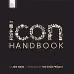

# SitePoint Premium 新版本:Swift、Icon Design 和 Vue

> 原文：<https://www.sitepoint.com/sitepoint-premium-new-releases-swift-icon-design-and-vue/>

我们正努力通过 SitePoint Premium 让您在自己的领域保持领先地位。我们有大量新书和迷你书可以在图书馆借阅——让我们向你介绍一下。

## Swift-Packt 全栈开发实践

使用 Xcode、Vapor 和 Swift 为 web 和移动平台从头开始构建全栈购物清单应用程序。通过创建可重用的客户机和服务器组件来提高开发人员的工作效率。使用 Vapor framework 为您的应用和网站开发后端服务。

阅读【Swift 全栈开发实践。

## Vue 和 D3.js 数据可视化简介

了解如何使用图表和图形可视化 Vue 项目中的数据，以便更好地传达和交流信息。在本教程中，您将使用 D3.js 库来实现这一点，该库结合了强大的可视化组件和数据驱动的 DOM 操作方法。

阅读[使用 Vue 和 D3.js 的数据可视化介绍](https://www.sitepoint.com/premium/books/an-introduction-to-data-visualization-with-vue-and-d3-js/)。

## 图标手册

图标手册是指导你完成图标设计整个过程的唯一资源——从决定正确的隐喻，画出清晰易懂的符号，到在你的网站和应用中实现。

阅读[图标手册](https://www.sitepoint.com/premium/books/the-icon-handbook/)。

## 如何用 Vue 构建一个可重用的组件

在本教程中，我们将教你如何使用 Vue 构建一个可重用的模态组件。我们将指导您创建一个简单的身份验证模型，使用 Vue 创建一个组件，最后创建一个可以复制和重用的框架模型组件。

阅读[如何用 Vue](https://www.sitepoint.com/premium/books/how-to-build-a-reusable-component-with-vue/) 构建可重用组件。

## 用 Vue.js，Node 和 MongoDB 搭建一个基本的 CRUD App

在本教程中，您将学习如何使用 Node、MongoDB 和 Vue 构建一个简单的 CRUD 应用程序，这是一个帮助外语学生学习词汇的工具。

阅读[用 Vue.js、Node 和 MongoDB](https://www.sitepoint.com/premium/books/build-a-basic-crud-app-with-vue-js-node-and-mongodb/) 搭建一个基本的 CRUD App。

## 还会有更多…

我们几乎每天都在 SitePoint Premium 上发布新内容，所以下周我们将带着最新更新回来。别忘了:如果您还没有查看我们的产品，请参加我们的 [7 天免费试用](https://www.sitepoint.com/)。

## 分享这篇文章