# 创建一个自动化的记分牌，用树莓皮感知你的分数

> 原文：<https://www.sitepoint.com/create-an-automated-scoreboard-that-senses-your-score-with-a-raspberry-pi/>

[https://www.youtube.com/embed/rI8ETBhy-ts](https://www.youtube.com/embed/rI8ETBhy-ts)

圣诞节前一时冲动，我给自己买了一个 NBA“过门”迷你篮球架。我不确定我会用它做什么，但在我的办公室里放一个篮球框似乎是一个不错的选择。最后，我决定进行实验，通过将它连接到一个 Raspberry Pi 上，给它一个记分牌显示，为它带来一些连接性。下面是如何进行的，如果你想尝试适应和改进它，有一步一步的指导！

本教程并不打算作为一步一步的“照我做的做”的风格指南，我希望你能接受这个概念，并将其用于所有其他想法。添加一个虚拟记分牌，记录人们进入您办公室的频率。或者进行不同的运动(也许是一个迷你足球球门追踪器？).或者使用一个完全不同的传感器，但用树莓派视觉跟踪点击！这项技术有很多潜在的应用。尝试一些东西，让我知道你怎么做！

## 你需要什么

为了能够跟进并做出类似的东西，这里列出了我使用的部件(或我实验室里已经有的类似部件):

*   **[【树莓派 3 b+](https://www.amazon.com/ELEMENT-Element14-Raspberry-Pi-Motherboard/dp/B07BDR5PDW/ref=as_li_ss_tl?crid=VZJJ66FE3MC1&keywords=raspberry+pi+3+b+&qid=1552006730&s=gateway&sprefix=raspberry+pi,aps,364&sr=8-3&linkCode=ll1&tag=sitepoint099-20&linkId=4ad0f742a8a2a50b7f6bc7f15f032b8a)**——我用的是 2015 年的一个老版本，如果你要买，就买一个像这样的新版本吧！
*   **[一个带 NOOBS](https://www.amazon.com/Raspberry-Pi-16GB-Preloaded-Noobs/dp/B01H5ZNOYG/ref=as_li_ss_tl?keywords=noobs+sd+card&qid=1551507622&s=gateway&sr=8-6&linkCode=ll1&tag=sitepoint099-20&linkId=b84a1191d34f39b4f6ddacc8ae6e6cb8)** 的 MicroSD 卡——如果你想自己安装这个，并准备好一个 SD 卡[树莓派基金会在这里有一个如何做的指南](https://www.raspberrypi.org/help/noobs-setup/2/)。
*   **[【斯伯丁 NBA Slam Jam 过门迷你篮球架](https://www.amazon.com/gp/product/B0085AOZIK/ref=as_li_tl?ie=UTF8&camp=1789&creative=9325&creativeASIN=B0085AOZIK&linkCode=as2&tag=sitepoint09-20&linkId=d8e8bc69bbf028cdbbde2f195611dcc2)**——这是我用过的迷你篮球架。你可以用一个不同的——尤其是如果它的网络工作得更好的话！
*   **[树莓派 3.3190G 7”触摸屏显示器](https://www.amazon.com/gp/product/B0153R2A9I/ref=as_li_tl?ie=UTF8&camp=1789&creative=9325&creativeASIN=B0153R2A9I&linkCode=as2&tag=sitepoint09-20&linkId=12564b5131303fa31b06069177fcb330)**——这是我最喜欢的树莓派显示器，它是一个触摸屏，所以你可以与 UI 互动，而不需要连接鼠标。
*   **[RS Raspberry Pi 7 英寸液晶触摸屏外壳，黑色](https://www.amazon.com/gp/product/B01GQFUWIC/ref=as_li_tl?ie=UTF8&camp=1789&creative=9325&creativeASIN=B01GQFUWIC&linkCode=as2&tag=sitepoint09-20&linkId=cf414f1db79199c6822a3b1ae7a4f808)**——为了让显示器和 Pi 一起看起来更好看，我把我的 Pi 放在这个黑色外壳里。
*   **[HC-SR04 超声波测距传感器模块](https://www.amazon.com/gp/product/B00F167T2A/ref=as_li_tl?ie=UTF8&camp=1789&creative=9325&creativeASIN=B00F167T2A&linkCode=as2&tag=sitepoint09-20&linkId=ec650235474281cc51ed390479c7fa56)**——我身边有一个备用的廉价克隆 HC-SR04 传感器，但我会推荐买一个质量好的。我的那个偶尔会有奇怪的读数，而且有点喜怒无常。

**需要注意的一点是—** 如果你的 Pi 没有 7 英寸显示屏，你也可以在附近的电脑显示器上显示分数。本地网络上任何带有网络浏览器和屏幕的设备都可以工作！

## 代码

想直接下载代码吗？GitHub 上有[这里有](https://github.com/sitepoint-editors/hoops-pi)。

## 我整理的东西

我把我的新篮球框挂在门上，框上装有超声波传感器，可以跟踪球何时进入框内。下面是一个 Raspberry Pi 供电的记分牌——我实际上建议找到更长的电缆，这样你就可以在篮球下落范围之外连接它。

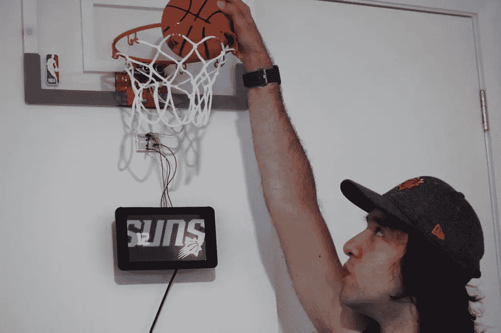

我在测试我的联网记分牌——用一个定制的太阳主题界面！

我将在下面解释为什么一切都是这样——以及给那些想在此基础上改进的人的一些建议！

## 我们将要使用的语言

*   为了跟上进度，你需要一些基础知识，但是我们不会有一行又一行的代码，事实上 JS 方面的事情非常简单。
*   **Node . js**–运行我们的记分牌服务器需要了解如何运行 npm 和 Node 的基本知识。

## 设置我们的树莓派

如果你对树莓派完全陌生，还没有设置任何东西，不要害怕！有很多关于设置的指南，非常简单明了。Raspberry Pi 基金会有一个使用 NOOBS 操作系统管理器安装 Raspbian 操作系统的分步指南。在进入任何其他步骤之前，您需要确保操作系统正在运行。

### 触摸屏设置

我用一个带触摸屏的 Raspberry Pi 3 把我连接的记分牌放在一起。我的触摸屏和外壳已经放在一起并拧紧，因为我以前在其他项目中使用过这个 Pi 3，但是如果你是从零开始，连接起来并不太难。较新的发货(像我的)实际上已经组装了一堆，适配器板已经拧到 LCD 屏幕上，如果是这样的话，一半的步骤已经完成了！如何组装屏幕的说明可在网上获得:

*   [官方说明](https://cdn.shopify.com/s/files/1/0174/1800/files/how_to_assemble_the_rpi_touchscreen_display.jpg?14903340043104331728) —这些是屏幕附带的说明，以防您丢失！
*   Pi 小屋有他们自己的教程，他们也解释了这个过程的细节。
*   [ZDNet 让我们来看看带外壳的触摸显示屏](https://www.zdnet.com/article/hands-on-raspberry-pi-7-inch-touch-display-and-case/) —他们提供了大量的细节和技巧来设置屏幕和外壳，以便在各种情况下使用。

### 案例设置

当谈到将外壳放在 LCD 屏幕和 Raspberry Pi 周围时，这个过程对我的外壳来说也很容易。我已经准备好了，但是一般步骤是:

*   确保你已经把你的 microUSB 卡放在树莓派里面了，并且对它的运行方式感到满意！令人恼火的是，在很多情况下，一旦盒子放好了，你就不能把卡拿出来了。上面链接的我的情况就是其中之一…所以在你失去访问权之前确保卡是完好的！
*   将带屏幕的 Pi 放入外壳内
*   排列带状电缆和来自 GPIO 的电缆，使它们不会碍事
*   确保你的 USB 接口和类似的孔在箱子较大部分的正确一侧，并且排列整齐。
*   一旦所有的东西都排列好了，拧紧四个螺丝就可以把它们组装在一起了！
*   打开它！如果你发现屏幕上下颠倒了，不用担心，这是机箱厂商排着队发力顶出来的副作用。当我登上我的记分牌时，我是用底部发出的力量登上的，所以这对我来说不是问题。如果这对您来说是个问题:
    *   运行`sudo nano /boot/config.txt`打开 Pi 的配置
    *   然后在末尾加上`lcd_rotate=2`，这将会旋转屏幕。
    *   按 Ctrl X 和 Ctrl Y 保存更改。
    *   重启你的 Pi，当它重新加载时，应该是正确的！

### 在 Raspberry Pi 上运行 Node.js

方便的是，Raspbian 默认安装了 Node！但是，它是 Node 的一个相当旧的版本。您可以通过打开终端并键入以下内容来检查您的 Pi 上安装了哪个版本:

`node -v`

我的 Pi 上安装了 8.15.0 版本。您可以通过运行以下命令进行升级:

 `sudo su -
apt-get remove nodered -y
apt-get remove nodejs nodejs-legacy -y
apt-get remove npm -y
curl -sL https://deb.nodesource.com/setup_5.x | sudo bash -
apt-get install nodejs -y` 

运行完所有这些之后，如果您再次键入 version 命令，您应该会看到一个更好的版本:

`node -v`

您还可以通过运行以下命令来检查 npm 是否安装正确:

`npm -v`

随着 node 在我们的设备上运行，我们已经准备好运行记分板节点服务器了！

## 我们的 Node.js 记分牌

我们记分牌的目标如下:

*   安装一个超声波传感器，观察环内的运动。
*   我们的节点服务器将观察来自我们的超声波传感器的距离读数。
*   我们将运行一个简单的网页，显示节点服务器检测到得分后的反应。
*   使用 WebSockets 在我们的节点服务器和网页之间向我们的网页发送分数触发器。

因此，我们的节点服务器的角色将是运行记分牌网页的 web 服务器，ping 我们的超声波传感器，并在发现球的运动时向我们的网页发送消息。

这里是我们的最终代码，供那些只想复制并粘贴进来进行尝试(或将其视为一个整体来理解它)的人使用。

```
const http = require('http'),
    express = require('express'),
    app = express(),
    server = require('http').Server(app),
    bodyParser = require('body-parser'),
    webpagePort = 8080,
    WebSocketServer = require('ws').Server,
    wss = new WebSocketServer({server: server}),
    Gpio = require('pigpio').Gpio,
    MICROSECONDS_PER_CM = 1e6/34321, // The number of microseconds it takes sound to travel 1cm at 20 degrees celsius
    trigger = new Gpio(23, {mode: Gpio.OUTPUT}),
    echo = new Gpio(24, {mode: Gpio.INPUT, alert: true});

let lastScoreTime = new Date();

app.use(bodyParser.json());

app.use(express.static(__dirname + '/public'));

app.use(function(err, req, res, next) {
  console.error(err.stack);
  res.status(500).send('Error came ');
});

server.listen(webpagePort, function() {
  console.log('Server is running on ' + webpagePort);
});

wss.on('connection', function connection(ws) {
  console.log('WebSockets are ready!');
});

function broadcast(message) {
  if (message) {
    console.log('Broadcasting ' + message);
    wss.clients.forEach(function each(client) {
      client.send(message);
    });
  }
}

trigger.digitalWrite(0); // Make sure trigger is low

const watchHCSR04 = () => {
  let startTick;

  echo.on('alert', (level, tick) => {
    if (level == 1) {
      startTick = tick;
    } else {
      const endTick = tick;
      const diff = (endTick >> 0) - (startTick >> 0);
      let distance = diff / 2 / MICROSECONDS_PER_CM;
      let currentScoreTime = new Date();
      console.log(distance);
      if (distance  1000)) {
        lastScoreTime = currentScoreTime;
        broadcast('SCORE:' + (diff / 2 / MICROSECONDS_PER_CM));
      }
    }
  });
};

watchHCSR04();

setInterval(() => {
  trigger.trigger(10, 1); // Set trigger high for 10 microseconds
}, 100); // Trigger every 100 milliseconds
```

我们现在将浏览每个部分，并了解其中发生了什么。

我们从运行 Node Express 服务器的一组典型常量开始。这是一个将在端口 8080 上运行的 web 服务器。Express 是我们正在使用的 Node.js 框架，因为它使运行 web 服务器变得又好又简单！

```
const http = require('http'),
    express = require('express'),
    app = express(),
    server = require('http').Server(app),
    bodyParser = require('body-parser'),
    webpagePort = 8080,
```

接下来，我们继续定义常量，但是这些是针对我们的 WebSocket 服务器的。WebSockets 是我们在服务器和显示分数的网页之间来回传递消息的方式。使用 WebSockets，我们可以在许多显示器上打开网页，它会更新所有的显示器。我只使用树莓 Pi 屏幕，但如果你想的话，你可以尽情发挥，在周围放置大型显示器来制作一些非常特别的东西。

对于 WebSockets，有一些不同的库，但是我喜欢使用 [ws](https://www.npmjs.com/package/ws) 。它专注于使用 WebSockets 标准以现代浏览器可以原生理解的方式提供 WebSockets(所以我们不需要在浏览器端运行 JavaScript 库)。

在我们的代码中，我们为服务器定义了`WebSocketServer`对象，然后创建了一个新的`WebSocketServer`，并将其分配给常量`wss`。

```
WebSocketServer = require('ws').Server,
wss = new WebSocketServer({server: server}),
```

最后，我们的最后一个常数是，这样我们就可以听到来自我们的超声波传感器的读数。为了从超声波传感器读取数据，我们使用了 [pigpio](https://github.com/fivdi/pigpio) 节点库。这使我们能够沿着电路板的顶部边缘访问 GPIO(通用输入/输出)引脚，这是我们连接超声波传感器的地方。

```
Gpio = require('pigpio').Gpio,
```

然后，我们在 GitHub 文档的[中添加 pigpio 的超声波传感器示例中提供的计算结果。它计算声音在 20 摄氏度下传播 1 厘米需要多少微秒。我们将在超声波传感器发出声音时使用该计算，然后监听响应——我们使用`MICROSECONDS_PER_CM`来计算响应的距离。](https://github.com/fivdi/pigpio#measure-distance-with-a-hc-sr04-ultrasonic-sensor)

```
MICROSECONDS_PER_CM = 1e6/34321, // The number of microseconds it takes sound to travel 1cm at 20 degrees celsius
```

最后两个常数指的是超声波传感器要连接的两个 GPIO 引脚。我们将引脚 23 作为称为`trigger`的输出引脚，引脚 24 作为称为`echo`的输入引脚。

```
trigger = new Gpio(23, {mode: Gpio.OUTPUT}),
echo = new Gpio(24, {mode: Gpio.INPUT, alert: true});
```

下面一行允许我们发送和解释 JSON 字符串。

```
app.use(bodyParser.json());
```

然后，我们为我们的 web 服务器设置了一些东西。我们首先设置静态 HTML/CSS/JS 文件的位置。当我们试图在前面列出的端口上访问 Raspberry Pi 时，这就是我们的 Express 服务器要查看的地方。

```
app.use(express.static(__dirname + '/public'));
```

然后，我们设置当错误发生时应该发生什么，我们告诉它将错误记录到控制台，然后发送一个 500 错误。

```
app.use(function(err, req, res, next) {
  console.error(err.stack);
  res.status(500).send('Error came ');
});
```

为了运行我们的 web 服务器，我们调用下面的代码。成功运行时，它会显示一条控制台消息。

```
server.listen(webpagePort, function() {
  console.log('Server is running on ' + webpagePort);
});
```

在我们的 web 服务器建立之后，我们建立了我们的 WebSocket 连接。节点服务器是我们的 WebSockets 服务器——它将向连接的客户端(我们在 Raspberry Pi 上的 web 浏览器)广播消息。下面的代码设置了当我们的 WebSocket 服务器准备好时要做什么。这发生在“连接”事件发生时。当这种情况发生时，我们发送一个`console.log`，如果我们在控制台中没有看到这个，我们知道 WebSocket 服务器端出了问题。

```
wss.on('connection', function connection(ws) {
  console.log('WebSockets are ready!');
});
```

接下来，我们创建了一个自定义函数，它将向任何连接的客户端发送 WebSocket 消息。就在它发送该消息之前，它将记录一条消息，表明该消息是从服务器广播的。

```
function broadcast(message) {
  if (message) {
    console.log('Broadcasting ' + message);
    wss.clients.forEach(function each(client) {
      client.send(message);
    });
  }
}
```

以下代码与我们的超声波传感器相关。这很大程度上直接来自于 pigpio GitHub 页面的例子。我不需要做太多的改动就能让它在这个场景中很好地运行。

我们首先将 trigger 引脚设置为低电平(或`0`)(当我们想要计时时，我们将触发它为高电平)。

```
trigger.digitalWrite(0); // Make sure trigger is low
```

pigpio 库可以使用一种叫做“警报”的东西对 gpio 引脚的状态变化做出反应。pigpio 库的 npm 页面说它跟踪这些“精确到几微秒”,这对我们来说足够了。我们设置了一个名为`watchHCSR04`的函数，该函数将留意来自 GPIO 引脚的滴答，如果它接收到一个滴答，我们将检查它保持高电平(或开启)的时间，然后我们根据该时间和`MICROSECONDS_PER_CM`计算，计算出导致 ping 返回的最近项目距离多少厘米。

如果距离少于 11 厘米，那么我们从我们的 WebSocket 服务器触发一个广播，让我们的 web 浏览器客户端知道移动被发现了。经过反复试验后，我决定选择 11 厘米，在环内的不同位置拿住球，同时我的`console.log`跑去看看球在那里时超声波传感器报告的值。

我们还会检查当前时间是否与上次读取分数的时间一致——如果还没有超过 1000 毫秒，我们就不会触发新的分数(例如，如果球在篮圈里晃动了一下，就不会给某人更多的分数！).这是我在发现一些重复计算分数的情况后添加的。

```
const watchHCSR04 = () => {
  let startTick;

  echo.on('alert', (level, tick) => {
    if (level == 1) {
      startTick = tick;
    } else {
      const endTick = tick;
      const diff = (endTick >> 0) - (startTick >> 0);
      let distance = diff / 2 / MICROSECONDS_PER_CM;
      let currentScoreTime = new Date();
      console.log(distance);
      if (distance  1000)) {
        lastScoreTime = currentScoreTime;
        broadcast('SCORE:' + (diff / 2 / MICROSECONDS_PER_CM));
      }
    }
  });
};

watchHCSR04();
```

为了真正引起 ping 发生，我们需要将我们的触发器设置为高(或`1`),以从我们的超声波传感器发出初始声音来进行测量。在服务器代码的最后一部分，我们每 100 毫秒做一次。这比皮奥的例子要频繁得多，因为我想有更多的机会发现篮下的移动。经过几次测试后，我把这个值调得越来越低(原来篮球可以移动得相当快！)

```
// Trigger a distance measurement once per second
setInterval(() => {
  trigger.trigger(10, 1); // Set trigger high for 10 microseconds
}, 100);
```

### 我们的 Package.json 文件

我们还需要在 package.json 文件中列出我们的依赖项，以便我们跟踪我们的项目需要运行什么！我的 package.json 文件如下所示:

```
{
  "name": "hoopspi",
  "version": "0.0.1",
  "description": "A connected scoreboard for my basketball hoop",
  "main": "index.js",
  "dependencies": {
    "body-parser": "^1.15.2",
    "express": "^4.14.0",
    "gulp": "^3.9.1",
    "pigpio": "^1.2.1",
    "ws": "^1.1.1"
  },
  "devDependencies": {},
  "author": "Patrick Catanzariti",
  "license": "MIT"
}
```

这包含了我们在上面的节点服务器中使用的所有依赖项。我建议将上面的内容复制粘贴到一个新的`package.json`文件中，与你的`index.js`文件放在同一个文件夹中。一旦你有了它，在你的控制台中运行下面的命令来安装所有需要的东西:

`npm install`

## 我们的 HTML

HTML 非常简单:

```
<!doctype html>
<html>
    <head>
        <meta charset="UTF-8">
        <meta name="viewport" content="width=device-width, initial-scale=1">
        <meta name="robots" content="no index, no follow">
        <title>HoopsPi</title>
        <link href="/css/styles.css" rel="stylesheet" type="text/css">
        <link href="https://fonts.googleapis.com/css?family=ZCOOL+QingKe+HuangYou" rel="stylesheet">
    </head>
    <body>
        <div class="container">
            <div id="score"></div>
        </div>
        <script src="js/scoreboard.js"></script>
    </body>
</html>
```

## 我们的前端 JavaScript

我们的前端 JavaScript 看起来是这样的:

```
(function() {
    var ws = new WebSocket('ws://192.168.1.133:8080', 'json');
    var score = 0;

    ws.onopen = function () {
        console.log('Websocket is open');
        ws.send('Hi from HoopPi!');
        document.getElementById('score').innerHTML = score;
    };

    ws.onmessage = function (event) {
        if (event.data.indexOf('SCORE:') != -1) {
            score++;
            document.getElementById('score').innerHTML = score;
        }
        console.log('Message was ', event.data);
    };

    ws.onerror = function(error) {
       console.log('Error detected: ' + error.data);
    }
}());
```

我们来看看是怎么回事！我们首先设置一个 WebSocket 来监视我们的 Raspberry Pi 所在的 IP 地址(使用控制台中的命令`ifconfig`来查找)。我们还将页面加载的初始得分设置为 0。

```
(function() {
    var ws = new WebSocket('ws://192.168.1.133:8080', 'json');
    var score = 0;
```

之后，我们打开 WebSocket，向控制台和我们的 WebSocket 发送一条消息(这条消息会发送到服务器，但我们不会使用这条消息！)并将我们在网页上的可见分数设置为我们的`score`变量:

```
ws.onopen = function () {
    console.log('Websocket is open');
    ws.send('Hi from HoopPi!');
    document.getElementById('score').innerHTML = score;
};
```

当我们的 WebSockets 看到一条消息(这将是来自我们 Pi 的消息)时，我们检查它是否有`"SCORE:"`的内容，如果有，我们将我们的分数计数加 1。从技术上来说，在篮球比赛中你至少可以得两分…但是我没有办法去发现三分球，所以我想一分就足够了。总有一天！我还记录了传入浏览器控制台的数据，这样我们就可以在出现问题时进行检查。

```
ws.onmessage = function (event) {
    if (event.data.indexOf('SCORE:') != -1) {
        score++;
        document.getElementById('score').innerHTML = score;
    }
    console.log('Message was ', event.data);
};
```

最后，如果有任何错误，我们会将它们记录到控制台:

```
ws.onerror = function(error) {
       console.log('Error detected: ' + error.data);
    }
}());
```

## 给东西布线

为了让上面的任何一个工作，我们需要把所有的东西都正确的连接起来！我们要做的主要工作是将超声波传感器连接到上面提到的 Raspberry Pi 的 GPIO 引脚。

我的 GPIO 引脚最后看起来是这样的:

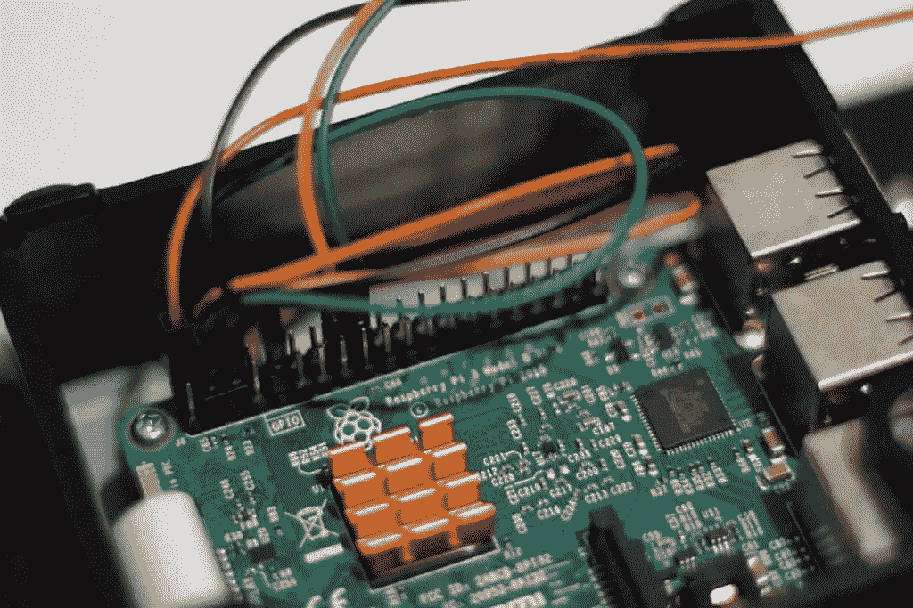

让我们来看看到底是什么连接在哪里。

我们必须小心连接超声波传感器。超声波传感器的输出为 5V，但 Raspberry Pi 的 GPIO 引脚最大电压为 3.3V，因此我们需要包括一些电阻，以确保不会损坏 GPIO 引脚。我个人使用 1K 和 2K 电阻，但是 pigpio 库的示例使用 330 和 470 欧姆电阻(我身边没有这些电阻，我的替代电阻似乎也不错，我建议遵循 pigpio 的建议)。

说到将超声波传感器连接到试验板，我使用了一些白色跳线进行连接，以便试验板和我们的 Pi 之间有更多的长度。超声波传感器会卡在环下，所以我们需要它从试验板上脱离出来才能做到这一点！然而，在我这样连接它之前，我将超声波传感器直接连接到试验板上，只是为了测试(在将传感器安装到环箍之前，测试传感器在试验板中支撑时是否工作要容易得多！).

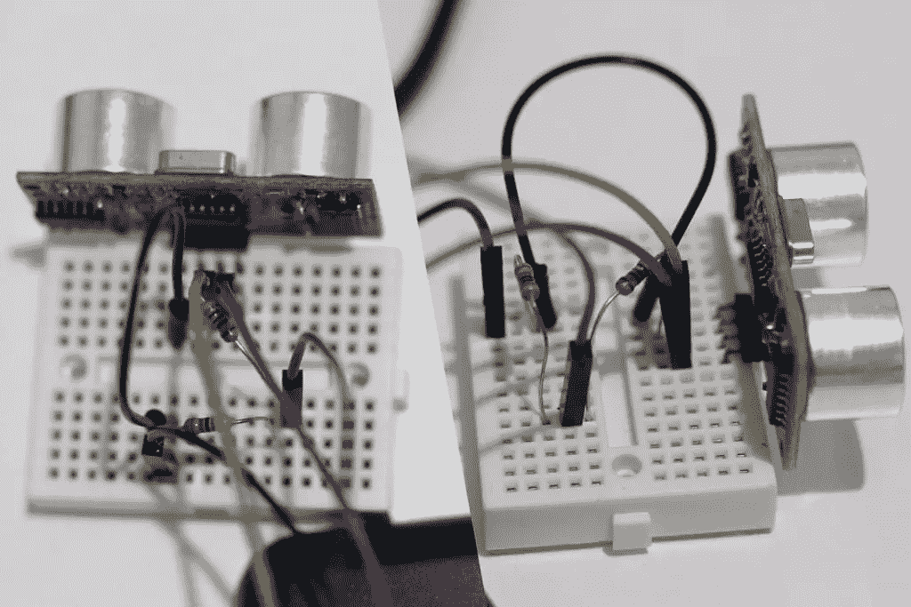

添加跳线电缆后，看起来更像这样:

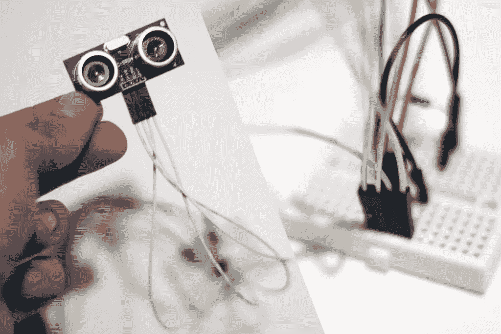

所有接线如下图所示。我们将超声波传感器上的 VCC 引脚连接到 5V 引脚(LCD 屏幕不使用的引脚)，超声波传感器上的 GND 引脚连接到 Pi 上的地，但我们还在接地行和连接到 Pi 上引脚 24 的行之间放置了一个 470 欧姆的电阻。330 欧姆电阻从连接到超声波传感器回波的那一行连接到引脚 24 的那一行。

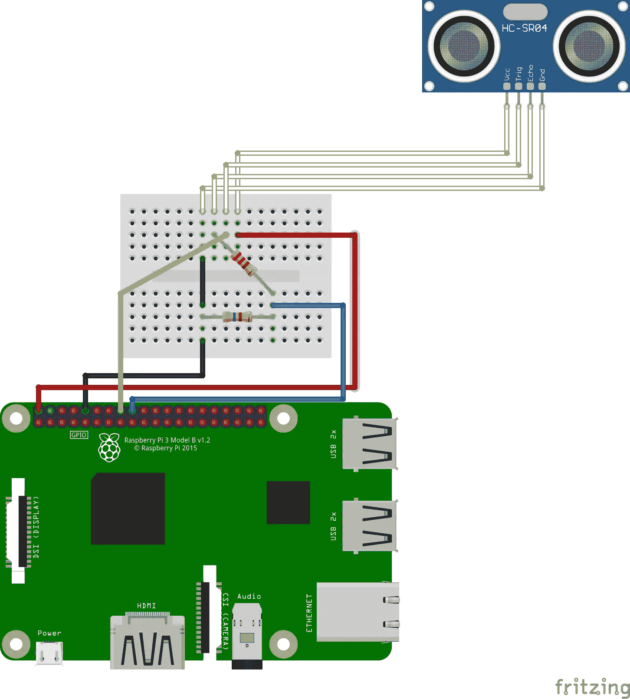

说到把它挂在篮球框上，我走的是用挂画带把我的树莓皮挂到墙上的路线。特别是我用的 [Command 5.4kg 白色中号图片挂条](https://www.amazon.com/gp/product/B00LW1APOC/ref=as_li_tl?ie=UTF8&tag=sitepoint09-20&camp=1789&creative=9325&linkCode=as2&creativeASIN=B00LW1APOC&linkId=b5a419b0b63d69fb4776e793a0e3fc5a)。我拿掉了 Pi 盒子的可拆卸背面，尽可能多的贴在上面:

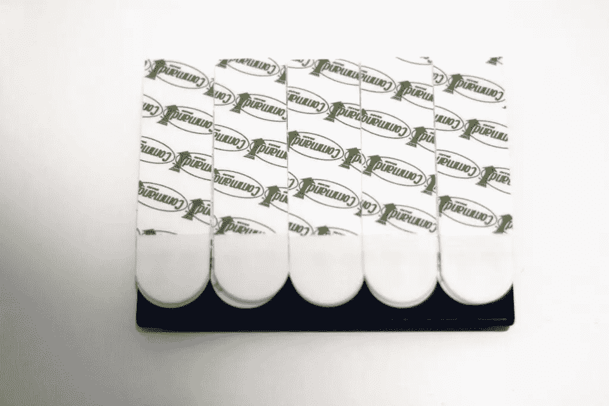

然后我把它重新挂回墙上，把圆周率放在盒子里，确保它是直的。我把我的直接放在了篮圈下面——回想起来，那不是最好的位置。我建议根据你的跳线长度把它放到一边。当我把 Pi 盒子排好之后，我轻轻地把它从后面拆下来，这样我就可以向下推盒子的背面，尽可能地把它牢牢地粘在墙上。

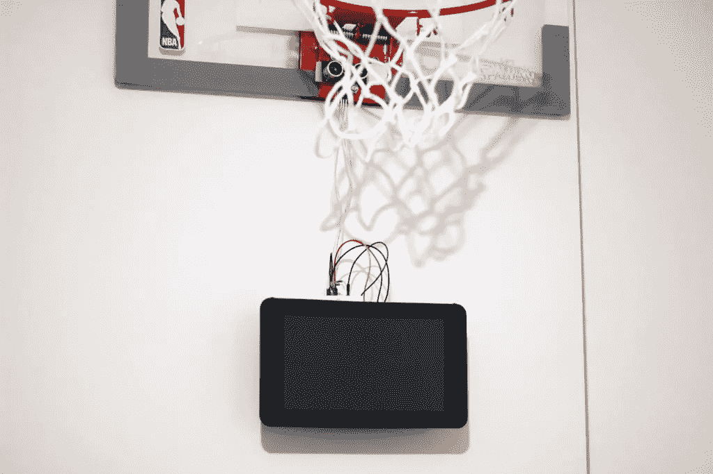

我非常担心圆周率是否会被粘住，为了安全起见，我在铁环下面放了一个豆包。幸运的是，在它挂在那里一个多星期并被篮球砸了无数次之后…它仍然挂着！那盘带子太神奇了。

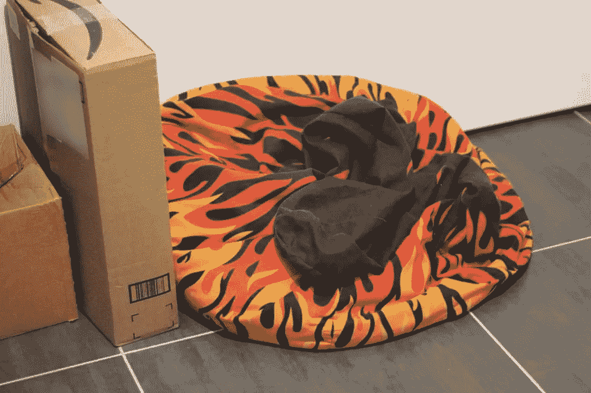

我最初用同样的胶带将我的传感器*贴在篮筐上，但使用胶带意味着我被限制在篮筐下足够平的某个地方，以至于可以将它粘住……这最终有点太低了，篮球网经常干扰跟踪。所以这就是我如何建议你*不要*贴传感器！*

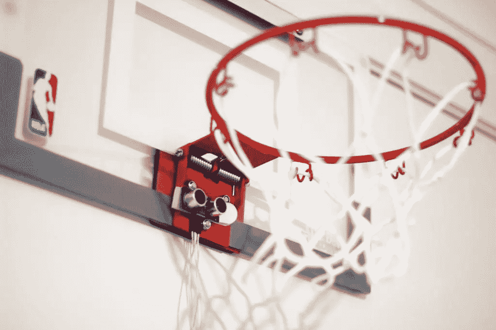

相反，我把传感器从那个点上拿下来，用 blutack 把它直接粘在铁环下面。

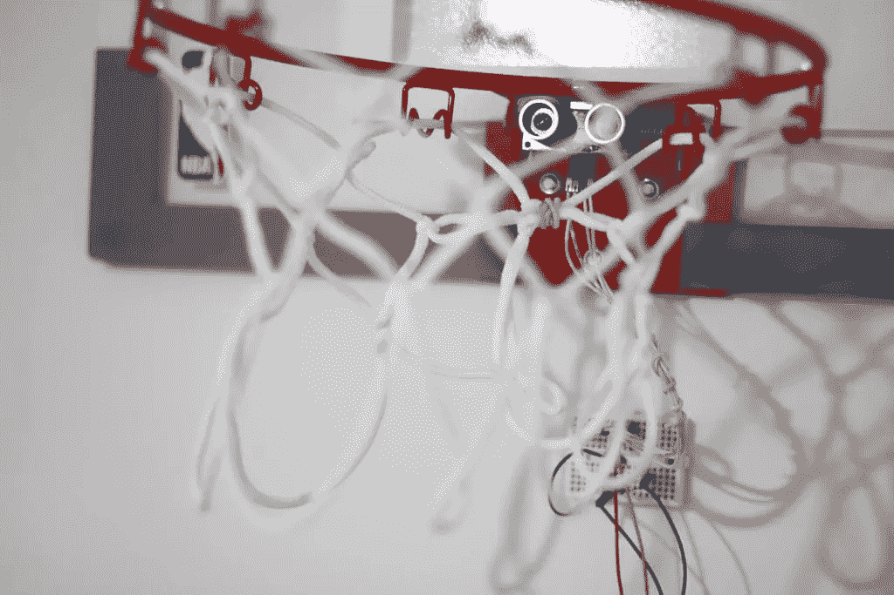

我更成功的放置了超声波传感器！

球网仍然挡在路上，所以我用 NBA 环箍包装上的一个扎带把一些球网绑在一起，以避免干扰:

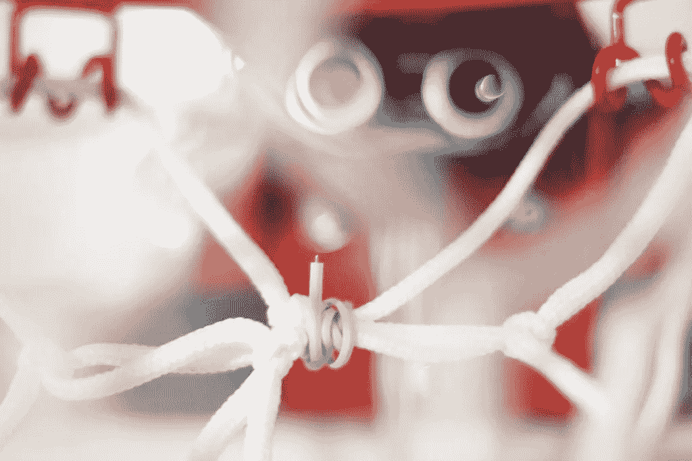

它仍然不完美，但似乎有点帮助！

我还用了一个电缆扎带将超声波传感器的电缆连接在一起。那些电缆扎带非常方便。

## 在活动

要运行一切，我们需要使用`sudo`关键字运行 Node.js 服务器，因为我们的节点应用程序需要可靠的权限才能访问 GPIO 引脚。要运行 Node.js 服务器，我们输入以下内容:

`sudo node index.js`

在控制台中应该是这样运行的:

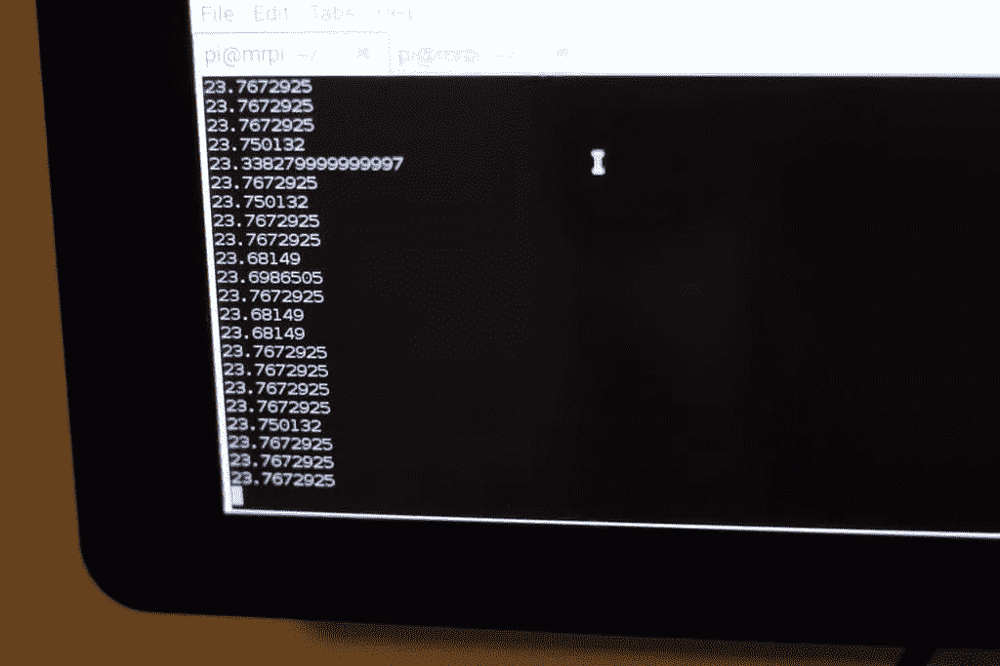

如果我们打开 Raspberry Pi 的浏览器，进入 *http://localhost:8080* ，我们应该会看到我们的记分牌已经准备好了！

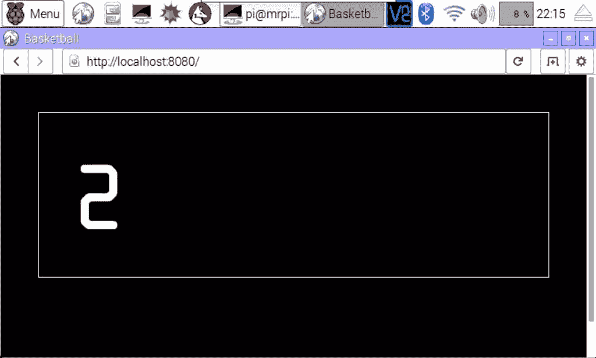

我个人更喜欢我的覆盆子 Pi 上的 Chromium，因为我更喜欢它的全屏模式和更多最新的浏览器。如果您的 Raspberry Pi 上没有 Chromium，使用两个命令安装很简单:

通常的:

```
sudo apt-get update
```

其次是:

```
sudo apt-get install chromium-browser --yes
```

然后，您应该可以在 Pi 菜单的“互联网”部分看到它:

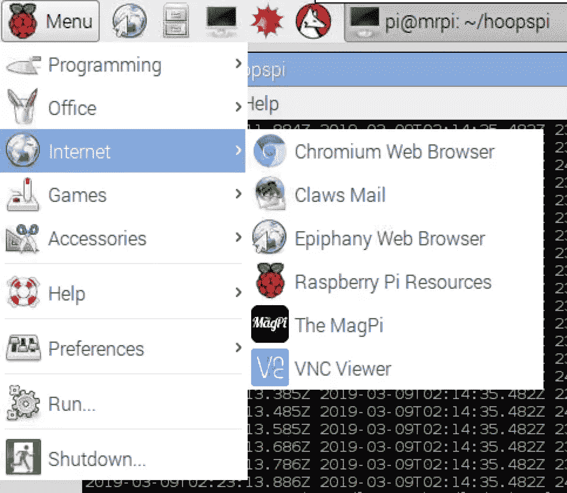

铬合金将安装在哪里

作为一个网页，最好的部分是它很容易定制！我定制了一个菲尼克斯太阳队的主题:

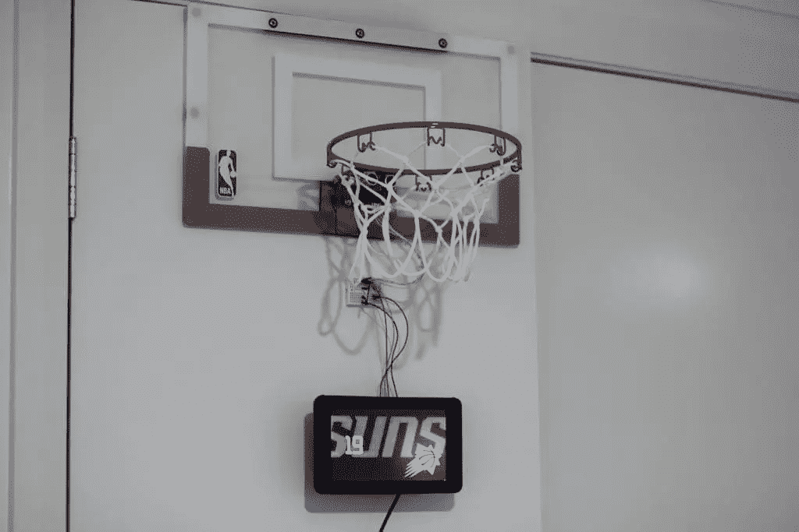

我的太阳主题版记分牌

## 结论

最后，篮球得分跟踪工作正常，但肯定会被带到下一个级别。我很想买一个[红外距离传感器](https://www.amazon.com/dp/B07548PZW2/ref=as_li_ss_tl?ie=UTF8&linkCode=ll1&tag=sitepoint099-20&linkId=db03fbf919358af8ca9f0576dd4a789a)，看看它是否能更准确地跟踪。基于浏览器的记分板还可以做更多的事情——你可以添加一个倒计时器，或者两个玩家模式，这样你就可以和朋友轮流玩了！

如果你用我上面最初的概念建造了类似的东西，我很想听听你建造了什么！请在下面的评论中告诉我，或者在 Twitter 上通过 [@thatpatrickguy](https://www.twitter.com/thatpatrickguy) 与我联系。

## SitePoint 上的其他 Raspberry Pi 指南

如果你热衷于用你的树莓派做更多的事情，我们在下面有关于树莓派修补的其他整洁的文章！

*   [node . js 中的 Raspberry Pi GPIO 引脚入门](https://www.sitepoint.com/getting-started-with-the-raspberry-pi-gpio-pins-in-node-js/)
*   [使用您的 Raspberry Pi 设置家庭 VPN 服务器](https://www.sitepoint.com/setting-up-a-home-vpn-using-your-raspberry-pi/)

## 分享这篇文章