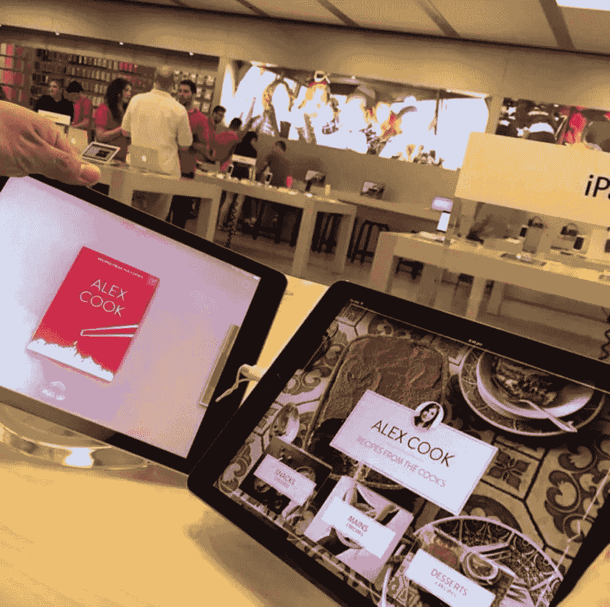
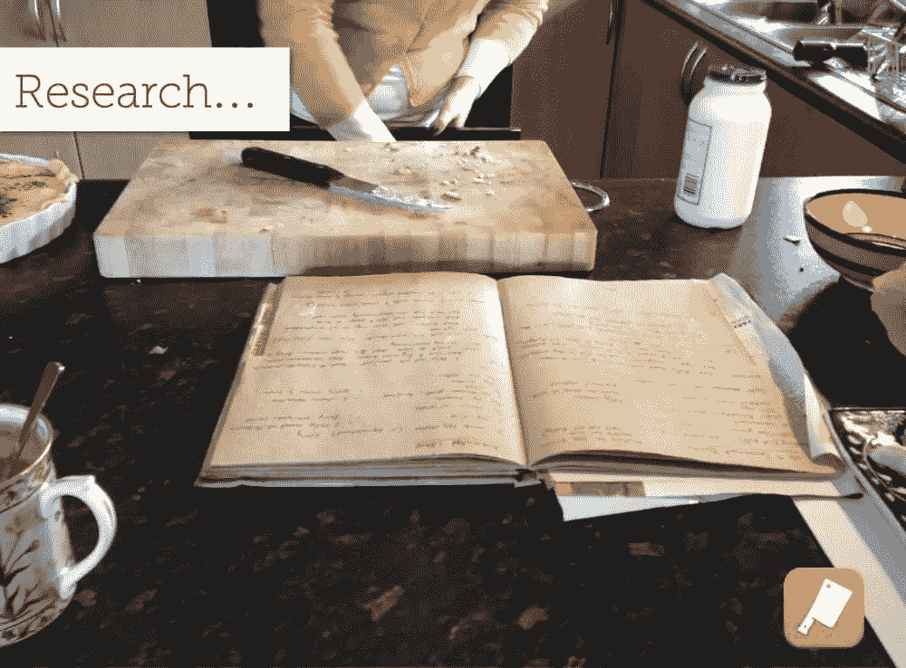
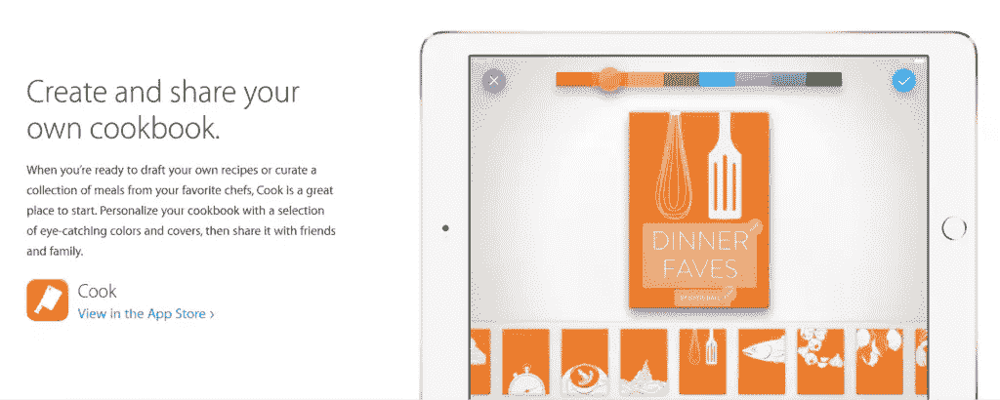
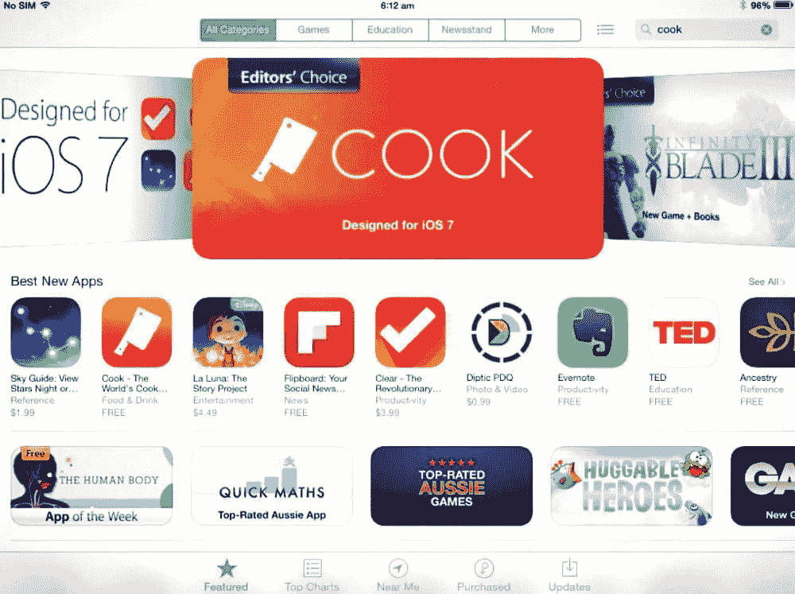
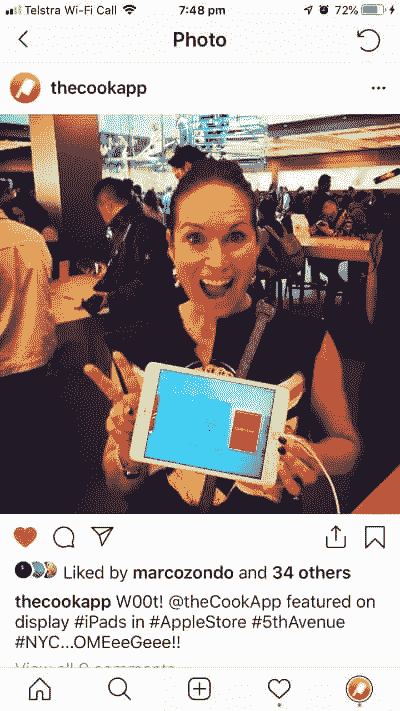

# 用户研究如何把一个好的应用变成一个伟大的应用

> 原文：<https://www.sitepoint.com/how-user-research-turned-a-good-app-into-a-great-one/>

想从头开始学习 UX 吗？使用 SitePoint Premium 获得涵盖基本面、项目、技巧和工具&的 UX 书籍全集。[现在就加入，每月仅需 14.99 美元](https://www.sitepoint.com/premium/products/Z2lkOi8vbGVhcm5hYmxlL1Byb2R1Y3QvMzE3?utm_source=blog&utm_medium=articles)。

首先，背景故事。2013 年，广受欢迎的[烹饪应用](https://itunes.apple.com/au/app/cook/id687560846)发布，回顾它所走过的历程真是太棒了。

我喜欢烹饪。对于创建了一个烹饪应用程序的人来说，这可能并不奇怪。作为一个孩子，我最早的一些记忆是坐在厨房的长凳上，看着我的母亲为各种各样的社会活动烹饪美味的食物，帮助搅拌或参与其他小事情对我来说是一个亮点。

我真的认为食物能保存很多记忆。食物的味道，或者你正在吃的菜的类型，可以带你回到过去——就像音乐有能力引发你生活中不同时期的记忆，提醒你过去的人和地方。

正是对过去的回忆让我想到了电子食谱是一个应用程序的好主意。

有一天我和我妈聊天，问她我奶奶的烤蛋羹配方在哪里。她回答说:“哦，我不知道。我不认为她会写下来。她只是凭记忆做的。”

我吓坏了。这是一个简单的食谱。但是在我问这个问题的时候，我的祖母已经去世十年了。这意味着我从过去回忆起的食谱——尽管它们很简单——现在已经和她一起丢失了。我的祖母和许多家庭厨师没有什么不同，他们有一系列的食谱，他们经常做，他们知道如何凭记忆做，所以从不写下来。

食谱可以在很多方面代表你的传统。我祖母的食谱很简单，我可以很容易地从网上搜索到。但是这份特别的食谱保存着我和祖母一起度过的烘焙晚餐和时光的特别记忆。因为她没有把它写下来，它现在已经丢失了——再也找不回来了。

因此，库克最初被设想为保存家庭食谱遗产的一种方式——帮助克服手写食谱随着时间的推移而丢失的问题，帮助保存家庭厨师世代相传的食谱。通过数字化旧世界的索引卡，破旧的食谱书，或其他随机手段，我的希望是使家庭食谱能够被捕获并与后代分享。数字化意味着食谱可以更容易地流传下来，不会随着时间的流逝而丢失。

## 做某事的机会来了

像许多对应用程序有杀手锏想法的人一样，我很久都没有用这个想法做任何事情。我只是另一个为应用程序设想“好主意”的人，并在晚宴上用这个想法让人们感到厌烦。

然后，在 2011 年，SitePoint 联系我写一本关于 UX 的书。

SitePoint 是一份主要面向开发人员社区的出版物，因此他们认为案例研究将有助于以更切实的方式为他们的读者带来 UX 的价值。

在有形的、可衡量的利益方面，UX 经常被人持怀疑态度。在那些日子里，在你开发产品的时候考虑产品的“用户”仍然是一件新鲜事——尽管这听起来很疯狂。所以我和我的编辑西蒙讨论了这个应用程序的想法，我们可以把它的故事整合到 UX 的书里。

我们想象每一章都可以谈论要遵循的关键方法，并且该应用程序将是我们如何将方法付诸实践的活生生的例子，以便将应用程序的想法付诸实践。从这个意义上说，库克成为了产品设计中“以人为中心的设计”的案例。

因此，通过写这本书，我们能够采取一种教育的方法，将食谱应用的想法进一步成熟。

## 产品开发的 UX 规则

无论何时创造一个产品，你都应该问自己三个简单的问题:

*   什么问题需要解决？
*   你在为谁解决？
*   你将如何衡量成功？

### 什么问题需要解决？

这通常会在想象产品时得到答案，库克也不例外。我是一个充满激情的家庭厨师，基于我遇到的痛苦，我认为市场上可能存在缺口。虽然永远不要认为你是你的用户是明智的，但这是许多想法的开始。这个想法激发了电子食谱的想法。接下来是对这个想法的探索。

作为探索过程的一部分，我们需要扫描地形。外面还有什么？只有我们有这种想法吗？我们如何从现有的竞争性和互补性产品中获得灵感？有人捷足先登了吗？

这项任务被证明是一项可怕的任务，因为我们发现烹饪应用程序中到处都是著名的名厨。杰米和尼格拉无处不在。我是一个充满热情的家庭厨师，但我不是厨艺大师。Eeep！然而，不管空间中的人才，设计差距仍然存在。我们找不到任何一款应用程序能向人们提供一种简单而愚蠢的方法来制作食谱并以数字形式保存下来。有许多复杂的很难使用。因此，不仅有差距，而且有一个我们可以很容易区分的领域——简单地通过易于使用。

### 我们在为谁解决？

在我看来，我们要解决的问题是家庭烹饪。热情，普通，日常厨师，这类人有自己的食谱剪贴簿，里面满是过去最喜欢的食谱。这些年从家人和朋友那里收集来的。

这也是我们最初将这款应用命名为“Family Favorites”的原因。它表达了我们的意图——但从营销的角度来看，它在销售梦想方面有点站不住脚，而且还倾向于以我们不希望的方式对目标受众进行归类。也就是说，它似乎在说“仅限家庭”。

我们知道我们需要在这个名字上做些工作，并赋予它更广泛的吸引力。然而，当我们继续研究和创建应用程序时，占位符名称保留了一段时间。我们以后再考虑名字。

### 衡量成功

很明显，衡量成功最简单的方法就是看人们下载并使用它。实际上，在这个阶段，在应用程序中创建食谱是衡量成功的主要标准。这个衡量标准会随着设计和概念的发展而改变，但是，从基本层面来说，如果你正在下载一个应用程序并使用它，这是一个很好的基本成功衡量标准。

我们为该应用程序是否收费而苦恼，最终我们决定在早期需要吸引眼球。所以这个应用程序将是免费的，这样人们下载它就没有障碍了。

## 采取“UX”方法在实践中意味着什么

我们吃自己的狗粮，遵循“以人为中心的设计方法”(HCD)，或“UX”的方法。如今，这种方法更普遍地被理解和接受为产品开发的有益方法。但在实践中又意味着什么呢？

HCD、UX，甚至服务设计(SD)，都有非常相似的理念:也就是说，通过将人放在设计过程的中心来进行设计——在产品开发过程的前期和整个过程中考虑他们的需求，是原型驱动的(也就是说，是实验性的)和迭代的(也就是说，改变你的想法和更新设计，基于你从与人的探索和验证中学到的东西)。这是愚蠢的简单。我们做这些都是为了开发库克。它工作了。

我经常讲述在我们开始设计应用程序之前，我如何招募人们参与一些概念探索研究的故事。我整个周末都在做这件事——这是我唯一能在工作时间安排的时间。我告诉参与者我要去他们家，我想让他们为我准备并烹饪他们一直以来最喜欢的菜谱。

我给每个人讲这个故事时，他们都笑着说同样的话。“好样的！你只是想被喂养！”

毫无疑问，这是我参加过的最愉快的会议之一，我当然喜欢许多不同的输出。但这是真正的诀窍之一——确保他们不真正知道我在探索什么。

从过程的角度来看，在我到达之前，我给他们发了一个家庭作业，让他们完成，这样我们就可以讨论这个问题了。家庭作业是制作一张结合文字和图像的海报，展示他们对烹饪的感受(这有助于他们进入主题)。他们知道我会到，在他们准备菜肴的时候和他们聊天，但他们并不知道除此之外我还在研究什么。

当他们准备食物时，我问了他们一些关于他们选择的菜的问题，并观察他们是否使用了食谱，以及他们在哪里有食谱作为参考。(是在一本食谱剪贴簿里吗？是在一本书里吗？索引卡？凭记忆？其他？)

我故意不太谈论储存或食谱管理。我观察到的那部分。我和他们主要谈论了他们对烹饪的热爱，他们是如何找到这个食谱的，以及它是如何成为家庭的最爱。我谈到了他们如何找到烹饪菜肴的新想法，以及他们把东西存放在哪里。但是我们从来没有讨论过他们是否认为“数字食谱应用”是一个好主意。

好的研究的诀窍是探索你正在看的东西的边缘，不要让你与之交谈的人知道你实际上在研究什么。

你从观察人们的真实习惯和行为中获得真正的洞察力，而不是通过直接询问他们的习惯——这只是让人们在不知道他们为什么做他们所做的事情的情况下编造一个答案。大多数时候我们不知道自己为什么要做事。我们只是自动地做它们。这是我们出于某种原因形成的习惯，它为我们服务于一个特定的目的。探索我们做什么的目的，以及为什么，是设计研究者的工作。

这涉及到设计研究的另一件事:我们探索用户以一种更有语境的方式工作和生活的方式，并从中获得设计灵感。人们经常忘记日常生活的小细节，所以进入他们的环境有助于我们建立他们可能认为无法表达的联系。设计研究旨在探索设计差距，并促进更好地了解如何满足用户的需求，以便我们可以为他们设计更好的解决方案。

HCD 的中心信条之一就是走极端。不要只和你认为你在为之创造产品的人打交道。走到边缘，从可能永远不想购买你的产品的用户类型中获得灵感。反对者和专家通常会给你最好的提示，告诉你你的产品如何与众不同，如何吸引更广阔的市场。

我招募参加的人有热情的家庭厨师，不会做饭的人，讨厌做饭的人，还有专业厨师。

## 我学到的改变了我的想法

我们在研究中创造的想法与我们想出来的完全不同。我们进入概念研究，绝对肯定我们有机会创造一个数字食谱，人们可以在里面存储他们的食谱。数字化的能力意味着珍贵的食谱永远不会丢失，你可以无限期地增加你的数字食谱。

然而，我们从这个角度错过的是分享和交换食谱的差距。我们也完全低估了人们对其他人日复一日的烹饪和饮食的偷窥和无所事事的好奇心。

这很有趣。我是一个热情的家庭厨师。但是我太专注于我认为产品应该是什么样的，以至于我完全忽略了用户研究帮助我打开眼界并重新关注的许多事情。从这个意义上说，我自己对产品的偏见让我忽略了关键的产品特性，而这些特性有助于让这款应用真正与众不同。

这指出了一些关于研究的事情。

1.  作为一个人，当你创造一个你亲自投资的产品时，你会有很多偏见和自我实现的倾向。你真的需要看看那个。这是人类的一部分，很难控制。意识到这一点，并用真实的人而不是你来测试你的假设是至关重要的。
2.  作为一名设计研究员，你必须对改变你的想法持开放态度，你认为你知道什么是真的。这是产品设计，不是艺术。设计的目的是确保它尽可能好地为最终用户服务。你需要接受的是，你最初的美好想法可能无法涵盖一切。你需要根据你所学到的改变你的想法和你的设计方法。否则，你只是在创造艺术。

对于设计研究人员来说，这种自我反思的时刻至关重要。你虚心接受新想法，并相应地改变你的设计，这不仅是必要的，也是你成功的关键。

## 关键的啊哈时刻

喜欢烹饪的人经常和其他喜欢烹饪的人成为朋友。交换和分享食谱是他们做的事情。但正如我们所知，这是一个艰难而又混乱的过程。

这是第一个顿悟的时刻。当我们展开研究时，我们意识到我们需要让库克不仅仅是一本数字食谱。我们需要促进分享。它需要成为一个分享食谱的社交网络，让你能够与朋友和家人联系，获取彼此的食谱。

另一个顿悟的时刻是发现人们对其他人做的和吃的东西着迷。不是异国情调或高度熟练的 cheffy 东西，而是人们感兴趣的快速简单的日常饮食。最终，他们想要日常生活的灵感。但是它必须快速简单——不需要太长时间的事情。他们很好奇其他人在工作日的晚上在厨房里做什么，而他们时间紧迫，正在为下一周做准备。

另一个关键的顿悟时刻是，人们偷窥食物的倾向并不局限于当地日常的平庸。他们对来自其他文化的日常食物感兴趣。我们发现许多人参加烹饪课程，并从他们访问的国家购买食谱。虽然他们对异国情调和高雅的东西感兴趣，但他们也对日常生活感兴趣。这让我们看到了一个*全球食谱共享网络*的前景，这将方便用户看到其他国家的日常厨师经常做什么菜。

这导致了两件事:我们在全球范围内推出了这款应用，而不仅仅是在澳大利亚，我们部分地将食谱浏览集中在从提交食谱的*上。因此，其中一个主要的导航功能是“世界书籍”，它可以让你看到英国、美国或新加坡的日常厨师在做什么。*

这似乎是一件小事，但对我来说，这真的是库克最酷的功能之一。是的，美国人有太多的奥利奥饼干食谱可以分享，而意大利人有惊人的面食储备。

另一个啊哈时刻是考虑如何帮助用户“填满”他们的食谱，而不必真的写出食谱。多年来，拥有食谱剪贴簿的人一直在添加食谱，但他们可能仍然没有太多食谱。这是我们关心的问题。为了让库克成功，你需要能够拥有一切，而且需要超级简单。

我们知道在网上搜索是找到食谱的一种常见方式。因此，在网上搜索食谱并将其添加到你的书中的需求是显而易见的，但另一种有助于充实你的书的方法是能够添加你在 Cook 中找到的食谱，从全球范围内选择。这有助于保存你喜欢的东西，也有助于快速方便地填写你的书。

这些东西可能看起来不多。但它们是设计和构建应用程序的根本不同的方式。我们之所以能够做这些事情，是因为我们在开始建立或奠定难以(或不可能)改变的基础之前，预先做了这项研究。我们让我们学到的东西重塑了我们对库克应用的想法，这是一个很好的位置。

## 我们现在在哪里

库克于 2013 年推出，一年后推出了《黑仔·UX 设计》一书，我很高兴地说，我们仍然被评为食品和饮料类别的前 20 名最佳应用之一。

迄今为止，我们已经有 150 万次下载，全球有 80 万份食谱通过该应用程序分享。

库克出现在全球苹果商店的 iPads 上。事实上，我永远不会忘记走进纽约的苹果商店，看到库克在展示的 iPads 上。哇！那是多么令人激动啊。

这款应用拥有许多热爱和珍惜他们的数字食谱的忠实用户。我不认为我能梦想到一个更幸福的结局。

像所有初创公司一样，我们总是在日常工作之余管理库克。现在也是一样。我们从未收到任何资金，一直通过我们专门的厨师社区保持梦想，他们每天通过应用程序创建和分享内容。

我们从来没有改变收费模式，所以到目前为止，库克给我们带来了很多感恩的时刻，但没有钱。正如我们提到的，我们决定消除所有的下载障碍，因此不对应用程序收费。直到今天，这款应用还是免费的——这是一个昂贵的决定，但在当时是正确的。

应用程序最有趣的一点是，你让某人去不同的银行 ATM 机支付 3 美元取钱，没有人会感到惊讶。你让某人花 3 美元买一个应用程序，他们会大动肝火！因此，不为库克收费是我们要重新考虑的事情。

对于使用 Cook 的人来说，有时很难理解只有大约两个人在监管这个应用程序。因此，现在我正在寻找资金，让库克继续走向未来——这是一项真正的爱的工作。

与库克一起工作是一生中难得的设计经历，也完全验证了我们想要证明的 HCD 方法。

## 分享这篇文章