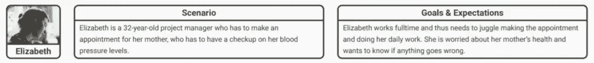
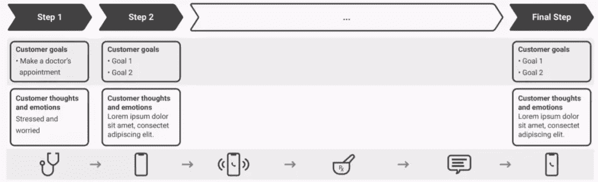
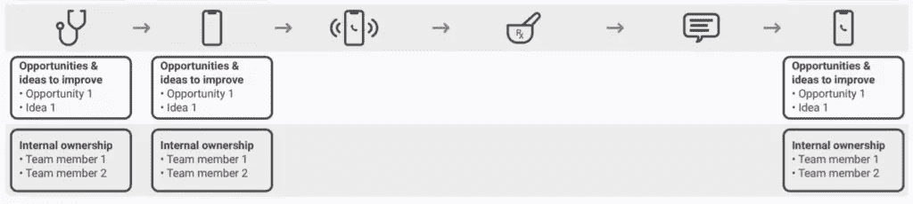

# 客户旅程图:客户生活中的一天

> 原文：<https://www.sitepoint.com/customer-journey-maps/>

想从头开始学习 UX 吗？使用 SitePoint Premium 获得涵盖基本面、项目、技巧和工具&的 UX 书籍全集。[现在就加入，每月仅需 14.99 美元](https://www.sitepoint.com/premium/products/Z2lkOi8vbGVhcm5hYmxlL1Byb2R1Y3QvMzE3?utm_source=blog&utm_medium=articles)。

**你*和*如何衡量客户参与度？喜欢、点击和购买通常是默认的衡量标准，但它们并不能说明全部情况。**

你需要知道顾客在多大程度上认为他们与你的产品、业务或品牌有关系，才能真正衡量顾客参与度。

你的产品是顾客日常生活的一部分吗？它能和谐地、本能地融入他们的世界吗？因此，客户参与对 UX 设计至关重要，而检验这一点的最佳工具之一就是客户旅程图。

> 客户的感知就是你的现实。—凯特·扎布里斯基

## 什么是客户旅程图？

一张**客户旅程图**考察了一段时间内客户与组织、品牌或产品之间的关系。这是一个基于研究的工具，考虑了所有的接触点和互动渠道。

现在，您可能想知道，当没有两个客户的旅程是相同的时，这怎么可能。请放心，我们的目标不是规划出每一个客户的旅程；这是为了概括和深入了解客户的“典型”旅程。这样做不仅可以洞察当前的互动，还可以揭示未来与客户互动的潜力。

客户旅程图可以帮助您了解客户对您的业务的想法、感受、所见、所闻和所做。这使得他们在试图向利益相关者提供教育，让他们了解客户在与你的业务互动时的感受时，具有不可估量的价值。他们有能力提出一些有趣的“假设”问题、可能的答案，以及最终改善整体用户体验的一些方法。

青蛙设计公司的亚当·理查森在《哈佛商业评论》中这样写道:

> 接触点越多，这样的地图就变得越复杂——但也是必要的。有时，客户旅程图是“从摇篮到坟墓”，着眼于整个接洽过程。

您可能已经知道，这意味着客户旅程图在您的整个组织中非常强大和相关。他们可以帮助协调 UX 设计、营销、客户服务、销售和物流部门的同事(仅举几例！)并增强对如何对待顾客的整体理解。通过这种方式，客户旅程图可以帮助打破运营孤岛，并开始推动更广泛的以客户为中心的沟通战略。

## 需要做一些准备

您需要做一些准备，以充分利用您的客户旅程图。在开始创建之前，您应该尝试了解以下内容:

*   **[用户角色](https://www.interaction-design.org/literature/topics/user-personas)** :如果你不知道背后的一般故事，你就不会知道你是否创造了一个典型的客户之旅。
*   **时间尺度**:客户旅程的长度很大程度上取决于它所涉及的产品类型。在开始之前，你会想知道是用一周、一年还是一生来衡量这段旅程。
*   **[客户接触点](https://www.interaction-design.org/literature/article/customer-touchpoints-the-point-of-interaction-between-brands-businesses-products-and-customers)** :你的客户做什么，他们如何与你的品牌互动。
*   **行动发生的渠道**:你的客户与企业互动的渠道——例如，通过电子邮件、社交媒体或面对面交流。
*   **[关键时刻](https://www.interaction-design.org/literature/article/the-moment-of-truth-build-desirable-relationships-with-users-and-customers)** :顾客可能对你的品牌或产品形成印象的任何互动都被称为**关键时刻**。
*   **任何其他因素**:朋友、家人或同事可能会影响顾客对品牌或产品的感受，因此可能会改变顾客体验。

## 如何创建顾客旅程图

一旦你的准备工作就绪，你就可以按照下面的八点流程来制定你的顾客旅程图。

1.  **创建组织目标**

    在开始构建顾客旅程图之前，你必须知道它的目的是什么。因此，第一步是概述本次规划练习的目标以及您打算满足的组织需求。

2.  **利用现有的[用户研究](https://www.interaction-design.org/literature/topics/user-research)**

    你可能处在一个手头有一堆用户研究的位置。如果真是这样，那真是个好消息！如果你还没准备好，发挥你的创造力，考虑如何开展研究，帮助你定义客户的旅程。

3.  **规划接触点和渠道**

    这是你准备工作派上用场的地方。你需要有效地规划出所有的接触点和渠道，这样你就能全面了解你的客户在哪里与你的品牌或产品互动，以及他们通过什么渠道进行互动。在这个阶段，一个很好的方法是集思广益，看看你在第一轮数据收集中是否错过了任何接触点或渠道。

4.  **创建共情地图**

    通过创建移情图，你将开始发现顾客在每次与你的品牌或产品互动时的感受。确保关注客户的感受和想法，以及他们在任何特定情况下的言行。

5.  **构建亲和度图**

    在这一点上，你将开始把之前阶段的想法、概念和感觉进行分类。你可以给这些类别贴上标签，在开始创建一个将它们联系在一起的图表之前，围绕每个类别进行头脑风暴。值得注意的是，您还可以消除*在此阶段似乎对客户体验没有任何影响的想法、概念和感觉。*

6.  **勾画客户旅程**

    您的客户旅程图的形式现在有多种解释。你可能想建立一个时间表，随着时间的推移将旅程联系在一起。您甚至可能想要将地图转换成视频、音频剪辑或动画，这完全由您决定！只要你通过接触点和渠道*展示客户在一段时间*内的活动，以及他们对这一过程中每一次互动的感受，你就走对了路。也就是说，客户旅程图应该包括你的移情图和亲和力图的输出。

7.  **迭代产生**

    正如所有好的设计过程一样，您必须经历迭代的各个阶段。花一些时间来完善你的草图的内容，以确保每个部分都包含一些有用的东西。你的目标是最终制作出一份客户旅程图，从你的团队成员和利益相关者开始，它在视觉上吸引人，对各种各样的人都有用。如果你的技能没有朝这个方向发展，你甚至可以在这个阶段找一个平面设计师。

8.  **分配和利用**

    如果你的顾客旅程图还在你的硬盘上或者在你桌子上的一堆纸下面，它就不能实现它的目的。这个过程的最后一步是让大众了解它，并解释为什么它如此重要。只有这样，你所有的努力才能得到很好的利用！例如，您应该能够围绕理想的客户旅程定义 KPI(关键绩效指标),并在您努力改善旅程时衡量未来的成功。

## 客户旅程图是什么样的？

正如上述流程的第六阶段所提到的，客户旅程图可以有多种解释，可以是你喜欢的任何形式。[交互设计基金会](https://www.interaction-design.org/)制作了各种各样的模板，可以免费访问、使用和分发(经过公平认可)——他们的客户旅程地图模板值得一看。您会看到它分为三个关键区域:

*   **区域 1** :该客户旅程所指的人物角色，以及地图所描述的场景。

    

*   第二区:在旅程的每一步，你都可以捕捉到用户的想法、行为和情感体验。这些是基于你进行的定性用户研究的结果，可以包括各种资源，包括报价、图像和视频。记得在本节讨论接触点*和*渠道，即客户互动的细节以及互动发生的地点和方式(如面对面、通过电子邮件、在网站上等等)。

    

*   **区域 3** :底部是确定旅程中每一步的见解以及客户在尝试进入下一步时可能面临的任何障碍的地方。您可能希望将这些机会转化为内部团队成员需要处理的行动点。

    

## 概括起来

客户旅程图是一种基于研究的工具，它提供了关于“典型”客户旅程的强大见解和深入知识。它使你能够从用户的角度看到你的品牌或产品是什么样的，你可以将这种同理心转化为更好地适应客户需求的设计，并尽可能消除(或缓解)更多的痛点。

每个查看它的利益相关者都将有机会为改善客户体验做出贡献。通过这种方式，客户旅程图在整个组织中都是相关的，以协调客户的感知和处理，并改善整体用户体验。

交互设计基金会(IDF)是一个非营利组织，致力于让设计教育变得可及和可负担。他们的一系列 UX 设计课程完全在线，自定进度，并提供行业认可的课程证书，由世界上最强的 UX 设计权威机构提供支持。

*这篇文章基于[顾客旅程图——穿着顾客的鞋子走一英里](https://www.interaction-design.org/literature/article/customer-journey-maps-walking-a-mile-in-your-customer-s-shoes)* 。

## 分享这篇文章