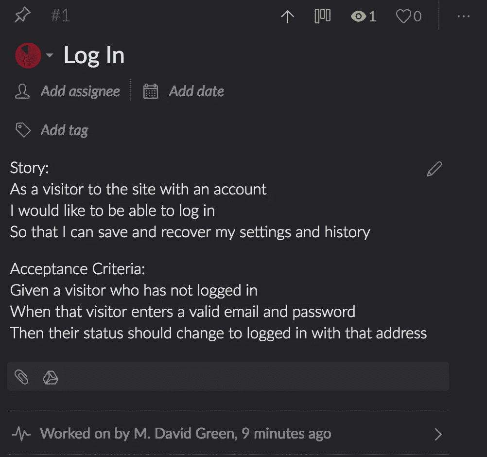
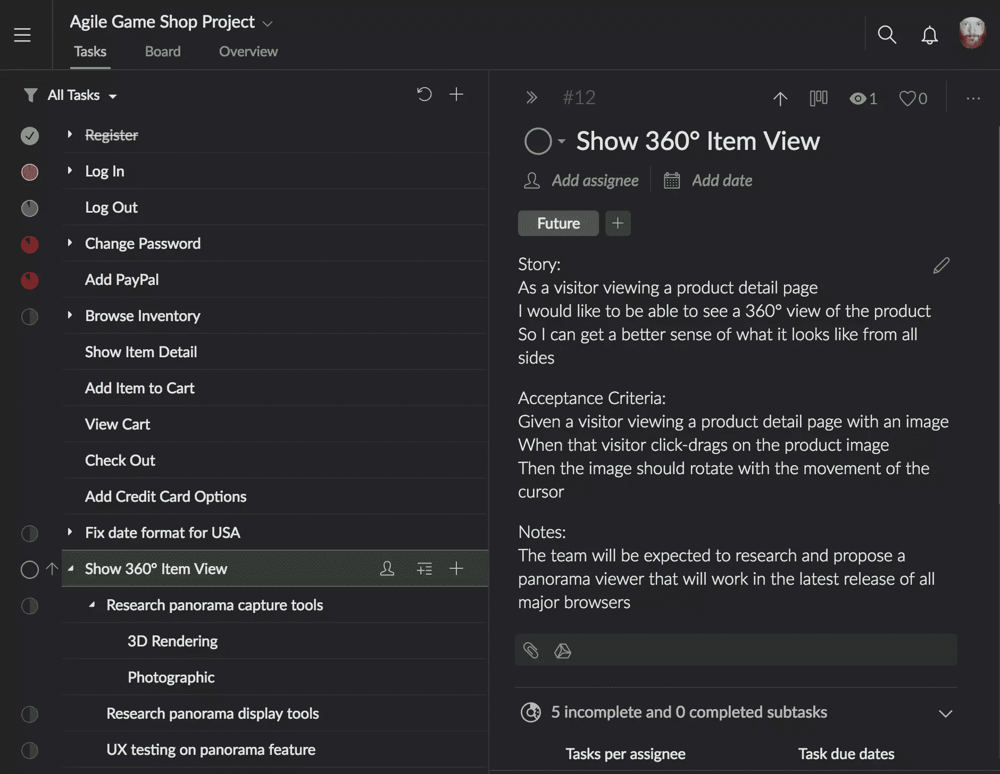
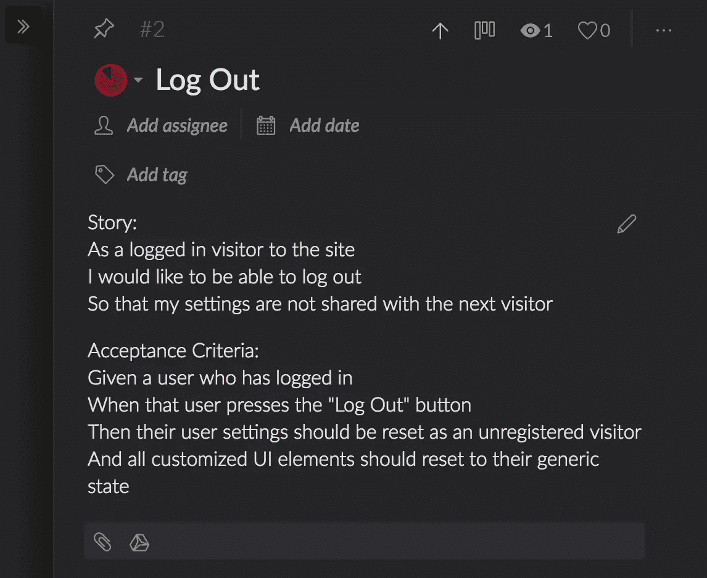
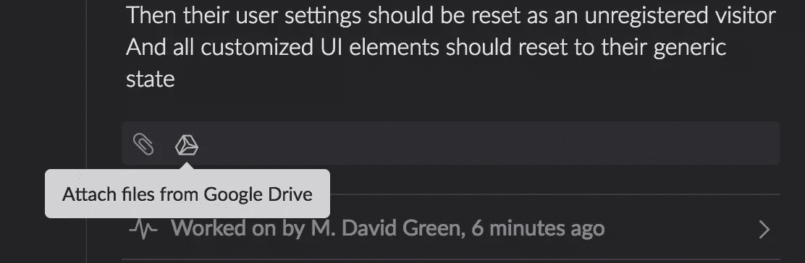
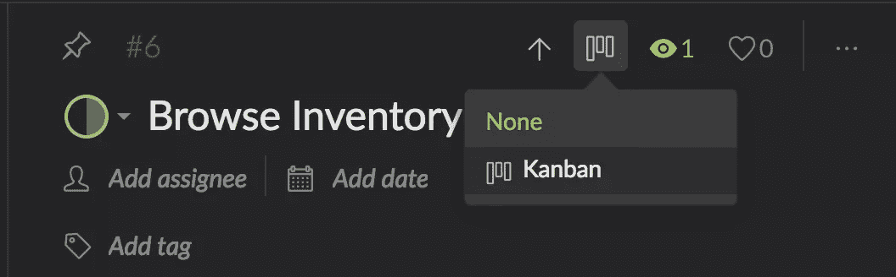
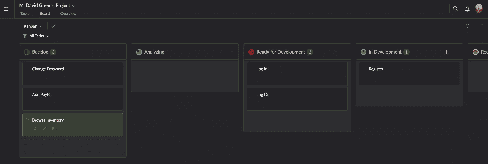

# 如何使用 Quire 管理您的产品积压

> 原文：<https://www.sitepoint.com/how-to-manage-your-product-backlog-with-quire/>

*本文是与 [Quire](https://quire.io/) 合作创作的。感谢您对使 SitePoint 成为可能的合作伙伴的支持。*

产品积压可能是敏捷组织中最有争议和误解的工件之一。每个人似乎都有自己的观点，关于它应该包含什么，应该如何组织，以及应该由谁来管理。结果，创建和管理产品积压已经变得更像是一门黑暗的艺术，而不是一门科学。为运行敏捷团队而优化的工具有时对于试图跟踪团队还没有开始工作的故事的产品负责人来说并不适用。

产品所有者可能要考虑的一个选项是 [Quire](http://quire.io) ，这是一个在线项目管理软件工具，具有任务和子任务跟踪以及看板功能，可以与敏捷团队保持同步，同时对产品所有者如何设计即将推出的功能和产品增强功能保持不变。Quire 的人联系我，让我看一下他们的产品，他们可能已经想出了一个解决方案，可以为产品所有者创建和维护他们团队的 backlog。

## 什么是产品积压，你如何管理它？

产品 backlog 是潜在故事的集合，这些故事描述了一个团队最终可能开发的特性，每个特性都为客户增加了价值。在 scrum 和看板中，故事是离散的垂直切片的终端用户功能块，它们是[独立的、可协商的、有价值的、可估计的、小的和可测试的](https://www.agilealliance.org/glossary/invest/)。

这与瀑布式组织有很大的不同，在瀑布式组织中，每一块工作都可能是一个更大的计划中经过深思熟虑的任务，最终应该为客户增加价值。甘特图任务通常表现为产品需求文档中顺序的、相互依赖的构件，由详细的[甘特图](https://www.sitepoint.com/making-your-own-gantt-chart-with-webix/)或类似的东西表示。

敏捷团队不会默认甘特图或详细的预先计划。在团队坐下来与产品负责人一起整理之前，敏捷故事通常没有典型的甘特图任务详细，由增加价值的客户目标驱动，为了清晰起见，验收标准用[可读的小黄瓜语法](https://www.sitepoint.com/smelly-cucumbers/)编写。一个未公开的潜在故事应该创造一个与团队其他成员讨论应该开发什么以及如何开发的机会。

因此，为了激发讨论，产品待定项中的变更可以是产品所有者希望他们看到的样子。这使得寻找一种一致的方法来管理和存储未分类的故事，以便在一个活跃的开发团队的环境中跟踪和组织它们变得很困难。

## 产品积压应该存储在哪里？

不像许多敏捷工件，它们在透明的光线下茁壮成长，产品 backlog 实际上受益于一点点秘密。在这里，产品负责人可以幻想用户可能想要什么，并跟踪外部需求以及用户体验测试期间正在进行的实验。只有当一个特性被修饰并且团队开始开发时，这些潜在的故事才需要被转换成一种可以与团队其他成员共享的格式。

这是最难的部分。通常，产品负责人会默认在同一个工具中开发他们即将到来的特性，这个工具将被用来作为故事来分享和跟踪它们，比如 JIRA 敏捷。这些工具中的大部分都期望他们的故事被估算、史诗、依赖、所有者等填充。

全功能的敏捷跟踪工具通常需要由 scrum 大师或组织中的其他人来配置，以满足约定的标准，这些标准限制了如何编写和编辑故事。这些设置可能不会给产品所有者在准备好与团队共享之前保留潜在故事的选项，除非这些故事写在单独的板上，然后再转移到团队板上。这比产品所有者在早期产品积压阶段需要考虑的要复杂得多。

一些产品负责人只是在文字处理器中写下他们的计划，必要时将文本复制并粘贴到适当的工具中。虽然这具有作为熟悉和方便的编写环境的优势，但是很难跟踪具有不同细节级别的多个开发特性。当你开发新的功能时，文字处理器也不能提供一个简单的方法来跟踪团队实际上在做什么。

电子表格可以更容易地跟踪关系和关联，但它们也诱使产品所有者更深入瀑布过程的杂草中，将故事视为连续的元素，而不是具有自身价值的独立功能。电子表格也不支持非常方便的编辑环境来编写和操作故事。

所以一个两全其美的解决方案可能是一个轻量级的独立敏捷项目跟踪系统，比如 Quire。使用 Quire 中基于任务的界面，可以保持团队正在处理的所有故事的运行历史，同时开发新的想法，思考它们如何融入团队并在团队准备好开始处理它们时进行优先排序。

## 什么信息应该进入产品待办事项列表？

在一个敏捷的组织中，故事代表了整个产品为客户增加价值的可能方向，而不是具有中间期限的固定需求，这些需求可能由它们交付的内在价值驱动，也可能不由它们驱动。Quire 允许产品所有者尽可能深入地维护潜在变更和特性的列表，在各种准备状态下，有或没有文档，在将它们提交给团队进行整理和开发之前，适当地重新组织和调整它们。Quire 调用这些任务，这是一个有用的命名约定，因为它们可能会或可能不会成为真实的故事，直到团队培训和接受它们并开始处理它们。

产品所有者决定了进入产品待办事项列表的信息的多少，因此拥有一个灵活的工具来完成工作并避免碍事是至关重要的。Quire 中的每项任务都需要捕捉足够的信息，以便传达产品负责人的愿景，并在展示时激发团队的创造力。Quire 甚至支持标记和过滤，因此任务可以被标记为进行中、错误修复或任何对特定情况有意义的内容。

可以有完全充实的功能…

…微小的错误修复，可选地包括子任务…

…或者它们可以是用潜在的子任务和子子任务，甚至是技术上不可能的子任务充实起来的一行幻想。

有时，验收标准可能是非常清楚的，尽管通常这些验收标准需要在与团队的交谈中加以充实。Quire 并不指定创建它们的位置，但是逻辑位置是在任务的描述字段中。

产品待办事项任务也可能是由非常具体的技术需求、用户体验测试和其他需要与之相关联的文档驱动的，所以如果您使用像 Quire 这样的工具，允许您将其他文档附加到一个单独的任务，这是非常方便的。它甚至集成了 Google Drive。

## 谁需要查看产品积压？

在计划的所有阶段，需要完成的任务都可以保留在产品待办事项列表中，但是当它们提交给团队时，就应该准备好进行完整的讨论了。我喜欢把产品积压看作是产品所有者控制的秘密的神奇袋子。随着时间的推移，通过适当的宣传，产品负责人可以向团队透露计划，并让他们了解这些新功能向最终用户承诺的价值。

这并不是说团队必须对产品的发展方向一无所知。产品负责人与开发团队坐在一起的原因是，随着功能的开发和未来功能计划的创建，可以有一个持续的来回对话。但是以敏捷的方式工作的一个好处是，团队可以在定义和整理故事时高效地关注它们，而不用担心它们会被工作开始后变化的需求的范围蔓延所打断。

因此，应该根据需要从开发人员那里寻求反馈，以确保潜在的功能是可能的，但讨论需要谨慎处理，这样团队就不会将潜在的新功能或增强误解为对当前正在进行的工作的强制转移。

像 Quire 这样的工具，位于传统敏捷故事板工具之外，对于维护产品 backlog 的隐私非常有用。没有必要为那些可能永远不会被开发的特性的描述设置特殊的权限，这样团队就不会分心。这使得产品所有者可以避免因未来可能的变更而污染正在进行的工作。因为产品 backlog 是用一个单独的工具管理的，所以只有产品所有者需要直接访问。

## 你如何让产品积压与团队保持同步？

产品 backlog 解决方案的最后一个挑战是它如何与团队正在做的工作保持同步。使用团队中每个人都可以看到的共享工具的一个主要优点是，任何更改都会立即反映到使用同一块板的每个人身上。但这通常是以能够保持潜在的未来功能私密为代价的，直到团队开始整理真实故事的时候。

如果产品负责人试图使用非敏捷的工具，比如电子表格或文字处理器来维护待办事项，难度会加倍。它不仅需要手动地将 backlog 与团队正在做的工作同步，还意味着开发一个对想法进行编码的系统，以便清楚它们处于什么状态。例如，产品负责人如何在文字处理程序的待办事项列表中区分正在开发的、可能永远不会发生的或者已经完全开发和部署的功能？

一个敏捷友好的笔记本是我们所需要的，Quire 很好地满足了这个目的。默认的 Quire 界面包括足够的细节来创建和跟踪任务的进展，因为它们变得充实，而不会妨碍产品所有者的创作过程。但是 Quire 还提供了一个可定制的看板视图，产品所有者可以使用它来跟踪任务的状态，这些任务已经被整理并作为完全估计的故事转移到其他系统，而不会干扰团队的其他成员。

通过配置看板板视图来匹配团队正在使用的状态，产品所有者可以选择将 Quire 任务添加到板上，并随着团队的前进，通过开发和部署来跟踪它们的进度。就像在任务详细信息视图中单击电路板图标一样简单…

…选择已配置的看板，然后切换到看板视图来拖动任务。

如果以这种方式使用，Quire 还可以利用集成的工具生成关于开发中的故事的状态的报告，使用有吸引力的和执行友好的图表和图形。这些可以在与高管和利益相关者的讨论中参考，或者在产品负责人认为合适的时候与团队共享。

如果团队发现它们有用，它们是可用的，但是产品负责人可能会决定一些图表，比如 Quire 的潜在计划工作的甘特图视图，不会增加价值或者实际上可能会分散敏捷团队的注意力。

创建和维护产品 backlog 是产品负责人角色的重要组成部分。产品负责人需要维护一个 backlog，以便于团队创建和跟踪潜在故事的优先级。由于看板特性在面向任务的界面中的本机集成，以及其方便的嵌套子任务界面， [Quire](https://quire.io) 可能是一个比试图使用团队用于活动故事的相同看板，或者用电子表格和文字处理器拼凑一个定制解决方案更好的解决方案。

## 分享这篇文章