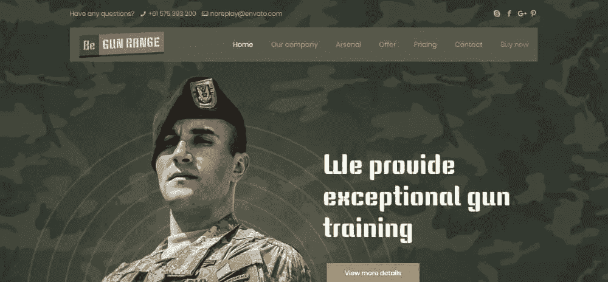
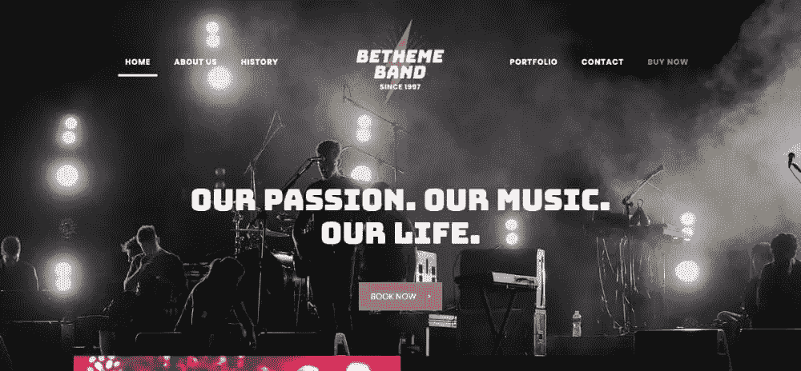
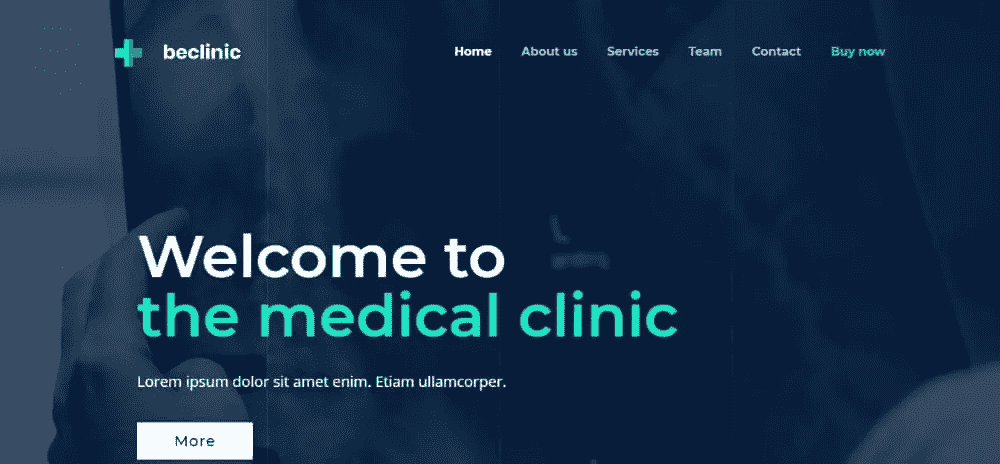
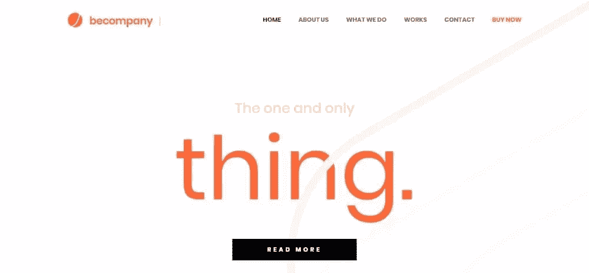
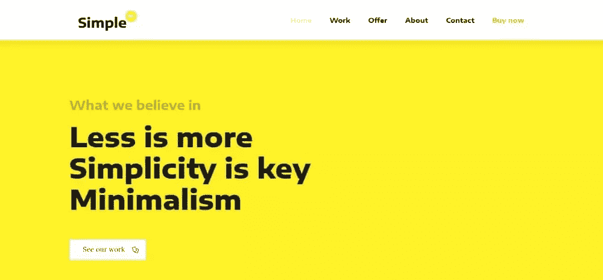
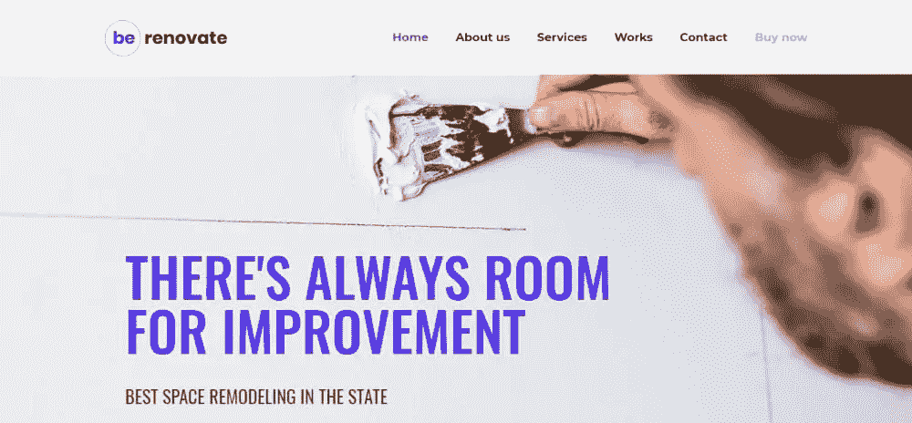
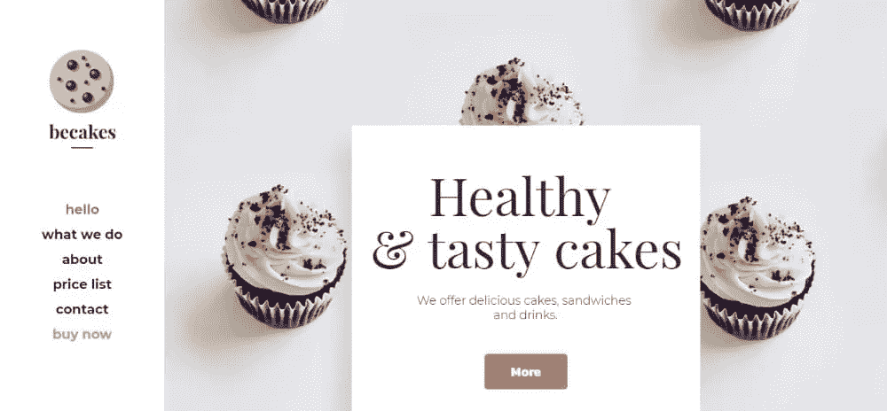

# 为什么更多的网页设计师应该尝试预建网站

> 原文：<https://www.sitepoint.com/why-more-web-designers-should-give-pre-built-websites-a-try/>

*这篇赞助文章由我们的内容合作伙伴 [BAW 媒体](https://bawmedia.com/)创作。感谢您对使 SitePoint 成为可能的合作伙伴的支持。*

关于网页设计师是否应该从头开始他们的设计工作，在网页设计行业有一个激烈且似乎永无止境的争论。另一种选择包括利用预先建立的网站所能提供的优势。

有些人认为使用任何一种模板都类似于作弊。任何有经验的设计师都应该从头开始设计。

事实是，这是错误的论点。一个预建的网站可以被看作是一个工具，尽管是一个强大的工具。专业设计师通过充分利用工具来达到他们的目标。

让我们讨论一下辩论中最激烈的问题，看看哪些论点站得住脚，哪些站不住脚。

从头开始设计给你创造的自由&预建的网站剥夺了你的创造力。

这个论点的第一部分有一定的道理。然而，创意和从零开始创造设计并不是一回事。换句话说，试图从头开始创造一个设计并不一定会让你更有创造力。依赖于你的方法甚至不能充分利用你的创造力。

一个设计背后必须有一个意义。正确表达这个意思需要业务知识的基础。您还应该知道给定企业的追随者期望看到的设计标准。

这是预建网站的切入点。它们提供了您需要的知识基础。他们也坚持正确的设计标准和趋势。同时。它们给你完全的创作自由，让你随心所欲地定制你的设计。

[**Be Theme**](https://themes.muffingroup.com/be/splash/?utm_source=sitepoint.com&utm_medium=content&utm_campaign=dec18) 拥有市场上最大的预建网站库，据最新统计超过 390 个。

它们按行业或内容类型进行组织，如以下 4 个示例所示。

[**开始排列**](https://themes.muffingroup.com/be/gunrange/?utm_source=sitepoint.com&utm_medium=content&utm_campaign=dec18)

[**becoffee 3**](https://themes.muffingroup.com/be/coffee3/?utm_source=sitepoint.com&utm_medium=content&utm_campaign=dec18)

[**be band 3**](https://themes.muffingroup.com/be/band3/?utm_source=sitepoint.com&utm_medium=content&utm_campaign=dec18)

 **

看看他们。这些不仅仅是“模板”。远非如此，他们也没有抢走你任何东西。

只有从头开始设计，你才是专业的&预建网站是为初学者准备的。

“只有当……”是危险的字眼时，你才是专业的。如果你太过努力地想变得专业，你会冒着让自己精疲力竭的风险。或者，模仿其他专业人士，努力加入俱乐部。

你创造的设计(有或没有工具)可以标志你是一个专业人士。然而，只有当你始终如一地满足客户的需求时，你才能这样说。这意味着把客户的目标作为你的第一要务。在某些情况下，这需要一个简单明了的设计，而不是一个非常漂亮的设计。

一个预先建立的网站可以帮你一把，因为它提供的基础通常是预先批准的。

这三个极简主义的预建网站都不能用“美得惊人”来形容。

他们只是(没有双关语)完成工作。

[**beclinic 3**](https://themes.muffingroup.com/be/clinic3/?utm_source=sitepoint.com&utm_medium=content&utm_campaign=dec18)

[**成为公司 3**](https://themes.muffingroup.com/be/company3/?utm_source=sitepoint.com&utm_medium=content&utm_campaign=dec18)

[**简单 2** 简单 3](https://themes.muffingroup.com/be/simple2/?utm_source=sitepoint.com&utm_medium=content&utm_campaign=dec18)

你必须在每个项目上投入 110%的努力&如果你不能平等地对待每个客户，你根本就不应该接客户。

的确，你应该总是尽你最大的努力。问题是，尽最大努力不是一个常数。它会因每个客户和每个任务而异。你可能正在努力满足多个客户。在这种情况下，你为一个人付出的最大努力很少等同于你为另一个人付出的最大努力。

如果你所有的客户都代表同一个行业，有着相同的需求，那会怎么样？在这种情况下，你可以并且可能应该平等地对待他们。那不可能发生。根本不存在放之四海而皆准的模式。

*   你不能给每个客户同等的时间。如果你尝试的话，你会碰到最小公分母的情况。
*   你可以是一个行业的专家，但对下一个行业却知之甚少或一无所知。一个需要很少或不需要你的研究，另一个可能需要大量的研究。
*   还有其他的变数。一个人的乐队可以很有趣，但很少是伟大的。这是因为几乎不可能完美地演奏所有乐器。更别说在一起了。
*   所以，你最终会有多重任务，最小的预算，外加每天工作多少小时的限制。

从头开始每项任务是不可能的。那么，为什么不使用预先构建的网站，并根据每个项目的具体情况进行定制呢？无论你谈论的是 1 个项目还是 10 个项目，这都是有意义的。

当你有足够的预算和截止日期不成问题时，你可能会想从头开始。你最好还是从一个预建的网站开始。然后，你可以尽情发挥你的创造力。

[**beta ilor 2**](https://themes.muffingroup.com/be/tailor2/?utm_source=sitepoint.com&utm_medium=content&utm_campaign=dec18)

 **

 **

[**因为**](https://themes.muffingroup.com/be/cakes/?utm_source=sitepoint.com&utm_medium=content&utm_campaign=dec18)

## 结论

从零开始创造一个设计是许多网页设计师渴望的。毕竟，在没有外界帮助的情况下，以做某事为荣是一种很棒的感觉。尤其是，做得好。在这种情况下，外部援助通常意味着网页设计工具。外挂，不需要编码的特效之类的。

从头开始设计一个又一个项目从来都不容易。就像在雷区谈判一样。聪明的网页设计师选择他们的战斗。他们会从头开始做一些作业，有时他们没有专业知识给其他人。在这种情况下，他们依靠预建网站中隐藏的价值观来看透他们。

浏览 [**Be 的**](https://themes.muffingroup.com/be/splash/?utm_source=sitepoint.com&utm_medium=content&utm_campaign=dec18) 预置网站库，给他们一个尝试。你不会后悔的。****** 

## ****分享这篇文章****