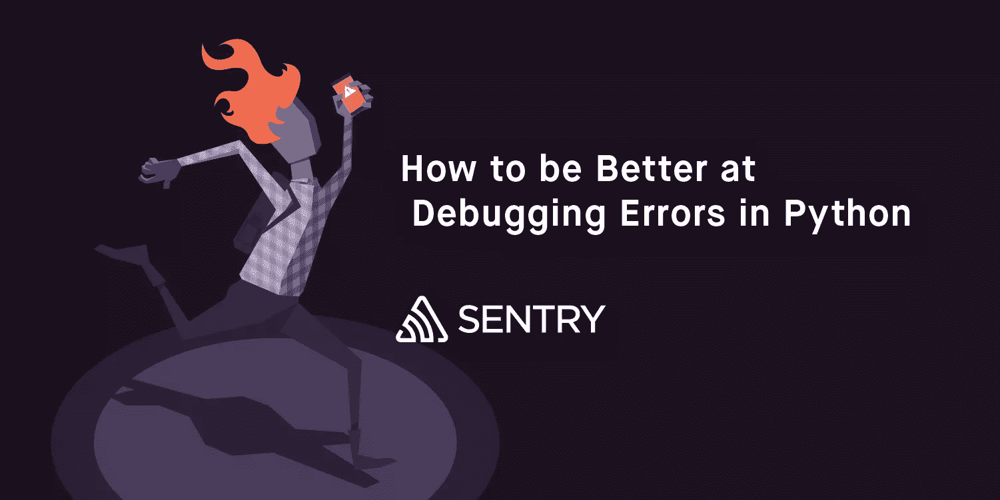
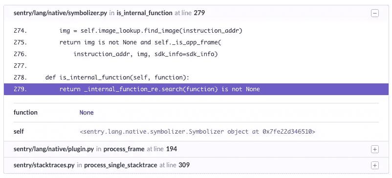

# 如何调试 Python 错误

> 原文：<https://www.sitepoint.com/how-to-debug-python-errors/>

*本文原载于[哨兵](https://blog.sentry.io/2017/06/22/debugging-python-errors)。感谢您对使 SitePoint 成为可能的合作伙伴的支持。*



Sentry 的一个更强大的特性来自于像 Python 这样的语言。在 Python、PHP 和 JVM 中，我们能够更深入地反思运行时，并为您提供关于调用堆栈中每一帧的额外数据。在高层次上，这让您知道像调用函数的参数这样的事情，使您能够更容易地重现和理解错误。让我们深入了解这是什么样子，以及它是如何工作的。

我们将从 [Python 错误](https://sentry.io/for/python/)在您的终端或标准日志系统中的典型表现开始:

```
TypeError: expected string or buffer
  File "sentry/stacktraces.py", line 309, in process_single_stacktrace
    processable_frame, processing_task)
  File "sentry/lang/native/plugin.py", line 196, in process_frame
    in_app = (in_app and not self.sym.is_internal_function(raw_frame.get('function')))
  File "sentry/lang/native/symbolizer.py", line 278, in is_internal_function
    return _internal_function_re.search(function) is not None 
```

虽然这让我们知道了错误的类型和位置，但不幸的是，它并不能帮助我们理解真正导致错误的原因。它有可能传递一个整数或者一个非类型，但是，实际上，它可以是任何数量的东西。猜测只能让我们到此为止，我们真的需要知道`function`到底是什么。

要做到这一点，一个简单且非常容易的方法是添加一些日志记录。我们可以在几个不同的入口点放置日志，这样更容易实现。它还能让我们确保得到我们想要的答案。例如，我们想弄清楚`function`的`type`是什么:

```
import logging
# ...
logging.debug("function is of type %s", type(function)) 
```

这样记录的另一个好处是它可以延续到生产中。结果通常是您没有在生产中记录调试级别的日志语句，因为数量可能很大并且不是很有用。它还经常要求您提前计划，以确保您记录了可能发生的各种故障案例以及每个案例的适当上下文。

出于本教程的目的，让我们假设我们不能在生产中这样做，没有提前计划，而是试图在开发中调试和重现这一点。

## Python 调试器

Python 调试器 (PDB)是一个工具，允许你使用断点单步调试你的调用栈。该工具本身受到 GNU 调试器(GDB)的启发，虽然功能强大，但如果您不熟悉它，可能会感到不知所措。这绝对是一种随着重复而变得更容易的体验，我们只打算以它为例来探讨一些高层次的概念。

所以我们想做的第一件事是在代码中添加一个断点。在上面的例子中，我们实际上可以自己操纵`symbolizer.py`。情况并非总是如此，因为有时第三方代码中会出现异常。无论您在哪里检测它，您仍然能够在堆栈中上下跳转。让我们从修改代码开始:

```
def is_internal_function(self, function):
    # add a breakpoint for PDB
    try:
        return _internal_function_re.search(function) is not None
    except Exception:
        import pdb; pdb.set_trace()
        raise 
```

我们将此限制为例外情况，因为通常您会有在大多数时间成功运行的代码，有时是在循环中，并且您不希望在每一次迭代中都暂停执行。

一旦我们遇到这个断点(这是`set_trace()`正在注册的)，我们将进入一个特殊的类似 shell 的环境:

```
# ...
(Pdb) 
```

这是 PDB 控制台，它的工作方式类似于 Python shell。除了能够运行大多数 Python 代码，我们还在调用堆栈中的特定上下文下执行。那个位置是入口。相反，它是您调用`set_trace()`的地方。在上面的例子中，我们就在我们需要的地方，所以我们可以很容易地获取`function`的类型:

```
(Pdb) type(function)
<type 'NoneType'> 
```

当然，我们也可以简单地使用 Python 的内置函数之一获取所有局部变量:

```
(Pdb) locals()
{..., 'function': None, ...} 
```

在某些情况下，我们可能不得不在堆栈中导航`up`和`down`以到达函数正在执行的帧。例如，如果我们的`set_trace()`工具把我们放在堆栈的更高位置，可能在顶部框架，我们将使用`down`跳转到内部框架，直到我们到达一个有所需信息的位置:

```
(Pdb) down
-> in_app = (in_app and not self.sym.is_internal_function(raw_frame.get('function')))
(Pdb) down
-> return _internal_function_re.search(function) is not None
(Pdb) type(function)
<type 'NoneType'> 
```

所以我们已经确定了问题:`function`是一个`NoneType`。虽然这并没有真正告诉我们为什么会这样，但它至少给了我们有价值的信息来加速我们的测试用例。

## 生产调试

所以 PDB 在开发方面做得很好，但是生产呢？让我们更深入地看看 Python 给了我们什么来回答这个问题。

CPython 运行时——大多数人使用的标准运行时——的伟大之处在于它允许轻松访问当前的调用堆栈。虽然其他一些运行时(如 PyPy)会提供类似的信息，但不能保证。当遇到异常时，堆栈通过`sys.exc_info()`暴露。让我们看看这给了我们一个典型的异常:

```
>>> try:
...   1 / 0
... except:
...   import sys; sys.exc_info()
...
(<type 'exceptions.ZeroDivisionError'>,
    ZeroDivisionError('integer division or modulo by zero',),
    <traceback object at 0x105da1a28>) 
```

我们将避免对此进行太深入的探讨，但是我们已经得到了一个由三条信息组成的元组:异常的类、异常的实际实例和回溯对象。我们在这里关心的是回溯对象。值得注意的是，您还可以使用 [traceback](https://docs.python.org/2/library/traceback.html) 模块在异常之外获取这些信息。有[一些关于使用这些结构的文档](https://docs.python.org/3.1/library/inspect.html)，但是让我们自己去尝试和理解它们。在 traceback 对象中，我们可以获得大量的信息，不过要访问这些信息还需要一些工作和技巧:

```
>>> exc_type, exc_value, tb = exc_info
>>> tb.tb_frame
<frame object at 0x105dc0e10> 
```

一旦我们得到了一个框架，CPython 就公开了获得堆栈局部变量的方法——这是执行框架的所有限定范围的变量。例如，看看下面的代码:

```
def foo(bar=None):
    foo = "bar"
    1 / 0 
```

让我们用代码生成一个异常:

```
try:
    foo()
except:
    exc_type, exc_value, tb = sys.exc_info() 
```

最后，让我们通过`<frame>`对象上的`f_locals`来访问局部变量:

```
>>> from pprint import pprint
>>> pprint(tb.tb_frame.f_locals)
{'__builtins__': <module '__builtin__' (built-in)>,
    '__doc__': None,
    '__name__': '__main__',
    '__package__': None,
    'exc_info': (<type 'exceptions.ZeroDivisionError'>,
                ZeroDivisionError('integer division or modulo by zero',),
                <traceback object at 0x105cd4fc8>),
    'foo': <function foo at 0x105cf50c8>,
    'history': '/Users/dcramer/.pythonhist',
    'os': <module 'os' from 'lib/python2.7/os.py'>,
    'pprint': <function pprint at 0x105cf52a8>,
    'print_function': _Feature((2, 6, 0, 'alpha', 2), (3, 0, 0, 'alpha', 0), 65536),
    'readline': <module 'readline' from 'lib/python2.7/lib-dynload/readline.so'>,
    'stack': [],
    'sys': <module 'sys' (built-in)>,
    'tb': <traceback object at 0x105da1a28>,
    'tb_next': None,
    'write_history': <function write_history at 0x105cf2c80>} 
```

我们在上面看到的实际上并没有那么有用。原因是我们在作用域中上升了一级，所以我们看到定义了`foo`,但实际上与函数调用本身无关。这并不总是正确的，但在我们的小例子中却是正确的。要找到我们要找的信息，我们需要更深入一层:

```
>>> inner_frame = tb.tb_next.tb_frame
>>> pprint(inner_frame.f_locals)
{'bar': None, 'foo': 'bar'} 
```

当我们回到最初的`TypeError`时，你可以很快理解这是多么有用。在这种情况下，通过上面的自省，我们发现预期为字符串的`function`实际上被设置为`NoneType`。我们知道，因为 Sentry 已经为我们捕获了这个错误，并自动提取每一帧的堆栈局部变量:



这是我们在 Sentry 中构建的第一个特性之一，直到今天，它仍然是我们能够提供的最有价值的调试组件之一。虽然我们不能总是给你重现一个异常所需的细节，但根据我们的经验，我们很少需要手动检测一些东西来理解上下文，并最终解决问题。

如果你对完整的实现感到好奇，它还利用了 Python 回溯结构的其他各种组件，你可以随时在 GitHub 上查看我们的 [Python SDK 的源代码。在 PHP 和 JVM 中，由于运行时的原因，方法略有不同，如果你感兴趣，你也可以在](https://github.com/getsentry/raven-python/blob/master/raven/utils/stacks.py) [Sentry 的 GitHub](https://github.com/getsentry) 上找到这些库。如果您使用的是 Sentry，我们通常会自动为您安装工具，尽管 JVM 需要一点配置(文档即将推出)。

## 分享这篇文章