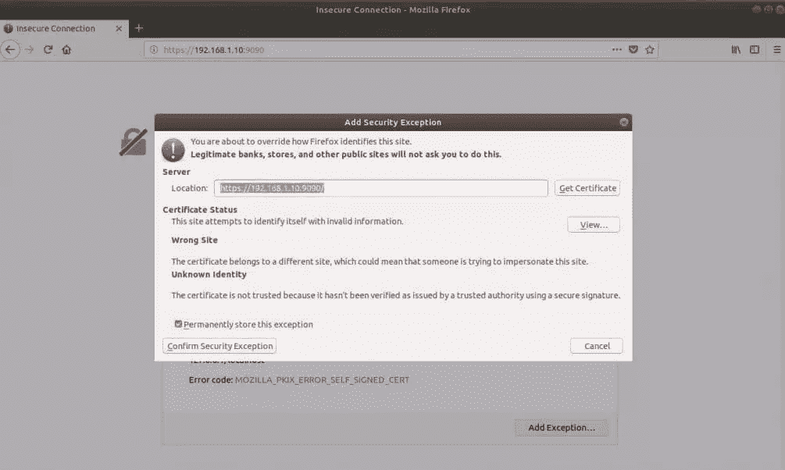
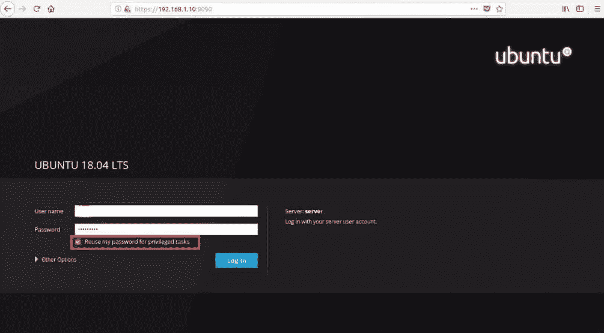
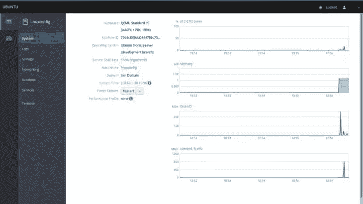
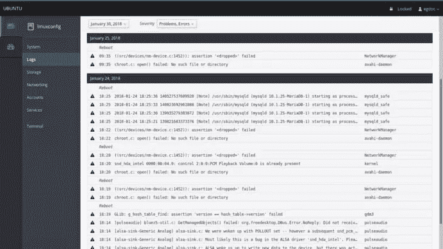
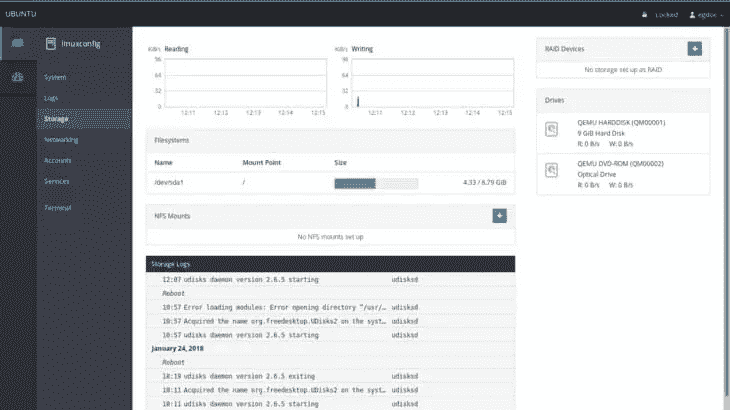
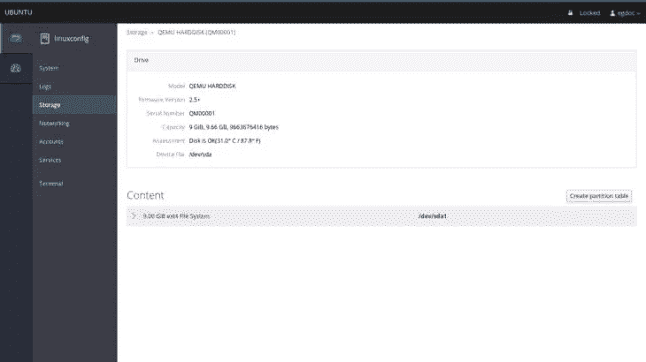
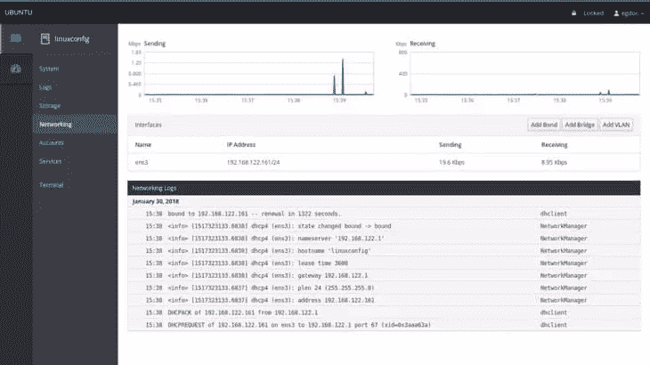
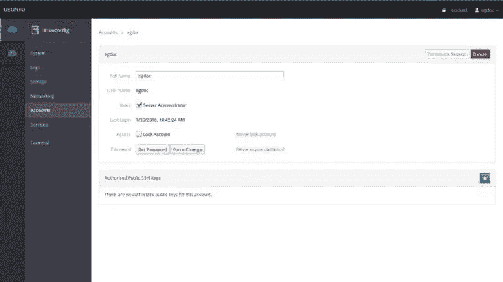
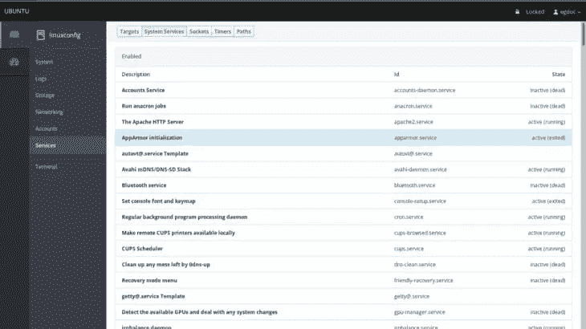

# 如何在 Ubuntu 18.04 上安装驾驶舱

> 原文：<https://www.sitepoint.com/how-to-install-cockpit-on-ubuntu-18-04/>

*本文原载于[阿里云](https://www.alibabacloud.com/blog/how-to-install-cockpit-on-ubuntu-18-04_594039?spm=a2c65.11461433.0.0.4ee35355t8NTC4)。感谢您对使 SitePoint 成为可能的合作伙伴的支持。*

Cockpit 是一个服务器管理器，可以通过网络浏览器轻松管理你的 GNU/Linux 服务器。它使 Linux 可被发现，允许系统管理员轻松地执行诸如启动容器、存储管理、网络配置、检查日志等任务。

Cockpit 提供了终端和 web 工具之间的方便切换。通过驾驶舱启动的服务可以通过终端停止。同样，如果终端出现错误，可以在驾驶舱日志界面看到。使用 Cockpit 你可以同时监控和管理几个服务器。只需添加它很容易，你的服务器会照顾它的好友。

Cockpit 是在 LGPL v2.1+下发布的，可用于 Redhat、CentOS、Debian、Ubuntu、Atomic 和 Arch Linux。Cockpit 与阿里云[弹性计算服务(ECS)](https://int.alibabacloud.com/m/1000019631/) 服务器兼容，工作良好。在本教程中，我将在装有 Ubuntu 18.04 LTS 的 ECS 上安装 Cockpit。在 Ubuntu 18.04 成熟并被纳入阿里云的操作系统映像库之前，我们可以通过使用`do-release-upgrade`实用程序[将 Ubuntu 16.04 升级到 Ubuntu 18.04](https://int.alibabacloud.com/m/1000019633/) 。

## 先决条件

1.  您必须激活阿里云[弹性计算服务(ECS)](https://int.alibabacloud.com/m/1000019631/) 并验证您的有效支付方式。如果你是新用户，你可以在你的阿里云账户中[获得一个免费账户](https://int.alibabacloud.com/m/1000019632/)。如果你不知道如何设置你的 ECS 实例，你可以参考[本教程](https://int.alibabacloud.com/m/1000019635/)或[快速入门指南](https://int.alibabacloud.com/m/1000019634/)。
2.  您应该设置服务器的主机名。
3.  访问安装在您电脑上的阿里云或 SSH 客户端中的 VNC 控制台。

完成先决条件后，通过 SSH 客户端(如 Putty)或阿里云帐户仪表板中的 VNC 控制台，使用您的 root 用户名和密码作为 root 用户登录。

## 在 Ubuntu 18.04 上安装驾驶舱

Ubuntu 18.04 中包含了 Cockpit，所以只需使用 apt 命令安装即可。

`sudo apt update`

安装驾驶舱组件。

`sudo apt -y install cockpit`

启动并启用驾驶舱。

```
sudo systemctl start cockpit.socket
sudo systemctl enable cockpit.socket 
```

## 使用驾驶舱

一旦你启动驾驶舱服务，它将开始监听端口 9090。现在，打开你的浏览器，导航到下面的网址。

`https://ip-address:9090`

Cockpit 使用自签名 SSL 证书进行安全通信。因此，您需要在浏览器中添加一个例外来访问驾驶舱。



使用您的本地用户帐户登录。在我的情况下，它是格卡迪尔。

*如果用户是非特权用户，并且拥有 sudo 访问权限，则勾选“在特权任务中重复使用我的密码”。*



我们现在必须在相关的输入字段中插入我们的凭证，并点击**登录**按钮。登录后，我们将被重定向到主驾驶舱页面:



让我们来看看吧。主页面部分显示了我们正在运行的机器的一些信息，如**硬件**、**主机名**、**操作系统**和**系统时间**。在这种情况下，我在虚拟机上运行 Ubuntu，因此硬件部分的值是 **QEMU 标准 Pc** 。

我们还有一个下拉菜单，让我们在系统上执行电源选项，如重启或关机。在右侧，我们可以看到一些图表，这些图表让我们可以按顺序监控重要的系统活动:CPU 和内存使用情况、磁盘活动和网络流量。

### 日志部分

在左栏菜单中，在**系统**部分的正下方，我们可以**点击日志上的**进入系统日志专用页面。在这里，在页面的顶部，我们有两个漂亮的菜单，让我们按照时间段和严重性过滤日志，在**问题**、**通知**、**警告**和**错误**之间进行选择。



要访问日志消息的详细信息，我们只需单击相应的行:我们将被重定向到包含日志详细信息的页面。

### 存储部分

接下来，我们将进行**存储**会话。这里我们有一些显示磁盘读写活动的图形，紧接着是一个指示文件系统使用量的状态栏。我们也可以选择轻松添加 **NFS 坐骑**和 **Raid 设备**。



我们可以通过单击 **Drives** 框右侧的相关部分来检查特定的驱动器:我们还可以在指定的驱动器上创建一个新的分区表(如果满足某些条件，例如，不得挂载磁盘):该操作将擦除其中的所有数据。



### 网络部分

在专用于网络监控和管理的部分，可以观察每个接口发送和接收的数据包的图表，以及一般的网络活动。通过单击接口行，可以看到关于接口的详细信息，例如它的 **MAC 地址**:在这里，我们也有机会启用或禁用所述接口。还可以使用专用按钮轻松添加一个**绑定**、一个**网桥**或一个 **vlan** 。页面底部显示了网络日志。



### 账户和服务科

最后两个可用部分是关于帐户和服务管理的。在前一种情况下，我们可以非常容易地创建、删除或获取系统中可用用户的信息。通过单击特定的用户部分，我们将可以选择更改其密码、锁定其帐户，甚至添加授权的公共 **ssh 密钥**:



在**服务**部分，我们将看到系统守护进程和目标的概述。web 界面允许我们启动、停止、启用或禁用每个服务，向我们显示其当前状态。多亏了 cockpit，我们还可以轻松管理 systemd **目标**(相当于经典的系统运行级别)**套接字**和**计时器**。



现在让我们看看如何为我们的应用程序配置 Cockpit。

## 1.驾驶舱配置文件–cockpit . conf

驾驶舱可以通过`/etc/cockpit/cockpit.conf`进行配置。该文件有一个 INI 文件语法，因此包含键/值对，分组到主题组中。有关详细信息，请参见下面的示例。

**注意:**驾驶舱监听的端口不能在这个文件中更改。要更改端口，请更改 systemd cockpit.socket 文件。

### 网络服务

**起源**

默认情况下，cockpit 不接受跨域 websocket 连接。使用此设置允许来自备用域的访问。如有必要，来源应包括方案、主机和端口。

```
 [WebService]
 Origins = https://somedomain1.com  
 https://somedomain2.com:9090 
```

协议头

配置 cockpit 来查看这个头的内容，以确定连接是否使用 tls。这应该只在 cockpit 位于反向代理之后时使用，并且应该注意确保传入的请求不能设置这个头。

```
 [WebService]
 ProtocolHeader = X-Forwarded-Proto 
```

**LoginTitle**

设置登录屏幕的浏览器标题。

**登录到**

当设置为 **true** 时，登录屏幕上的连接选项可见，并允许登录另一台服务器。如果没有指定这个选项，那么将根据 cockpit-ssh 进程是否可用来自动检测它。

**要求主机**

当设置为 **true** 时，cockpit 将要求用户使用连接到选项来指定要登录的主机。

**MaxStartups**

与 **sshd** 配置选项同名。指定允许的最大并发登录尝试次数。在身份验证成功或连接关闭之前，其他连接将被丢弃。默认为 10。

或者，可以通过指定三个冒号分隔的值 **start:rate:full** (例如“10:30:60”)来启用随机早期丢弃。如果当前有 **start** (10)个未认证的连接，驾驶舱将以**率/100** (30%)的概率开始拒绝认证尝试。如果未认证的连接数量达到**满** (60)，则概率线性增加，所有连接尝试都被拒绝。

**AllowUnencrypted**

如果为真，cockpit 将接受未加密的 HTTP 连接。否则，它会将所有 HTTP 连接重定向到 HTTPS。例外情况是来自本地主机和特定 URL 的连接(如 **/ping** )。默认为 false。

**UrlRoot**

您将为 cockpit 提供服务的根 URL。当提供时，cockpit 将期望所有请求都以给定的 url 为前缀。当您在反向代理(如 nginx)后面使用 cockpit 时，这非常有用。**/驾驶舱/** 和**/驾驶舱+** 被保留，不应使用。比如**/驾驶舱-新/** 就可以。**/座舱/** 和**/座舱+新/** 都不是。

### 原木

**致命的**

桥中被视为致命的日志消息的类型。用空格分隔多个值。相关值为:严重和警告。

### OAuth

可以将 Cockpit 配置为支持隐式 grant OAuth 授权流。成功后，生成的 oauth 令牌将使用**载体** auth-scheme 传递给 cockpit-ws。为了成功登录，还需要配置驾驶舱来验证和允许**持有人**令牌。

**网址**

这是 cockpit 在需要获取 oauth 令牌时将用户浏览器重定向到的 url。Cockpit 将在 url 中添加一个 redirect_uri 参数，其中包含获得令牌后 oauth 提供者应该重定向到的位置。

**误差参数**

当 oauth 提供者将用户重定向回 cockpit 时，在 url 的 querystring 或 fragment 部分查找该参数，以找到错误消息。如果没有提供，它将默认为**错误描述**。

**TokenParam**

当 oauth 提供者将用户重定向回 cockpit 时，在 url 的 querystring 或 fragment 部分查找该参数，以找到访问令牌。如果未提供，它将默认为**访问令牌**。

## 2.驾驶舱网络服务–驾驶舱-ws

cockpit-ws 程序是一个 web 服务组件，用于浏览器应用程序与各种配置工具和服务(如 cockpit-bridge(8))之间的通信。

用户或管理员应该永远不需要启动这个程序，因为它是由 systemd(1)在启动时自动启动的。

`cockpit-ws [--help] [--port PORT] [--no-tls] [--local-ssh] [--address ADDRESS]`

### 运输安全

要指定 web 服务应该使用的 TLS 证书，只需删除一个扩展名为**的文件。 **/etc/cockpit/ws-certs.d** 目录中的 cert** 。如果这个目录中有多个文件，那么排序后选择优先级最高的一个。

**。证书**文件应该包含至少两个 OpenSSL 样式的 PEM 块。首先一个或多个 **BEGIN 证书**块用于服务器证书和中间证书管理机构，最后一个块包含 **BEGIN 私钥**或类似密钥。该密钥可能没有加密。

如果没有 TLS 证书，则使用 **openssl** 自动生成自签名证书，并存储在 **0-self-signed.cert** 文件中。

当注册到 FreeIPA 域时，会从 IPA 服务器请求一个 SSL 证书，并存储在 **10-ipa.cert** 中。

要检查 cockpit-ws 将使用哪个证书，请运行以下命令。

`$ sudo remotectl certificate`

如果使用 **certmonger** 管理证书，可以使用下面的命令自动准备串联的**。证书**文件:

```
CERT_FILE=/etc/pki/tls/certs/$(hostname).pem
 KEY_FILE=/etc/pki/tls/private/$(hostname).key

 getcert request -f ${CERT_FILE} -k ${KEY_FILE} -D $(hostname --fqdn) –
 C "sed -n w/etc/cockpit/ws-certs.d/50-from-certmonger.cert 
 ${CERT_FILE} ${KEY_FILE}" 
```

### 超时

当通过 systemd(1)启动时，如果没有人登录，或者在最后一个用户断开连接后，cockpit-ws 将在 90 秒后退出。

### 选择

| **命令** | **描述** |
| --- | --- |
| 救命 | 显示帮助选项。 |
| –本地-ssh | 通常 cockpit-ws 使用 cockpit-session 和 PAM 来验证用户并启动用户会话。启用此选项后，它将通过 SSH 在 127.0.0.1 端口 22 进行身份验证。 |
| –端口端口 | 服务 HTTP 请求端口，而不是端口 9090。通常 Cockpit 是通过 systemd socket 激活按需启动的，这个选项没有效果。以通常的 systemd 方式更新 ListenStream 指令 cockpit.socket 文件。 |
| –地址地址 | 绑定到地址 address，而不是绑定到所有可用地址。通常 Cockpit 是通过 systemd socket 激活按需启动的，这个选项没有效果。在这种情况下，以通常的 systemd 方式更新 cockpit.socket 文件中的 ListenStream 指令。 |
| –无 tls | 不要用 TLS。 |

### 环境

cockpit-ws 进程将使用 XDG basedir 规范中的 XDG _ 配置 _DIRS 环境变量来查找它的 cockpit.conf(5)配置文件。

此外，XDG basedir 规范中的 XDG _ 数据 _DIRS 环境变量可用于覆盖提供静态文件的位置。这些是提供给未登录用户的文件。

## 3.远程访问配置–remote CTL

remotectl 程序将配置对系统的远程访问。目前，它管理驾驶舱的 SSL 证书。

`remotectl {COMMAND} [OPTIONS...]`

### 命令

**证书**

管理驾驶舱的 SSL 证书。如果在没有选项的情况下使用，将检查驾驶舱是否有有效的证书，而不做任何更改。

**–确保**确保证书存在并且可以加载。如果证书不存在，将创建证书。

**–用户用户名**应该拥有证书的 unix 用户。仅在与**一起使用时有效–确保**。

**–组组名**应该读取证书的 unix 组。仅在与**一起使用时有效–确保**。

如果给出了任何附加参数，它们将被视为应该组合在一起以创建证书文件的文件。如果组合文件通过验证，它们将使用第一个文件的名称保存在适当的位置，扩展名更改为. cert。例如:

`remotectl certificate server.pem chain.pem key.pem`

会产生 **server.cert** 。如果 **server.cert** 已经存在，它将被覆盖。

### 选择

| **命令** | **描述** |
| --- | --- |
| 救命 | 显示帮助选项。 |
| –冗长 | 打印关于任务的详细消息。 |

## 4.驾驶舱主驾驶台-驾驶舱驾驶台

cockpit-bridge 程序被 cockpit 用来从 Web 前端向服务器转发消息和命令。除此之外，它中继 DBus，并代表 Web 用户界面生成进程。

用户或管理员通常不会运行该程序。它位于 **$PATH** 中，以便 Cockpit 可以在主机之间连接时找到它。但是，从命令行运行时，有一些诊断程序可用。

`cockpit-bridge [--help] [--packages]`

### 选择

| **命令** | **描述** |
| --- | --- |
| 救命 | 显示帮助选项。 |
| –互动=边界 | 与原始 cockpit1 协议交互。对于调试和测试非常有用。指定消息之间的空行边界。 |
| –包装 | 列出所有可用的驾驶舱包并退出。注意这包括运行此命令的用户可用的包。 |

## 结论

虽然不能完全替代命令行，但 Cockpit 让我们有机会对核心组件和机器的整体状态有一个很好的图形化概述。通过将多台机器添加到主驾驶舱服务器，可以管理多台机器，主驾驶舱服务器是运行服务的机器。日常任务可以通过我们刚刚浏览过的网络界面轻松完成:试试吧，它可以让你的生活更轻松！

## 分享这篇文章