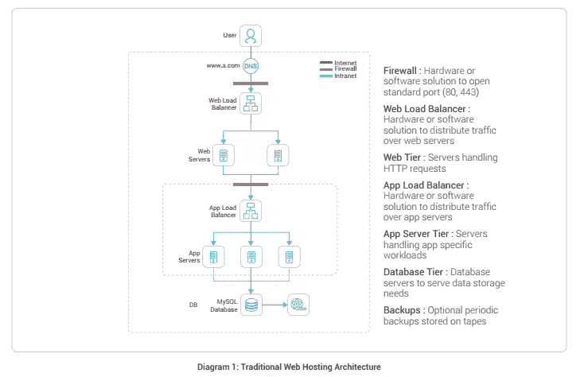
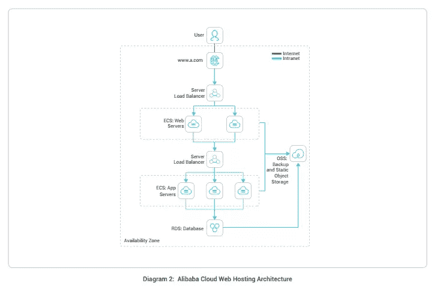
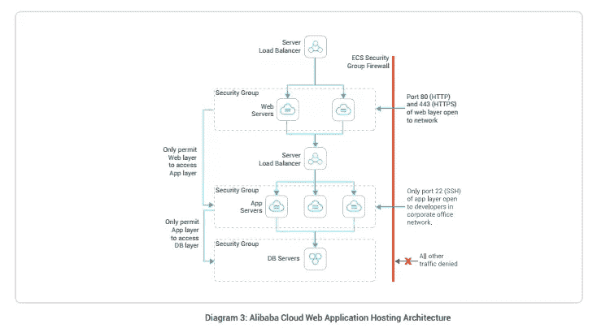
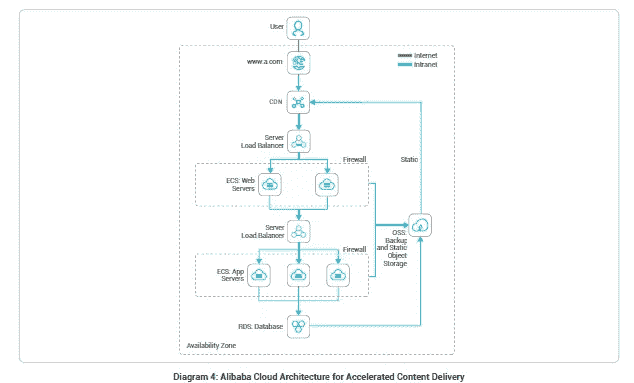
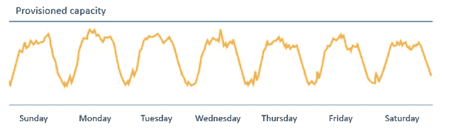
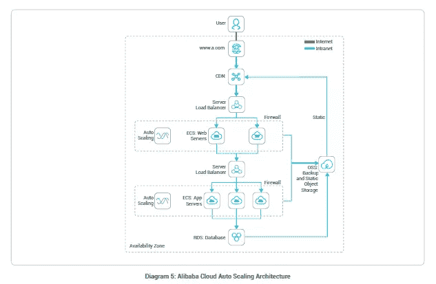
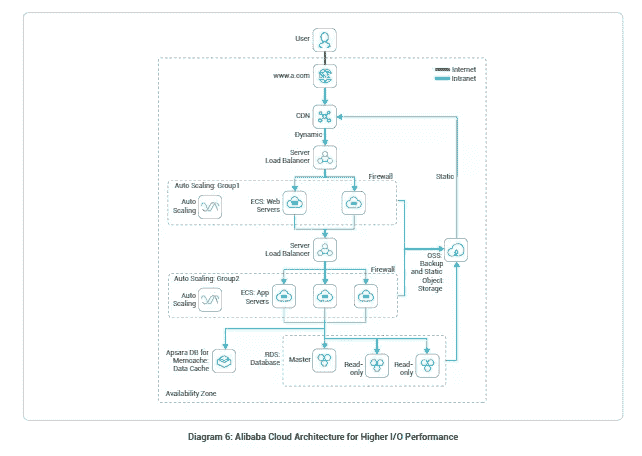
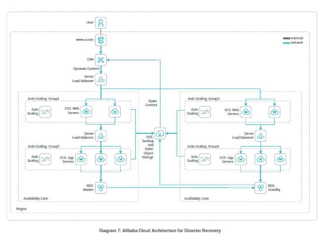
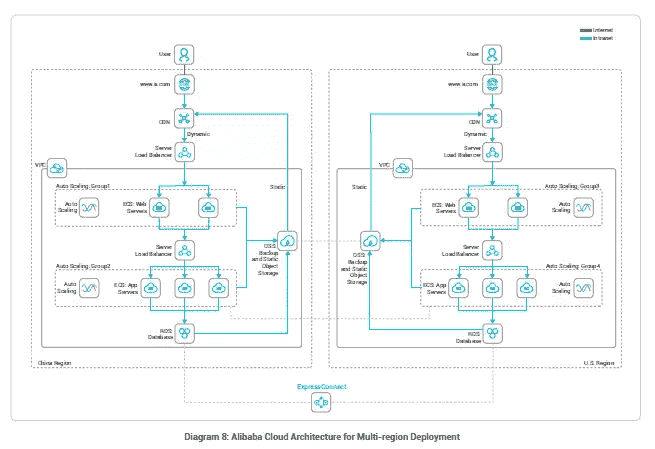

# 阿里云中 Web 应用托管的最佳实践

> 原文：<https://www.sitepoint.com/best-practices-of-web-application-hosting-in-alibaba-cloud/>

*本文原载于[阿里云](https://community.alibabacloud.com/blog/5-best-practices-for-different-web-application-hosting-scenarios_593900?spm=a2c65.11461478.0.0.5c835355u5CXTf)。感谢您对使 SitePoint 成为可能的合作伙伴的支持。*

在传统数据中心部署高可用性和可伸缩性的 web 应用程序是一项复杂而昂贵的任务。人们必须在容量管理上投入大量的精力和资源。但通常情况下，它会导致资源过度配置或配置不足，进一步导致对未充分利用的硬件的低效投资。为了应对这一挑战，[阿里云](https://int.alibabacloud.com/m/1000019616/)为最苛刻的 web 应用部署场景提供了可靠、可扩展、高性能的云基础设施。本文旨在提供在阿里云上扩展 web 应用的实用解决方案和最佳实践。

## 常见 Web 应用程序托管的传统解决方案

在传统的虚拟主机领域，设计一个可扩展的架构总是一个挑战。下图描述了一个传统的虚拟主机模型。此图的目的是帮助您将其与云上托管的类似架构进行比较。

传统的虚拟主机通常遵循三层设计，将架构分为表示层、应用层和持久层。该设计通过在每一层添加额外的服务器来实现可扩展性。该架构还具有内置的高可用性特性。下一节将探讨在阿里云中部署这种传统虚拟主机的方法。

## 阿里云上简单的 Web 应用托管架构

下图显示了使用各种阿里云产品和服务部署时，传统的虚拟主机架构是什么样子:

该架构的关键组件包括:

*   **【弹性计算服务(ECS)】—基于阿里云自有的大规模分布式计算系统，弹性计算服务(Elastic Compute Service，ECS)是一种可扩展的高效云计算服务。阿里云 ECS 帮助您快速构建更稳定、更安全的 web 应用，以适应您业务的实时需求。**
***   **【对象存储服务(OSS)】—阿里云提供各种选项，在云上存储、访问、备份你的数据。对于静态存储，它提供对象存储服务(OSS)来促进自动数据复制和故障恢复。*****   [**ApsaraDB for RDS**](https://int.alibabacloud.com/m/1000019619/) —关系数据库服务(Relational Database Service，简称 RDS)是基于阿里云自有分布式系统的稳定、可靠、弹性、高性能的在线数据库服务。它支持 MySQL、SQL Server、PostgreSQL 和 PPAS。此外，它还提供了一套全面的功能，包括灾难恢复、数据备份、监控和迁移。*   [**DNS**](https://int.alibabacloud.com/m/1000019620/) —阿里云 DNS 服务为您的域名管理需求提供高可用、可扩展的 DNS 服务。它会自动将您的域请求重新路由到最近的 DNS 服务器。*   [**【服务器负载均衡器(SLB)**](https://int.alibabacloud.com/m/1000019621/) —服务器负载均衡器是一种 web 流量分发服务，可以最大化和扩展您的 web 应用程序的外部服务能力。通过在多个云服务器之间无缝分配流量并消除单点故障，SLB 增强了您的应用程序的可靠性、可用性和可用性。****

 ****## 利用云进行 Web 应用托管

在阿里云上部署 web 应用时，您应该考虑在部署中进行修改，以充分利用云的优势。以下是在阿里云上托管应用时的一些关键考虑事项。

### 一个区域中的多个数据中心

在某个区域内，阿里云通常运营至少两个数据中心，称为可用性区域(AZs)。不同 az 中的弹性计算服务(ECS)在逻辑上和物理上都是分离的。阿里云提供了一个易于使用的模型来跨 AZs 部署您的应用程序，以实现更高的可用性和可靠性。

### Web 应用程序和服务器的高安全性

Web 应用程序安全性是当今组织主要关注的问题之一，超过 90%的应用程序容易受到安全攻击。这些攻击可以利用网站和固有的服务器，这使企业面临财务损失的风险。为了保护您的 web 应用免受此类攻击，阿里云提供了一套网络和应用安全服务，如[防 DDoS](https://int.alibabacloud.com/m/1000019622/) (基础版和专业版) [Web 应用防火墙](https://int.alibabacloud.com/m/1000019623/)(WAF)[服务器卫士](https://int.alibabacloud.com/m/1000019624/)。

除了这些服务，用户还可以通过定义防火墙和权限来主动限制外部流量。下图描绘了阿里云 web 应用托管架构，它带有一个组防火墙来保护整个基础架构。

*   对于 web 服务器群集，防火墙安全组只允许访问端口 80 和 443 (HTTP 和 HTTPS)。
*   为了保护应用服务器集群，安全组只允许来自 web 服务器的访问。
*   对于 DB 服务器，其安全组允许从应用服务器访问应用数据请求。此外，数据库服务器的安全组只允许来自应用程序层的访问。为了确保完全安全，只允许从安全组的防火墙规则中配置的白名单 IP 访问端口 22 (SSH)进行直接主机管理。

### 将专家系统视为动态资源

为了在阿里云上构建和托管容错和可扩展的应用程序，您将需要一个灵活的系统，该系统将 ECS 的动态特性考虑在内。了解云资源在出现故障时可能变得不可用或丢失是非常重要的。此外，一旦配置了新的虚拟服务器，您就不能对分配给它的 IP 地址做任何假设。为了处理这样的场景，阿里云允许你选择资源的位置，并提供[弹性 IP](https://int.alibabacloud.com/m/1000019625/)。它们是为了将资源的 IP 地址保持为静态而获得的。如果您调配新的 ECS 实例，您可以将相同的 EIP 映射到新实例。

考虑到所有这些因素，让我们看看基于特定场景部署 web 应用程序的一些最佳实践。

## 最佳实践#1:内容交付的应用托管

到目前为止，上面的 web 应用程序架构最适合从一个中心位置为所有用户请求提供服务。然而，在高流量的情况下，内容交付网络(CDN)有助于优化您的 web 应用的性能，确保无延迟体验。

### 参考架构

随着[阿里云 CDN](https://int.alibabacloud.com/m/1000019626/) ，一个不断增长的全球边缘位置网络负责缓存静态和流媒体内容。CDN 从操作系统获取原始内容，并在边缘节点缓存这些内容。缓存后，未来的请求会自动路由到最近的边缘位置，以确保以最佳性能交付内容。反过来，这一过程会释放服务器的额外负载，因为流量会直接影响服务器，从而有效消耗计算资源。

下面的架构图展示了一个典型的使用 CDN 托管的 web 应用。

阿里云 CDN 还可以与任何非阿里云的原点服务器无缝协作。使用阿里云 CDN 也没有财务承诺——你只需为通过该服务实际交付的内容付费。

## 最佳实践#2:自动伸缩的 Web 应用程序托管

在传统的基础架构托管模式中，您需要调配固定数量的服务器，您不得不根据需求高峰建立服务器。这种方法依赖于准确的容量规划，否则会导致在未使用的服务器容量上花费大量资金。在现实世界中，网站上的典型流量如下所示:

### 参考架构

在阿里云上，web 应用程序可以利用额外服务器的按需供应，或者在流量较少的时段向下调整，以最大限度地降低公用事业成本。这些都是由[阿里云自动伸缩](https://int.alibabacloud.com/m/1000019627/)服务自动执行的。阿里云弹性计算服务(ECS)实例不是通过流量预测模型来提前调配服务器，而是根据一组触发器来动态调配，以扩展和收回设备。从服务器负载平衡器自动添加或删除由 Auto Scaling 管理的服务器，使该部署选项成为真正强大的设置。下图展示了一个典型的 web 应用程序托管和自动缩放:

现在，让我们简要讨论一下这个架构的关键组件，自动伸缩。您可以根据直接从阿里巴巴[云监控](https://int.alibabacloud.com/m/1000019628/)获得的指标数据设置自动扩展触发器。例如，如果 CPU 利用率在过去五分钟内达到或超过 75%,或者当前应用程序使用了 35%的内存，您可以将自动扩展设置为触发。此外，您还可以根据预期的负载和组织的要求，在特定时间提供一定数量的实例。

## 最佳实践#3:具有更高 IO 性能的 Web 应用程序托管

面对不断增长的业务需求，保持应用程序的高性能至关重要。即使是最微小的故障也会导致极大的响应时间并影响用户体验。传统的单实例数据库设计可能不足以满足大量的 I/O 请求。

为了减轻数据库的负担，您应该将写和读请求分离到不同的数据库实例中。当您执行分离时，不要忘记在 web 托管服务器和数据库之间包含一个 memcached 层。

该架构中有两个关键组件:

*   **ApsaraDB for Memcache:** 它是一个在线开放缓存服务，在访问热点数据的同时，提供对查询和数据的高速访问。此外，它支持键值数据库，并与 ECS 服务兼容。您可以保留热点数据并减轻数据库的压力，从而缩短读取响应时间。
*   **用于只读 RDS 的 ApsaraDB:**如果读请求超过写请求，单个实例将无法处理它们，从而影响应用程序的性能。为了实现更流畅的读写能力，ApsaraDB 可以为特定区域的 RDS 创建具有只读帐户的主实例的副本。这为读/写请求提供了更快的响应。此外，副本处理读取请求，而主实例仅满足写入请求。

## 最佳实践#4:具有多 DC 灾难恢复的 Web 应用程序托管

对于拥有大规模关键任务 web 应用程序的企业来说，保持无缝用户体验的高可用性至关重要。尽管云基础架构通过安全服务确保保护，但您仍然需要跨数据中心部署来提供额外的安全性。在数据中心停机的情况下，这变得更加必要。

### 参考架构

这种云架构设计的主要特点是跨多个数据中心或可用区域分布所有服务器和数据库服务。只要服务器在同一个区域，并且可以作为一个单一的 web 应用系统，就可以进行这种分布。

让我们看一下阿里云 Web 应用托管和多 DC 灾难恢复的关键考虑事项。

**完全自动化:**该体系结构检测与服务器相关的问题，并通过将生产环境与灾难恢复环境进行切换来确保恢复。 [ApsaraDB for RDS](https://int.alibabacloud.com/m/1000019619/) 维护数据备份，并且在主数据库机器出现故障的情况下自动切换数据库端点，从而确保出色的可用性。

**充分利用资源:**在建议的云架构中，没有专用于灾难恢复环境的资源。一旦出现任何问题，系统就会使用生产环境中的资源来确保灾难恢复。这有助于充分利用资源，使其成为企业的一种经济高效的解决方案。

## 最佳实践#5:多区域部署的 Web 应用程序托管

对于在多个国家运营或计划全球扩张的企业来说，拥有灵活的 IT 架构对于业务增长至关重要。这些公司需要高度稳定和高质量的网络来跟上技术和不断变化的需求。对于这些公司来说，主要的问题是他们迫切需要一个高效、安全的网络来连接他们的全球业务。对于中小型企业来说，从电信服务提供商那里租赁线路可能是一个昂贵的选择。为了解决这一问题，阿里云提供了一种简单且经济高效的方式，通过专线与世界不同地区联系。它还提供了其他几种解决方案来解决跨区域的数据复制/同步问题。

### 参考架构

下面的体系结构符合跨不同区域的多节点部署的需求。部署在中国的应用程序也可以同时部署在美国地区。这两个应用程序在服务层和数据层相互交互。使用[阿里云快速连接](https://int.alibabacloud.com/m/1000019629/)，多个地区的两个 VPC 通过专线连接。这允许位于中国地区的 ECS 实例和位于美国地区的 ECS 实例之间通过互联网进行安全连接。尽管位于不同的位置，这两个 RDS 实例也可以实时同步数据。阿里云 OSS 允许跨区域的数据复制，以满足通过互联网进行大量数据复制的需求。

基于此架构的多区域部署简单且经济高效。用户只需一个阿里云账号，就可以快速构建自己的多区域应用，维护全球所有的云资源。阿里云还提供多种数据传输解决方案，以满足大多数用户的业务场景需求。

## 结论

在比较传统和云虚拟主机方法时，作为一个组织，您必须超越硬件和价格来利用虚拟主机解决方案的真正内在价值和相关的商业利益。传统的虚拟主机系统需要你购买、安装、管理和维护硬件设备和基础设施来托管你的站点；一项持续时间非常长的任务。这种必要性使得传统的托管解决方案变得繁琐、费时、昂贵。

此外，大多数大型企业在多个地点都有业务，每个地点都需要专门的供应商/员工。从远程位置管理这些供应商进一步增加了组织成本。此外，还有其他隐性成本，如购买硬件的额外税收、送货费用以及运营开销。

相比之下，云虚拟主机提供了多重优势，有可能产生巨大的商业利益。此外，云虚拟主机保证了 SLA，保证了网站的高可用性。此外，它允许您在消耗资源时付费，没有隐藏成本，使您能够高效地规划 it 预算。

## 分享这篇文章****